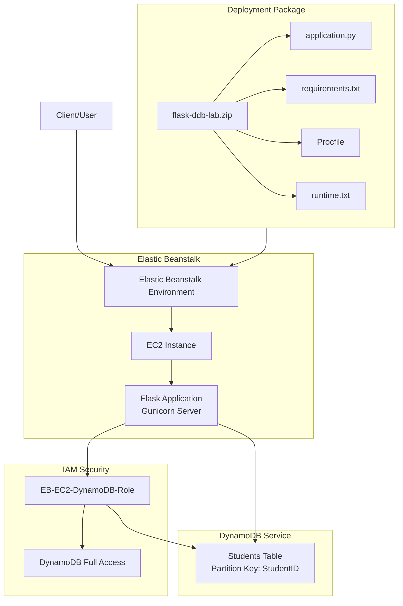
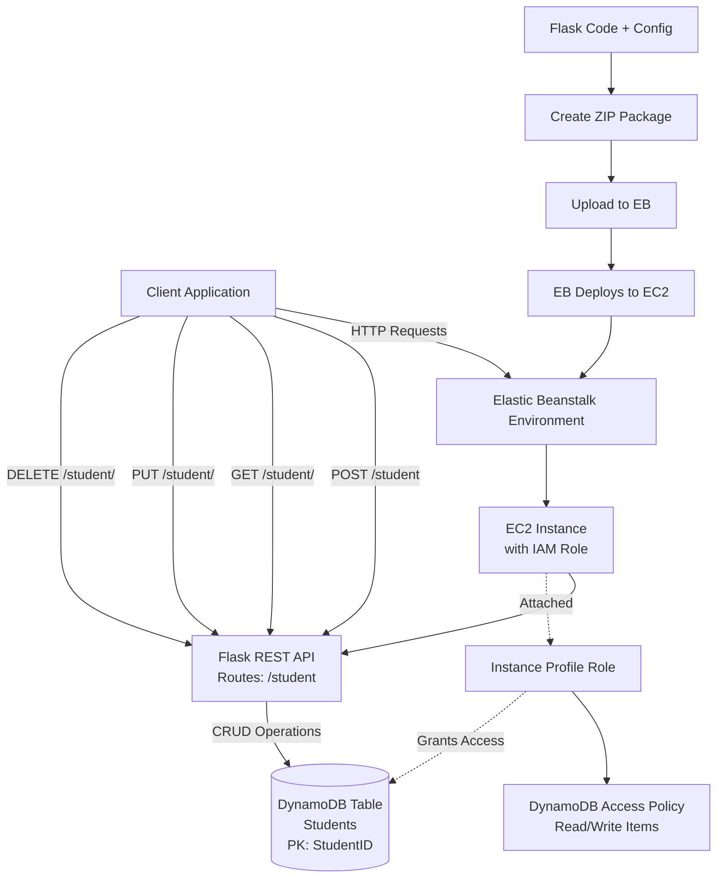

# Flask + DynamoDB on Elastic Beanstalk

**Topics:** Elastic Beanstalk, Flask, DynamoDB, REST API, IAM, PaaS

## Overview

This lab builds on previous excercise by integrating a Flask application with DynamoDB for data persistence. You'll deploy a RESTful API that performs CRUD operations on a DynamoDB table, all managed through Elastic Beanstalk's PaaS environment. The activity demonstrates serverless database architecture with managed application hosting.

## Key Concepts

| Concept | Description |
| :------- | :---------- |
| Boto3 | AWS SDK for Python to interact with DynamoDB |
| RESTful API | HTTP-based interface for CRUD operations |
| IAM Instance Profile | Role attached to EC2 for secure AWS service access |
| Environment Variables | Configuration values passed to application at runtime |
| Runtime.txt | Specifies Python version for Elastic Beanstalk |
| JSON Responses | Structured data format for API responses |

### Prerequisites

- Active AWS account with billing enabled
- IAM permissions for Elastic Beanstalk, EC2, and DynamoDB
- Basic knowledge of Flask, REST APIs, and NoSQL databases
- Completion of Lab 18 (DynamoDB basics) recommended

## Architecture Overview

::: details Click to expand Architecture Diagram

:::

::: details Click to expand Architecture Diagram


:::

## Phase 1: Local Environment Preparation

Before deploying to AWS, prepare your project folder with the required files.

### Project Structure

Create a folder named `flask-ddb-lab` containing exactly these four files:

- `application.py` - Flask application code
- `requirements.txt` - Python dependencies
- `Procfile` - Gunicorn configuration
- `runtime.txt` - Python version specification

### File Contents

#### application.py

::: details application.py Code
```python
from flask import Flask, request, jsonify
import boto3
import os

app = Flask(__name__)

REGION = os.getenv("AWS_REGION", "ap-south-1")
TABLE_NAME = os.getenv("TABLE_NAME", "Students")

dynamodb = boto3.resource("dynamodb", region_name=REGION)
table = dynamodb.Table(TABLE_NAME)

@app.route("/")
def home():
    return "Flask + DynamoDB on Elastic Beanstalk is working!"

@app.route("/health")
def health():
    return jsonify(status="ok")

# CREATE
@app.route("/student", methods=["POST"])
def create_student():
    try:
        data = request.get_json()
        table.put_item(Item={
            "StudentID": data["StudentID"],
            "Name": data["Name"],
            "Dept": data.get("Dept", "")
        })
        return jsonify(message="Student created"), 201
    except Exception as e:
        return jsonify(error=str(e)), 500

# READ
@app.route("/student/<student_id>", methods=["GET"])
def get_student(student_id):
    try:
        resp = table.get_item(Key={"StudentID": student_id})
        item = resp.get("Item")
        if not item:
            return jsonify(error="Student not found"), 404
        return jsonify(item)
    except Exception as e:
        return jsonify(error=str(e)), 500

# UPDATE
@app.route("/student/<student_id>", methods=["PUT"])
def update_student(student_id):
    data = request.get_json()
    resp = table.update_item(
        Key={"StudentID": student_id},
        UpdateExpression="SET #n = :n, Dept = :d",
        ExpressionAttributeNames={"#n": "Name"},
        ExpressionAttributeValues={":n": data["Name"], ":d": data.get("Dept", "")},
        ReturnValues="UPDATED_NEW"
    )
    return jsonify(message="Student updated", updated=resp["Attributes"])

# DELETE
@app.route("/student/<student_id>", methods=["DELETE"])
def delete_student(student_id):
    table.delete_item(Key={"StudentID": student_id})
    return jsonify(message="Student deleted")
```
:::

#### requirements.txt

```text
Flask
boto3
gunicorn
```

#### Procfile

```text
web: gunicorn --bind 0.0.0.0:8000 application:app
```

#### runtime.txt

```text
python-3.11
```

### Packaging the Application

1. Select all 4 files in the `flask-ddb-lab` folder
2. **On Windows/Mac:** Right-click → **Send to** → **Compressed (zipped) folder**
3. **On Ubuntu/Linux:** Open terminal in the `flask-ddb-lab` folder and run:

```bash
zip flask-ddb-lab.zip application.py requirements.txt Procfile runtime.txt
```

4. Name the file: `flask-ddb-lab.zip`

> [!IMPORTANT]
> When you open the zip file, all 4 files should be at the root level, NOT inside a subfolder. Elastic Beanstalk expects the application code at the root of the archive.

## Phase 2: AWS Resource Configuration

### Create DynamoDB Table

1. Navigate to **DynamoDB** → **Tables** → **Create table**
2. Configure the table:
   - **Table name**: `Students`
   - **Partition key**: `StudentID` (Type: **String**)
3. Click **Create table**
4. Wait for the table status to become **Active**

### Create IAM Role for EC2 Instances

The IAM role grants EC2 instances permission to access DynamoDB.

1. Navigate to **IAM** → **Roles** → **Create role**
2. **Trusted entity type**: AWS service
3. **Use case**: EC2
4. Click **Next**
5. **Attach permissions policy**: Search for and select `AmazonDynamoDBFullAccess`
6. Click **Next**
7. **Role name**: `EB-EC2-DynamoDB-Role`
8. Click **Create role**

> [!TIP]
> Once this role is created, it will be available for all future Elastic Beanstalk environments. You only need to create it once per AWS account. For production, create a custom policy with minimal DynamoDB permissions instead of full access.

## Phase 3: Elastic Beanstalk Deployment

### Create Application Environment

1. Navigate to **Elastic Beanstalk** → **Create application**
2. Configure application:
   - **Application name**: `flask-ddb-lab`
   - **Platform**: Python
   - **Application code**: Select **Sample application** (for initial setup)
   - **Presets**: Single instance (free tier eligible)

### Configure Service Access

1. **Service role**: Leave as default (auto-created)
2. **EC2 instance profile**: Select `EB-EC2-DynamoDB-Role`
3. Click **Next** through remaining configuration screens
4. Click **Submit**

Wait 5-10 minutes for the environment to launch. The environment health should show **Ok** (green) when ready.

### Verify Sample Application

1. In the environment dashboard, locate the **Domain** URL (e.g., `flask-ddb-lab.us-east-1.elasticbeanstalk.com`)
2. Open the URL in your browser
3. You should see the default Python sample application

### Deploy Your Application

1. In the environment dashboard, click **Upload and deploy**
2. Click **Choose file** and select `flask-ddb-lab.zip`
3. **Version label**: `v1`
4. Click **Deploy**

Wait for the deployment to complete (health status returns to **Ok**).

## Phase 4: Environment Variables Configuration

Environment variables tell your Flask app which DynamoDB table and region to use.

1. In the environment dashboard, click **Configuration** (left sidebar)
2. Locate the **Updates** category and click **Edit**
3. In the **Platform software** section, scroll to **Environment variables**
4. Add these properties:

| Name | Value |
|------|-------|
| `TABLE_NAME` | `Students` |
| `AWS_REGION` | `ap-south-1` |

5. Click **Apply**
6. Wait for the environment to finish updating (2-3 minutes)

> [!WARNING]
> Without these environment variables, your application will fail to connect to DynamoDB. The Flask app reads these values using `os.getenv()` with defaults, but explicit configuration ensures correct region and table name.

## Phase 5: Testing & Verification

### Health Check

Open **AWS CloudShell** (or your local terminal) and test the health endpoint:

```bash
curl http://<your-eb-domain>/health
```

**Expected output:**

```json
{"status":"ok"}
```

### CRUD Operations Testing

Replace `<your-eb-domain>` with your actual Elastic Beanstalk domain URL.

#### Create a Student (POST)

```bash
curl -X POST http://<your-eb-domain>/student \
-H "Content-Type: application/json" \
-d '{"StudentID":"101","Name":"Anita","Dept":"MCA"}'
```

**Expected response:**

```json
{"message":"Student created"}
```

#### Read Student Data (GET)

```bash
curl http://<your-eb-domain>/student/101
```

**Expected response:**

```json
{"StudentID":"101","Name":"Anita","Dept":"MCA"}
```

#### Update Student Data (PUT)

```bash
curl -X PUT http://<your-eb-domain>/student/101 \
-H "Content-Type: application/json" \
-d '{"Name":"Anita S","Dept":"MCA-III"}'
```

**Expected response:**

```json
{"message":"Student updated","updated":{"Name":"Anita S","Dept":"MCA-III"}}
```

#### Delete Student (DELETE)

```bash
curl -X DELETE http://<your-eb-domain>/student/101
```

**Expected response:**

```json
{"message":"Student deleted"}
```

### Verify in DynamoDB Console

1. Navigate to **DynamoDB** → **Tables** → **Students**
2. Click **Explore table items**
3. Confirm the data reflects your test operations

### Validation

- **Local Setup:** Verify all files are created and Flask app runs locally.
- **Packaging:** Confirm ZIP contains files at root level.
- **Deployment:** Check EB environment health is "OK" and domain is accessible.
- **API Testing:** Test all CRUD endpoints with curl commands.
- **Database:** Verify data persistence in DynamoDB console.
- **Environment Variables:** Ensure TABLE_NAME and AWS_REGION are set.

::: details Validation

- **Elastic Beanstalk Environment:** Health status shows "Ok" in EB console
- **Application URL:** Accessible and returns "Flask + DynamoDB on Elastic Beanstalk is working!" on root path
- **DynamoDB Table:** "Students" table exists with correct partition key
- **API Endpoints:** All CRUD operations (POST, GET, PUT, DELETE) work correctly
- **IAM Role:** EB-EC2-DynamoDB-Role attached to EC2 instance with proper permissions
- **Environment Variables:** TABLE_NAME and AWS_REGION properly configured

:::

### Common Issues & Solutions

::: details Troubleshooting
### Issue: Application returns 500 errors

**Causes:**
- Missing environment variables (`TABLE_NAME`, `AWS_REGION`)
- Incorrect IAM role attached to EC2 instance
- DynamoDB table doesn't exist or wrong name

**Solution:**
1. Check environment variables in **Configuration** → **Software**
2. Verify IAM role in **Configuration** → **Security**
3. Confirm table name matches exactly (case-sensitive)

### Issue: Environment health shows "Degraded"

**Causes:**
- Application code errors
- Missing dependencies in `requirements.txt`
- Incorrect file structure in zip

**Solution:**
1. Check logs: **Logs** → **Request logs** → **Last 100 lines**
2. Verify all 4 files are at zip root (not in subfolder)
3. Ensure `application.py` has the correct variable name (`app`)

### Issue: 502 Bad Gateway error

**Causes:**
- Procfile missing port binding (should bind to 8000)
- Nginx proxy configuration mismatch

**Solution:**
1. Ensure Procfile is: `web: gunicorn --bind 0.0.0.0:8000 application:app`
2. Redeploy the application
3. Check `/var/log/nginx/error.log` for upstream connection errors

### Issue: Permission denied accessing DynamoDB

**Cause:** IAM role not attached or incorrect permissions

**Solution:**
1. Go to **Configuration** → **Security** → **Edit**
2. Verify **IAM instance profile** is set to `EB-EC2-DynamoDB-Role`
3. Confirm role has `AmazonDynamoDBFullAccess` policy attached
:::

### Cost Considerations

::: details Cost Considerations

- **Elastic Beanstalk:** ~$0.01/hour for t3.micro EC2 (free tier eligible)
- **DynamoDB:** On-demand pricing (~$1.25/million writes, $0.25/million reads)
- **Tip:** Terminate EB environment and delete DynamoDB table immediately after lab. Monitor via AWS Cost Explorer.

:::

### Cleanup

::: details Cleanup

To avoid ongoing charges:

1. **Elastic Beanstalk**:
   - Go to your environment → **Actions** → **Terminate environment**
   - Confirm by typing the environment name

2. **DynamoDB**:
   - Go to **DynamoDB** → **Tables** → **Students**
   - Click **Delete** → Confirm deletion

3. **IAM Role** (optional):
   - Can be retained for future labs
   - Or delete via **IAM** → **Roles** → `EB-EC2-DynamoDB-Role` → **Delete**

:::

## Result

Successfully deployed a Flask REST API integrated with DynamoDB on Elastic Beanstalk. Demonstrated serverless database operations, secure IAM access, and managed application deployment with full CRUD functionality.

## Viva Questions

1. What is the role of Boto3 in this Flask application?
2. Why do we use IAM instance profiles instead of access keys?
3. What are the benefits of deploying on Elastic Beanstalk?
4. How does DynamoDB differ from traditional relational databases?
5. What is the purpose of the Procfile in Elastic Beanstalk deployments?
