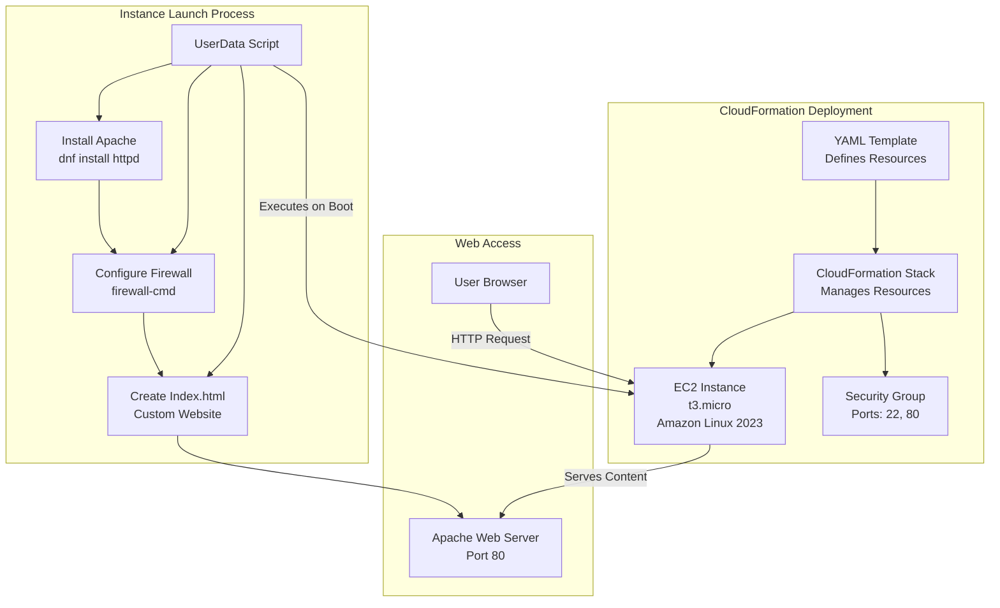

# CloudFormation: Launch EC2 with Apache using UserData

**Topics:** CloudFormation, EC2, UserData, Infrastructure as Code

## Overview

This lab introduces AWS CloudFormation, Infrastructure as Code (IaC) service. You'll create a YAML template to provision an EC2 instance with Apache web server installed via UserData, demonstrating automated infrastructure deployment.

The activity covers creating a CloudFormation template, deploying it as a stack, and verifying the automated setup. You'll learn how to define resources, use parameters, and leverage UserData for instance configuration.

## Key Concepts

| Concept | Description |
| :------- | :---------- |
| CloudFormation | AWS service for defining and provisioning infrastructure as code |
| YAML Template | Human-readable format for defining AWS resources |
| UserData | Script that runs on EC2 instance launch for configuration |
| Parameters | Input values for template customization |
| Resources | AWS services defined in the template |
| Outputs | Values returned after stack creation |

## Prerequisites

- Region set to Asia Pacific (Mumbai) – ap-south-1
- Basic knowledge of EC2 and Security Groups
- Understanding of YAML syntax (optional but helpful)
- Existing EC2 key pair for SSH access

## Architecture Overview

::: details Click to expand Architecture Diagram

:::

## Phase 1: Create Key Pair

### Step 1: Open EC2 Key Pairs
1. AWS Console → Search EC2
2. Left menu → Key Pairs (under "Network & Security")
3. Click Create key pair

### Step 2: Create key pair
- Name: pemkeypair (any name is fine)
- Key pair type: RSA
- Private key file format: .pem (recommended)
- Click Create key pair

A file will download like: pemkeypair.pem

> [!NOTE]
> CloudFormation uses key pair NAME (pemkeypair), not the file name.

## Phase 2: Create CloudFormation Template

### Step 1: Create YAML file on your computer
1. Open Notepad
2. Paste the full YAML template given below
3. Save as: ec2-apache-al2023.yaml
   - Save type: All files
   - Encoding: UTF-8 (if asked)

### Full CloudFormation Template (Amazon Linux 2023)
> [!IMPORTANT]
> - Do not add .pem anywhere.
> - You will select Key Pair from dropdown during stack creation.

::: details ec2-apache-al2023.yaml Code
```yaml
AWSTemplateFormatVersion: "2010-09-09"
Description: Launch EC2 (Amazon Linux 2023) and install Apache (httpd) using UserData

Parameters:
  KeyName:
    Type: AWS::EC2::KeyPair::KeyName
    Description: Select an existing EC2 Key Pair to enable SSH access

Resources:
  WebServerSG:
    Type: AWS::EC2::SecurityGroup
    Properties:
      GroupDescription: Allow SSH (22) and HTTP (80)
      SecurityGroupIngress:
        - IpProtocol: tcp
          FromPort: 22
          ToPort: 22
          CidrIp: 0.0.0.0/0
        - IpProtocol: tcp
          FromPort: 80
          ToPort: 80
          CidrIp: 0.0.0.0/0

  WebServerInstance:
    Type: AWS::EC2::Instance
    Properties:
      InstanceType: t3.micro
      KeyName: !Ref KeyName
      SecurityGroups:
        - !Ref WebServerSG

      # Amazon Linux 2023 AMI for Mumbai (ap-south-1)
      ImageId: !Sub "{{resolve:ssm:/aws/service/ami-amazon-linux-latest/al2023-ami-kernel-default-x86_64}}"
      UserData:
        Fn::Base64: |
          #!/bin/bash
          dnf update -y
          dnf install -y httpd
          systemctl enable httpd
          systemctl start httpd
          firewall-cmd --permanent --add-service=http
          firewall-cmd --reload
          echo "<h1>Apache Installed via CloudFormation UserData (Amazon Linux 2023)!</h1>" > /var/www/html/index.html

Outputs:
  InstanceId:
    Description: EC2 Instance ID
    Value: !Ref WebServerInstance

  WebsiteURL:
    Description: Apache Website URL
    Value: !Sub "http://${WebServerInstance.PublicDnsName}"
```
:::

## Phase 3: Deploy CloudFormation Stack

### Step 1: Open CloudFormation
1. AWS Console → Search CloudFormation
2. Click Stacks
3. Click Create stack → With new resources (standard)

### Step 2: Prepare template (select correct options)
1. Under Prepare template: Select Choose an existing template
2. Under Template source: Select Upload a template file
3. Click Choose file → select ec2-apache-al2023.yaml
4. Click Next

### Step 3: Specify Stack Details
- Stack name: EC2-Apache-AL2023
- Click Next

### Step 4: Parameters
- Under KeyName, select your key pair name from dropdown (Example: pemkeypair)
- Click Next

### Step 5: Configure Stack Options (keep default)
1. Leave everything as default
2. Click Next

### Step 6: Review and Create
1. Scroll down
2. Click Create stack

### Step 7: Monitor Stack Creation
1. Wait for Stack status to become: CREATE_COMPLETE
2. Open the stack → click Outputs tab
3. Copy WebsiteURL
4. Paste URL in browser

> [!TIP]
> Expected Output in browser: Apache Installed via CloudFormation UserData (Amazon Linux 2023)!

## Validation

::: details Validation

- **Key Pair:** Confirm key pair exists in EC2 console.
- **Template:** Verify YAML syntax and file structure.
- **Stack Creation:** Check CloudFormation stack status is "CREATE_COMPLETE".
- **EC2 Instance:** Ensure instance is running with 2/2 status checks passed.
- **Security Group:** Confirm inbound rules for ports 22 and 80.
- **Website:** Access the output URL and verify Apache page loads.
- **UserData:** Check EC2 system logs for UserData execution.
:::

::: details Troubleshooting

### Troubleshooting (Common Errors)

1. **Website not opening**
   - Check: EC2 instance status checks are 2/2 passed
   - Security group has port 80 open
   - Firewall allows HTTP (firewalld configured in UserData)
   - Wait 2–3 minutes (UserData takes time)

2. **Stack went to ROLLBACK**
   - Go to stack → Events tab → check the failure reason
   - Most common reason: Wrong Key Pair selected / key pair does not exist

:::

## Cost Considerations

::: details Cost Considerations

- **EC2 t3.micro:** ~$0.01/hour (free tier eligible for 750 hours)
- **CloudFormation:** No additional cost for the service itself
- **Tip:** Delete stack immediately after lab to avoid EC2 charges.

:::

## Cleanup

::: details Cleanup

To avoid charges:
1. CloudFormation → Stacks
2. Select EC2-Apache-AL2023
3. Click Delete
4. Confirm

This deletes EC2 + Security Group automatically.

:::

## Result

Successfully created infrastructure using CloudFormation IaC. Demonstrated automated EC2 provisioning with UserData scripts for software installation and configuration.

## Viva Questions

1. What is the purpose of **UserData** in EC2?
2. Why do we use CloudFormation instead of manual EC2 creation?
3. What is the difference between **Parameters** and **Resources** in CloudFormation?
4. Why is the Security Group created in the template?
5. What happens when a CloudFormation stack is deleted?
