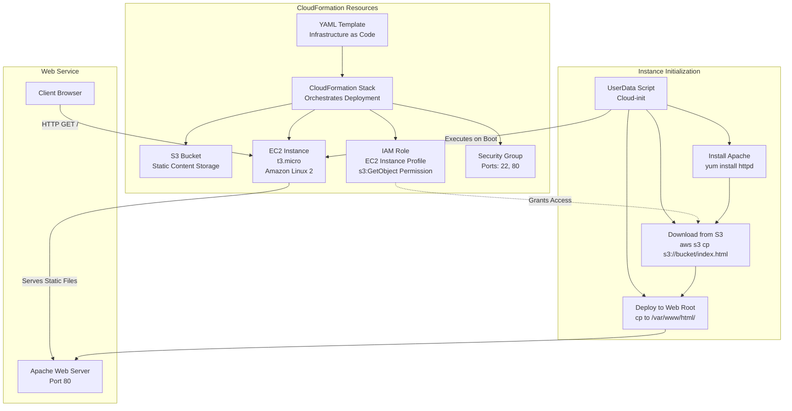

# EC2 + S3 : Static Content Pulled from S3 using CloudFormation

## Overview

This lab demonstrates advanced CloudFormation usage by creating a multi-resource stack that integrates EC2, S3, and IAM. You'll deploy an EC2 instance that automatically pulls static website content from an S3 bucket using UserData scripts and IAM roles.

### Key Concepts

| Concept | Description |
|---------|-------------|
| **Multi-Resource Stack** | CloudFormation template defining multiple AWS services |
| **IAM Instance Profile** | Role attached to EC2 for secure S3 access |
| **UserData Automation** | Scripts that run on instance launch for configuration |
| **S3 Integration** | Storing and retrieving static content from object storage |
| **Stack Dependencies** | Creating resources in sequence with proper references |
| **Cross-Service Permissions** | IAM policies for secure inter-service communication |

### Objectives

- Create an **S3 bucket** using CloudFormation.
- Upload a static **index.html** file to S3.
- Launch an **EC2 (Amazon Linux 2023) + Apache** using CloudFormation.
- Configure EC2 to **pull index.html from S3** and host it via Apache.

### Prerequisites

- **Region:** Mumbai (ap-south-1).
- **Key Pair:** An existing key pair (e.g., `pemkeypair`).

## Architecture Overview


    
## PART 0 — One-time: Create Key Pair

1. Navigate to **EC2** → **Key Pairs** → **Create key pair**.
    
2. **Name:** `pemkeypair`.
    
3. **Format:** `.pem`. Download and keep it safe.
    

## PART 1 — Stack-1: Create S3 Bucket (CloudFormation)

### Step 1.1: Create S3 template file

Create a file named `stack1-s3-bucket.yaml` and paste the following:

```yaml
AWSTemplateFormatVersion: "2010-09-09"
Description: Create an S3 bucket to store website content (index.html)
Resources:
  WebsiteBucket:
    Type: AWS::S3::Bucket
Outputs:
  BucketName:
    Description: S3 Bucket Name (use this to upload index.html)
    Value: !Ref WebsiteBucket
```


### Step 1.2: Create stack

1. Go to **CloudFormation** → **Stacks** → **Create stack** → **With new resources**.
    
2. Choose **Upload a template file** → `stack1-s3-bucket.yaml`.
    
3. **Stack name:** `S3-Website-Bucket`.
    
4. Click **Create stack**.
    

### Step 1.3: Copy bucket name

Open the completed stack, go to **Outputs**, and copy the `BucketName`.


## PART 2 — Upload Static Content to S3 (Manual)

### Step 2.1: Create index.html on your PC

Create a file named `index.html` with this content:

```html
<!DOCTYPE html>
<html>
<head>
<title>EC2 + S3 Demo</title>
</head>
<body>
<h1>Hello! This page was pulled from S3 to EC2 automatically.</h1>
<p>Deployed using CloudFormation + UserData</p>
</body>
</html>
```

### Step 2.2: Upload to S3 bucket

1. Go to **S3** → **Buckets** → Open your bucket → **Upload**.
    
2. Upload `index.html` to the **root** (no folder).
    
3. The file path is now: `s3://<your-bucket-name>/index.html`.
    

## PART 3 — Stack-2: Launch EC2 + Apache + Pull from S3

This stack manages the IAM Role, Security Group, EC2 instance, Apache installation, and file synchronization.

### Step 3.1: Create EC2 template file

Create a file named `stack2-ec2-pull-from-s3.yaml` and paste the following:

```yaml
AWSTemplateFormatVersion: "2010-09-09"
Description: Launch EC2 (Amazon Linux 2023), install Apache, and pull index.html from S3
Parameters:
  KeyName:
    Type: AWS::EC2::KeyPair::KeyName
    Description: Select an existing EC2 Key Pair to enable SSH access
  BucketName:
    Type: String
    Description: Enter the S3 bucket name created in Stack-1 (Output)
  SubnetId:
    Type: AWS::EC2::Subnet::Id
    Description: Select a PUBLIC subnet (default VPC public subnet recommended)
  VpcId:
    Type: AWS::EC2::VPC::Id
    Description: Select the VPC (default VPC recommended)
Resources:
  WebServerRole:
    Type: AWS::IAM::Role
    Properties:
      AssumeRolePolicyDocument:
        Version: "2012-10-17"
        Statement:
          - Effect: Allow
            Principal:
              Service: ec2.amazonaws.com
            Action: sts:AssumeRole
      Policies:
        - PolicyName: S3ReadOnlyForWebsiteBucket
          PolicyDocument:
            Version: "2012-10-17"
            Statement:
              - Effect: Allow
                Action:
                  - s3:GetObject
                  - s3:ListBucket
                Resource:
                  - !Sub "arn:aws:s3:::${BucketName}"
                  - !Sub "arn:aws:s3:::${BucketName}/*"
  WebServerInstanceProfile:
    Type: AWS::IAM::InstanceProfile
    Properties:
      Roles:
        - !Ref WebServerRole
  WebServerSG:
    Type: AWS::EC2::SecurityGroup
    Properties:
      GroupDescription: Allow SSH (22) and HTTP (80)
      VpcId: !Ref VpcId
      SecurityGroupIngress:
        - IpProtocol: tcp
          FromPort: 22
          ToPort: 22
          CidrIp: 0.0.0.0/0
        - IpProtocol: tcp
          FromPort: 80
          ToPort: 80
          CidrIp: 0.0.0.0/0
  WebServerInstance:
    Type: AWS::EC2::Instance
    Properties:
      InstanceType: t3.micro
      KeyName: !Ref KeyName
      SubnetId: !Ref SubnetId
      SecurityGroupIds:
        - !Ref WebServerSG
      IamInstanceProfile: !Ref WebServerInstanceProfile
      ImageId: !Sub "{{resolve:ssm:/aws/service/ami-amazon-linux-latest/al2023-ami-kernel-default-x86_64}}"
      UserData:
        Fn::Base64: !Sub |
          #!/bin/bash
          dnf update -y
          dnf install -y httpd
          systemctl enable httpd
          systemctl start httpd
          firewall-cmd --permanent --add-service=http
          firewall-cmd --reload
          aws s3 cp s3://${BucketName}/index.html /var/www/html/index.html
          systemctl restart httpd
Outputs:
  WebsiteURL:
    Description: Open this URL in browser
    Value: !Sub "http://${WebServerInstance.PublicDnsName}"
```


### Step 3.2: Create stack

1. **CloudFormation** → **Stacks** → **Create stack**.
    
2. Upload `stack2-ec2-pull-from-s3.yaml`.
    
3. **Stack name:** `EC2-Pull-S3-Website`.
    
4. **Parameters:**
    
    - **KeyName:** Select your key pair.
        
    - **BucketName:** Paste the bucket name from Stack-1 Output.
        
    - **VpcId:** Select default VPC.
        
    - **SubnetId:** Select a **PUBLIC** subnet.
        
5. Click **Create stack** and wait for `CREATE_COMPLETE`.
    

## PART 4 — Verify Output

Go to **Stack-2** → **Outputs** → Copy **WebsiteURL** and open it in a browser.

- **Expected page:** "Hello! This page was pulled from S3 to EC2 automatically…".
    

## Validation

- **Stack-1:** Confirm S3 bucket created and bucket name noted from outputs.
- **S3 Upload:** Verify index.html uploaded to bucket root.
- **Stack-2:** Check CloudFormation stack status is "CREATE_COMPLETE".
- **EC2 Instance:** Ensure instance running with proper IAM role attached.
- **Security Group:** Confirm ports 22 and 80 are open.
- **Website:** Access output URL and verify content matches S3 file.
- **IAM Permissions:** Confirm EC2 can access S3 without public bucket access.

## Troubleshooting (common)

1. **Website not opening:**
    
    - Wait 1–2 minutes (UserData takes time).
        
    - Check if Security Group has **HTTP 80** open.
        
    - Ensure firewall allows HTTP (configured in UserData).
        
    - Ensure you selected a **public subnet** for S3 access.
        
2. **Stack-2 fails with S3 access error:**
    
    - BucketName typed incorrectly.
        
    - `index.html` not uploaded at the root of the bucket.
        

## Cost Considerations

- **EC2 t3.micro:** ~$0.01/hour (free tier eligible)
- **S3 Storage:** ~$0.023/GB/month (minimal for small files)
- **CloudFormation:** No additional cost
- **Tip:** Delete stacks immediately after lab to avoid charges.

## Clean-up

1. **Delete Stack-2 first:** `EC2-Pull-S3-Website`.
    
2. **Empty the S3 bucket:** Delete `index.html`.
    
3. **Delete Stack-1:** `S3-Website-Bucket`.
    

## Viva-ready questions

- What is the purpose of **UserData** in EC2?
    
- Why do we need an **IAM Role + Instance Profile**?
    
- Why is the S3 bucket not made public in this lab?
    
- What happens when a CloudFormation stack is deleted? 
    
- Which ports are required for web hosting and SSH?

## Result

Successfully created a multi-service CloudFormation stack integrating EC2, S3, and IAM. Demonstrated automated content deployment from object storage to web server using IaC and secure cross-service permissions.
    