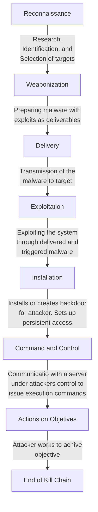

# Attack Targets and The Anatomy of an Attack

While there are many specific targets for an attack, they can generally be distilled into three core areas: Network, Application, and Host.

## Attack Targets

### A. Network Attacks

These are often the first types of attacks to occur. The target is the communication structure of a network, specific devices, or communication protocols.

- **Flooding / Denial of Service (DoS):** Occurs when a source generates more traffic than the receiver can handle (e.g., ARP flood or web server flood). This overwhelms the hardware, forcing it to perform unintended operations or fail completely.

- **Man-in-the-Middle (MITM):** Intercepting communications between two parties.

### B. Application Attacks

Targets the Software and services running on devices, servers, or user workstations. These attacks usually exploit misconfigurations or software vulnerabilities.

Exploits can act as a entry point for further damage, including credential dumping, data exposure, and financial loss.

- **SQL Injection & Cross-Site Scripting (XSS):** Web-based vulnerabilities.

- **Kerberoasting:** A specific attack on Microsoft Active Directory servers to capture and crack passwords.

### C. Host (Endpoint) Attacks

Targets the host, End-user systems such as desktop machines and laptops, or users of those systems.

Major Risk Factor is, These machines have a large attack surface because they host many applications and user behavior is unpredictable/undefined.

- **Drive-by Downloads / Watering Holes:** Compromising a user simply by having them visit a website.

- **Legacy Application Attacks:** Targeting unpatched software (e.g., old versions of Java are a common culprit).

- **Phishing Emails:** The most common and effective attack vector today. They are simple to execute, require low technical skill, and target human psychology rather than hardware.

## The Anatomy of an Attack (The Cyber Kill Chain)

The "Anatomy of an Attack", often referred to as the **Cyber Kill Chain**, lays out a series of actions and events attackers commonly take to exploit a system or network. 

* It helps defenders identify, detect, and prevent intrusion activity and categorize the Tactics, Techniques, and Procedures (TTPs) used by attackers.

* It is a model adopted from the military (Developed by Lockheed Martin) to describe the structure of an intrusion.

### Phase 1: Reconnaissance

The first step in an attack where the attacker gathers intelligence to profile the target and identify vulnerabilities to meet their objective. This phase can take weeks, months, or even years.

The areas of information gathering are :
- **Passive/Open Source:** Reviewing company websites, job listings, social networks (LinkedIn, Instagram, GitHub), and using crafted Google/Bing searches.

- **Active:** Email harvesting, network scanning (direct and indirect), and checking registration services (Whois) and hosting providers.

It is almost impossible to detect passive reconnaissance. However, defenders can try to detect active connections (scanning ports and services) to determine intent.

### Phase 2: Weaponization

Once intelligence is gathered, the adversary prepares the for weaponization which may be preparing an exploit based on vulnerability's identified in the target's environment. Planning best delivery methods and Setting up Command and Control (C2) servers.

* **Opportunistic exploitation** where, an exploit is developed for a vulnerability, with attackers scanning the internet for anyone who appears vulnerable to deploy pre-made payload to.

#### Blue Team Countermeasures:

This is an essential phase for defenders to prepare for by hardening controls and studying threat intelligence.

- Tracking latest malware trends (phishing, ransomware).

- Building detection rules for known exploitation patterns and scanning.

- Gathering intelligence on criminal groups and campaigns specific to the industry (e.g., finance, oil and gas).

### Phase 3: Delivery

The attacker launches the attack using the chosen delivery method and wait for the exploitation to take place. 
- Phishing emails.
- Watering hole attacks or staging servers.
- Direct exploitation of exposed services (Web, email, DNS, VPN).

This is often the first opportunity for defenders to detect, analyse and actively block the attack. 
* Defense can be, Monitoring public-facing servers and analyzing incoming/outgoing traffic behaviors to block malicious activities.

### Phase 4: Exploitation

The stage where the adversary attempts to gain actual access to the victim by triggering a vulnerability.
- Exploiting OS vulnerabilities.
- Social Engineering (Phishing, Spear Phishing, Whaling).
- Clickjacking and browser exploits.

The adversary already has spent time collecting information about the vulnerabilities, not only in systems but in people, during the reconnaissance phase.

Defenders must adapt to new tactics. Key measures include:
- User-awareness training and Phishing exercises.
- Vulnerability assessments and Penetration testing.
- Endpoint/Network hardening and Secure coding practices.

### Phase 5: Installation

Once exploitation is successful, the attacker entrenches themselves in the system to maintain access (Persistence). Establishes a permanent connection (backdoor) or link to a C2 server to facilitate lateral movement.

Techniques for Persistence:
- **Web Shells:** Malicious scripts installed on compromised web servers to gain access and maintain control. This requires a prior vulnerability to install.

- **Registry Modifications:** Adding auto-run keys or modifying DLL paths so malware starts automatically.

- **Backdoors:** Installing software that allows return access.

Defenders utilize specific platforms to detect and block installation of backdoors.
- Host-based Intrusion Detection Systems (HIDS)
- Endpoint Detection and Response (EDR)
- Antivirus (AV)
- Security Information and Event Management (SIEM) 

Key Monitoring Areas:

- **Account Usage:** Any activity or applications using the **Administrator account**.

- **Files:** The creation of suspicious files (analyzing names or locations).

- **System Internals:** Monitoring Registry changes and Auto-run keys.

- Changes to security controls and Configurations.

- **Process Correlation:** Using EDR reports to correlate endpoint processes.

## Phase 6: Command and Control (C2)

In the C2 phase, the attacker establishes a two-way communication channel between the compromised victim and a server they control  using the C2 server.
* It functions like legitimate administrative agents, issuing commands to infected hosts.

- The server can be owned by the adversary or rented from another criminal group.

**Traffic Patterns:**

- **Beaconing:** The malware sends regular signals ("heartbeats") to the C2 server, which can often be detected in network traffic.

- **Protocols:** Most communication uses common protocols like **HTTP** and **DNS** queries to blend in with normal traffic.

- **Obfuscation:** Encoded commands are common to hide the content.

This is the **last chance** in the kill chain to block the attack before the adversary achieves their objectives. If the C2 channel is blocked immediately, the attacker cannot issue commands and may assume the exploit failed.

- **Blocking IOCs:** Using threat intelligence to identify and block known C2 Indicators of Compromise (IOCs).

- **Proxying:** Inspecting HTTP and DNS authentication and communications.

- **Session Monitoring:** Analyzing network sessions for anomalies.

## Phase 7: Actions on Objectives

At this stage, the adversary has achieved "entrenchment", they have persistent access and open communications with the C2 server. They now move to execute their primary intent.

Common Attacker Objectives
- Collection of credentials.
- Privilege escalation.
- Lateral movement (moving to other systems in the network).
- Data exfiltration (stealing data).
- Extortion or Ransomware deployment.

Detection at this stage is critical; any delay can cause severe impact. This phase often triggers the **Disaster Recovery** plan. 

Preparation Requirements:
- Incident response playbooks and plans.
- Testing Incidence readiness through Tabletop Exercises, Simulating reactions and procedures.
- Defined escalation paths and communication points of contact.

## Defensive Technologies

Defensive technologies include both passive (alerting) and active (blocking/deleting) tools used to thwart attackers.

Passive are detections and alerts, requiring intervention by an analyst. Active, use workflows or rules to determine actions to take and act upon them like quarantine or delete.

### 1. Firewalls

Often the first line of defense, firewalls have evolved significantly:
- **Early Gen:** Smart routers using Access Control Lists (ACLs).
- **Second Gen:** Added the ability to track and maintain state.
- **Next-Generation Firewalls (NGFW):** The latest iteration; they understand application behavior and apply intrusion prevention.

### 2. Antivirus (AV)

- **Signature-Based:** Early versions matched files against a list of known malicious signatures.

- **Heuristic/Behavioral:** Modern AV incorporates heuristic detection (looking for suspicious characteristics) and behavioral detection (analyzing user/app interactions).

### 3. Intrusion Detection Systems (IDS)

- **NIDS (Network IDS):** Monitors network traffic against detection rules.

- IPS (Intrusion Prevention System): A NIDS that can actively block malicious traffic.

- **HIDS (Host IDS):** Operates at the file system level on a specific machine. While useful, they are limited by only seeing activity on that single host.

### 4. Endpoint Detection and Response (EDR)

EDR is a modern evolution of host security. Installed as an agent on servers or workstations. It collects data and reports to a central repository to build behavior profiles, allowing for the detection of complex malicious behavior.

### 5. Security Information and Event Management (SIEM)

SIEM acts as the "go-between" or central brain for network detection and EDR systems. It collects logs, telemetry, and device info from across the entire enterprise to provide a holistic view.

- If an attacker downloads tools on one machine, the SIEM correlates that behavior with rules to alert the security staff.

## Clickjacking

Clickjacking occurs when hackers create transparent layers over legitimate buttons or links to reroute users to unintended sites without their knowledge.

- **Likejacking:** Hijacking "Like" buttons on social media to force unintended interactions.

- **Cursorjacking:** Masking the true location of the mouse cursor.

- **Cookiejacking:** Stealing cookies containing sensitive data to imitate a user.

- **Filejacking:** Placing frames over "browse files" buttons to trick users into granting file access.

- **Mousejacking:** Remotely controlling device functions to click items or type commands.
