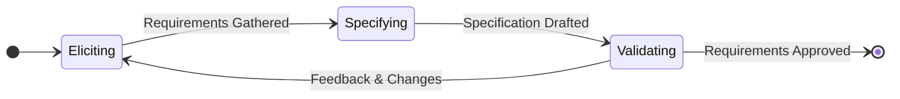

# Requirements Engineering Processes

## I. Requirements Engineering (RE) Fundamentals

### A. Key Definitions

1. **Requirements Engineering (RE) :** The process of **finding out, analyzing, documenting, and checking** the services and constraints of a system. It involves understanding and defining what services are required from the system and identifying the constraints on its operation and development.
    
2. **Requirements Document :** The outcome of the RE process; an **agreed requirements document** that specifies a system satisfying stakeholder requirements.
    
3. **Feasibility Study :** A short, focused study that takes place early in the RE process to assess if the system contributes to organizational objectives, can be implemented within schedule/budget/technology, and can be integrated with existing systems.
    

### B. Core Concepts and Principles

1. **Criticality:** Requirements engineering is a particularly **critical stage** of the software process, as errors or mistakes made early inevitably lead to later problems in system design and implementation.
    
2. **Iterative Nature:** Requirements engineering is typically an **iterative process** in which the main activities are interleaved. The activities are often organized around a **spiral model**.
    
3. **Stakeholder Needs:** Requirements are usually presented at two levels of detail: a high-level statement for **end-users and customers**, and a detailed **system specification** for developers.
    

## II. The Overall Requirements Engineering Process

Requirements engineering involves three key activities: discovering requirements by interacting with stakeholders (elicitation and analysis); converting these requirements into a standard form (specification); and checking that the requirements actually define the system that the customer wants (validation).

In practice, requirements engineering is an iterative process in which the activities are interleaved. The overall process consists of these three core activities, often following a spiral model structure.

### A. Process Steps (Main Activities)

1. **Requirements Elicitation and Analysis:** Discovering requirements by interacting with stakeholders (elicitation and analysis);
    
2. **Requirements Specification:** Converting these requirements into a standard form (specification);
    
3. **Requirements Validation:** Checking that the requirements actually define the system that the customer wants (validation).

### B. Phasing of Effort (The Spiral Model)

The activities are organized as an iterative process around a spiral. The amount of time and effort devoted to each activity in an iteration depends on the stage of the overall process, the type of system being developed, and the budget that is available. The output of the RE process is a system requirements document.

#### Version 1: Abstract Flowchart

This diagram represents the progressive and iterative nature of the spiral model as a linear flow.

#### Version 2: State Diagram

This diagram shows the cyclical nature of the process, with states for each major activity.

    This spiral model accommodates approaches to development where the requirements are developed to different levels of detail. The number of iterations around the spiral can vary, so that the spiral can be exited after some or all of the user requirements have been elicited.

## III. Requirements Elicitation and Analysis

### A. Key Definition

**Requirements Elicitation and Analysis :** The process of deriving system requirements through observation of existing systems, discussions with potential users and procurers, task analysis, and other techniques. The goal is to understand the work that stakeholders do and how they might use a new system to support that work.

During requirements elicitation, software engineers work with stakeholders to find out about the application domain, work activities, the services and system features that stakeholders want, the required performance of the system, hardware constraints, and so on.

### B. The Elicitation and Analysis Sub-Process Steps

Elicitation and analysis is itself an iterative process cycle with continual feedback between stages:

1. **Requirements Discovery and Understanding:** Gathering information by interacting with stakeholders, as well as finding domain requirements from existing documentation and systems.
    
2. **Requirements Classification and Organization:** Taking the initial unstructured collection of information and grouping related requirements into coherent clusters.
    
    - **Key Technique (Viewpoints):** This involves organizing requirements by **viewpoint**, where a viewpoint is a way of collecting and organizing requirements from a group of stakeholders who share something in common (e.g., end-users or managers).
        
3. **Requirements Prioritization and Negotiation:** Resolving conflicts among stakeholders’ varying views to reach agreed-upon compromise requirements.
    
    - **Regular stakeholder meetings** are necessary to allow concerns to be expressed and agreements made, which prevents stakeholders from undermining the RE process.
        
4. **Requirements Documentation:** Recording the requirements, which may result in an early draft of the formal document or may involve maintaining the information informally on wikis or whiteboards.
    
    - At this stage, it is important to use simple language and diagrams to describe the requirements, making it possible for stakeholders to understand and comment.
        
    - To make information sharing easier, it is best to use a shared document or a wiki that is accessible to all interested stakeholders.
        

### C. Requirements Elicitation Techniques

1. **Interviewing:** Talking directly to stakeholders to gather information about what they do.
    
    - **Open Interviews:** There is no predefined agenda. The requirements engineering team explores a range of issues with system stakeholders to develop a better understanding of their needs.
        
    - **Closed Interviews:** The stakeholder answers a predefined set of questions.
        
    - In practice, interviews are normally a mixture of both types. To be an effective interviewer, one should:
        
        - Be open-minded, avoid preconceived ideas about the requirements, and be willing to listen to stakeholders.
            
        - Prompt the interviewee to get discussions going by using a **springboard question**, a requirements proposal, or by working together on a prototype system. Simply asking “tell me what you want” is unlikely to result in useful information.
            
2. **Observation / Ethnography:** An observational technique used to understand operational processes by watching people perform their jobs to observe what artifacts and systems they use.
    
    - This is valuable for discovering requirements derived from **cooperation and awareness** of others’ activities that users may not articulate (e.g., an air traffic controller adjusting strategy based on neighboring sectors’ activities).
        
    - Software systems are used in a social and organizational environment; ethnography helps account for these factors to ensure the system will be used as intended.
        
    - Ethnographic studies can reveal critical process details missed by other techniques but are not as effective for discovering broader organizational or domain requirements.
        
    - **Integration:** Ethnography can be combined with the development of a **system prototype**; the ethnography informs the prototype, and the prototype focuses the ethnography by generating new questions.
        
3. **Scenarios and User Stories:** High-level, natural language narratives that describe possible uses of the system and help visualize how users might interact with the product.
    
    - People find it easier to relate to real-life examples than abstract descriptions. Stories and scenarios are ways of capturing this information and can be used when interviewing stakeholders to develop more specific system requirements.
        
    - **Example (iLearn):** A user story describing a teacher (Jack) using the digital learning environment for a class project can elicit requirements, such as the need for a **photo-sharing site** and a **wiki**.
        
    - A scenario starts with an outline of the interaction. As elicitation progresses, details are added. At its most general, a scenario may include:
        
        - A description of what the system and users expect when the scenario starts.
            
        - A description of the normal flow of events in the scenario.
            
        - A description of what can go wrong and how resulting problems can be handled.
            
        - Information about other activities that might be going on at the same time.
            
        - A description of the system state when the scenario ends.

