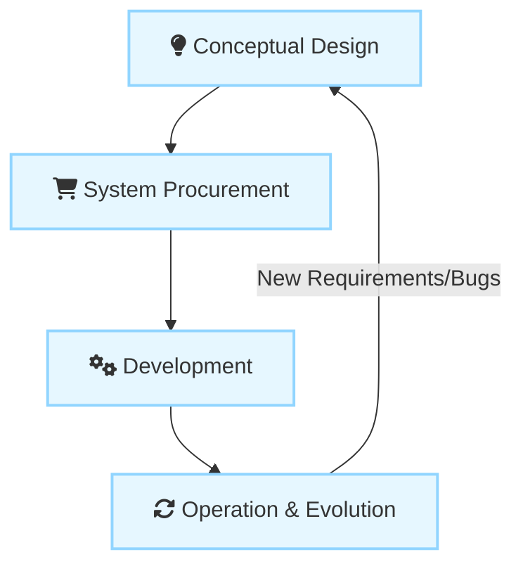
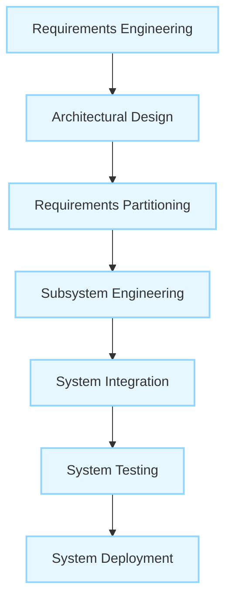
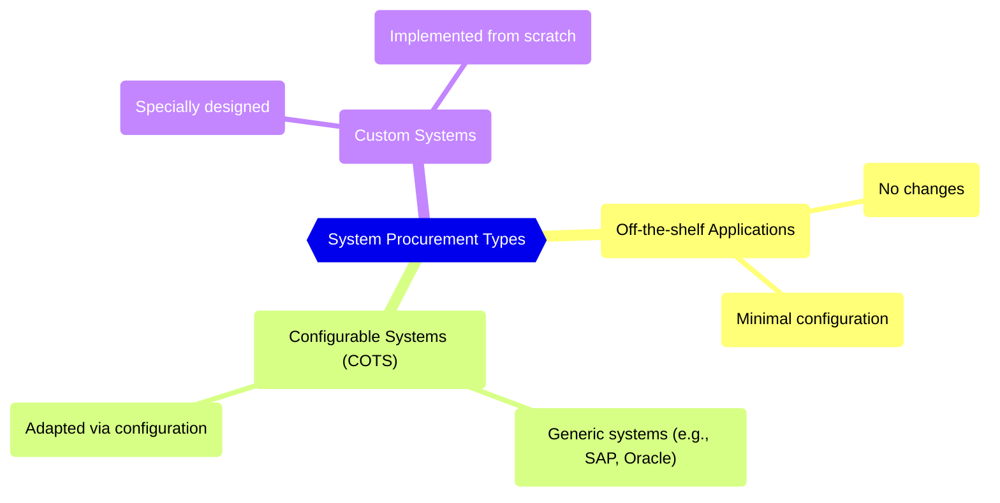

## I. The Systems Engineering Process

### A. Key Definitions and Stages

1. **Systems Engineering :** The activity concerned with specifying, buying, designing, and testing complex sociotechnical systems, encompassing hardware, software, and operational processes. It includes everything related to procuring, specifying, developing, deploying, operating, and maintaining both technical and sociotechnical systems.
    
2. **Stages of Systems Engineering:** The life cycle of systems engineering involves fundamental stages, with decisions made at any one stage potentially having a profound influence on the others.

    
- **Conceptual Design:** The activity where high-level system requirements and a **vision of the operational system** is developed.
        
- **System Procurement (Acquisition):** Decisions are made about which hardware and software must be acquired, which suppliers should develop the system, and the terms of the contract.
        
- **Development:** The system is built, integrating hardware and software engineering, system integration, and testing. Operational processes are also defined, and training courses are designed.
        
- **Operation and Evolution:** The long-term modification of the system to reflect changes in business requirements and the operating environment.        

### B. Development Process Characteristics

1. **Plan-Driven Requirement:** Higher-level systems engineering processes are typically **plan-driven processes** (often following a waterfall model). This is essential because different elements of the system (hardware, software, buildings) are developed **independently** and often by different contractors concurrently.
    
2. **Rationale:** Interfaces must be fully defined before development. Changes during development (especially hardware changes) can be very expensive or impossible.
    
3. **Key Development Activities:**
    
    1. **Requirements Engineering:** Refining, analyzing, and documenting high-level/business requirements.
        
    2. **Architectural Design:** Establishing the overall structure, identifying components, and understanding their relationships.
        
    3. **Requirements Partitioning:** Deciding which subsystems are responsible for implementing requirements (allocating requirements to hardware, software, or operational processes).
        
    4. **Subsystem Engineering:** Developing software, configuring off-the-shelf hardware/software, designing special-purpose hardware, and defining operational processes.
        
    5. **System Integration:** Putting system elements together to create a new system where emergent properties become apparent.
        
    6. **System Testing:** Extended activity to test the whole system, including acceptance/user testing.
        
    7. **System Deployment:** Making the system available, transferring data, and establishing communications.

### C. Challenges of Interdisciplinary Development

Systems engineering requires the involvement of a range of professional disciplines (e.g., electrical, software, mechanical, user interface designers).

- **Misunderstandings due to Terminology:** Different professional disciplines often use the **same words but they do not always mean the same thing**, leading to errors if not resolved early.
    
- **Misconceptions about Capabilities:** Each discipline often makes assumptions about what other disciplines can or cannot do based on inadequate understanding. For example, an electronic engineer might assume software can easily handle computationally intensive tasks to simplify hardware design.
    

## II. System Procurement

### A. Key Definition and Drivers

1. **System Procurement (System Acquisition) :** A process whose outcome is a decision to buy one or more systems from system suppliers. At this stage, decisions are made on the scope of a system that is to be purchased, system budgets and timescales, and high-level system requirements.
    
2. **Drivers for Procurement Decisions:**
    
    - **External Competition:** If a business needs to compete more effectively or maintain a competitive position, managers may decide to buy new systems to improve business efficiency or effectiveness.
        
    - **The Need to Comply with External Regulations:** Businesses are increasingly regulated and must demonstrate compliance with externally defined regulations.
        
    - **The Replacement of Other Organizational Systems:** An organization may have a mixture of systems that cannot work together or that are expensive to maintain.
        

### B. Types of Systems Procured

The procurement approach depends on the type of system or component needed:

1. **Off-the-shelf Applications:** Systems that can be used without changes and require minimal configuration.
    
2. **Configurable Application or ERP Systems (COTS):** Generic, large-scale systems (like SAP or Oracle) that must be adapted through configuration features or code modification.
    
3. **Custom Systems:** Systems that must be specially designed and implemented.
    

### C. Procurement Processes by System Type

|**System Type**|**Core Activities**|**Requirements Status**|
|---|---|---|
|**Off-the-shelf Systems**|Conceptual design, assessing approved applications, and placing the order.|Requirements usually match or are adapted post-selection.|
|**Configurable Systems**|Market survey, choosing a shortlist, **refining requirements** to match candidate systems, choosing a supplier, and contract negotiation.|Requirements must often be modified or adapted to fit the system's assumptions.|
|**Custom Systems**|**Defining detailed requirements** (which form the legal contract), issuing a request for tender, choosing a supplier, and contract negotiation.|Requirements document is **critical** and part of the contract.|

### D. Requirements and Contracts in Procurement

- **Legal Documents:** For custom systems, the requirements document becomes a **legal document** and the basis for the contract.
    
- **Public Sector Constraints:** For public sector systems, detailed rules often require all systems above a certain price to be open to tender. This forces system buyers to develop **complete requirements upfront** so all companies can bid, a constraint that slows down the process and inhibits agile development.
    
- **Negotiation:** Contract negotiations for custom systems cover payment schedules, reporting, acceptance criteria, and costs of change requests.
    

### E. Challenges and Consequences

1. **The Criticality of Procurement Decisions:**
    
    - Decisions made at the procurement stage are **critical for later stages**; poor choices lead to late delivery and systems unsuited to their operational environment.
        
    - If the wrong system is chosen (e.g., an ERP system that cannot handle organizational diversity), the system may be **abandoned** after major costs are incurred.
        
    - Choosing to procure a custom system requires significant effort in defining complex requirements (e.g., dependability), which can substantially extend time and budget.
        
2. **Non-Technical Influences:**
    
    - **Political Motivation:** Many bad procurement decisions stem from political rather than technical causes.
        
    - **Examples of Political Drivers:** Senior management demanding a single system across the organization; suppliers chosen based on long-standing relationships; or managers preferring compatibility with existing systems rather than new, superior technology.
        

### F. Analogy: System Engineering vs. System Procurement

If **Systems Engineering** is the master plan for building a new national railway network (defining the tracks, the trains, the scheduling rules, and the staff training), then **System Procurement** is the specific stage where the government chooses _which_ companies will supply the specialized steel for the tracks, _which_ manufacturer will build the locomotives, and _which_ contractor will implement the ticketing software, all based on predefined requirements and legal contracts. Procurement formalizes the financial and contractual aspects of the high-level engineering plan.

