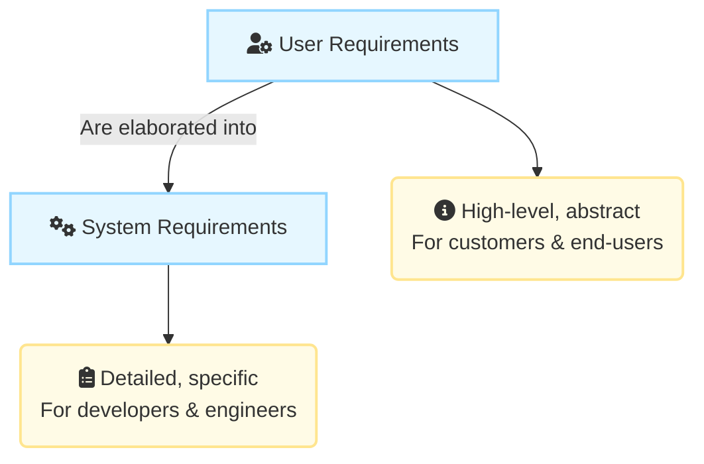
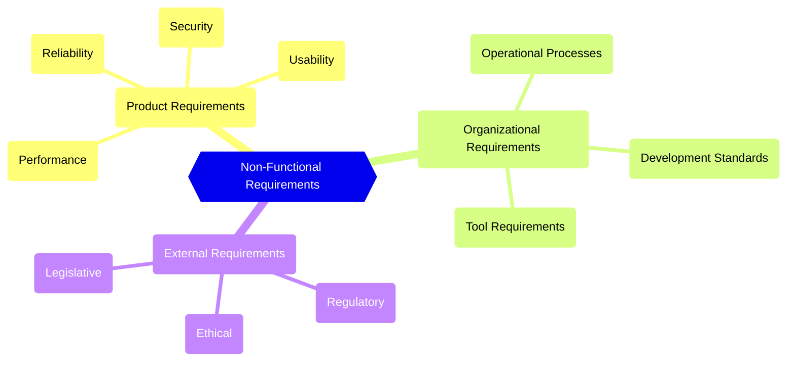
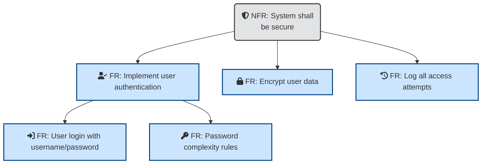

# Requirements Engineering

## I. Requirements Engineering Fundamentals

### A. Core Concepts and Definitions

1. **Requirement :** A description of the **services** a system should provide and the **constraints** on its operation. Requirements reflect the needs of customers for a system that serves a specific purpose (e.g., controlling a device, finding information, or placing an order).
    
2. **Requirements Engineering (RE) :** The process of finding out, analyzing, documenting, and checking the services and constraints of a system.
    
3. **System Stakeholder :** Any individual or group who is affected by the system in some way and thus has a legitimate interest in it.
    

### B. Requirements Engineering in the Software Lifecycle

Requirements Engineering is typically presented as the first stage of the software engineering process. It establishes a high-level view of what the system might do and the benefits that it might provide.

These findings are often used in a feasibility study, which assesses whether the proposed system is technically and financially feasible. The results of this study help management decide whether to proceed with the procurement or development of the system.

### C. Levels of Requirements Specification

Requirements are documented at different levels of detail because they are read and utilized by different stakeholders for different purposes.

#### 1. User Requirements Specification

- **Definition:** Statements written in natural language, supplemented by simple diagrams and tables. They describe what services the system is expected to provide to system users and the constraints under which it must operate.
    
- **Purpose:** To describe the functional and non-functional requirements in a way that is understandable by system users and customers who lack detailed technical knowledge. User requirements should avoid software jargon, structured notations, or formal notations.
    
- **Content Focus:** This specification should describe only the external behavior of the system. The content may vary from broad statements of required features to detailed descriptions of system functionality.
    

#### 2. System Requirements Specification

- **Definition:** A detailed, expanded version of the user requirements. This document, sometimes called a functional specification, provides more specific information and a detailed description of the services, functions, and operational constraints of the software system to be implemented.
    
- **Purpose:** Serves as the starting point for system design by software engineers. It should define exactly what is to be implemented and may be used as part of the contract between the system buyer and the software developers.
    
- **Content Focus:** This specification should ideally describe only the external behavior and operational constraints of the system. However, for complex systems, some initial design information (such as a proposed architecture) may be included to help structure the specification.
    

### D. Stakeholder Readership by Requirement Level

The level of detail required by a reader depends on their role and concerns.

1. **Audience for User Requirements:** Stakeholders who are not usually concerned with how the system will be implemented or may be managers not interested in detailed facilities. This audience includes:
    
    - Client Managers
        
    - System End-Users
        
    - Client Engineers
        
    - Contractor Managers
        
    - System Architects
        
2. **Audience for System Requirements:** Stakeholders who need to know more precisely what the system will do, either because they are involved in system implementation or need to understand how it will support business processes. This audience includes:
    
    - System End-Users
        
    - Client Engineers
        
    - System Architects
        
    - Software Developers

## II. Functional Requirements (FRs)

### A. Key Definition and Scope

Functional requirements are explicit **statements of services the system should provide**. This includes defining how the system must react to particular inputs and how it must behave in particular situations. They may also explicitly define what the system should **not** do.

1. **Dependency:** The nature of functional requirements depends on the type of software being developed, the expected users, and the general approach the organization takes when documenting requirements.
    
2. **Specification Levels:**
    
    - **User Requirements:** When expressed as user requirements, functional requirements should be written in natural language so that system users and managers can understand them.
        
    - **System Requirements:** Functional system requirements expand upon the user requirements and are written for system developers. They should describe the system functions, their inputs and outputs, and exceptions in detail.
        
3. **Information Requirements:** In cases where an organization plans to use an existing off-the-shelf software product, the focus of specification shifts from functional requirements to **information requirements**. These define the necessary information people need to do their work, and how that information is to be delivered and organized.
    

### B. Quality Attributes of Functional Requirements

An ideal functional requirements specification should be both complete and consistent.

1. **Completeness:** All services and information required by the user should be defined.
    
2. **Consistency:** Requirements should not be contradictory.
    

Achieving both completeness and consistency is complex and is often only possible for very small systems. This difficulty arises for two primary reasons:

- In large, complex systems, mistakes and omissions are easy to make.
    
- Large systems involve many stakeholders with different backgrounds and expectations. These stakeholders are likely to have different, and often inconsistent, needs. Such inconsistencies may not be obvious when requirements are first specified and may only be discovered after deeper analysis or during system development.
    

#### Risk of Imprecision

Ambiguous or imprecise requirements can lead to disputes, implementation delays, and cost increases. This is because system developers may interpret vague requirements in a way that simplifies implementation, which frequently conflicts with the customer’s true intentions.

### C. Examples of Functional Requirements

Functional requirements for a hypothetical Mentcare system (Mental Health Care Patient Management System) could include:

- A user **shall be able to search** the appointments lists for all clinics.
    
- The system **shall generate each day**, for each clinic, a list of patients who are expected to attend appointments that day.
    
- Each staff member using the system **shall be uniquely identified** by his or her eight-digit employee number.
    

## III. Non-functional Requirements (NFRs)

### A. Key Definition and Characteristics

Non-functional requirements are **constraints** on the services or functions offered by the system. They include timing constraints, constraints on the development process, and constraints imposed by standards. NFRs often apply to the **system as a whole** rather than individual system features.

1. **Scope:** NFRs specify or constrain characteristics related to **emergent system properties** (e.g., reliability, response time, and memory use). They also cover constraints on the development process, standards adherence, and implementation details (e.g., I/O device capabilities).
    
2. **System Impact:** NFRs often affect the overall architecture of the system. Their implementation may be **spread throughout the system** rather than being confined to individual components.
    
3. **Criticality:** Non-functional requirements are often more critical than individual functional requirements. System users can usually find ways to work around a function that does not meet their needs. However, failing to meet an NFR can render the entire system unusable.
    
    - **Example (Reliability):** If an aircraft system does not meet its reliability requirements, it will not be certified as safe for operation.
        
    - **Example (Performance):** If an embedded control system fails to meet its performance requirements, the control functions will not operate correctly.
        

### B. Sources and Classification

NFRs can be classified into three main groups based on the requirements origin:

1. **Product Requirements:** Specify or constrain the **runtime behavior** of the software.
    
    - _Examples:_ Performance (speed, memory required), Reliability (acceptable failure rate), Security, and Usability requirements.
        
2. **Organizational Requirements:** Broad system requirements derived from **policies and procedures** in the customer’s and developer’s organizations.
    
    - _Examples:_ Operational process requirements (defining system use) and Development process requirements (specifying development methods or tools).
        
3. **External Requirements:** Derived from factors external to the system and development process. These may include regulatory requirements that set out what must be done for the system to be approved for use.
    
    - _Examples:_ Regulatory, ethical, and legislative requirements (e.g., privacy laws, safety regulations) that ensure the system is acceptable to its users and the general public.
        

### C. Quantitative Specification and Metrics

To be verifiable, non-functional requirements should be stated **quantitatively** whenever possible, allowing them to be objectively tested and measured for compliance.

#### 1. Metrics for Quantifiable NFRs

Common metrics used for objective specification include:

- **Speed/Efficiency (Performance):** Processed transactions/second, User/event response time, Screen refresh time.
    
- **Size:** Memory required, Chip area.
    
- **Robustness:** Time to restart after failure, Probability of data corruption on failure, Percentage of events causing failure.
    
- **Reliability:** Mean time to failure (MTTF), Rate of occurrence of failure (ROCOF).
    
- **Safety:** Probability of failure on demand (POFOD).
    
- **Availability (AVAIL):** The probability that a system will be operational when a demand is made for service, expressed as a percentage of operational time. (e.g., 0.9999 availability means the system is unavailable for less than 8.4 seconds in a 24-hour period).
    
- **Portability:** Percentage of target-dependent statements, Number of target systems.
    
- **Usability:** Training time required, Average number of errors made by experienced users per hour.
    

#### 2. Example: From Goal to Verifiable Requirement

- **General Goal (Non-testable):** "Medical staff should be able to use the system easily."
    
- **Verifiable NFR (Testable):** "Medical staff shall be able to use all the system functions after two hours of training. After this training, the average number of errors made by experienced users shall not exceed two per hour of system use."
    

### D. Examples of Non-functional Requirements (Mentcare System)

1. **Product Requirement (Availability):** "The Mentcare system shall be available to all clinics during normal working hours (Mon–Fri, 08:30–17:30). **Downtime** within normal working hours shall **not exceed 5 seconds in any one day**."
    
2. **Organizational Requirement (Authentication):** "Users of the Mentcare system shall identify themselves using their health authority identity card."
    
3. **External Requirement (Privacy):** "The system shall implement patient privacy provisions as set out in HStan-03-2006-priv."
    

## IV. The Relationship Between Requirement Types

### A. Interdependence

The distinction between functional and non-functional requirements is not always clear-cut. The two types are not independent; often, one type of requirement will generate or constrain other requirements.

### B. Example: Security

A user requirement concerned with security, such as a statement limiting access to authorized users, may appear to be a non-functional requirement. However, when developed in more detail, this single requirement may generate other requirements that are clearly functional, such as the need to include user authentication facilities (e.g., login, password management) in the system.

The system requirements, therefore, do not just specify the services or features required; they also specify the necessary functionality to ensure that these services and features are delivered effectively.

### C. Analogy

Think of designing a high-performance race car.

- **Functional Requirements** are the car's basic services which define **what** the car does : 
	- "It must accelerate from 0 to 60 mph," 
	- "It must brake when the pedal is pressed,"
	- "It must turn when the steering wheel is turned."

- **Non-functional Requirements** are the constraints and quality attributes which define **how well** or under **what restrictions** the car performs its functions : 
	- "The car must have an _Availability_ (Product NFR) of 99.9% during the race," 
	- "It must be constructed using _Organization_ standards (Organizational NFR) set by the company,"
	- "It must not exceed 90 decibels of noise (External/Regulatory NFR)." 

> [!NOTE] Practice Questions
> - Explain the differences between **Functional and Non-Functional Requirements** with suitable examples.
> - Identify various **functional and non-functional requirements** of a banking system.
> - What are **non-functional requirements**? Explain the **three types** of non-functional requirements (Product, Organizational, External).
> - What are the **metrics for specifying non-functional requirements**? (List/tabulate common metrics used for NFRs such as performance, reliability, availability, usability, portability.)
