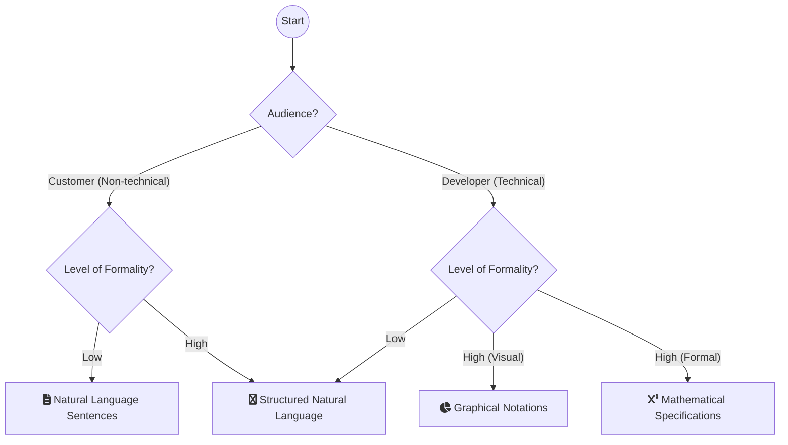
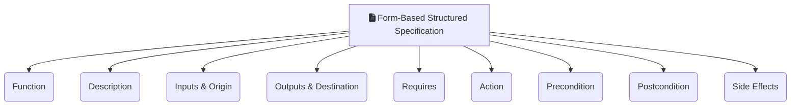
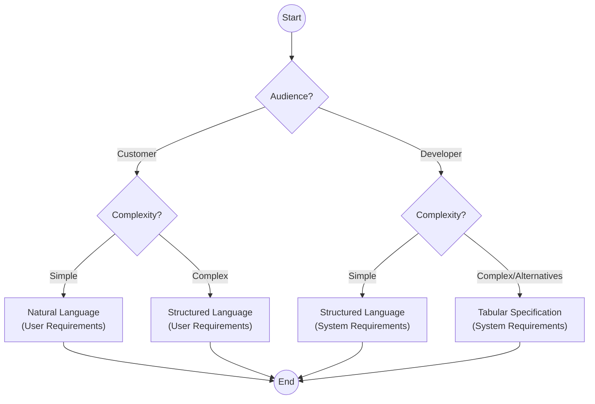

## IV. Requirements Specification

### A. Goal and Output

1. **Goal:** To translate the gathered information into a precise document. The resulting **Software Requirements Document (SRD)** should ideally be clear, unambiguous, easy to understand, complete, and consistent, although this is practically impossible for large systems.
    
2. **Content:** The specification includes two primary types of requirements:
    
    - **User requirements:** Abstract statements for customers and end-users, typically written in natural language.
        
    - **System requirements:** Detailed functional and non-functional descriptions for developers; they may be written using more formal notations.
        

### B. Notations for Requirements Specification

Different notations are suitable for different audiences and levels of detail. User requirements are almost always written in **natural language** supplemented by diagrams, while system requirements may use natural language, graphical, or mathematical notations.

|**Notation**|**Description**|
|---|---|
|**Natural Language Sentences**|Requirements are written using numbered sentences, with each sentence expressing one requirement.|
|**Structured Natural Language**|Requirements are written on a standard form or template, where each field provides information about an aspect of the requirement. This reduces variability and imposes uniformity.|
|**Graphical Notations**|Graphical models (e.g., UML use case and sequence diagrams) define the functional requirements, supplemented by text annotations. Use cases, for example, identify actors and interaction types.|
|**Mathematical Specifications**|Notations based on formal concepts like finite-state machines or sets. While unambiguous, they are often difficult for most customers to understand and check.|

### C. Natural Language Specification Guidelines

Natural language is popular because it is expressive and intuitive, but its flexibility makes it potentially vague and ambiguous, complicating interpretation.

To minimize ambiguity in natural language requirements, follow these guidelines:

- **Standard Format:** Invent a standard format and ensure all requirements adhere to it. Write the requirement in one or two sentences.
    
- **Consistent Language:** Use language consistently to distinguish between **mandatory** requirements (usually using "**shall**") and desirable requirements ("should").
    
- **Highlighting:** Use text highlighting (bold, italic, or color) for key parts of the requirement.
    
- **Avoid Jargon:** Avoid technical jargon, abbreviations, and acronyms (like "architecture" or "module") that non-technical readers may misunderstand.
    
- **Rationale:** Whenever possible, associate a rationale with each user requirement to explain _why_ it was included and who proposed it (the source).
    

### D. Structured Specifications

Structured natural language uses a standard way of writing requirements (usually templates or forms) to maintain expressiveness while enforcing uniformity and organization.

**Advantages:** This approach reduces **variability** and helps organize requirements more effectively compared to free-form text.

**Form-Based Information:** Information typically included in a form-based structured specification:
    
- A **description** of the function or entity being specified.
	
- A description of its **inputs** and their origin.
	
- A description of its **outputs** and their destination.
	
- Information needed for the computation (**"requires"** part).
	
- A description of the **action** to be taken.
	
- **Precondition** (what must be true before the function is called) and **postcondition** (what is true after the function is called).
	
- A description of any **side effects** of the operation.
	

## V. Requirements Specification Examples

The use of different specification styles (Natural, Structured, and Tabular) helps manage the inherent ambiguity of requirements and is chosen based on the audience (customer vs. developer) and the complexity of the feature being specified.

### A. Natural Language Specification (User Requirements)

Natural language specification is used for writing **user requirements** because it is expressive, intuitive, and universal, making it understandable by non-technical system users and customers.

#### Example: Insulin Pump Software System

This example follows the recommended guidelines by using a standard format, "shall" for a mandatory requirement, and including a rationale.

|**Requirement ID**|**Specification**|
|---|---|
|**3.2**|The system **shall measure** the blood sugar and **deliver insulin**, if required, **every 10 minutes**.|
|**Rationale:**|(Changes in blood sugar are relatively slow, so more frequent measurement is unnecessary; less frequent measurement could lead to unnecessarily high sugar levels.)|

### B. Structured Specification (System Requirements)

Structured natural language is a technique where requirements are written in a standard format (template or form) to impose uniformity, reduce ambiguity, and reduce variability. This level is used for **system requirements** directed at software engineers.

#### Example: Insulin Pump - Safe Sugar Level Dose Computation

This form-based specification details a specific function, defining the conditions for calculating the insulin dose when the blood sugar level is within a safe range.

|**Field**|**Content**|
|---|---|
|**Function**|Compute insulin dose: Safe sugar level.|
|**Description**|Computes the dose of insulin to be delivered when the blood sugar level is in the safe band (4 to 8 units).|
|**Inputs**|Three blood sugar readings (r0, r1, r2).|
|**Source**|Blood sugar sensor.|
|**Outputs**|CompDose (the dose to be delivered) and a command to the pump.|
|**Destination**|Insulin pump and control system.|
|**Requires**|Two previous readings so that the rate of change of sugar level can be computed.|
|**Precondition**|The insulin reservoir contains at least the maximum allowed single dose of insulin.|
|**Postcondition**|r0 is replaced by r1 then r1 is replaced by r2.|
|**Side effects**|None.|

### C. Tabular Specification (System Requirements Detail)

Tables are especially useful when specifying functional requirements that deal with a number of **alternative situations** or complex computations, as they simplify the description of actions taken for each condition. This helps clarify complex logic that is difficult to write unambiguously in natural language text.

#### Example: Insulin Pump - Rate of Change and Dose Calculation

The insulin pump's computation of insulin dose is based on the rate of change of blood sugar levels (calculated using current and previous readings). The table below specifies the computation logic:

|**Condition**|**Action**|
|---|---|
|**Sugar level falling** (_r2 < r1_)|`CompDose = 0`|
|**Sugar level stable** (_r2 = r1_)|`CompDose = 0`|
|**Sugar level increasing and rate of increase decreasing** (_r2 > r1 & ((r2 - r1) < (r1 - r0))_)|`CompDose = 0`|
|**Sugar level increasing and rate of increase stable or increasing** (_r2 > r1 & ((r2 - r1) $\geq$ (r1 - r0))_)|`CompDose = round ((r2 - r1)/4)`. If rounded result = 0 then `CompDose = MinimumDose`|

### D. Summary Analogy

**Analogy: The Blueprint for a Skyscraper**

 The Software Requirements Document is like the blueprint for a skyscraper. 
 * It doesn't just show the pretty picture (the **user requirements**); 
 * it includes detailed structural diagrams (**system requirements**), material constraints (**non-functional requirements**), and 
 * a comprehensive log of decisions, ensuring that all tradesmen (developers, managers, testers) know exactly what must be built, how well it must stand up, and why it's needed.

## VI. The Software Requirements Document (SRD)

### A. Key Definitions and Core Concepts

1. **Requirements:** Descriptions of the services a system should provide and the constraints on its operation.
    
2. **Requirements Specification:** The process of writing down the user and system requirements into a document.
    
3. **Software Requirements Document (SRD) / Software Requirements Specification (SRS):** An official statement of what the system developers should implement. It may include both the user requirements for a system and a detailed specification of the system requirements.
    
4. **System Requirements Document (Functional Specification):** A detailed description of the software system’s functions, services, and operational constraints that defines **exactly what is to be implemented**. It may be part of the contract between the system buyer and the software developers.
    
5. **Ideal Document Quality:** Ideally, the requirements specified within the document should be clear, unambiguous, easy to understand, complete, and consistent.
    
6. **Structure and Architecture:** The requirements document may need an initial architectural design of the system to help organize the specification, particularly structuring the requirements according to the different subsystems.
    
7. **System-as-a-Whole Focus:** The document should generally describe only the **external behavior** of the system and its operational constraints, avoiding excessive detail about internal design or implementation.
    

### B. Importance, Usage, and Level of Detail

#### 1. When the SRD is Essential

Requirements documents are critical under specific professional circumstances:

- When systems are **outsourced** for development.
    
- When **different teams** develop different parts of the system.
    
- When a detailed analysis of the requirements is **mandatory** (e.g., for critical systems).
    

In contrast, agile methods often argue against detailed requirements documents, favoring short, incrementally collected **user stories** written on cards or whiteboards, as formal documents are viewed as quickly obsolete.

#### 2. Determining the Level of Detail

The required detail in the document depends on the system type and the development process:

- **Critical Systems (e.g., Safety/Security-Critical):** These systems need **detailed and precise** requirements because safety and security must be analyzed thoroughly to find possible errors.
    
- **Contracted/Outsourced Systems:** The specifications must be **detailed and precise**.
    
- **In-house/Iterative Development:** The requirements document can be **less detailed**, allowing details and ambiguities to be resolved later during the development process.
    

#### 3. Stakeholder Roles and Document Usage

Different types of readers use the requirements document for different purposes:

- **System Customers:** Specify the requirements and read them to check if they meet their needs; specify changes to the requirements.
    
- **Managers:** Use the requirements document to plan a bid for the system and to plan the system development process.
    
- **System Engineers (Developers):S** Use the requirements to understand the system and the relationships between its parts.
    
- **System Test Engineers:** Use the requirements to develop validation tests for the system.
    
- **System Maintenance Engineers:** Use the requirements to understand the system and the relationships between its parts.
    

### C. Recommended Document Structure

The organization of the SRD often follows a structure recommended by standards organizations, such as the **IEEE** (Institute of Electrical andElectronic Engineers), especially for complex, long-lifetime systems.

| **Document Section**                  | **Core Concepts and Content**                                                                                                                                                                                                                                                                                                                                              |
| ------------------------------------- | -------------------------------------------------------------------------------------------------------------------------------------------------------------------------------------------------------------------------------------------------------------------------------------------------------------------------------------------------------------------------- |
| **Preface**                           | Defines the expected readership.   Describes the document's version history, including the rationale for creating a new version and a summary of changes made.                                                                                                                                                                                                    |
| **Introduction**                      | Describes the need for the system.     Briefly describes the system’s functions and explains how it will work with other systems.       Describes how the system fits into the overall business or strategic objectives of the organization.                                                                                                             |
| **Glossary**                          | Defines all technical terms used, as assumptions should not be made about the reader's experience.                                                                                                                                                                                                                                                                         |
| **User Requirements Definition**      | Describes the services provided for the user, including the nonfunctional requirements, using notations (like natural language and diagrams) that are understandable to customers.     Specifies product and process standards that must be followed.                                                                                                             |
| **System Architecture**               | Provides a high-level overview of the anticipated system architecture, showing the distribution of functions across system modules.  Architectural components that are reused should be highlighted.                                                                                                                                                                 |
| **System Requirements Specification** | Detailed description of the functional and nonfunctional requirements.     Interfaces to other systems may be defined.                                                                                                                                                                                                                                            |
| **System Models**                     | Includes graphical models (e.g., object models, data-flow models) showing relationships between components and the system and its environment.                                                                                                                                                                                                                             |
| **System Evolution**                  | Describes the fundamental assumptions on which the system is based, and any anticipated changes due to hardware evolution, changing user needs, and so on.   Useful for system designers in avoiding design decisions that would constrain likely future changes to the system.                                                                                   |
| **Appendices**                        | Provide detailed, specific information that is related to the application being developed (e.g., hardware and database descriptions).     Hardware requirements define the minimal and optimal configurations for the system.   Database requirements define the logical organization of the data used by the system and the relationships between data. |
| **Index**                             | Includes indexes (e.g., alphabetic index, index of diagrams, index of functions) to help readers find information easily.                                                                                                                                                                                                                                                  |

> [!NOTE] Practice Questions
> - Explain **different ways of writing system requirements specification (SRS)** (natural language, structured natural language, graphical, mathematical). What are the advantages and trade-offs?
> - List the **problems that can arise when user requirements are written in natural language**.
> - Highlight the **key activities involved in the requirements specification process**.
> - Discuss the **general structure of a software requirements document (IEEE SRS)** and who the primary readers/users of the document are.

