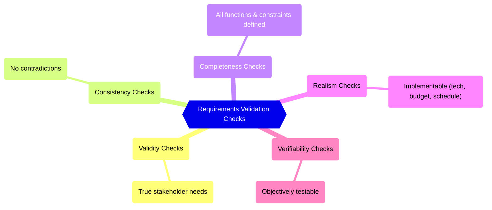
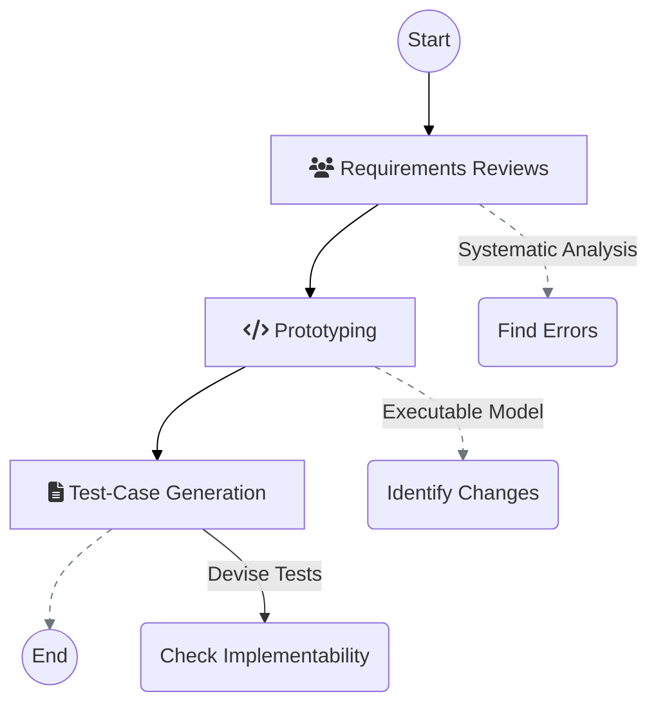
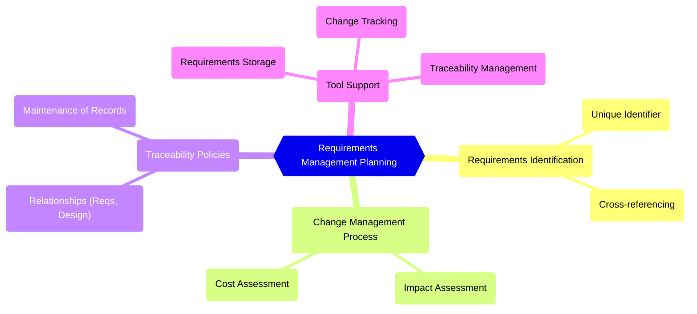
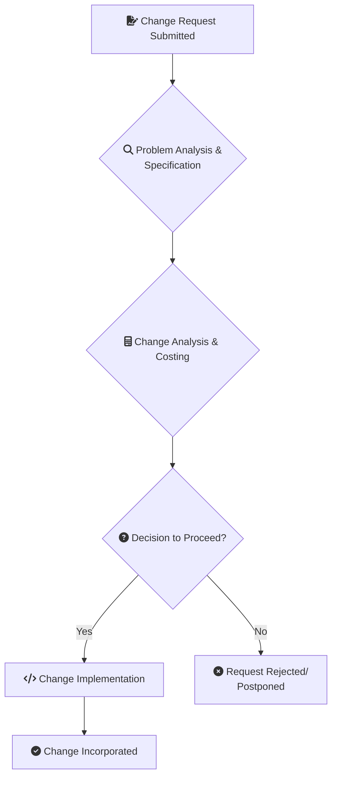

## VII. Requirements Validation

Requirements validation is the process of checking that the requirements define the system that the customer **really wants**. It is concerned with finding problems with the requirements and overlaps with elicitation and analysis.

* Requirements validation is critically important because errors in a requirements document can lead to **extensive rework costs** when these problems are discovered during development or after the system is in service. 
* The cost of fixing a requirements problem by making a system change is usually much greater than repairing design or coding errors, as a change to the requirements usually means that the system design and implementation must also be changed.

### A. Goal and Importance

1. **Goal:** To check that the requirements define the system the customer **really wants**. This involves ensuring the requirements are realistic, consistent, and complete.
    
2. **Consequence of Failure:** Errors in the requirements document, if discovered late, can lead to **extensive rework costs** during development or after system deployment.
    
3. **Role in Dependable Processes:** Requirements reviews are included in dependable processes to check that requirements are, as far as possible, complete and consistent.
    

### B. Validation Checks (5 key Dimensions)

During the requirements validation process, different types of checks should be carried out on the requirements in the requirements document.

1. **Validity Checks:** Ensuring the requirements cover the **true needs** of the stakeholders. User requirements may have changed since they were originally elicited.
    
2. **Consistency Checks:** Ensuring that there are no contradictions or conflicting descriptions of the same function or constraints within the document.
    
3. **Completeness Checks:** Ensuring all required functions and constraints intended by the system user are fully defined.
    
4. **Realism Checks:** Using knowledge of the existing technology, proposed budget, and schedule to ensure that the requirements **can be implemented**.
    
5. Verifiability: Ensuring requirements are written so that a set of tests can be objectively designed to demonstrate that the delivered system meets each specified requirement, thereby reducing potential disputes.
    
### C. Validation Techniques
    

    
1. **Requirements Reviews:** A systematic analysis of the requirements by a team of reviewers to find errors and inconsistencies.
    
    
    
2. **Prototyping:** Developing an executable model of the system for end-users and customers to interact with. Their feedback helps identify necessary requirements changes and unmet expectations.
    
    
    
3. **Test-Case Generation:** Devising tests for the requirements as part of the validation process. If a test is difficult or impossible to design, this usually means that the requirement will be difficult to implement and should be reconsidered. Developing tests from user requirements before code is written is an integral part of test-driven development.
    

    

    
### D. Challenges in Validation

The problems involved in requirements validation should not be underestimated. It is difficult to show that a set of requirements does in fact meet a user’s needs. Users need to picture the system in operation and imagine how that system would fit into their work. This type of abstract analysis is difficult even for skilled computer professionals and harder still for system users.

As a result, it is rare to find all requirements problems during the requirements validation process. Inevitably, further requirements changes will be needed to correct omissions and misunderstandings after agreement has been reached on the requirements document.

> [!NOTE] Practice Questions
> - Mention different types of **checks that should be carried out** during the requirements validation process (validity, consistency, completeness, realism, verifiability). Explain each briefly.
> - Differentiate between **verification and validation** in the requirements context.
> - Describe **validation techniques** and when to use them (requirements reviews, prototyping, test-case generation).

## VIII. Requirements Management and Change

> [!NOTE] Practice Questions
> - What is **requirement change management**? What are the **principal stages of the change management process** (problem analysis and change specification, change analysis and costing, change implementation)?
> - What is **requirements management** and what planning activities are needed (identification, traceability, tool support, change management process)?

### A. Core Concept and Inevitability of Change

1. **Requirements Management :** The process of **managing changes** to the requirements of a system.
    
2. **Inevitability of Change :** Requirements for large software systems are always changing. This is a natural consequence of the development process and the system's environment. Change is inevitable for several reasons:
    
    - **Wicked Problems:** Many systems address "wicked" problems that cannot be completely defined upfront. The stakeholders’ understanding of the problem evolves during the development process, leading to new or modified requirements.
        
    - **Changing Environment:** The business and technical environment of a system changes after installation. New hardware may be introduced, new legislation may be enacted, or business priorities may shift, all ofwhich necessitate system changes.
        
    - **Stakeholder Conflicts:** Large systems have diverse stakeholders with different, often conflicting, priorities. The final requirements are an initial compromise. With experience, the balance of support may need to be changed, leading to re-prioritization and new requirements.
        
    - **User vs. Customer:** The people who pay for a system (customers) and the people who use it (end-users) are rarely the same. Customer-imposed budgetary or organizational constraints may conflict with user needs, requiring new features to be added after delivery for the system to be effective.
        

### B. The Need for Requirements Management

Given that requirements will evolve, a formal process must be in place to manage these changes. The goal is to track individual requirements, maintain links between dependent requirements, and assess the **impact** and **cost** of proposed changes _before_ they are implemented.

This process should begin as soon as a draft version of the requirements document is available.

### C. Requirements Management Planning

Requirements management planning is concerned with establishing how the set of evolving requirements will be managed. During this planning stage, several key issues must be decided:

1. **Requirements Identification:** Each requirement must be given a **unique identifier**. This is essential for it to be cross-referenced with other requirements and used in traceability assessments.
    
2. **Change Management Process:** This is the set of activities that assess the **impact and cost** of changes.
    
3. **Traceability Policies:** These policies define the **relationships** that should be recorded (between each requirement, and between requirements and the system design). The policy must also define how these traceability records will be maintained.
    
4. **Tool Support:** Automated tools are necessary for managing the large amounts of information involved. Tool support is needed for:
    
    - **Requirements Storage:** Maintaining the requirements in a secure, managed data store that is accessible to all stakeholders.
        
    - **Change Management:** Tracking suggested changes and the responses to them.
        
    - **Traceability Management:** Allowing related requirements to be discovered.
        
    - Tools can range from simple shared spreadsheets or databases to specialized requirements management systems (e.g., DOORS) for larger systems.
        

### D. Requirements Change Management Process

A formal requirements change management process should be applied to all proposed changes after the requirements document has been approved. This ensures all change proposals are treated consistently and that the benefits of implementation are justified by the costs.

The process has three principal stages:

1. **Problem Analysis and Change Specification:** The process begins when a stakeholder submits a **change request** (e.g., a bug report or a request for new functionality). The problem or change proposal is analyzed to check that it is valid. This analysis is fed back to the requestor, who may respond with a more specific change proposal or withdraw the request.
    
2. **Change Analysis and Costing:** The effect of the proposed change is assessed using traceability information and general knowledge of the system requirements. The cost of making the change is estimated (in terms of modifications to the requirements document, system design, and implementation). Once this analysis is complete, a decision is made on whether to proceed with the change.
    
3. **Change Implementation:** The requirements document and, where necessary, the system design and implementation, are modified.
    
    - **Document Changeability:** To support this, the requirements document should be organized to be changeable. This is achieved by minimizing external references and making document sections as modular as possible, allowing individual sections to be replaced without affecting other parts of the document.
        
    - If an emergency change must be made to the system, the requirements document must be updated as soon as possible to prevent the specification and implementation from becoming out of sync.
        

### E. Agile vs. Formal Change Management

1. **Agile Approach:** Agile development processes are designed to cope with requirements that change during development. When a user proposes a change, it does not go through a formal change management process. Instead, the user prioritizes the change and decides what planned features should be dropped from the next iteration to accommodate it.
    
2. **Drawbacks of Agile Approach:** This approach has potential problems. Users are not necessarily the best people to judge if a change is cost-effective. In systems with multiple stakeholders, a change that benefits one user may not benefit others.
    
3. **Formal Approach:** In contrast, the formal process utilizes an independent authority (like a **Change Control Board (CCB)**) who can balance the needs of all stakeholders and the long-term goals of the project when deciding which changes to accept.

