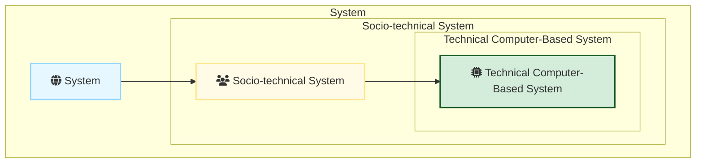
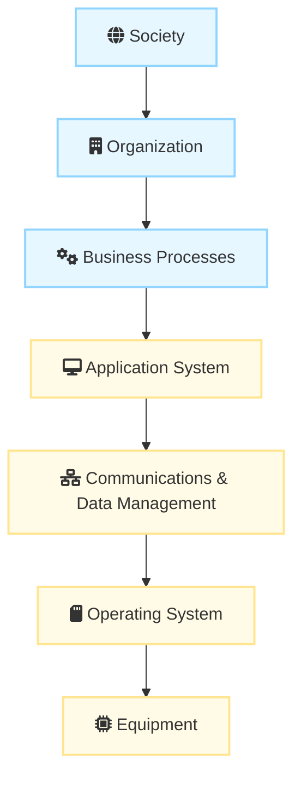
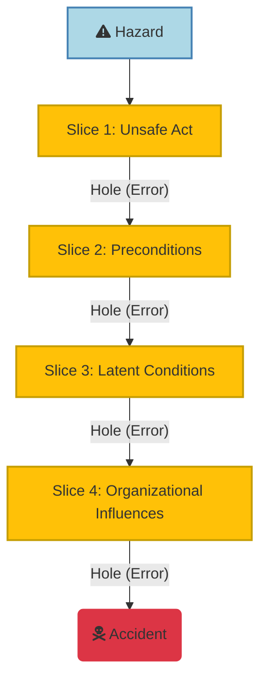

# Socio-technical Systems

## I. Socio-technical Systems Fundamentals

### A. Key Definitions

1. **System :** A purposeful collection of interrelated components, of different kinds, which **work together to deliver a set of services** to the system owner and users.
    
2. **Socio-technical System (STS) :** A system that includes technical components (hardware and software) but **crucially also includes people, defined operational processes**, and is situated within an organization, influenced by its policies and culture. These systems include non-technical elements such as people, processes, and regulations, as well as technical components.
    
3. **Technical Computer-Based System :** A system including hardware and software components but **excluding** the defined procedures and processes followed by human operators (e.g., mobile phones, computer games).

### B. Core Concepts

1. **Holistic View and Emergent Properties:** A system is defined as **more than simply the sum of its parts**. Systems possess **emergent properties** (like performance, reliability, safety, and security) that relate to the behavior of the system as a whole and only become apparent when components are integrated.
    
2. **Purpose:** Sociotechnical systems are developed to support human activities and deliver a business purpose, such as increasing sales or maintaining safe airspace.
    
3. **Engineering Focus:** When designing a dependable, software-intensive system, designers must take a **holistic sociotechnical systems perspective** rather than focusing solely on software or hardware. Errors are likely to occur at the interfaces between separately designed parts.
    
4. **Relationship to Software Engineering:**
    
    - **Systems engineering is broader**; software engineering is a component of systems engineering.
        
    - Systems engineering deals with all aspects of complex system development where software plays a major role, including hardware development, policy and process design, and system deployment.
        

### C. Example

- **Mentcare System:** This medical records system is a **sociotechnical system**. While it includes technical components (client software, server, database), its operation is critically influenced by staff, organizational policies (privacy, safety), and strict mental health laws governing patient detention.
    

## II. Sociotechnical System Structure and Context

### A. The Sociotechnical Systems Stack (Layers)

Sociotechnical systems are complex and must be viewed in layers. These layers, organized from innermost (technical) to outermost (environmental), influence the system’s behavior and requirements. Software is embedded in almost all layers.

1. **Equipment:** The hardware devices, some of which may be computers controlled by embedded software.
    
2. **Operating System:** Interacts with the hardware and provides a set of common facilities for higher software layers.
    
3. **Communications and Data Management:** Extends the operating system facilities to provide access to remote systems and databases (sometimes called middleware).
    
4. **Application System:** Delivers the application-specific functionality that is required.
    
5. **Business Processes:** The organizational business processes that make use of the software system.
    
6. **Organization:** Includes higher-level strategic processes as well as business rules, policies, and norms that should be followed.
    
7. **Society:** The laws and regulations of society that govern the operation of the system.
    

### B. Organizational Elements and Boundaries

The organizational environment in which a sociotechnical system operates influences its requirements, design, and eventual operation.

1. **Organizational Elements:** A new system may lead to changes in these fundamental organizational elements:
    
    - **Policies:** Organizational rules, such as security policies and data protection standards.
        
    - **Processes:** The operational procedures and workflows followed by staff when using the system.
        
    - **Jobs:** The responsibilities and work tasks of the people using and managing the system.
        
    - **Politics:** Organizational objectives and conflicts between organizational goals.
        
2. **System Boundaries:** Establishing system boundaries is difficult because large systems are often embedded in their organizational environments, and different people see the scope of the system differently. Defining the boundary is critical for requirements definition.
    

It is important to ensure that, wherever possible, software failure does not lead to overall system failure. This requires examining how the software interacts with its environment to ensure that:

- Software failures are, as far as possible, contained within the enclosing layer of the system stack and do not seriously affect the operation of other layers.
    
- Faults and failures in other layers are understood, so that checks may be built into the software to help detect these failures and support recovery.
    

## III. Complexity of Socio-technical Systems

### A. Core Concepts of Complexity

1. **Basis of Complexity:** System complexity arises from the **number of relationships** and the **nature of the relationships** (coupling) between system elements.
    
2. **Impact:** Complexity is the primary influence on a system's **understandability and changeability**. As complexity increases, so does the likelihood that changing one part will have unpredictable or undesirable effects elsewhere.
    
3. **Reductionism Failure:** The traditional engineering approach of **reductionism** (understanding a system by studying its separate parts) is **inadequate** for complex sociotechnical systems, because the number and dynamic nature of interactions cannot be analyzed as a whole.
    

### B. Types of Complexity

When discussing complex systems, particularly large-scale systems of systems, complexity is often categorized into three types:

1. **Technical Complexity:** Stems from the relationships between the hardware and software components of the system itself.
    
2. **Managerial Complexity:** Stems from the complexity of coordinating different managers and teams who may have conflicting priorities, especially when systems are managed independently.
    
3. **Governance Complexity:** Stems from the conflicting objectives, policies, and regulations (laws, ethical standards) that govern the system and its elements.
    

### C. Characteristics Driven by Complexity

The complexity of sociotechnical systems gives rise to crucial characteristics that challenge traditional software engineering:

1. **Emergent Properties:** These are properties of the system as a whole (e.g., dependability, security, resilience) that cannot be determined by analyzing individual components alone and only become visible when the system is integrated. **Reliability**, for example, is an emergent property dependent on hardware, software, and operator reliability.
    
2. **Non-deterministic Behavior:** The precise behavior of complex systems is often hard to predict because of the dynamic, complex interactions between components, the environment, and human operators.
    
3. **Wicked Problems:** Complex sociotechnical systems are often developed to solve "wicked problems," which are so complex that **no definitive problem specification exists**, and the true nature of the problem only emerges as the solution is developed (e.g., developing a national medical records system).
    

## IV. Dependability and Failure in Sociotechnical Systems

System dependability is influenced by all elements in a sociotechnical system—hardware, software, people, and organizations. Component failures in any system are inevitable.

### A. Failure Propagation (The Swiss Cheese Model)

System failure is often not due to a single component failing, but the unexpected alignment of multiple failures.

- **The Swiss Cheese Model:** This model suggests that hazards are prevented by multiple, redundant layers of defense (like slices of Swiss cheese). Failure occurs only when the weaknesses (holes) in all layers align temporarily, allowing a hazard to pass through the system defenses and trigger an accident.
    
- Failure Consequences: In complex sociotechnical systems, failure propagation can occur across system boundaries. A software failure in a technical system might not lead to total system failure if human operators in the broader sociotechnical system detect the failure and take corrective action.
    

### B. Regulation and Compliance

To ensure public safety, most governments limit the freedom of companies by requiring them to follow certain standards to ensure their products are safe and secure. Regulation and compliance (following the rules) applies to the **sociotechnical system as a whole**, not simply the software element of that system.

### C. Redundancy and Diversity

Strategies to achieve and enhance dependability rely on both redundancy and diversity.

1. **Redundancy :** Spare capacity is included in a system that can be used if part of that system fails.
    
2. **Diversity :** Redundant components of the system are of different types, thus increasing the chances that they will not fail in exactly the same way.

> [!NOTE] Practice Questions
> - Define **Socio-technical System** and **Complex Systems**.
> - Justify why **sociotechnical systems are viewed as layers**, and describe the **different layers of a Socio-Technical System**.
> - What are **emergent system properties**? List the **types of emergent properties** and explain how they affect behavior and performance.
> - List and discuss the **key factors which influence socio-technical system operation**.
> - What do you mean by **System Dependability**? Explain the **four principal dimensions of dependability** and give examples of principal dependability properties.

