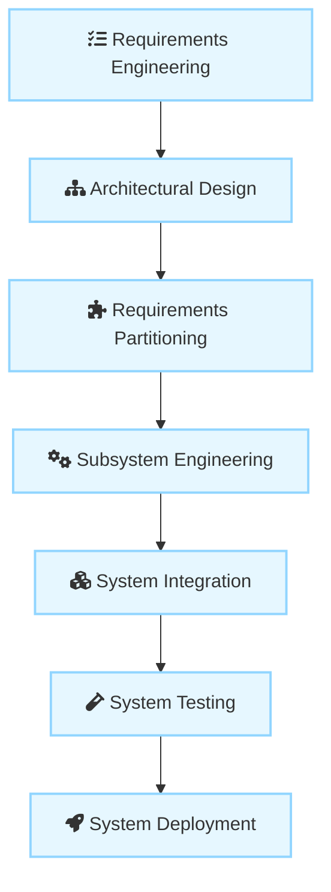
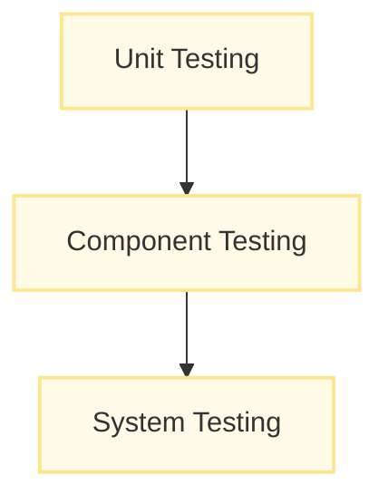
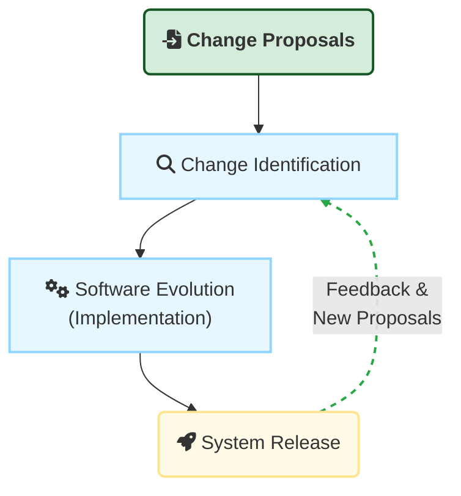

## III. System Development

### A. Definition and Core Concepts

1. **Definition :** System development is the complex process in which system elements (developed or purchased) are **integrated to create the final system**.
    
2. **Process Model :** Higher-level systems engineering processes are typically **plan-driven processes** (often following a waterfall model) rather than incremental models.
    
3. **Rationale for Plan-Driven Approach :** This approach is necessary because different elements (hardware, software, buildings) are developed **independently and concurrently** by different contractors. Therefore, all interfaces must be fully defined before development begins, as changes (especially to hardware) are often expensive or impossible later on.
    
4. **Relationship with Requirements/Design :** System development is inextricably linked with requirements development and high-level design; these processes are often concurrent, following a **spiral model** where requirements and architectural design are developed and refined together.
    
5. **Goal :** The process culminates in a "go live," after which users begin to use the system to support their work.
    

### B. Key Development Activities (Process Steps)

The systems development stage includes seven fundamental activities after the initial conceptual design:

1. **Requirements Engineering:** The process of refining, analyzing, and documenting the high-level and business requirements identified earlier in the conceptual design.
    
2. **Architectural Design:** Identifying the overall structure of the system, the principal components (subsystems or modules), their relationships, and how they are distributed. This process overlaps significantly with requirements engineering.
    
3. **Requirements Partitioning:** Deciding which components (hardware, software, or operational processes) are responsible for implementing the requirements.
    
4. **Subsystem Engineering:**
    
    - Developing the software components of the system.
        
    - Configuring off-the-shelf hardware and software components.
        
    - Designing special-purpose hardware, if necessary.
        
    - Defining the operational processes and redesigning essential business processes.
        
5. **System Integration:** The critical process of **putting together system elements** to create the new system. This is the stage where **emergent system properties** (like performance and security) first become apparent.
    
6. **System Testing:** An extended activity where the whole system is tested and problems are exposed. This includes acceptance/user testing by the procuring organization.
    
7. **System Deployment:** Making the system available to its users, including transferring data from existing systems and establishing communications with other systems in the environment.
    

### C. Implementation and Quality Practices in Development

1. **Design and Implementation :** These activities are invariably interleaved. In an agile approach, formal design documents may be minimized or recorded informally on whiteboards, with design decisions left to the programmers.
    
2. **Configuration Management (CM) :** CM is essential during development because components are changed several times a day.
    
    - The **development phase** focuses on adding new functionality.
        
    - The **system testing phase** focuses on bug fixes, performance improvements, and security repairs; no new functionality is added.
        
    - Tools (like Git or Subversion) are required to maintain a shared project repository and manage versions to prevent developers from overwriting each other’s work.
        
3. **System Building (Integration) :** System building is the process of creating a complete executable system by compiling and linking components, external libraries, and configuration files.
    
    - **Continuous Integration (CI) :** Software should be **frequently rebuilt and tested immediately** after a new version is created (often daily or more often).
        
    - **Benefits of CI :** CI increases the chances of finding problems stemming from component interactions early on, encourages thorough unit testing, and puts psychological pressure on developers not to "break the build".
        
4. **Testing :** Development testing is performed to discover bugs and defects. It should be an incremental activity, starting as soon as code is written.
    
    - Development testing includes **Unit testing** (individual program units/classes), **Component testing**, and **System testing** (checking component compatibility and interfaces).
        
    - **Test-Driven Development (TDD) :** A methodology pioneered in agile methods where tests are written _before_ the code to be tested.

## IV. System Operation and Deployment

### A. Key Concepts

1. **Operation Stage :** This stage occurs after the system is deployed and users are trained. The system is put into practical use.
    
2. **Operational Processes :** These are the processes involved in using the system as intended by its designers. These processes are defined during the system development process.
    
    - Operational processes should be designed to be flexible and adaptable, not overly constraining. They should not require operations to be done in a particular order, as operators will often improve the process based on real-world situations.
        
3. **Post-Deployment Change :** The planned operational processes **usually have to change** to reflect the real working environment. Undetected problems may arise because the initial system specification contained errors or omissions, leading to operators using the system in ways not intended by the designers.
    
4. **Deployment Challenges :** Deployment is often more difficult and costly than anticipated.
    
    - The user environment may differ from what was expected.
        
    - Existing system data may need extensive clean-up.
        
    - User training may be inadequate.
        
    - Problems may emerge from operating the new system alongside existing systems, such as data transfer difficulties or physical incompatibility.
        
    - Different user interfaces between new and old systems may increase the operator error rate.
        

## V. Software Evolution and Maintenance

> [!NOTE] Practice Questions
> - Describe the **system development** lifecycle and the key activities (requirements engineering, architectural design, partitioning, subsystem engineering, integration, testing, deployment).
> - Explain why **plan-driven processes** are often used for large system development and the rationale for heavy upfront interface definition.
> - What are the **implementation and quality practices** important during development (configuration management, CI, testing, TDD)?
> - Discuss **software evolution and maintenance**: drivers, challenges, and why maintenance costs can exceed initial development costs.

Large, complex systems usually have a long lifetime. Complex hardware/software systems may remain in use for more than 20 years, even though the original technologies used are obsolete.

Over their lifetime, these systems change and evolve to correct errors in the original requirements and to implement new requirements. Computers are replaced, organizations reorganize, and the external environment changes, forcing system changes. Evolution is a process that runs alongside normal system operational processes, involving reentering the development process to make changes to hardware, software, and operational processes.

### A. Key Definitions

|**Term**|**Key Definition**|
|---|---|
|**Software Evolution**|The process where software is **continually changed** over its lifetime in response to changing requirements and customer needs. It is seen as a continuum rather than a separate process from development.|
|**Software Maintenance**|The general process of **changing a system after it has been delivered**. This term is usually applied to **custom software** where separate development groups are involved before and after delivery.|
|**Legacy System**|A sociotechnical system that is **useful or essential** to an organization but has been developed using **obsolete technology or methods**. They often perform critical business functions.|

### B. The Evolution Process

1. **Duration:** Operation and maintenance is normally the **longest life-cycle phase**.
    
2. **Process Drivers:** Evolution is driven by formal or informal **system change proposals** (requests for new requirements, bug reports, or platform adaptation).
    
3. **Evolution Process Steps:** The process is cyclical and includes:

    
1. **Change Identification Process:** Identifying changes based on user feedback or new requirements.
    
2. **Software Evolution Process (Implementation):** Revisions are designed, implemented, and tested (reentering the development process).
    
3. **System Release:** Delivering the updated version.
        

### C. Challenges and Costs of Evolution

1. **High Cost:** The cost of **software maintenance usually exceeds the initial software development costs** for custom systems.
    
2. **Reasons for High Cost:**
    
    - **System Complexity and Degradation:** As systems age, their structure becomes corrupted by continuous change, making subsequent changes more difficult and costly.
        
    - **Side-Effects:** Changes to one subsystem often have **side-effects** that adversely affect others, necessitating cascading changes.
        
    - **Risk of Introducing New Faults:** Changes made during evolution are often a source of problems and vulnerabilities. Maintenance teams may be unaware of original design decisions made for dependability or security. As complete retesting is expensive and often impossible after every change, testing may not discover the adverse side-effects of changes that introduce or expose faults in other components.
        
    - **Obsolete Technology:** Systems may be implemented using **obsolete programming languages**, making it difficult to find knowledgeable staff for maintenance.
        
    - **Lack of Program Understanding:** When development and maintenance teams are separate, the new team must perform **program understanding** (reverse-engineering the code) before making changes, often due to inadequate or out-of-date documentation.
        
3. **Agile vs. Plan-Based Maintenance:**
    
    - Agile proponents argue that high-quality, readable code is sufficient documentation.
        
    - Conversely, detailed documentation, especially the **system requirements document**, is critical for maintenance engineers to assess the impact of proposed changes. The lack of a coherent requirements document in agile-developed systems can make maintenance more difficult and expensive.
        

### D. Legacy Systems

1. **Legacy Components:** Legacy systems consist of hardware, obsolete support software (compilers, debuggers), and application software.
    
2. **Legacy Data:** They often hold an **immense volume of data** accumulated over the system’s lifetime, which may be inconsistent or duplicated across files.
    
3. **Reengineering:** When a legacy system is modified to make it easier to understand and change, this is called **reengineering**. This may involve software and data restructuring, or **wrapping** the legacy system with adaptor services that hide its original interfaces and present new, better-structured interfaces for use by other components.

