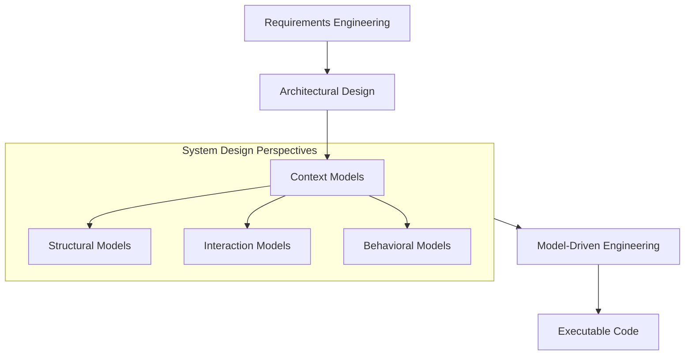

# System Modeling

System modeling is the process of developing **abstract models** of a system, where each model provides a different view or perspective of that system.

## Primary Approach and Notation

- **Graphical Notation**: System modeling generally involves representing a system using graphical notation.
    
- **UML**: The standard language for object-oriented modeling is the **Unified Modeling Language (UML)**.
    
- **Formal Models**: While graphical notation is standard, it is possible to develop formal mathematical models for detailed system specifications.
    

> [!NOTE] Model Abstraction
> 
> A system model is not a complete representation of the system. It is an abstraction that purposely leaves out detail to make the system easier to understand, emphasizing only the most salient characteristics.

## Purpose of System Models

Models serve two primary roles during the software engineering process:

1. **Communication and Documentation**: Models help explain requirements to stakeholders, facilitate design discussions among engineers, and document the system for implementation.
    
2. **Implementation Basis**: In **Model-Driven Engineering (MDE)**, complete or partial system implementations are automatically generated from these models.
    

## Model Usage and Rigor

The level of detail and rigor required depends on the intended use of the model.

| **Usage Context**             | **Description**                                            | **Rigor Requirement**                                                                                                    |
| ----------------------------- | ---------------------------------------------------------- | ------------------------------------------------------------------------------------------------------------------------ |
| **Stimulating Discussion**    | Used to focus discussion among engineers (Agile modeling). | **Informal/Incomplete**: Models may be incomplete as long as they cover key points.                                      |
| **Documenting Systems**       | Used to document existing systems.                         | **Correct**: Models do not need to be complete, but they must use notation correctly and describe the system accurately. |
| **Generating Implementation** | Used in MDE to generate source code.                       | **Complete and Correct**: Extreme care with notation is required as these models serve as the code basis.                |

## Essential UML Diagram Types

While UML provides 13 diagram types, five key types represent the essentials of a system.

|**Diagram Type**|**Perspective**|**Description**|
|---|---|---|
|**Use Case**|Interaction|Shows interactions between a system and its environment.|
|**Sequence**|Interaction|Shows interactions between actors, the system, and system components.|
|**Class**|Structural|Shows object classes and the associations between them.|
|**Activity**|Behavioral|Shows activities involved in a process or data processing (Data-driven).|
|**State**|Behavioral|Shows how the system reacts to internal and external events (Event-driven).|

## System Perspectives and Architecture

These models work together to form a cohesive design. The architectural design acts as the critical link between design and requirements engineering.

> [!TIP] The Building Analogy
> 
> If software design is like planning a complex building:
> 
> - **Context Models**: The property lines and connection to external infrastructure.
>     
> - **Structural Models**: The blueprints for the frame and interior.
>     
> - **Interaction Models**: How people move through rooms and use services.
>     
> - **Behavioral Models**: How automated systems (climate/security) react to events.
>     
> - **MDE**: Automated tools reading blueprints to fabricate the building reality.
>     

## Detailed Breakdown (Chapter 5)

The following table summarizes the specific topics covered in Chapter 5 of Ian Sommerville's _Software Engineering_.

| **Section** | **Topic**              | **Details**                                                                                                                               |
| ----------- | ---------------------- | ----------------------------------------------------------------------------------------------------------------------------------------- |
| **5.1**     | **Context models**     | Define system boundaries and positioning within the environment. They inform subsequent internal models.                                  |
| **5.2**     | **Interaction models** | Describe required functionality via user inputs/outputs and component interaction.   Typically uses Use Case and Sequence diagrams. |
| **5.3**     | **Structural models**  | Define the static organization of classes and objects (Class diagrams) needed to deliver functionality.                                   |
| **5.4**     | **Behavioral models**  | Describe dynamic behavior and responses to stimuli (data or events) over time.   Uses Activity and State diagrams.                  |
| **5.5**     | **MDE**                | An approach where models are automatically transformed into executable code, covering requirements, testing, and development.             |

> [!NOTE] Practice Questions
> - What is **system modelling**? Explain the **different types of UML diagrams** used to represent the essentials of a system (Activity, Use Case, Sequence, Class, State).
> - Explain why **several types of model are needed** to fully represent a system.
> - What roles do models play (communication/documentation vs implementation basis in MDE)?

