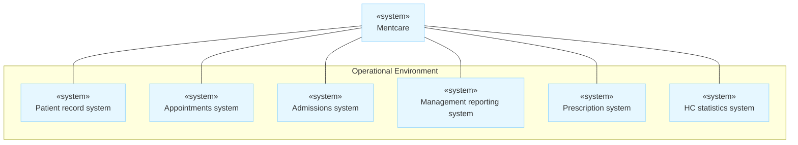
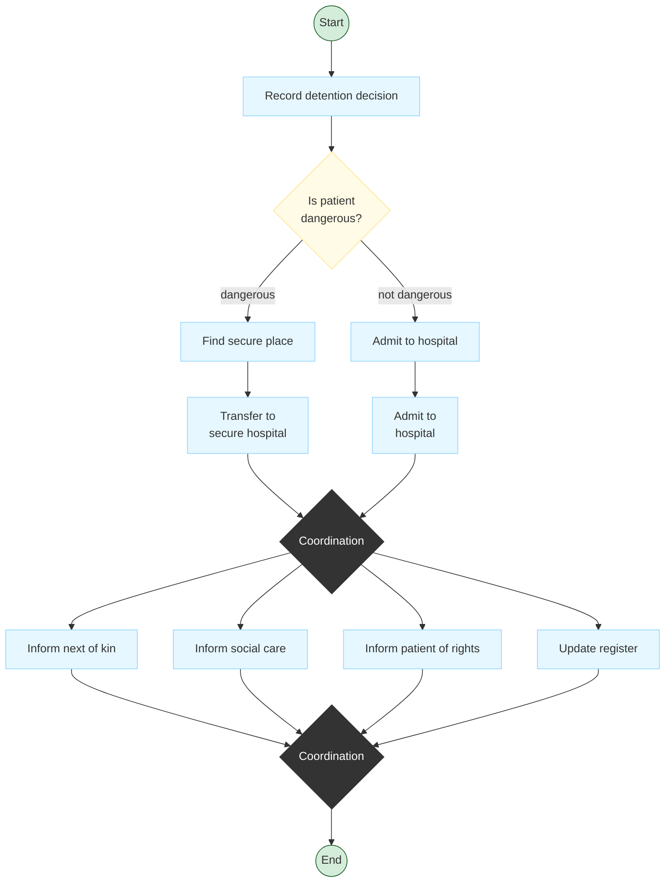

# Context Models

Context models are fundamental at the earliest stage of system specification, primarily used to define the **system boundaries**.

## Defining System Boundaries

System boundaries are established by deciding what is and is not part of the system being developed. This definition requires cooperation with **system stakeholders** to determine:

- What **functionality** should be included in the new software system.
    
- What processing or operations should be carried out in the system’s **operational environment** (e.g., processes that remain manual or are supported by existing systems).
    

> [!NOTE] Cost Efficiency
> 
> Boundary decisions should be made early in the process to limit the system costs and reduce the time required to fully understand the system requirements and design.

## Flexibility of Boundaries

In some scenarios, such as when an automated system replaces an existing system, the boundary is relatively clear (manual or computerized, retaining the same environment).

However, in other scenarios, the boundary is **flexible** and is decided upon during the requirements engineering process.
Example: Mentcare Patient System

A key decision involves determining whether the system should exclusively collect consultation information or also collect personal patient information.

|**Strategy**|**Advantages**|**Disadvantages**|
|---|---|---|
|**Reliance on external systems**|Avoids data duplication.|Slower access to information and potential system unavailability if external systems fail.|

## Modeling Context and Dependencies

Once initial boundary decisions are made, the next step is producing a **simple architectural model** to define the context and dependencies.

A context model typically shows the environment, which generally includes **several other automated systems**.

> [!WARNING] Limitation of Simple Context Models
> 
> Simple context models show the boundary and neighboring systems, but they do not explicitly show the types of relationships (e.g., data consumption/production, shared data, or network connectivity). Therefore, they must be used alongside other models, such as business process models.

## Relevant Diagrams (Section 5.1)

Two primary diagram types are employed to illustrate context and process.

### 1. The Context Model

This simple architectural model shows the Mentcare system and the other automated systems in its environment.
 
- **Connectivity**: Shows links to external systems like Patient Records, Appointments, Admissions, Management Reporting, Prescriptions, and HC Statistics (collects research information).

### 2. Process Model of Involuntary Detention (Activity Diagram)

**Activity diagrams** are used to model the business processes within which the systems operate. Figure illustrates the **involuntary detention** process involving the Mentcare system.

**Diagram Elements:**

- **Activities**: Rectangles with round corners representing subprocesses.
    
- **Coordination**: A **solid bar** indicates synchronization. Flows leading _from_ a bar represent parallel (concurrent) activities.
    
- **Guards**: Conditions in square brackets (e.g., `[dangerous]`) that determine flow.
    

> [!TIP] Parallel Execution
> 
> In the diagram above, the activities "Inform social care," "Inform next of kin," "Inform patient of rights," and "Update register" are designed to be executed concurrently.

> [!NOTE] Practice Questions
> - How do **context models help in defining the boundaries of a system** and its interactions with external entities?
> - Draw a **context model for a Patient information system in a hospital** including a patient admission system and an image storage system; explain the necessity of a context diagram.
> - When are boundaries considered flexible vs clear? Give examples.

