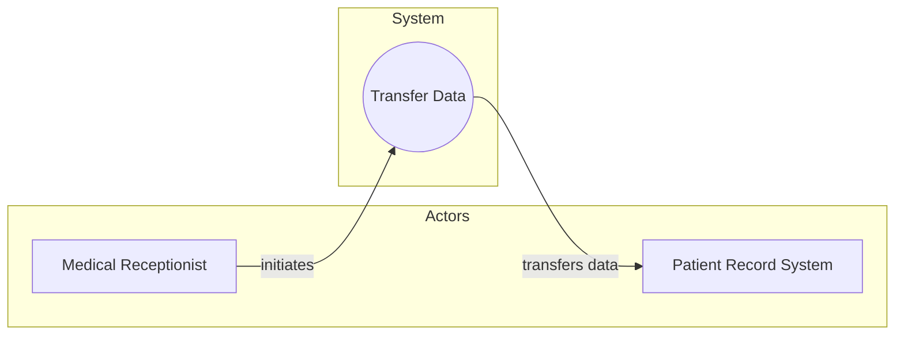
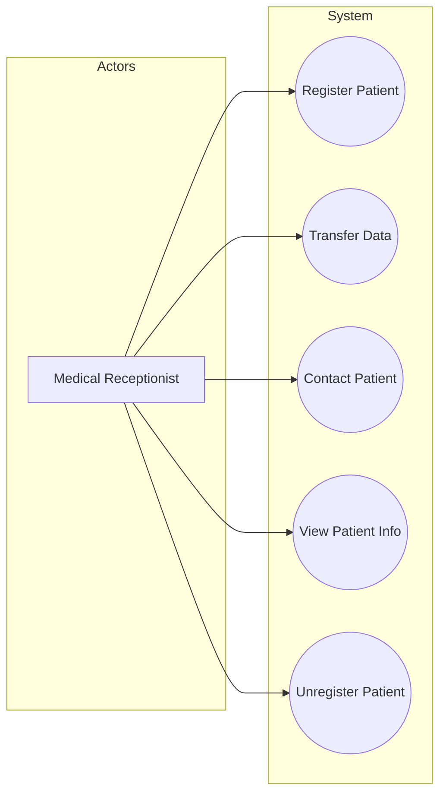
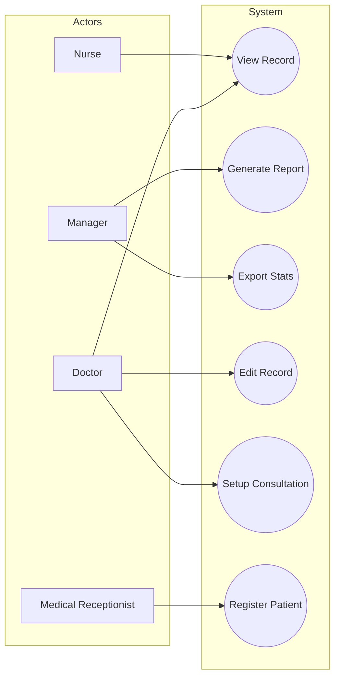

# Interaction Models

Interaction models are used to represent interactions, which can include user input/output, system-to-system communication, or interaction between software components. **Use case modeling** is one of the two primary approaches used for this purpose, primarily focused on modeling interactions between a system and external agents.

## Use Case Modeling

Originally developed by **Ivar Jacobsen in the 1990s**, use case modeling is now part of the Unified Modeling Language (UML).

- **Definition**: A use case represents a **discrete task** that involves **external interaction** with the system. A use case is understood as a **simple description** of what a user expects from a system during a particular interaction.
    
- **Scope**: It is a simple description of what a user expects from a system during a particular interaction.
    
- **Application**: Use case models are generally more helpful in the **early stages of system design** rather than in detailed requirements engineering.
    

### Notation and Elements

|**Element**|**Graphic Representation**|**Description**|
|---|---|---|
|**Use Case**|**Ellipse**|Represents the specific interaction or task.|
|**Actor**|**Stick Figure**|Represents agents involved in the interaction. These can be **human users** (e.g., operator) or **external systems/hardware**.|
|**Links**|**Lines**|Connects actors to use cases. While formal UML uses plain lines, arrows are often used informally to indicate who **initiates the transaction**.|

## Supplementing Use Case Diagrams

Use case diagrams offer a **simple overview** of an interaction but lack specific detail.

> [!IMPORTANT] Completing the Description
> 
> To achieve a complete interaction description, diagrams must be supplemented with additional detail.
> 
> 1. A **simple textual description**.
>     
> 2. A **structured description** typically presented in a **table** (often considered the most useful format).
>     
> 3. A **sequence diagram** to model interactions between system components.
>     

## Composite Diagrams

**Composite use case diagrams** are used to show multiple different use cases in a single view.

- **Small Systems**: It is possible to include all potential interactions in one diagram.
    
- **Complex Systems**: Multiple diagrams are required, often grouped by **related use cases** (e.g., all use cases involving a specific actor like a "Medical Receptionist").
    

> [!NOTE] UML Complexity
> 
> The UML includes specific constructs for sharing parts of a use case across diagrams (e.g., include, extend), but these are often difficult for non-technical end-users to understand.

## Use Case Examples (Mentcare System)

The following diagrams illustrate the progression from a single interaction to complex composite views within the Mentcare patient information system.

### Single Interaction: Transfer Data

This model shows the interaction required for transferring summarized patient data from the Mentcare system to an external Patient Record System (PRS). The Medical Receptionist initiates this interaction.

### Tabular Description: Transfer Data

The following table provides the necessary detail for the "Transfer Data" use case (Figure 5.4).

|**Field**|**Details**|
|---|---|
|**Use Case**|Mentcare system: Transfer data|
|**Goal**|Upload summary patient data to the Patient Record System (PRS)|
|**Actors**|Medical Receptionist (operator), Patient Record System (PRS)|
|**Description**|The operator selects patient details and the PRS system for upload. The Mentcare system checks security permissions, formats the data, and initiates the data transfer.|
|**Comments**|The receptionist must have appropriate security permissions to access both the patient information and the PRS.|

### Composite View: Medical Receptionist

This diagram (Figure 5.5) illustrates multiple use cases connected to a single actor, demonstrating the range of tasks a Medical Receptionist performs.

### General System Overview

This diagram (Figure 4.15) illustrates the relationships between multiple actors (Nurse, Manager, Doctor) and their specific interactions.

> [!NOTE] Practice Questions
> - Define **interaction model**. Explain **use-case modelling** with an example.
> - Develop a set of **use cases** that would serve as a basis for understanding the requirements for an **ATM system**.
> - Draw a **sequence diagram of ATM withdrawal** (use the interaction between ATM, bank server, card reader, user).
> - Draw the **sequence diagram for consulting a doctor** for a department in the hospital.
> - Explain the **importance of Interaction models** in understanding user-system and system-system interactions.
> - Develop the **use case model and sequence diagram of a weather station** and show the interaction between the data collection sub-system and the instruments that collect the weather data.

