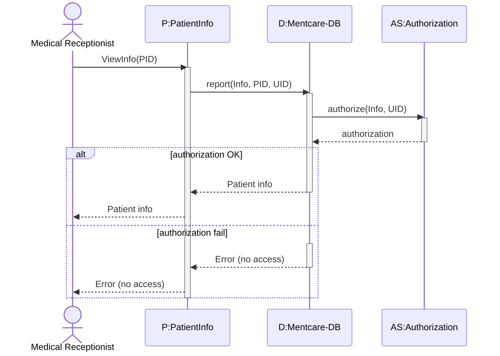
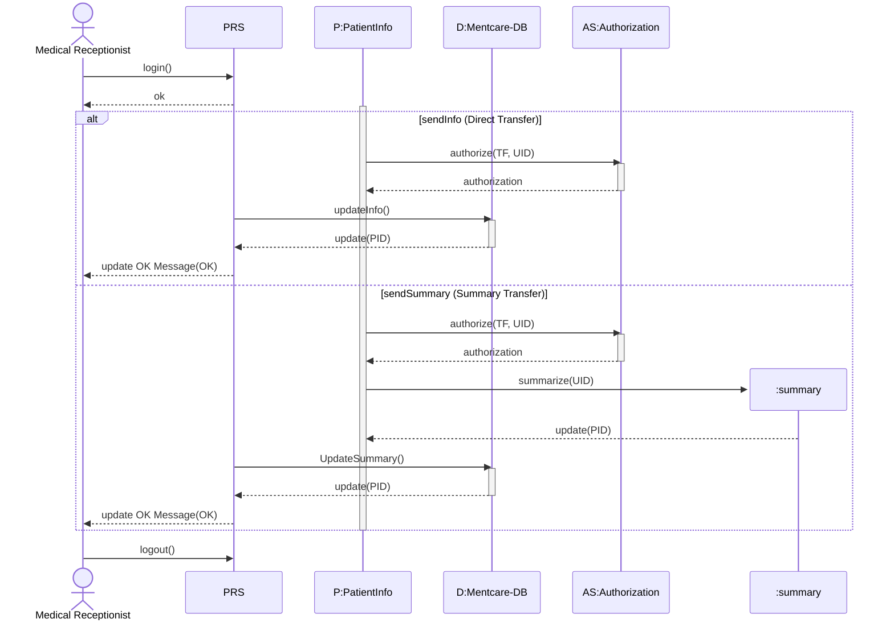

# Sequence Diagrams

Sequence diagrams are the second part of interaction modeling (Section 5.2), primarily used to model the **dynamic interactions** between system components and external agents. They are typically used in conjunction with use cases to document the detailed interactions of a specific **use case instance**.

## Core Notation and Elements

The UML syntax for sequence diagrams is structured to show the flow of control and messages over time, read from **top to bottom**.

| **Element**         | **Visual Representation** | **Description**                                                                            |
| ------------------- | ------------------------- | ------------------------------------------------------------------------------------------ |
| **Participants**    | Horizontal listing        | The **objects and actors** involved in the interaction, listed along the top.              |
| **Lifelines**       | Dotted vertical line      | Represents the duration for which that object instance is involved in the computation.     |
| **Activation**      | Vertical rectangle        | Indicates the period an object is active or has the **focus of control** (executing code). |
| **Messages**        | Annotated arrows          | Interactions between lifelines. Annotations specify calls, parameters, and return values.  |
| **Object Creation** | specific message/box      | Illustrates the creation of new objects (e.g., temporary summaries) during the sequence.   |

## Advanced Modeling Features

Sequence diagrams support advanced logic to model complex scenarios.

- **Alternatives (`alt`)**: Conditional paths are shown using a box labeled `alt`. Conditions are written in **square brackets** (e.g., `[authorized]`), and options are divided by a dotted line.
    
- **Asynchronous Interaction**: Arrows with a **stick arrowhead** indicate a message is sent without suspending processing, allowing the sender to continue other activities.
    

> [!TIP] Level of Detail
> 
> For early high-level design or requirements engineering, it is often best to omit interactions that depend on specific implementation decisions to avoid obscuring important relationships.

## Comparison with Data-Flow Diagrams (DFDs)

Sequence diagrams can be adapted for data-driven modeling if messages flow predominantly from left to right.

- **Engineers' Preference**: While non-experts often find traditional DFDs more intuitive, engineers generally **prefer sequence diagrams** because they explicitly highlight the **objects** responsible for operations.
    

---

# Sequence Diagram Examples

The following diagrams illustrate key concepts using the Mentcare system.

## 1. View Patient Information

This diagram (Figure 5.6) models the dynamic sequence where a Medical Receptionist requests patient information, requiring an **authorization check**.

## 2. Transfer Data (Complex Interaction)

This diagram (Figure 5.7) demonstrates advanced features:

- **Alternatives**: Processing differs based on whether the user selects `sendInfo` or `sendSummary`.
    
- **Object Creation**: A temporary `Summary` object is created dynamically.
    
- **External Interaction**: The system interacts with an external Patient Record System (PRS).
    

> [!NOTE] Practice Questions
> - Define the **sequence diagram** notation: participants, lifelines, activation, messages, object creation.
> - Draw the **sequence diagram for ATM withdrawal** and explain the key interactions.
> - Develop a **sequence diagram for consulting a doctor** in a hospital department (show actors and authorization checks).
> - Explain when to use sequence diagrams vs DFDs.

