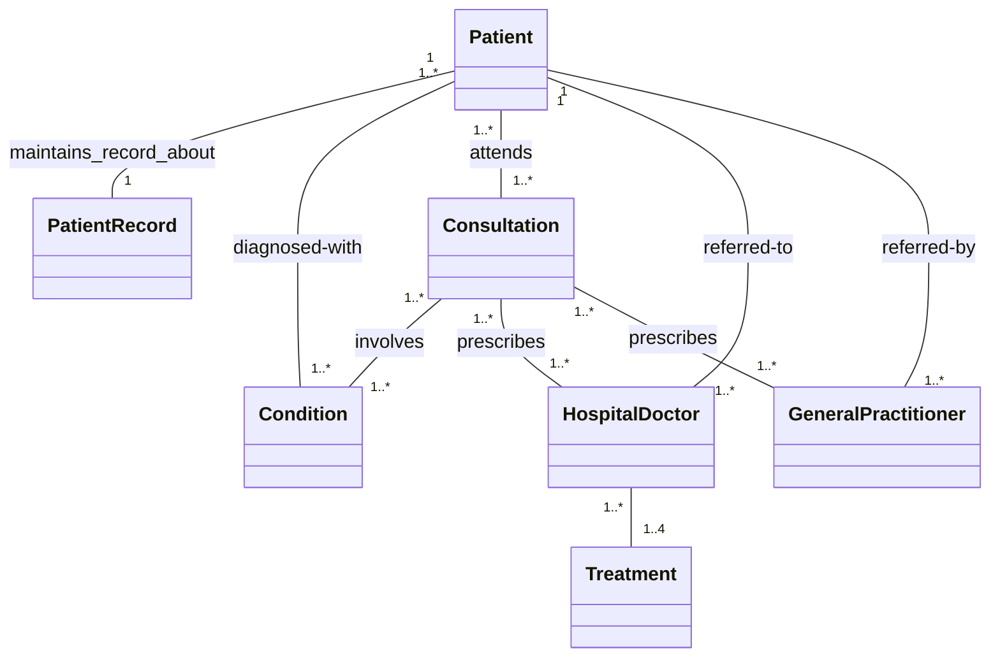
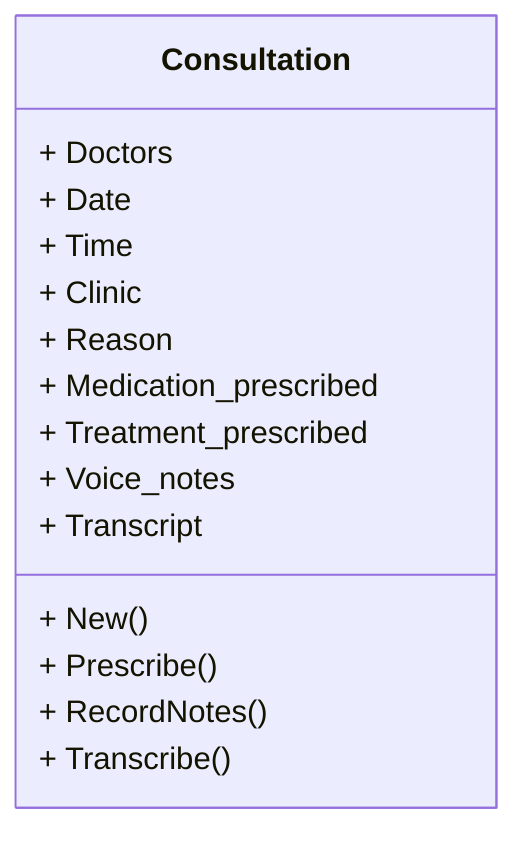
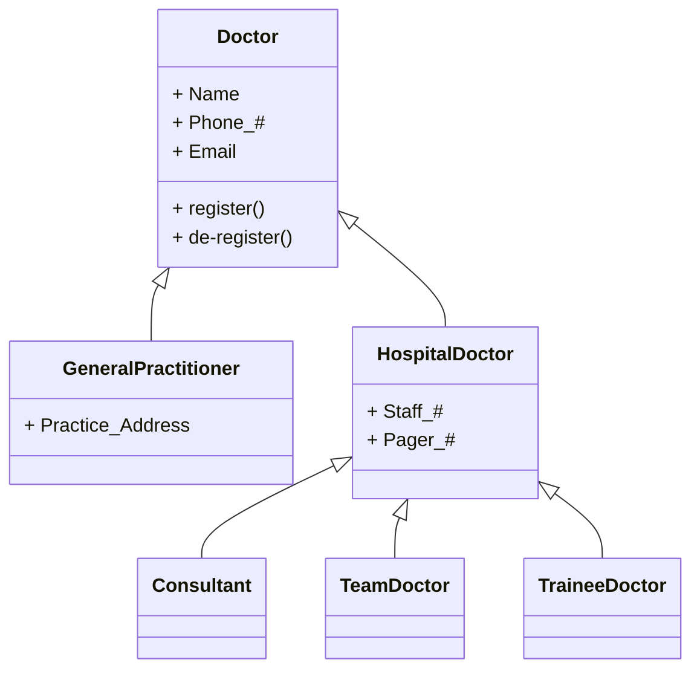
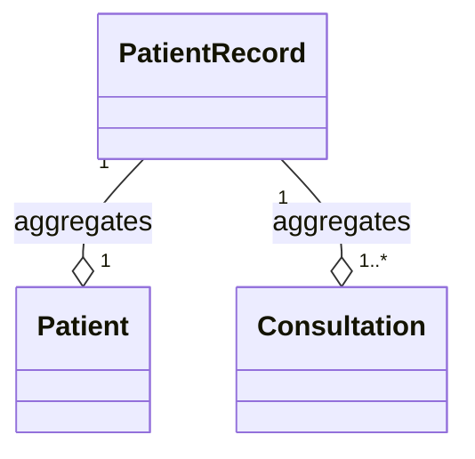

# Structural Models

Structural models display the **organization of a system** in terms of its component parts and their relationships. They are fundamental representations used when discussing and designing the system architecture.

## Static vs. Dynamic Models

Structural models can be categorized into two main types:

- **Static Models**: Show the organization of the system design, focusing on components like object classes and their relationships.
    
- **Dynamic Models**: Show the organization of the system executing, reflecting structures such as interacting threads.
    

> [!NOTE] Architectural Context
> 
> Although UML has component, package, and deployment diagrams for architectural modeling, the core of this section focuses on Class Diagrams to detail the static structure of objects.

## Class Diagrams

Class diagrams show the classes in a system and the **associations** (links) between them.

- **Object Class**: A general definition of one kind of system object. In early stages, these represent real-world entities (e.g., patient, doctor).
    
- **Association**: A link indicating a relationship, often requiring one class to have knowledge of the other.
    

### Class Structure Detail

Classes are represented by a **rectangle** divided into three sections:

1. **Top Section**: The **name** of the object class.
    
2. **Middle Section**: The class **attributes** (data fields).
    
3. **Lower Section**: The **operations** (methods) associated with the class.
    

### Multiplicity (Associations)

Multiplicity indicates how many objects are involved in an association.

|**Symbol**|**Meaning**|**Example**|
|---|---|---|
|`1`|Exactly one object|A patient has exactly one record.|
|`1..*`|One or more objects|A patient attends one or more consultations.|
|`*`|An indefinite number|General indefinite relationship.|

### Example: Associations and Multiplicity

The following diagram represents classes and associations in the Mentcare system, showing how a `Patient` interacts with various entities, such as `Consultation`, `Condition`, and `Hospital Doctor`.

### Example: Attributes and Operations

This diagram details the `Consultation` class, showing the specific attributes and operations.

## Generalization

Generalization (often called inheritance) allows the system to define hierarchies of classes.

- **Mechanism**: Attributes and operations in the higher-level classes (superclasses) are automatically associated with lower-level classes (subclasses).
    
- **Notation**: An **arrowhead pointing up** toward the more general class.

A `General practitioner` and `Hospital doctor` are specialized types of `Doctor`. Furthermore, `Hospital doctor` is specialized into `Consultant`, `Team doctor`, and `Trainee doctor`.

## Aggregation

Aggregation is a type of association used to illustrate when objects are made up of different parts.

- **Definition**: One object (the **whole**) is composed of other objects (the **parts**).
    
- **Notation**: A **diamond shape** is added to the link next to the class representing the whole.
    

> [!NOTE] Practice Questions
> - What are **structural models**? Explain **class diagrams** with an example.
> - Describe **multiplicity**, **generalization**, **aggregation**, and **associations** in class diagrams.
> - Give an example class diagram for an ATM or a language-processing system.
