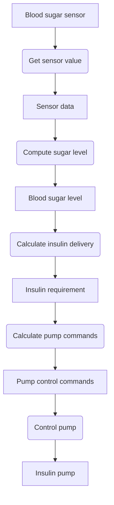
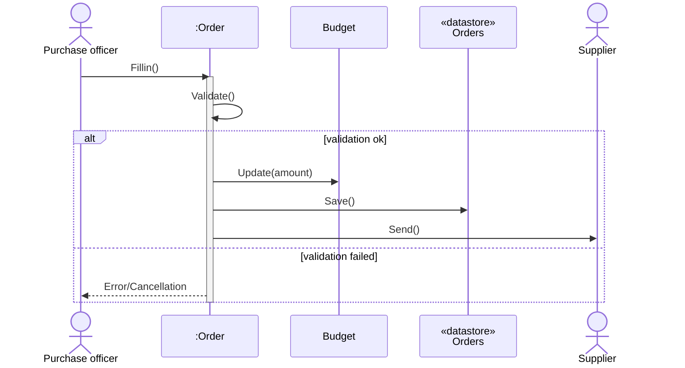

# Behavioral Models

**Behavioral models** are dynamic models that describe the behavior of a system while it is executing. Their main purpose is to show what happens, or what is intended to happen, when a system responds to a **stimulus** received from its environment.

## Stimuli Categories

System stimuli fall into two main categories:

- **Data**: Data becomes available that must be processed by the system, triggering the required processing.
    
- **Events**: An internal or external event occurs that triggers system processing (events may or may not have associated data).
    

## Data-Driven Modeling

**Data-driven models** illustrate the sequence of actions involved in processing input data and generating an associated output.

### Purpose and History

- **Requirements Analysis**: Typically used to show the **end-to-end processing** sequence from initial input to final response.
    
- **Functional Perspective**: Historically implemented as **data-flow diagrams (DFDs)**, they illustrate how data flows through and is transformed during sequential processing.
    

### Benefits and Notation

- **Accessibility**: Data-flow models are **simple and intuitive**, making them accessible to non-expert stakeholders for model validation.
    
- **UML Representation**: In UML, data-driven diagrams are often represented using **activity diagrams**.
    
- **Structure**: An activity diagram shows **processing steps** (activities) and the **data flowing** between these steps (objects).
    

> [!NOTE] Engineer vs. Stakeholder Preference
> 
> While non-experts typically find DFDs (activity diagrams) more intuitive, engineers generally prefer sequence diagrams because they highlight the specific system objects responsible for operations.

## Diagrams Representing Data-Driven Models

Data-driven modeling is illustrated using an activity model of a control system (Insulin Pump) and a sequence model of a business process (Order Processing).

### 1. Activity Model: Insulin Pump Operation

This diagram (Figure 5.14) shows the processing chain where the insulin pump software converts a sensor input into control commands.

- **Activities**: Rounded rectangles represent process steps.
    
- **Objects**: Square rectangles represent the data flowing between steps.
	

### 2. Sequence Diagram: Order Processing

This sequence diagram (Figure 5.15) illustrates an alternative way to show sequential data processing, focusing on the system objects (`Order`, `Budget`, `Orders` datastore) rather than the processes themselves.

> [!TIP] Directional Flow
> 
> When sequence diagrams are used for data-driven modeling, messages flow primarily from left to right, emphasizing sequential transformation.

> [!NOTE] Practice Questions
> - What is a **state machine model**? Draw the **state machine model of a simple microwave oven** (event-driven modeling).
> - Describe how **behavioral models** are used to represent dynamic aspects of a system. Provide an example using state diagrams.
> - Briefly discuss **behavioral models** and **data-driven modeling** and illustrate with examples.

