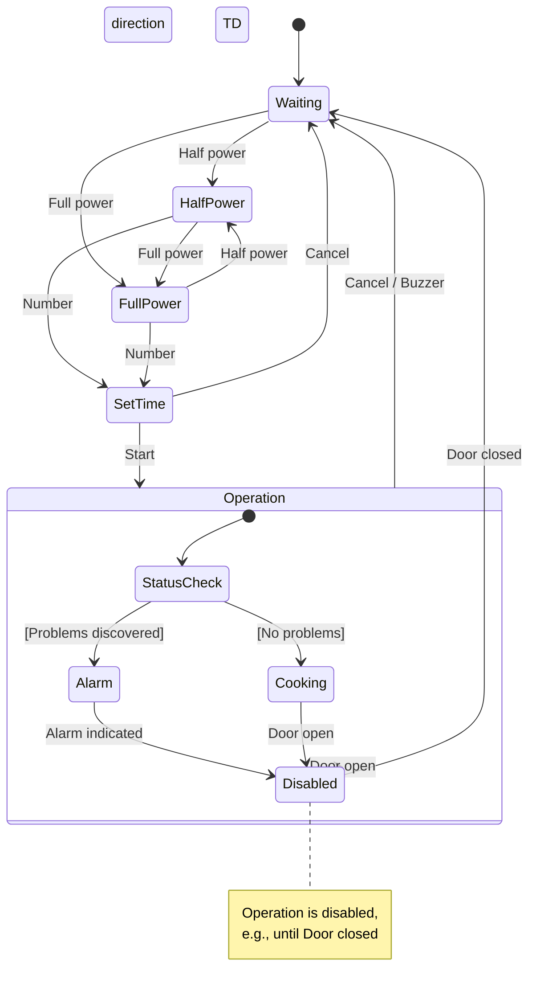
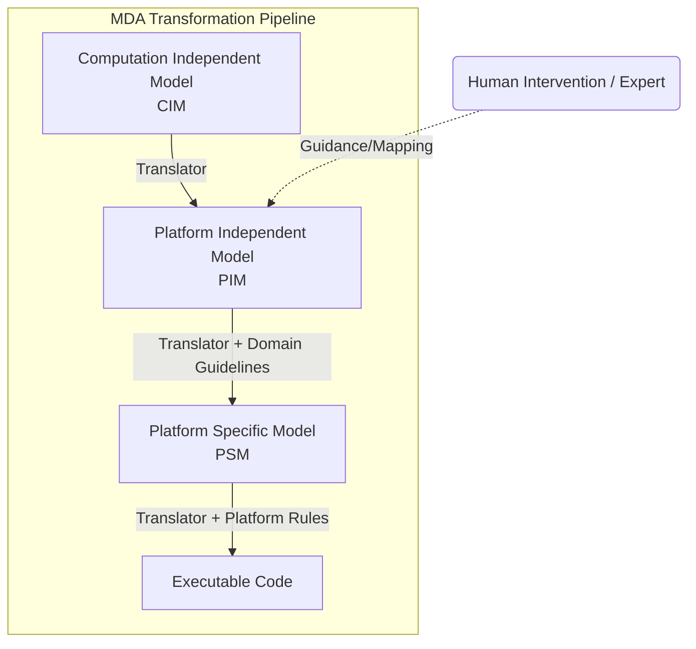

# Event-Driven Modeling and MDE

This section covers the final behavioral modeling approaches: event-driven modeling for real-time systems and the broader framework of Model-Driven Engineering (MDE).

## Event-Driven Modeling

**Event-driven modeling** is a type of behavioral model that shows how a system dynamically responds to internal and external **events**.

### Core Concepts

- **Stimulus-Response**: These models assume a system has a **finite number of states**, and events (stimuli) cause a **transition from one state to another**.
    
- **Applicability**: This view is particularly appropriate for **real-time systems**.
    
- **Data Flow**: These models show states and transitions but **do not show the flow of data** within the system.
    

> [!NOTE] UML Notation
> 
> The Unified Modeling Language (UML) supports event-based modeling using state diagrams (based on Statecharts). These show how an object changes state depending on the messages it receives.

### Example: Microwave Oven Control

The following example illustrates event-driven modeling using a microwave oven system. The system transitions between states based on specific user stimuli.

**System Stimuli**

|**Stimulus (Event)**|**Description**|
|---|---|
|`Full power`|User has pressed the full-power button.|
|`Number`|User has pressed a numeric key to set time.|
|`Start`|User has pressed the Start button.|
|`Door open`|The oven door switch is not closed.|

**State Diagram**

The `Operation` state includes substates for status checking. If the door opens during operation, the system immediately transitions to the `Disabled` state.

## Model-Driven Engineering (MDE)

**Model-driven engineering (MDE)** is a software development approach where **models, rather than executable programs, are the principal outputs** of the development process.

### Core Philosophy

- **Abstraction**: MDE aims to raise the level of abstraction, freeing engineers from programming language details or execution platforms.
    
- **Origins**: MDE developed from **Model-Driven Architecture (MDA)**, proposed by the Object Management Group (OMG).
    
- **Scope**: While MDA focuses on design and implementation, MDE concerns **all aspects** of the software engineering process, including requirements and testing.
    

### MDA Model Types

MDA recommends producing three types of abstract system models.

| **Acronym** | **Model Type**                | **Description**                                                                                               |
| ----------- | ----------------------------- | ------------------------------------------------------------------------------------------------------------- |
| **CIM**     | Computation Independent Model | Abstracts core domain features (domain models). Identifies assets, roles, and entities.                       |
| **PIM**     | Platform-Independent Model    | Models system operation **without reference to implementation**. Shows static structure and event responses.  |
| **PSM**     | Platform-Specific Model       | A transformation of the PIM for a specific platform (e.g., J2EE, .NET). Can often be generated automatically. |

### Transformation Pipeline

The following diagram illustrates the conceptual flow of models in MDA.

### Benefits and Challenges

|**Benefits**|**Challenges**|
|---|---|
|**Error Reduction**: Abstracts away implementation details.|**Translation Difficulty**: Completely automated translation is rarely possible and usually requires human intervention.|
|**Speed**: Accelerates design and implementation.|**Complexity Mapping**: Human experts are needed to link concepts between different CIMs.|
|**Reusability**: Creates platform-independent models.|**Niche Use Case**: Platform independence primarily benefits large, long-lifetime systems.|

> [!TIP] Executable UML (xUML)
> 
> Completely automated transformation relies on Executable UML (xUML), a subset of UML where models have clearly defined meanings that can be compiled directly to code.

> [!NOTE] Practice Questions
> - What is **model driven engineering (MDE/MDA)**? Explain the role of **CIM, PIM, and PSM**.
> - What is **event-driven modelling**? Provide an example and draw the state diagram for a microwave oven.
> - Illustrate **Model-Driven Engineering** with an example and explain the transformation pipeline.

