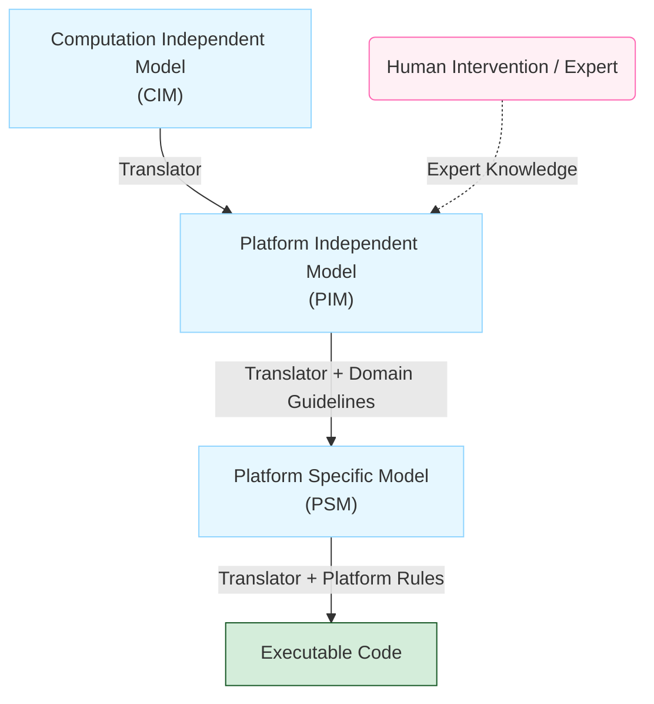

# Model-Driven Architecture (MDA)

**Model-Driven Architecture (MDA)** is a model-focused approach to software design and implementation that uses a subset of **Unified Modeling Language (UML) models** to describe a system.

It was proposed by the **Object Management Group (OMG)** as a new software development paradigm.

> [!NOTE] MDA vs. MDE
> 
> While Model-driven engineering (MDE) is concerned with all aspects of the software engineering process (including requirements and testing), MDA focuses specifically on the design and implementation stages.

## Core Philosophy

MDA aims to **raise the level of abstraction** in software engineering. The core philosophy ensures that **models, rather than executable programs, are the principal outputs** of the development process, freeing engineers from concerns about specific programming language details or execution platforms.

## The Three Abstract System Models

MDA recommends producing three types of abstract system models to represent the system at different levels.

|**Model Type**|**Abbreviation**|**Description**|
|---|---|---|
|**Computation Independent Model**|**CIM**|Also called **domain models**. They abstract the core domain features and identify key abstractions (e.g., assets, roles, patients).|
|**Platform-Independent Model**|**PIM**|Describes system operation **without reference to implementation**. Typically uses UML diagrams to show static structure and event responses.|
|**Platform-Specific Model**|**PSM**|A **transformation of the PIM** for a specific platform (e.g., J2EE, .NET). These can be layered (e.g., middleware-specific but database-independent).|

## Benefits and Transformation

Model-based engineering provides several key advantages:

- **Error Reduction**: Reduces the likelihood of errors by abstracting implementation details.
    
- **Speed**: Accelerates the design and implementation process.
    
- **Reusability**: Allows the creation of reusable, platform-independent application models.
    
- **Portability**: Enables **rapid re-hosting** on new platforms by writing a new model translator.
    

> [!TIP] Multi-Platform Efficiency
> 
> For systems running on different platforms (e.g., J2EE and .NET), engineers only need to maintain a single PIM. The corresponding PSMs for each platform are automatically generated.

## Executable UML (xUML)

The goal of completely automated transformation relies on **Executable UML (xUML)**.

- xUML is a **subset of UML 2** where graphical models have clearly defined meanings.
    
- These models must include information about **implementation operations** to allow direct compilation into executable code.
    

## Challenges and Limitations

In practice, completely automated translation from models to code is **rarely possible**.

> [!WARNING] Human Intervention Required
> 
> - **CIM to PIM Translation**: Translating high-level CIM models to PIM models remains a research problem.
>     
> - **Complex Mapping**: **Human intervention** is necessary to link concepts used in different CIMs (e.g., mapping a 'role' in a security model to a 'staff member' in a hospital model).
>     

## MDA Transformation Pipeline

The following diagram illustrates the transformation pipeline recommended by MDA.

> [!NOTE] Practice Questions
> - What is **model driven engineering (MDE/MDA)**? Explain **event driven modelling** with an example.
> - Illustrate **Model Driven Engineering** with an example (CIM → PIM → PSM → Code pipeline).
> - What are practical limitations of fully automated model-to-code translation (where human intervention is required)?

