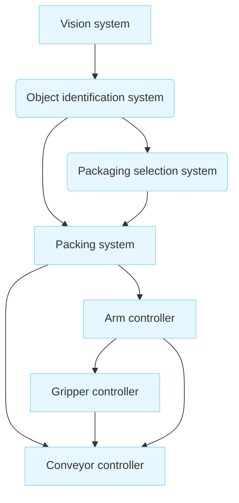

# Architectural Design

The specific subtopics are:

- Architectural design decisions
    
- Architectural views
    
- Architectural patterns
    
- Application architectures
    

## Chapter 6 Breakdown

The following table details where each specific topic is located and discussed within the textbook.

| **Section**   | **Topic**                     | **Details**                                                                                                                                           |
| ------------- | ----------------------------- | ----------------------------------------------------------------------------------------------------------------------------------------------------- |
| **Chapter 6** | **Architectural Design**      | Introduces the importance of architectural design, decisions involved, and patterns. It is the first stage in the software design process.            |
| **6.1**       | **Design Decisions**          | Addresses structural decisions (decomposing components, controlling operations, non-functional requirements) that profoundly affect the system.       |
| **6.2**       | **Architectural Views**       | Discusses perspectives required for documenting architecture (e.g., Krutchen’s 4+1 view model), as a single diagram cannot represent all information. |
| **6.3**       | **Architectural Patterns**    | Introduces reusable patterns (MVC, Layered, Client-Server) that capture successful system organizations and their strengths/weaknesses.               |
| **6.4**       | **Application Architectures** | Details generic models for specific classes of systems (e.g., Transaction processing), used as design checklists or starting points.                  |

## Introduction to Architectural Design

Architectural design is defined as the process concerned with **understanding how a software system should be organized** and **designing the overall structure of that system**.

### Role in the Software Process

- **First Stage**: It is the **first stage in the software design process**.
    
- **Critical Link**: It serves as the **critical link between design and requirements engineering**.
    
- **Primary Function**: To **identify the main structural components in a system** and determine the **relationships between them**.
    

> [!NOTE] Output
> 
> The outcome of the architectural design process is an architectural model that describes how the system is organized as a set of communicating components.

> [!NOTE] Practice Questions
> - What is meant by **architectural design**? Define **software architecture**.
> - Discuss the different **architectural styles and structures** and how non-functional requirements influence architecture decisions.
> - Why is architectural design a critical link between requirements and design? Give examples.

### Agile Considerations

While traditional models define architecture early, it remains significant in agile processes.

> [!IMPORTANT] Refactoring Costs
> 
> - It is generally accepted that an **early stage** of an agile development process should focus on designing an overall system architecture.
>     
> - **Incremental development of architectures is not usually successful**.
>     
> - While refactoring components is easy, **refactoring the system architecture is expensive** because it requires modifying most system components to adapt to the changes.
>     

### Overlap with Requirements Engineering

In practice, there is a **significant overlap** between architectural design and requirements engineering.

- **Unrealistic Separation**: The ideal that a system specification should not include design information is **unrealistic**, except for small systems.
    
- **Feature Reflection**: Architectural components must be identified because they **reflect the high-level features of the system**.
    
- **Abstract Architecture**: An **abstract system architecture** is often proposed during requirements engineering to associate groups of functions with large-scale components.
    

## Example: Packing Robot Control System

The source material uses an abstract model of a **packing robot system** to illustrate system architecture. The system uses a vision component to identify objects, select packaging, and manage movement.

### Diagram Description

The model shows the main components and the links between them, representing how these communicating components structure the system.

