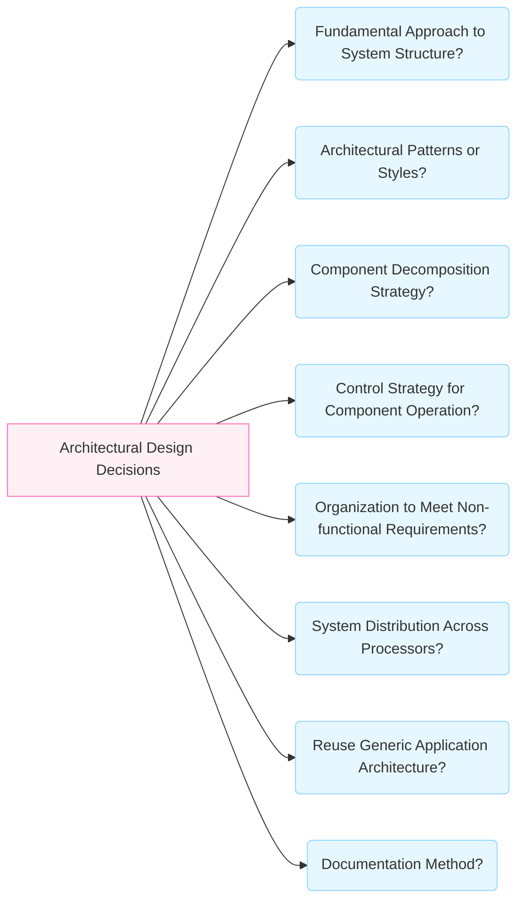

# Architectural Design Decisions

Architectural design is a **creative process** in which the system architect designs an organization that satisfies the functional and non-functional requirements. Rather than following a rigid sequence of activities, architectural design is best considered a **series of decisions**. These structural decisions are influenced by the system type, the architect's experience, and the specific system requirements.

## Fundamental Architectural Questions

During the architectural design process, system architects must address several fundamental questions or decisions.

1. **Fundamental Approach to Structure**: What will be the basic approach used to structure the system (e.g., layered or client-server structuring)?
    
2. **Architectural Patterns/Styles**: What patterns might be used? A pattern captures the essence of a proven system organization and includes information on its strengths and weaknesses.
    
3. **Component Decomposition**: How will the structural components in the system be decomposed into sub-components?
    
4. **Control Strategy**: What strategy will be used to control the operation of the components in the system?
    
5. **Non-functional Organization**: What architectural organization is best for delivering the **non-functional requirements** of the system?
    
6. **System Distribution**: How will the system be **distributed** across hardware cores or processors? This affects performance and reliability.
    
7. **Generic Architecture Template**: Is there a generic application architecture that can act as a template (e.g., specific to the application domain)?
    
8. **Documentation**: How should the architecture of the system be documented?
    

### Decision Concept Map

> [!NOTE] Practice Questions
>
> - What is meant by **architectural design**? Explain its role in meeting functional and non-functional system requirements.
>
> - Define **software architecture** and describe how architectural design helps address non-functional requirements. Give examples.
>
> - Discuss different **architectural styles and structures** you can choose to satisfy non-functional requirements (e.g., layered, client-server, repository). Explain advantages and disadvantages of each.

## Influence of Non-functional Requirements

The choice of architectural style and structure is closely related to the **non-functional requirements** of the system. The architecture fundamentally influences properties like reliability, efficiency, and security.

|**Requirement**|**Architectural Implication**|
|---|---|
|**Performance**|Localize critical operations within a small number of large components, ideally deployed on the same computer to reduce communication overhead.|
|**Security**|Use a **layered structure** with the most critical assets protected in the innermost layers, subjected to high security validation.|
|**Safety**|Co-locate safety-related operations in a **single component** or small number of components to reduce validation costs and problems.|
|**Availability**|Include **redundant components** to enable replacement and updating without stopping the system.|
|**Maintainability**|Use **fine-grain, self-contained components**. Separate data producers from consumers and avoid shared data structures.|

> [!IMPORTANT] Conflicts and Trade-offs
> 
> It is impossible to optimize all non-functional attributes simultaneously. Architects must make compromises, such as:
> 
> - **Performance vs. Maintainability**: Large components improve performance, while small components improve maintainability.
>     
> - **Security vs. Usability**: Balancing strict security with ease of use.
>     
> - **Availability vs. Time-to-Market**: Balancing redundancy with cost and speed.
>     

## Architectural Decisions in Agile

In the context of Agile and self-organizing teams, the process of making architectural decisions shifts from detailed upfront definition to **emergent design**.

### Emergent Design and the Last Responsible Moment

- **Agile Principle**: The eleventh principle states that **the best architectures, requirements, and designs emerge from self-organising teams**.
    
- **Deferring Decisions**: Agile teams avoid Big Design Up Front (BDUF). Design thinking is guided by the **"last responsible moment,"** the latest point at which a decision must be made.
    
- **Opportunistic Design**: Deferring choices allows teams to make decisions based on **evidence** and facts learned while building the system.
    
- **Flexibility**: The architecture should support the flexibility required to **add any Product Backlog Item (PBI) at any time**.
    

### Team Responsibility and Constraints

- **Constraints**: Self-organizing teams are often constrained by **external enterprise architects** who impose limits on technical choices (e.g., toolsets).
    
- **High-Level Principles**: In complex environments, high-level architectural principles align teams, but the teams themselves remain responsible for detailed design.
    
- **EDUF**: Agile teams practice **Enough Design Up Front (EDUF)**, producing only documentation that **adds value** and is necessary for maintenance.
    

### Technical Excellence and Debt

- **Agility**: **Continuous attention to technical excellence and good design enhances agility**.
    
- **Technical Debt**: Allowing inappropriate design or quick hacks leads to technical debt, making systems expensive to support later in the lifecycle.
    
- **Refactoring**: This practice is crucial for architectural design in Agile. It ensures the continual quality and maintainability of the system by improving structure without changing behavior.
