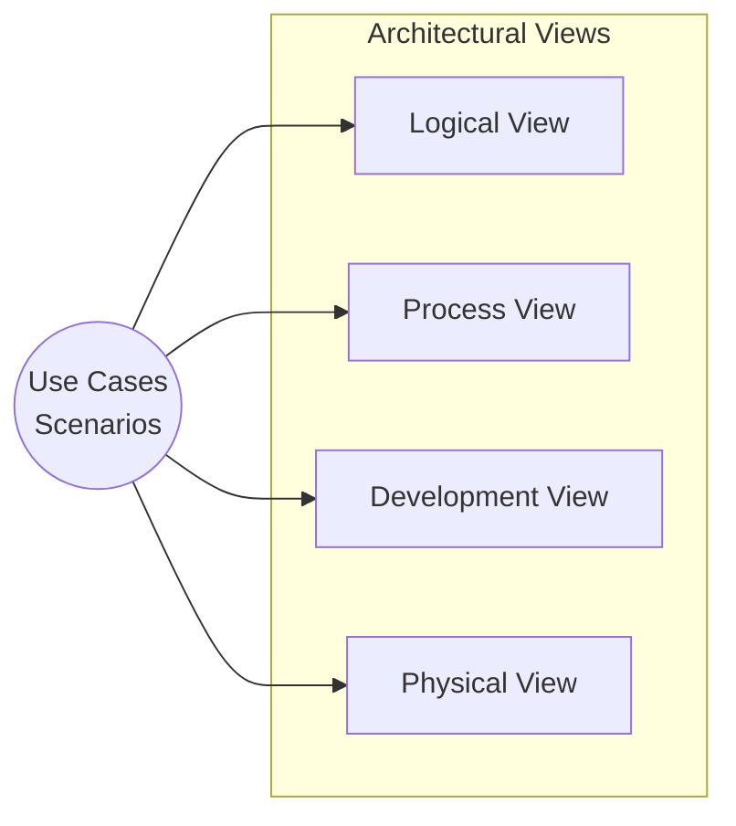

# Architectural Views

The architectural model, which is the output of architectural design, describes how a system is organized as a set of communicating components.

## Purpose and Need for Multiple Views

It is **impossible to represent all relevant information about a system’s architecture in a single diagram**.

- **Limitation of Single Models**: A single graphical model can only depict **one perspective** (e.g., decomposition, runtime interactions, or physical distribution).
    
- **Agile Context**: In Agile methods, the team should produce only the design documentation that **adds value** and is necessary for maintenance and support.
    
> [!NOTE] Practice Questions
>
> - What are **architectural views**? Explain why multiple views are needed to represent a system's architecture.
>
> - Explain the **different types of architectural views** (e.g., logical, process, development, physical, scenarios) and their significance in providing a comprehensive understanding of system architecture.
>

## Krutchen's 4+1 View Model

One widely recognized framework for organizing these perspectives is **Krutchen’s 4+1 view model**. It suggests four fundamental architectural views linked through common use cases.

|**View**|**Focus**|**Details**|
|---|---|---|
|**Logical View**|**Key Abstractions**|Shows objects or object classes. Relates system requirements to entities.|
|**Process View**|**Runtime Interactions**|Shows how the system is composed of interacting processes. Useful for judgments on **performance and availability**.|
|**Development View**|**Decomposition**|Details the breakdown of software into components implemented by a **single developer or team**. Valuable for managers and programmers.|
|**Physical View**|**Hardware/Distribution**|Shows system hardware and how components are **distributed across processors**. Essential for deployment planning.|

> [!NOTE] The "+1" View
> 
> Use Cases/Scenarios form the "+1" component. They link and integrate the four main views, illustrating how components work together during typical system interactions.

## Conceptual View

**Hofmeister et al.** suggest incorporating a **conceptual view** in addition to Krutchen's four views.

- **Definition**: An **abstract view** of the system.
    
- **Purpose**: Serves as a basis for decomposing high-level requirements and assisting with component reuse decisions.
    
- **Example**: The high-level block diagram of the **packing robot system** (from the chapter introduction) is a conceptual view.
    

> [!TIP] Practical Usage
> 
> Conceptual views are almost always developed during the design process to explain the architecture to stakeholders and inform decisions.

## Notations for Architectural Models

Architects must decide what notations to use for describing architectural models.

| **Notation Type**                              | **Pros**                                                                       | **Cons**                                                                        | **Context**                                      |
| ---------------------------------------------- | ------------------------------------------------------------------------------ | ------------------------------------------------------------------------------- | ------------------------------------------------ |
| **Informal** (Block Diagrams)                  | **Fast**, intuitive, supports communication. Requires no specialist knowledge. | Lacks rigor.                                                                    | Best for **creative design phase** and planning. |
| **UML**                                        | Useful for **detailed documentation** and model-driven development.            | Can constrain expressiveness; requires specialist knowledge.                    | Detailed documentation phases.                   |
| **ADLs** (Architectural Description Languages) | Reduces ambiguity; allows tool-based checking.                                 | **Expensive**, time-consuming, and difficult for non-specialists to understand. | Specialized high-rigor environments.             |

> [!IMPORTANT] Agile Perspective
> 
> In Agile development, detailed design documentation is often minimized. This practice is known as EDUF (Enough Design Up Front), focusing only on views necessary for communication.

