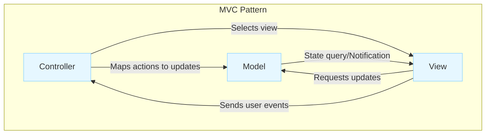
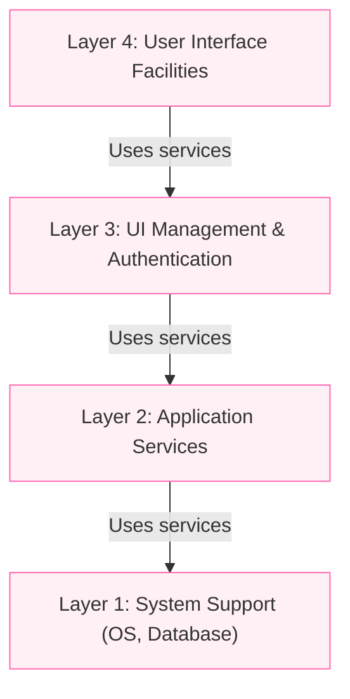
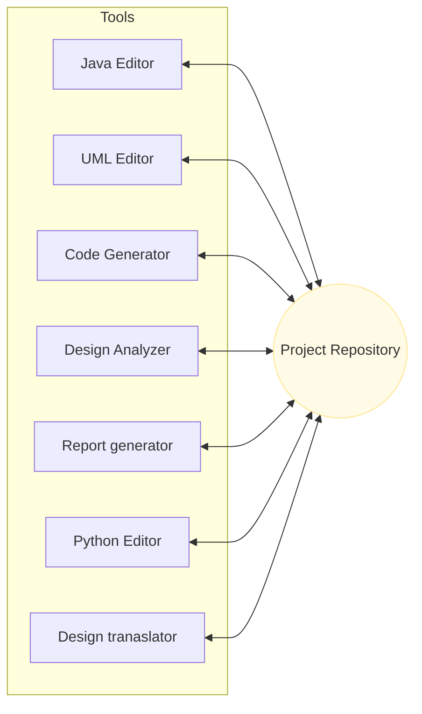
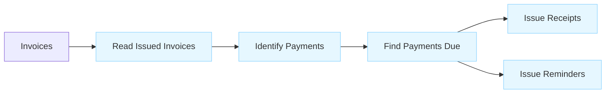

# Architectural Patterns

Architectural patterns are a means of **reusing knowledge about generic system architectures**. They capture the essence of a system organization that has been successful in previous systems and provide a **stylized, abstract description of good practice**.

## Pattern Description Components

An architectural pattern description should include:

1. **Name**: The name of the pattern.
    
2. **Description**: A brief description of the architecture.
    
3. **Graphical Model**: A visual representation.
    
4. **Example**: The type of system where the pattern is used.
    
5. **Usage Guide**: Information on when it is appropriate to use, along with strengths and weaknesses.

> [!NOTE] Practice Questions
>
> - Briefly explain the **repository model** and the **client-server model**. Draw the repository architecture for an IDE and discuss advantages and disadvantages.
>
> - Discuss the **Layered architecture** with an example; state its advantages and disadvantages.
>
> - What is an **MVC pattern**? Illustrate the Model-View-Controller model with a diagram and an example.
>
> - Explain what **design patterns** are and briefly discuss the **Observer** pattern. Sketch an architecture for an ATM machine and indicate any relevant design patterns used.

    
## 1. Model-View-Controller (MVC) Pattern

The **Model-View-Controller (MVC)** pattern is fundamental to interaction management in many web-based systems.

### Description

The MVC pattern **separates presentation and interaction from the system data**. The system is structured into three logical components:

- **Model**: Manages the **system data** and operations. Encapsulates application state and notifies the View of state changes.
    
- **View**: Defines and manages how **data is presented** to the user.
    
- **Controller**: Manages **user interaction** (e.g., key presses, mouse clicks) and maps user actions to model updates.
    

### Usage & Trade-offs

|**Feature**|**Details**|
|---|---|
|**When Used**|When there are **multiple ways to view/interact with data** or when future requirements are unknown.|
|**Advantages**|Allows **data to change independently of its representation**. Supports multiple views of the same data.|
|**Disadvantages**|Can involve **additional code and complexity** if the data model is simple.|

## 2. Layered Architecture

The Layered Architecture pattern organizes functionality into **separate layers** to achieve separation and independence.

### Description

A layer provides services only to the layer immediately above it. Lowest-level layers represent **core services** likely used throughout the system.

### Usage & Trade-offs

|**Feature**|**Details**|
|---|---|
|**When Used**|Building on top of **existing systems**, development by **separate teams**, or requiring **multilevel security**.|
|**Advantages**|Allows changes to be made **without affecting other parts**. Localizes machine dependencies.|
|**Example**|**iLearn digital learning system** (4-layer architecture).|

## 3. Repository Architecture

The Repository pattern describes how interacting components can **share data** via a central location.

### Description

**All data** is managed in a **central repository** accessible to all components. Components **do not interact directly**; they interact only through the repository.

### Usage & Trade-offs

|**Feature**|**Details**|
|---|---|
|**When Used**|Systems generating **large volumes of information** stored for long periods (e.g., IDEs, command and control).|
|**Advantages**|Efficient way of **sharing large amounts of data** without explicit transmission between components.|
|**Disadvantages**|Components must agree on a **single data model**. Distributing the repository is difficult (redundancy/consistency overhead).|

---

## 4. Client–Server Architecture

The Client–Server pattern is a commonly used runtime organization for **distributed systems**.

### Description

The system is organized as **services** delivered by **servers** and **clients** that access them. Clients access services via **remote procedure calls** (e.g., HTTP).

### Usage & Trade-offs

|**Feature**|**Details**|
|---|---|
|**When Used**|Data in a shared database needs access from a **range of locations**, or when load is variable.|
|**Advantages**|Effective use of networked systems. Easy to add/upgrade servers **transparently**.|

---

## 5. Pipe and Filter Architecture

The Pipe and Filter pattern models the **runtime organization** where functional transformations process inputs to outputs.

### Description

Processing is organized into discrete **filters** (components) that transform data. Data flows through **pipes** from one filter to the next.

### Usage & Trade-offs

|**Feature**|**Details**|
|---|---|
|**When Used**|**Batch processing systems** (e.g., invoice reconciliation) and embedded systems with limited user interaction.|
|**Advantages**|**Reusing filters** is easy. Supports parallel execution of filters.|
|**Disadvantages**|Requires an **agreed data format** for transfer. Difficult to use for **interactive systems**.|

