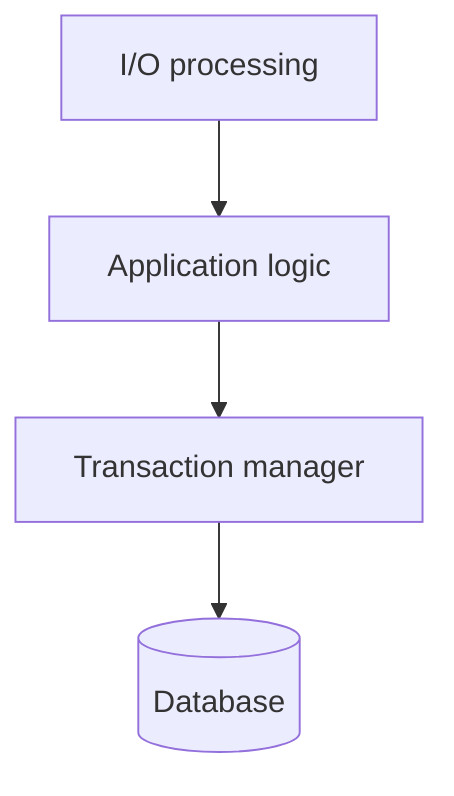
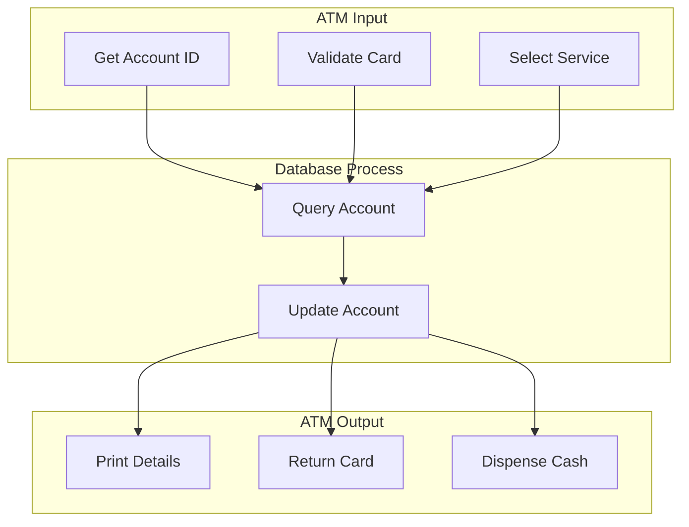
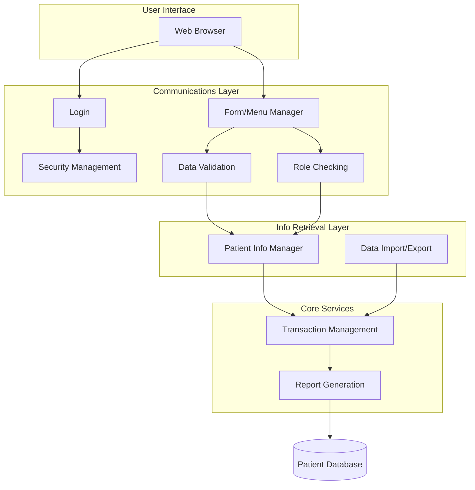
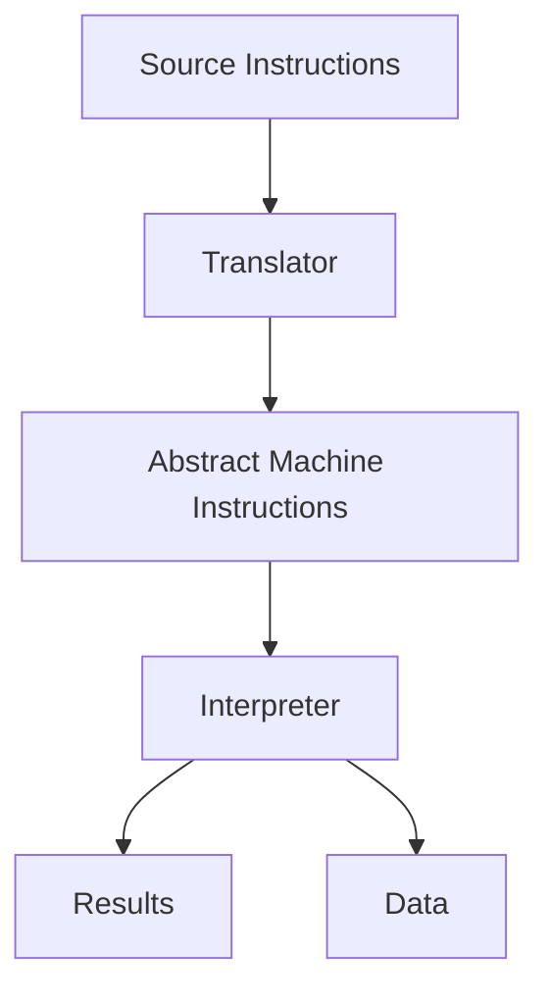
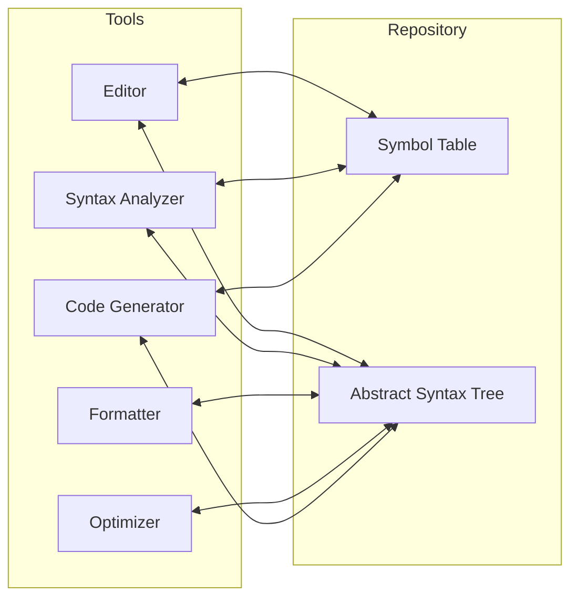
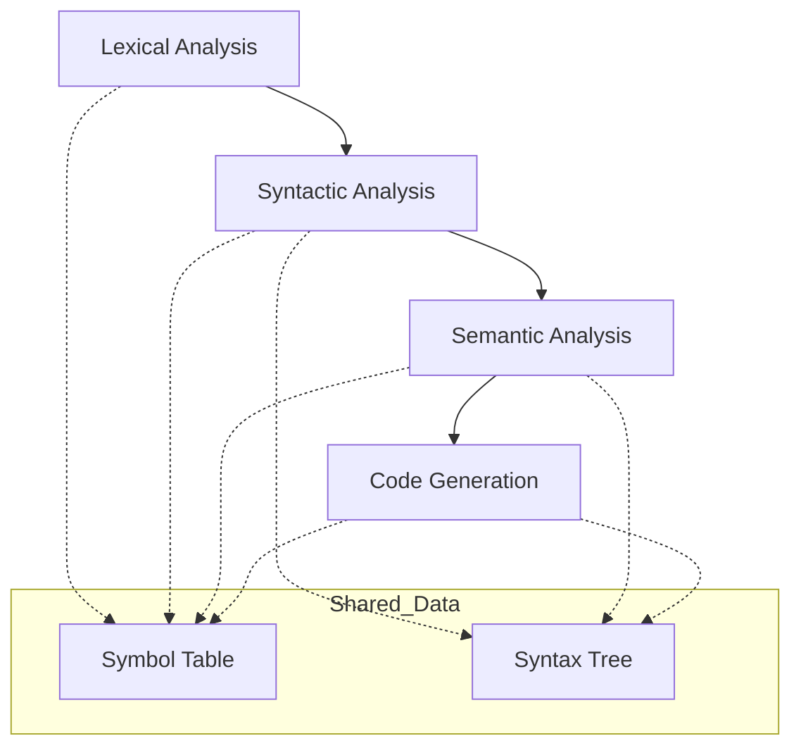

# Application Architectures

**Application architectures** are generic models that describe the structure and organization of particular types of software systems. Systems within the same domain often share features because businesses have common needs (e.g., accounting, invoicing).

## Reusing Application Architectures

The reuse of application architectures can be achieved in two main ways:

1. **Reimplementation**: The generic architecture is reimplemented when developing new systems.
    
2. **Implicit Reuse**: Generic systems (e.g., ERPs) are configured to create a specific application.
    

## Uses of Architecture Models

Designers can use generic models in five primary ways:

|**Use Case**|**Description**|
|---|---|
|**Starting Point**|An initial foundation for the architectural design process.|
|**Design Checklist**|To compare designs against the generic model for consistency.|
|**Team Organization**|Identifies stable structural features to organize parallel development.|
|**Reuse Assessment**|Identifies comparable elements for component reuse.|
|**Vocabulary**|Provides standard terms for discussing applications.|

> [!NOTE] Practice Questions
>
> - What is **application architecture**? State its uses and give examples of application types.
>
> - Classify the two types of application architecture and elaborate any one with an example.
>
> - Draw the **architecture diagram for a language processing system** and explain the role of repository and pipe-and-filter styles in compilers and language-processing toolsets.
>
> - List the **stages of object-oriented design** and explain any three of them.
>
> - Identify possible **objects** for a group diary/time-management system and outline an object-oriented design for it (make reasonable assumptions as needed).

## 1. Transaction Processing Systems (TPS)

**Transaction Processing Systems (TPS)** are interactive systems where users make asynchronous requests for service. They often use a transaction manager to ensure proper completion.

### Conceptual Structure

The conceptual structure involves four sequential components for handling a request.

### Example: ATM System

TPS can be organized as a "pipe and filter" architecture. In an ATM, hardware handles input/output, while the bank server handles processing.

### Layered Information System Architecture

Systems involving interaction with a shared database are typically structured using layers.

|**Layer**|**Function**|
|---|---|
|**User Interface**|Top layer supporting user interaction.|
|**User Communications**|Handles input/output from the interface.|
|**Info Retrieval/Mod**|Application logic for database access and updates.|
|**Transaction Mgmt**|Manages database transactions.|
|**Database**|The system database (bottom layer).|

### Example: Mentcare System

The Mentcare system illustrates a layered architecture where communications and retrieval layers are detailed for specific needs like validation and security.

---

## 2. Language Processing Systems (LPS)

**Language Processing Systems (LPS)** process user intentions expressed in a formal language into an internal format for interpretation.

### Translator and Interpreter Architecture

A general model showing the conversion of source instructions into results via **Translator** and **Interpreter** components.

### Repository Architecture for LPS

When part of a toolset, LPS is effective when organized around a central repository (Symbol Table and Abstract Syntax Tree).

### Pipe and Filter Compiler Architecture

Compilers often combine sequential processing (Pipe and Filter) with centralized data sharing (Repository). This is effective in **batch environments**.

