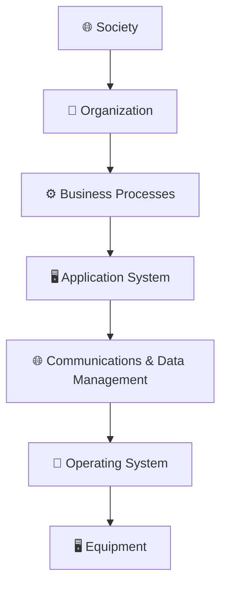
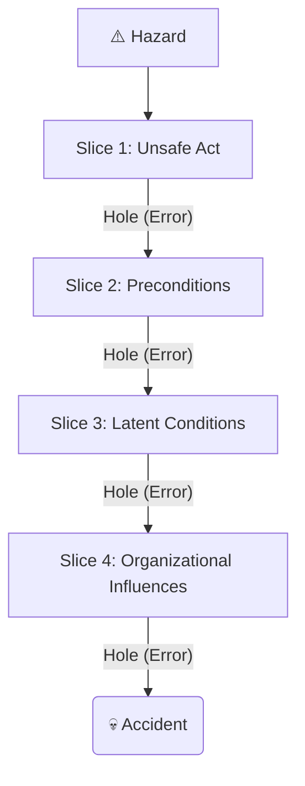

# Socio-technical Systems

1. **System:** A purposeful collection of interrelated components, of different kinds, which **work together to deliver a set of services** to the system owner and users.

   Software engineering is not an isolated activity but is part of a broader systems engineering process. It has human, social, or organizational purpose.

2. **Technical Computer-Based System:** A system including hardware and software components but **excluding** the defined procedures and processes followed by human operators (e.g., mobile phones, computer games). The system is not self-aware.

3. **Socio-technical System (STS):** A system that includes technical components (hardware and software), defined operational processes, and people (operators) as inherent parts of the system. Situated within and governed by an organization, influenced by its policies and culture.
    **Mentcare System:** This medical records system is a **sociotechnical system**. While it includes technical components (client software, server, database), its operation is critically influenced by staff, organizational policies (privacy, safety), and strict mental health laws governing patient detention.

## Sociotechnical System Structure

Sociotechnical systems are complex and must be viewed in layers to understand them. These layers, organized from innermost (technical) to outermost (environmental), influence the system's behavior and requirements. Software is embedded in almost all layers.

In a complex system, all the properties and behavior of the system components are inextricably intermingled. The successful functioning of each system component depends on the functioning of other components.

Thus, software can only operate if the processor is operational. The processor can only carry out computations if the software system defining these computations has been successfully installed. Complex systems are usually hierarchical and so include other systems.

### The Sociotechnical Systems Stack (Layers)

::: details Sociotechnical Systems Stack

:::

The layers are as follows:

1. **Equipment:** The hardware devices, some of which may be computers controlled by embedded software.

2. **Operating System:** Interacts with the hardware and provides a set of common facilities for higher software layers.

3. **Communications and Data Management:** Extends the operating system facilities to provide access to remote systems and databases (sometimes called middleware).

4. **Application System:** Delivers the application-specific functionality that is required.

5. **Business Processes:** The organizational business processes that make use of the software system.

6. **Organization:** Includes higher-level strategic processes as well as business rules, policies, and norms that should be followed.

7. **Society:** The laws and regulations of society that govern the operation of the system.

## Characteristics of Sociotechnical Systems

The complexity of sociotechnical systems gives rise to crucial characteristics that challenge traditional software engineering:

1. **Emergent Properties:** These are properties of the system as a whole (e.g., dependability, usability, security, resilience) that cannot be determined by analyzing individual components alone and only become visible when the system is integrated, as a consequence of the interactions between components.

   **Reliability**, for example, is an emergent property dependent on hardware, software, and operator reliability.

2. **Non-deterministic Behavior:** They do not always produce the same output when presented with the same input. The precise behavior of complex systems is often hard to predict because of the dynamic, complex interactions between components, the environment, and human operators.

3. **Wicked Problems:** Complex sociotechnical systems are often developed to solve "wicked problems," which are so complex that **no definitive problem specification exists**, and the true nature of the problem only emerges as the solution is developed (e.g., developing a national medical records system).

4. **Complex Relationships with Organizational Objectives:** The extent to which the system supports organizational objectives does not just depend on the system itself. It also depends on the stability of these objectives, relationships and conflicts between organizational objectives, and how people in the organization interpret these objectives.

### Emergent Properties

- **Functional Emergent Properties:** These appear when all the parts of a system work together to achieve some objective. For example, a bicycle has the functional property of being a transportation device once it has been assembled from its components.

- **Non-functional Emergent Properties:** These relate to the behavior of the system in its operational environment, such as reliability, performance, safety, and security. These are often critical for computer-based systems, as failure to achieve some minimal defined level in these properties may make the system unusable.

#### Reliability as an Emergent Property

- Because of component inter-dependencies, faults can be propagated through the system.
- System failures often occur because of unforeseen inter-relationships between components.
- It is practically impossible to anticipate all possible component relationships.
- Software reliability measures may give a false picture of the overall system reliability.

#### Influences on Reliability

- **Hardware Reliability:** What is the probability of a hardware component failing and how long does it take to repair that component?
- **Software Reliability:** How likely is it that a software component will produce an incorrect output. Software failure is usually distinct from hardware failure in that software does not wear out.
- **Operator Reliability:** How likely is it that the operator of a system will make an error?
- Failures are not independent and they propagate from one level to another.

## Dependability and Failure in Sociotechnical Systems

System dependability is influenced by all elements in a sociotechnical system—hardware, software, people, and organizations. Component failures in any system are inevitable. System failure is often not due to a single component failing, but the unexpected alignment of multiple failures.

::: details Failure Propagation

:::

- **The Swiss Cheese Model:** This model suggests that hazards are prevented by multiple, redundant layers of defense (like slices of Swiss cheese). Failure occurs only when the weaknesses (holes) in all layers align temporarily, allowing a hazard to pass through the system defenses and trigger an accident.

- **Failure Consequences:** In complex sociotechnical systems, failure propagation can occur across system boundaries. A software failure in a technical system might not lead to total system failure if human operators in the broader sociotechnical system detect the failure and take corrective action.

## Types of Complexity

In complex systems, complexity is often categorized into three types:

1. **Technical Complexity:** Stems from the relationships between the hardware and software components of the system itself.

2. **Managerial Complexity:** Stems from the complexity of coordinating different managers and teams who may have conflicting priorities, especially when systems are managed independently.

3. **Governance Complexity:** Stems from the conflicting objectives, policies, and regulations (laws, ethical standards) that govern the system and its elements.

## Practice Questions

::: tip Practice Questions
- Define **Socio-technical System** and **Complex Systems**.
- Justify why **sociotechnical systems are viewed as layers**, and describe the **different layers of a Socio-Technical System**.
- What are **emergent system properties**? List the **types of emergent properties** and explain how they affect behavior and performance.
- List and discuss the **key factors which influence socio-technical system operation**.
- What do you mean by **System Dependability**? Explain the **four principal dimensions of dependability** and give examples of principal dependability properties.
:::

