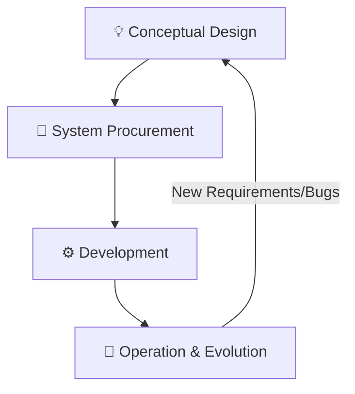
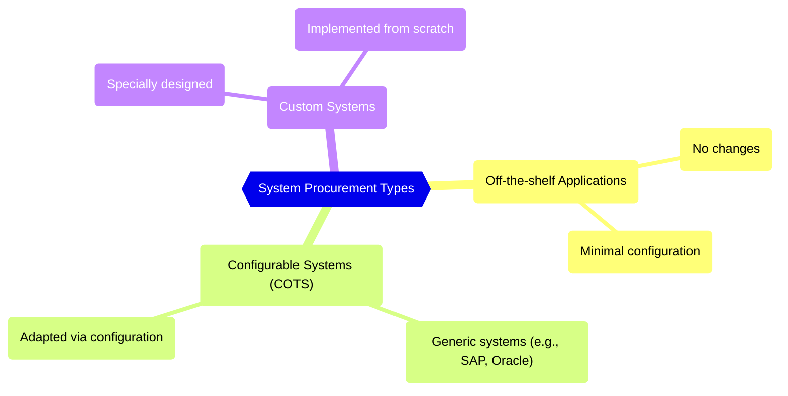

# Systems Engineering

## The Systems Engineering Process

1. **Systems Engineering :** The activity concerned with specifying, buying (procuring), designing, developing, testing, deploying and maintaining complex sociotechnical systems. It covers hardware, software, user interactions and operational processes.

   Concerned with the services provided by the system, constraints on its construction and operation and the ways in which it is used to fulfill its purpose or purposes.
    
2. **Stages of Systems Engineering:** The life cycle of systems engineering involves fundamental stages, with decisions made at any one stage potentially having a profound influence on the others.

    
- **Conceptual Design:** The activity where high-level system requirements and a **vision of the operational system** is developed.
        
- **System Procurement (Acquisition):** Decisions are made about which hardware and software must be acquired, which suppliers should develop the system, and the terms of the contract.
        
- **Development:** The system is built, integrating hardware and software engineering, system integration, and testing. Operational processes are also defined, and training courses are designed.
        
- **Operation and Evolution:** The system is deployed, users are trained, and the system is brought into use. Operational processes have to change to reflect the real working environment where the system is used. Over time, the system evolves as new requirements are identified. Eventually, the system declines in value and it is decommissioned and replaced.

### Challenges of Interdisciplinary Development

Systems engineering requires the involvement of a range of professional disciplines (e.g., electrical, software, mechanical, user interface designers).

- **Misunderstandings due to Terminology:** Different professional disciplines often use the **same words but they do not always mean the same thing**, leading to errors if not resolved early.
    
- **Misconceptions about Capabilities:** Each discipline often makes assumptions about what other disciplines can or cannot do based on inadequate understanding. For example, an electronic engineer might assume software can easily handle computationally intensive tasks to simplify hardware design.
    

## System Procurement

1. **System Procurement (System Acquisition) :** At this stage, decisions are made on the scope of a system that is to be purchased, system budgets and timescales, and high-level system requirements. A process whose outcome is a decision to buy one or more systems from system suppliers. 
    
2. **Drivers for Procurement Decisions:**

    - **The state of other Organizational Systems:** An organization may have a mixture of systems that cannot work together or that are expensive to maintain.

    - **External Competition:** If a business needs to compete more effectively or maintain a competitive position, managers may decide to buy new systems to improve business efficiency or effectiveness.

    - **The Need to Comply with External Regulations:** Businesses are increasingly regulated and must demonstrate compliance with externally defined regulations. This may require replacing non-compliant systems.

    - **Available Budget:** An obvious factor in determining the scope of new systems that can be procured.

### Types of Systems Procured

The procurement approach depends on the type of system or component needed:

::: details System Procurement Types

:::

1. **Off-the-shelf Applications:** Systems that can be used without changes and require minimal configuration.
    
2. **Configurable Application or ERP Systems (COTS):** Generic, large-scale systems (like SAP or Oracle) that must be adapted through configuration features or code modification.
    
3. **Custom Systems:** Systems that must be specially designed and implemented.
    

### Procurement Processes by System Type

|**System Type**|**Core Activities**|**Requirements Status**|
|---|---|---|
|**Off-the-shelf Systems**|Conceptual design, assessing approved applications, and placing the order.|Requirements usually match or are adapted post-selection.|
|**Configurable Systems**|Market survey, choosing a shortlist, **refining requirements** to match candidate systems, choosing a supplier, and contract negotiation.|Requirements must often be modified or adapted to fit the system's assumptions.|
|**Custom Systems**|**Defining detailed requirements** (which form the legal contract), issuing a request for tender, choosing a supplier, and contract negotiation.|Requirements document is **critical** and part of the contract.|

::: tip Practice Questions
- Describe the **professional disciplines involved in Systems Engineering** with a neat sketch.
- What do you mean by **critical systems**? Explain the **three main types of critical systems**.
- What is **system procurement**? Explain system procurement in detail and describe the **steps involved in the system procurement process**.
- Explain the **stages of system procurement** with the help of an activity diagram.
:::

## System Development

System development is the complex process in which system elements (developed or purchased) are **integrated to create the final system**.

### Key Development Activities

The systems development stage includes seven fundamental activities after the initial conceptual design:

1. **Requirements Engineering:** The process of refining, analyzing, and documenting the high-level and business requirements identified earlier in the conceptual design.
    
2. **System/Architectural Design:** Identifying the overall structure of the system, the principal components (subsystems or modules), their relationships, and how they are distributed. This process overlaps significantly with requirements engineering.
    
3. **Requirements Partitioning:** Deciding which components (hardware, software, or operational processes) are responsible for implementing the requirements.
    
4. **Subsystem Engineering:**
    
    - Developing the software components of the system.
        
    - Configuring off-the-shelf hardware and software components.
        
    - Designing special-purpose hardware, if necessary.
        
    - Defining the operational processes and redesigning essential business processes.
        
5. **System Integration:** The critical process of **putting together system elements** to create the new system. This is the stage where **emergent system properties** (like performance and security) first become apparent.
    
6. **System Testing:** An extended activity where the whole system is tested and problems are exposed. This includes acceptance/user testing by the procuring organization.
    
7. **System Deployment:** Making the system available to its users, including transferring data from existing systems and establishing communications with other systems in the environment.

## System Operation and Deployment

1. **Operation Stage:** Occurs after the system is deployed and users are trained. The system is put into practical use.
    
2. **Operational Processes:** These are the processes involved in using the system as intended by its designers. These processes are defined during the system development process.

3. **Post-Deployment Change:** The planned operational processes **usually have to change** to reflect the real working environment.

## Software Evolution and Maintenance

Large, complex systems usually have a long lifetime. Complex hardware/software systems may remain in use for more than 20 years, even though the original technologies used are obsolete.

Over their lifetime, these systems change and evolve to correct errors in the original requirements and to implement new requirements. Computers are replaced, organizations reorganize, and the external environment changes, forcing system changes. Evolution is a process that runs alongside normal system operational processes, involving reentering the development process to make changes to hardware, software, and operational processes.

|**Term**|**Key Definition**|
|---|---|
|**Software Evolution**|The process where software is **continually changed** over its lifetime in response to changing requirements and customer needs. It is seen as a continuum rather than a separate process from development.|
|**Software Maintenance**|The general process of **changing a system after it has been delivered**. This term is usually applied to **custom software** where separate development groups are involved before and after delivery.|
|**Legacy System**|A sociotechnical system that is **useful or essential** to an organization but has been developed using **obsolete technology or methods**. They often perform critical business functions.|

### The Evolution Process

1. **Duration:** Operation and maintenance is normally the **longest life-cycle phase**.
    
2. **Process Drivers:** Evolution is driven by formal or informal **system change proposals** (requests for new requirements, bug reports, or platform adaptation).
    
3. **Evolution Process Steps:** The process is cyclical and includes:
    
    - **Change Identification Process:** Identifying changes based on user feedback or new requirements.
    
    - **Software Evolution Process (Implementation):** Revisions are designed, implemented, and tested (reentering the development process).
    
    - **System Release:** Delivering the updated version.

### Legacy Systems

1. **Legacy Components:** Legacy systems consist of hardware, obsolete support software (compilers, debuggers), and application software.
    
2. **Legacy Data:** They often hold an **immense volume of data** accumulated over the system’s lifetime, which may be inconsistent or duplicated across files.
    
3. **Reengineering:** When a legacy system is modified to make it easier to understand and change, this is called **reengineering**. This may involve software and data restructuring, or **wrapping** the legacy system with adaptor services that hide its original interfaces and present new, better-structured interfaces for use by other components.

::: tip Practice Questions
- Describe the **system development** lifecycle and the key activities (requirements engineering, architectural design, partitioning, subsystem engineering, integration, testing, deployment).
- Explain why **plan-driven processes** are often used for large system development and the rationale for heavy upfront interface definition.
- What are the **implementation and quality practices** important during development (configuration management, CI, testing, TDD)?
- Discuss **software evolution and maintenance**: drivers, challenges, and why maintenance costs can exceed initial development costs.
:::
