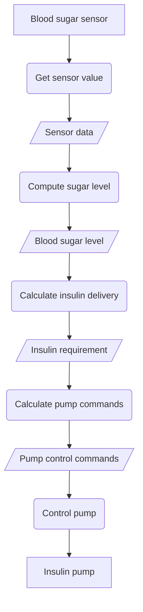
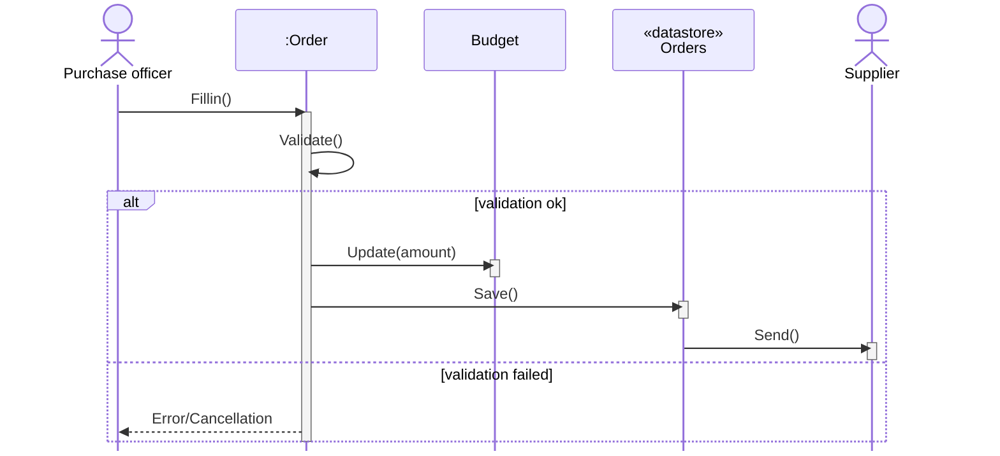
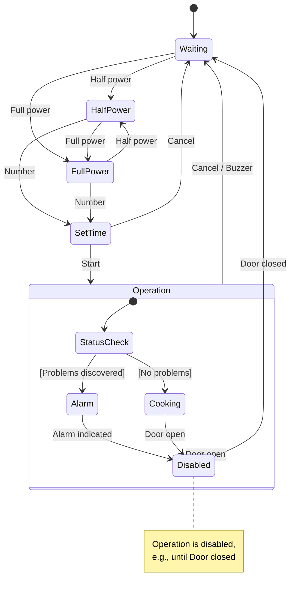
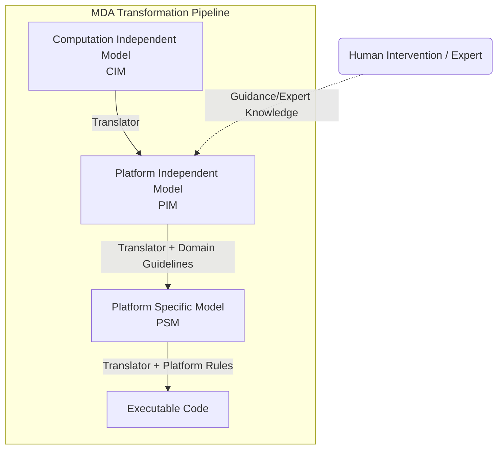

# Behavioral Models

**Behavioral models** are dynamic models that describe the behavior of a system while it is executing. Their main purpose is to show what happens, or what is intended to happen, when a system responds to a **stimulus** received from its environment.

## Stimuli Categories

System stimuli fall into two main categories:

- **Data**: Data becomes available that must be processed by the system, triggering the required processing.
    
- **Events**: An internal or external event occurs that triggers system processing (events may or may not have associated data).

## Data-Driven Modeling

Many business systems are data-processing systems that are primarily driven by data. They are controlled by the data input to the system, with relatively little external event processing. Their processing involves a sequence of actions on that data and the generation of an output.

**Data-driven models** illustrate the sequence of actions involved in processing input data and generating an associated output.
- **Requirements Analysis**: Typically used to show the **end-to-end processing** sequence from initial input to final response.        
- **Functional Perspective**: Historically implemented as **data-flow diagrams (DFDs)**, they illustrate how data flows through and is transformed during sequential processing.

### Benefits and Notation

- **Accessibility**: Data-flow models are **simple and intuitive**, making them accessible to non-expert stakeholders for model validation.
    
- **UML Representation**: In UML, data-driven diagrams are often represented using **activity diagrams**.
    
- **Structure**: An activity diagram shows **processing steps** (activities) and the **data flowing** between these steps (objects).
    

::: info Engineer vs. Stakeholder Preference

While non-experts typically find DFDs (activity diagrams) more intuitive, engineers generally prefer sequence diagrams because they highlight the specific system objects responsible for operations.

:::

## Diagrams Representing Data-Driven Models

Data-driven modeling is illustrated using an activity model of a control system (Insulin Pump) and a sequence model of a business process (Order Processing).

### 1. Activity Model: Insulin Pump Operation

This diagram shows the processing chain where the insulin pump software converts a sensor input into control commands.

- **Activities**: Rounded rectangles represent process steps.
    
- **Objects**: Square rectangles represent the data flowing between steps.

::: details Insulin Pump Activity Diagram

:::

### 2. Sequence Diagram: Order Processing

This sequence diagram illustrates an alternative way to show sequential data processing, focusing on the system objects (`Order`, `Budget`, `Orders` datastore) rather than the processes themselves.

Sequence models are particularly useful for **business process modeling**, where the focus is on the interactions between different system components.

data-flow models highlight the processing steps(operations) and data transformations.

::: tip Directional Flow

When sequence diagrams are used for data-driven modeling, messages flow primarily from left to right, emphasizing sequential transformation.

:::

::: details Order Processing Sequence Diagram

:::

::: info Practice Questions
- What is a **state machine model**? Draw the **state machine model of a simple microwave oven** (event-driven modeling).
- Describe how **behavioral models** are used to represent dynamic aspects of a system. Provide an example using state diagrams.
- Briefly discuss **behavioral models** and **data-driven modeling** and illustrate with examples.
:::

## Event-Driven Modeling and MDE

This section covers the final behavioral modeling approaches: event-driven modeling for real-time systems and the broader framework of Model-Driven Engineering (MDE).

### Event-Driven Modeling

**Event-driven modeling** is a type of behavioral model that shows how a system dynamically responds to internal and external **events**.

- **Stimulus-Response**: These models assume a system has a **finite number of states**, and events (stimuli) cause a **transition from one state to another**.
    
- **Applicability**: This view is particularly appropriate for **real-time systems**.
    
- **Data Flow**: These models show states and transitions but **do not show the flow of data** within the system.
    

::: info UML Notation

The Unified Modeling Language (UML) supports event-based modeling using state diagrams (based on Statecharts). These show how an object changes state depending on the messages it receives.

:::

#### Example: Microwave Oven Control

The following example illustrates event-driven modeling using a microwave oven system. The system transitions between states based on specific user stimuli.

**System Stimuli**

|**Stimulus (Event)**|**Description**|
|---|---|
|`Full power`|User has pressed the full-power button.|
|`Number`|User has pressed a numeric key to set time.|
|`Start`|User has pressed the Start button.|
|`Door open`|The oven door switch is not closed.|

**State Diagram**

The `Operation` state includes substates for status checking. If the door opens during operation, the system immediately transitions to the `Disabled` state.

::: details Microwave Oven State Diagram

:::

## Model-Driven Engineering (MDE)

**Model-driven engineering (MDE)** is a software development approach where **models, rather than executable programs, are the principal outputs** of the development process. MDE aims to raise the level of abstraction, freeing engineers from programming language details or execution platforms.
    
- **Origins**: MDE developed from **Model-Driven Architecture (MDA)**, proposed by the Object Management Group (OMG).
    
- **Scope**: While MDA focuses on design and implementation, MDE concerns **all aspects** of the software engineering process, including requirements and testing.
    
#### MDA Model Types

MDA recommends producing three types of abstract system models.

| **Acronym** | **Model Type**                | **Description**                                                                                               |
| ----------- | ----------------------------- | ------------------------------------------------------------------------------------------------------------- |
| **CIM**     | Computation Independent Model | Abstracts core domain features (domain models). Identifies assets, roles, and entities.                       |
| **PIM**     | Platform-Independent Model    | Models system operation **without reference to implementation**. Shows static structure and event responses.  |
| **PSM**     | Platform-Specific Model       | A transformation of the PIM for a specific platform (e.g., J2EE, .NET). Can often be generated automatically. |

Platform-independent models (PIMs) are central to MDA, serving as the basis for generating platform-specific models (PSMs) and ultimately executable code.

Computation independent models (CIMs) capture high-level domain concepts and are used to guide PIM development.

Platform-specific models (PSMs) adapt PIMs to particular implementation technologies, often through automated transformations.

#### Transformation Pipeline

The following diagram illustrates the conceptual flow of models in MDA.

::: details MDA Transformation Pipeline

:::

### Benefits and Challenges

|**Benefits**|**Challenges**|
|---|---|
|**Error Reduction**: Abstracts away implementation details.|**Translation Difficulty**: Completely automated translation is rarely possible and usually requires human intervention.|
|**Speed**: Accelerates design and implementation.|**Complexity Mapping**: Human experts are needed to link concepts between different CIMs.|
|**Reusability**: Creates platform-independent models.|**Niche Use Case**: Platform independence primarily benefits large, long-lifetime systems.|

::: tip Executable UML (xUML)

Completely automated transformation relies on Executable UML (xUML), a subset of UML where models have clearly defined meanings that can be compiled directly to code.

:::

## Model-Driven Architecture (MDA)

::: info MDA vs. MDE

While Model-driven engineering (MDE) is concerned with all aspects of the software engineering process (including requirements and testing), MDA focuses specifically on the design and implementation stages.

:::

::: tip Multi-Platform Efficiency

For systems running on different platforms (e.g., J2EE and .NET), engineers only need to maintain a single PIM. The corresponding PSMs for each platform are automatically generated.

:::

#### Executable UML (xUML)

The goal of completely automated transformation relies on **Executable UML (xUML)**.

- xUML is a **subset of UML 2** where graphical models have clearly defined meanings.
    
- These models must include information about **implementation operations** to allow direct compilation into executable code.
    

#### Challenges and Limitations

In practice, completely automated translation from models to code is **rarely possible**.

::: warning Human Intervention Required

- **CIM to PIM Translation**: Translating high-level CIM models to PIM models remains a research problem.
    
- **Complex Mapping**: **Human intervention** is necessary to link concepts used in different CIMs (e.g., mapping a 'role' in a security model to a 'staff member' in a hospital model).

:::

::: info Practice Questions
- What is **model driven engineering (MDE/MDA)**? Explain **event driven modelling** with an example.
- Illustrate **Model-Driven Engineering** with an example and explain the transformation pipeline (CIM → PIM → PSM → Code pipeline).
- What are practical limitations of fully automated model-to-code translation (where human intervention is required)?
:::
