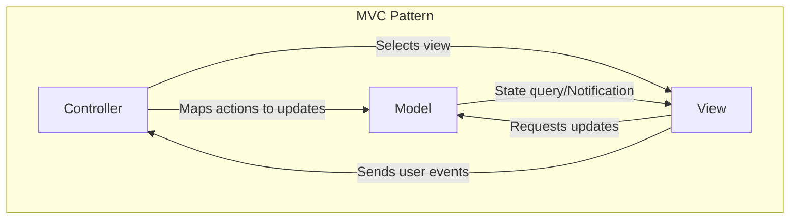
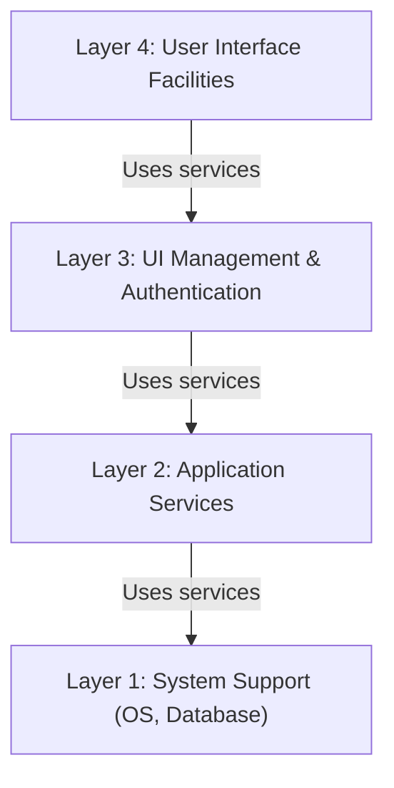
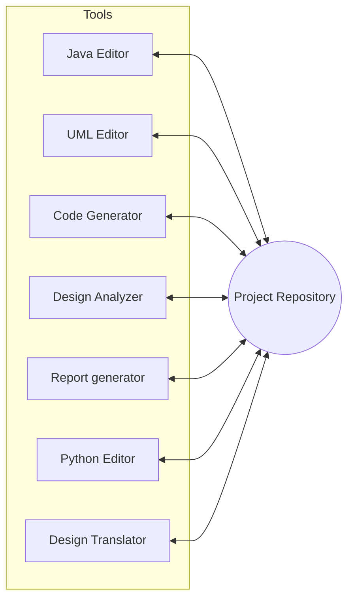
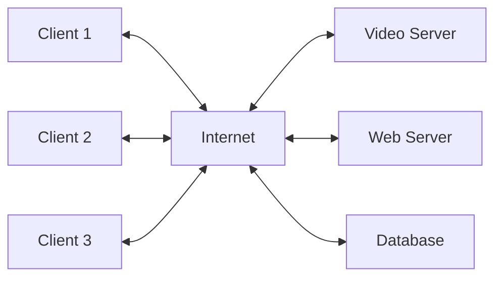
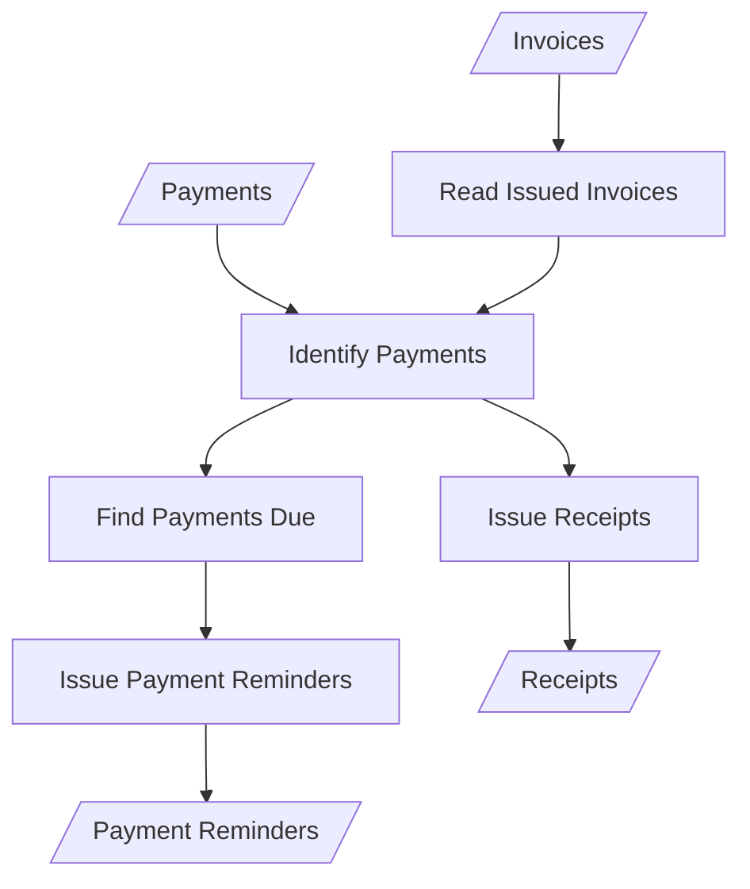

# Architectural Patterns

Architectural patterns are a means of **reusing knowledge about generic system architectures**. They capture the essence of a system organization that has been successful in previous systems and provide a **stylized, abstract description of good practice**. 

It should include information on when it is appropriate and is not appropriate to use that pattern, and details on the pattern’s strengths and weaknesses.

## 1. Model-View-Controller (MVC) Pattern

The **MVC** pattern is fundamental to interaction management in many web-based systems and is supported by most language frameworks.

The MVC pattern separates elements of a system were, allowing them to change independently. For example, adding a new view or changing an existing view can be done without any changes to the underlying data in the model.

The system is structured into three logical components that interact with each other:

- **Model**: Manages the **system data** and associated operations on that data. 
	Encapsulates application state and notifies the View of state changes.
    
- **View**: Defines and manages how **data is presented** to the user.
    
- **Controller**: Manages **user interaction** (e.g., key presses, mouse clicks) and maps user actions to model updates.
    
| **Feature** | **Details** |
|-------------|-------------|
| **When Used** | When there are **multiple ways to view/interact with data** or when future requirements are unknown. |
| **Advantages** | Allows **data to change independently of its representation**. Supports multiple views of the same data. |
| **Disadvantages** | Can involve **additional code and complexity** if the data model is simple. |

::: details MVC Interactions

:::

## 2. Layered Architecture

The Layered Architecture pattern organizes functionality into **separate layers** to achieve separation and independence.

System functionality is organized into separate layers, and each layer only relies on the facilities and services offered by the layer immediately beneath it. i.e, A layer provides services only to the layer immediately above it. Lowest-level layers represent **core services** likely used throughout the system like database.

This layered approach supports the incremental development of systems.

If a layers interface is unchanged, a new layer with extended functionality can replace an existing layer, making this architecture very changeable and portable. 

| **Feature**       | **Details**                                                                                                                                                                                                                                                                                                                                                                                              |
| ----------------- | -------------------------------------------------------------------------------------------------------------------------------------------------------------------------------------------------------------------------------------------------------------------------------------------------------------------------------------------------------------------------------------------------------- |
| **When Used**     | Building on top of **existing systems**, or development spread across **separate teams**, or requiring **multilevel security**.                                                                                                                                                                                                                                                                          |
| **Advantages**    | Allows changes or replacement of entire layers to be made **without affecting other parts**.  When layer interfaces change or new facilities are added to a layer, only the adjacent layer is affected.   Localizes machine dependencies.   Makes it easier to provide multi-platform implementations of an application system, as only the machine-dependent layers need re-implementation. |
| **Disadvantages** | Providing a clean separation between layers is often difficult, and a high-level layer may have to interact directly with lower-level layers rather than through the layer immediately below it.   Performance can be a problem because of multiple levels of interpretation of a service request as it is processed at each layer.                                                                |

::: details Layered Architecture

:::

## 3. Repository Architecture

The Repository pattern describes how interacting components can **share data** via a central location.

**All data** is managed in a **central repository** accessible to all components. Components **do not interact directly**; they interact only through the repository.

| **Feature**       | **Details**                                                                                                                                                                                                                                                                                                                                                                                 |
| ----------------- | ------------------------------------------------------------------------------------------------------------------------------------------------------------------------------------------------------------------------------------------------------------------------------------------------------------------------------------------------------------------------------------------- |
| **When Used**     | Systems generating **large volumes of information** stored for long periods (e.g., IDEs, command and control).   Data-driven systems where the inclusion of data in the repository triggers an action or tool.                                                                                                                                                                        |
| **Advantages**    | Efficient way of **sharing large amounts of data** without explicit transmission between components.   Components can be independent; they do not need to know of the existence of other components. Changes made by one component can be propagated to all components.   All data can be managed consistently (e.g., backups done at the same time) as it is all in one place. |
| **Disadvantages** | Components must agree on a **single data model**.   Distributing the repository is difficult (redundancy/consistency overhead).   The repository is a single point of failure so problems in the repository affect the whole system. May be inefficiencies in organizing all communication through the repository.                                                              |

::: details IDE Repository Architecture

:::

## 4. Client–Server Architecture

The Client–Server pattern is a commonly used runtime organization for **distributed systems**.

In a client–server architecture, the system is presented as a set of **services**, with each service delivered by a separate **server**. **Clients** are users of these services and access servers via **remote procedure calls** (e.g., HTTP) to make use of them.

| **Feature**       | **Details**                                                                                                                                                                                                                                                                                              |
| ----------------- | -------------------------------------------------------------------------------------------------------------------------------------------------------------------------------------------------------------------------------------------------------------------------------------------------------- |
| **When Used**     | Data in a shared database needs access from a **range of locations**.   Servers can be replicated for variable load.                                                                                                                                                                               |
| **Advantages**    | Servers can be distributed across a network with Effective use of networked systems.   Easy to add/upgrade servers **transparently**.    General functionality (e.g., a printing service) can be available to all clients and does not need to be implemented by all services.               |
| **Disadvantages** | Each service is a single point of failure and so is susceptible to denial-of-service attacks or server failure.   Performance may be unpredictable because it depends on the network as well as the system.   Management problems may arise if servers are owned by different organizations. |

::: details Client-Server Architecture

:::

## 5. Pipe and Filter Architecture

The Pipe and Filter pattern models the **runtime organization** where functional transformations process and convert inputs to outputs.

The processing of the data in a system is organized so that each processing component is a discrete filter and carries out one type of data transformation. The data flows (as in a pipe) from one component to another for processing. Input data flows through these transforms until converted to output. 

The transformations may execute sequentially or in parallel. The data can be processed by each transform item by item or in a single batch.

| **Feature**       | **Details**                                                                                                                                                                                                                                                                                                                |
| ----------------- | -------------------------------------------------------------------------------------------------------------------------------------------------------------------------------------------------------------------------------------------------------------------------------------------------------------------------- |
| **When Used**     | Pipe and filter systems are best suited to batch processing systems (e.g., invoice reconciliation) and embedded systems where there is limited user interaction.  Used in data-processing applications (both batch and transaction-based) where inputs are processed in separate stages to generate related outputs. |
| **Advantages**    | **Reusing filters** is easy. Supports parallel execution of filters.                                                                                                                                                                                                                                                       |
| **Disadvantages** | Difficult to use for **interactive systems**.   Requires an **agreed data format** for transfer between communicating transformations.   Each transformation must parse its input and unparse its output to the agreed form which increases system overhead.                                                   |

::: details Pipe and Filter Architecture

:::

::: info Practice Questions

- What is an architectural pattern?

- What is an MVC pattern? Illustrate the Model-View-Controller model with a diagram and an example.

- Discuss the Layered architecture model of System Organization with the help of an example and write its advantages and disadvantages.

- Briefly explain the repository model and the client-server model. Draw the repository architecture for an IDE and discuss advantages and disadvantages.

- Discuss the Client-server model of System Organization with the help of an example and write its advantages and disadvantages.

- Define Information System Architecture. Draw the architecture diagram for a language processing system. (Note: Language processing systems often utilize a repository architecture).

- Explain what design patterns are and briefly discuss the Observer pattern. Sketch an architecture for an ATM machine and indicate any relevant design patterns used.

:::
