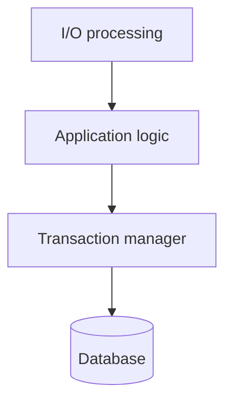
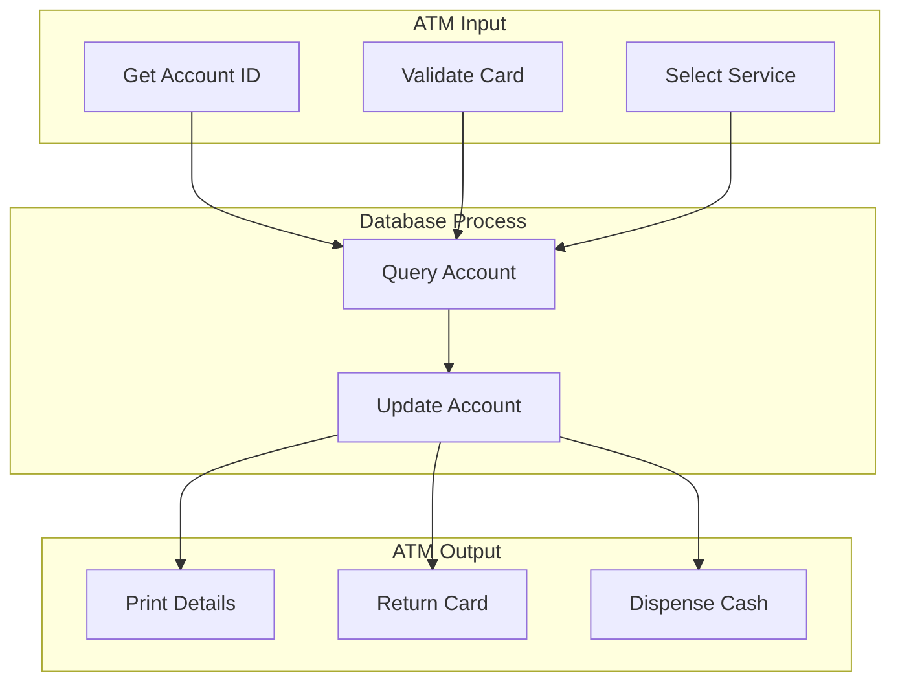
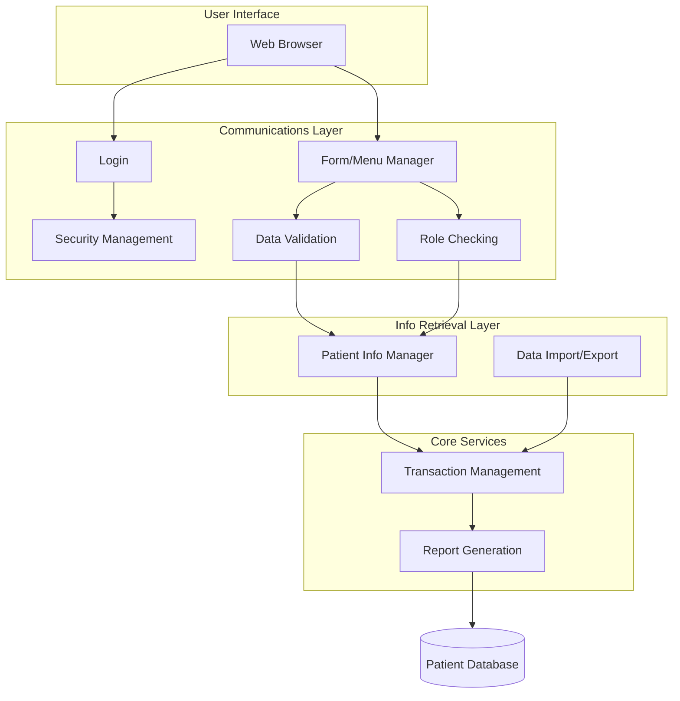
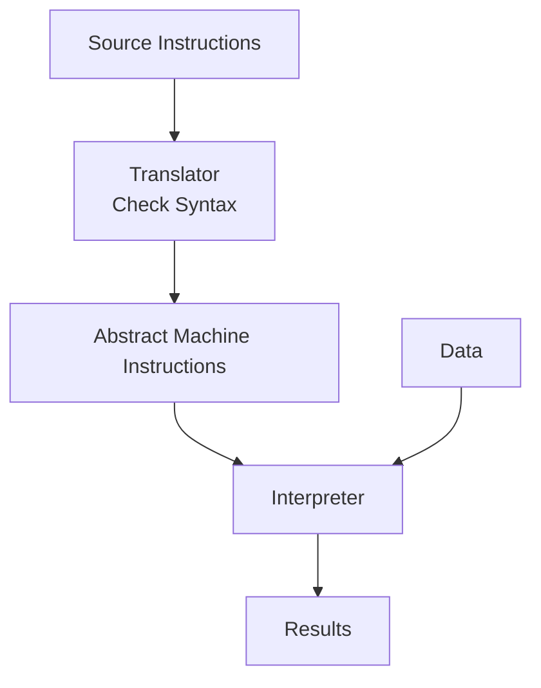

# Application Architectures

**Application architectures** are generic models that describe the structure and organization of particular types of software systems. Systems within the same domain often share features because businesses have common needs (e.g., accounting, invoicing).

## Reusing Application Architectures

The reuse of application architectures can be achieved in two main ways:

1. **Reimplementation**: The generic architecture is reimplemented when developing new systems.
    
2. **Implicit Reuse**: Generic systems (e.g., ERPs) have a standard architecture and components that are configured and adapted to create a specific business application.

## Uses of Architecture Models

A software designer can use models of application architectures as:

1. **Starting Point for Design Process**: If you are unfamiliar with the type of application you are developing, base it on a generic application architecture as a starting point and specialize it for the specific system.

2. **Design Checklist**: To compare a design against the generic application architecture model for consistency.

3. **Team Organization**: As a way of organizing the work of the development team. Application architectures identify stable structural features of the system, allowing components to be developed in parallel. You can assign work to group members to implement different components.

4. **Reuse Assessment**: As a means of assessing components for reuse. If you have components you might reuse, compare them with the generic structures to see if there are comparable components in the application architecture.

5. **Vocabulary**: As a vocabulary for talking about applications. If you are discussing a specific application or comparing applications, use the concepts from the generic architecture to provide standard terms.

## 1. Transaction Processing Systems (TPS)

**Transaction Processing Systems (TPS)** are database-centered applications that process user requests for information and update the information in a database. They are interactive business systems where users make asynchronous requests for service. They are organized so that user actions can’t interfere with each other and the integrity of the database is maintained.

This class of system includes interactive banking systems, e-commerce systems, information systems, and booking systems. They often use a transaction manager in database systems to ensure proper completion.

Transaction processing systems may be organized as a “pipe and filter” architecture, with system components responsible for input, processing, and output.

### Conceptual Structure

The conceptual structure involves four sequential components for handling a request.

### Example: ATM System

TPS can be organized as a "pipe and filter" architecture. In an ATM, hardware handles input/output, while the bank server handles processing.

::: details ATM System

:::

### Layered Information System Architecture

All systems that involve interaction with a shared database can be considered transaction-based information systems. Systems involving interaction with a shared database are typically structured using layers.

| **Layer**              | **Function**                                      |
|-----------------------|---------------------------------------------------|
| **User Interface**    | Top layer supporting user interaction.            |
| **User Communications**| Handles input/output from the interface.          |
| **Info Retrieval/Mod**| Application logic for database access and updates.|
| **Transaction Mgmt**  | Manages database transactions.                    |
| **Database**          | The system database (bottom layer).               |

#### Example: Mentcare System

The Mentcare system illustrates a layered architecture where communications and retrieval layers are detailed for specific needs like validation and security.

::: details Mentcare System

:::

## 2. Language Processing Systems (LPS)

**Language Processing Systems (LPS)** process user intentions expressed in a formal language (e.g., a programming language) into an internal format for interpretation and internal representation.

The best-known language processing systems are compilers, which translate high-level language programs into machine code. Language processing systems translate one language into an alternative representation of that language and, for programming languages, may also execute the resulting code.

The pipe and filter model of language compilation is effective in batch environments where programs are compiled and executed without user interaction.

### Translator and Interpreter Architecture

A general model showing the conversion of source instructions into results via **Translator** and **Interpreter** components.

::: details LPS Architecture

:::

### Repository Architecture for LPS

When part of a toolset, LPS is effective when organized around a central repository (Symbol Table and Abstract Syntax Tree).

### Pipe and Filter Compiler Architecture

Compilers often combine sequential processing (Pipe and Filter) with centralized data sharing (Repository). This is effective in **batch environments**.

::: info Practice Questions

- What is **application architecture**? State its uses and give examples of application types.

- Classify the two types of application architecture and elaborate any one with an example.

- Draw the **architecture diagram for a language processing system** and explain the role of repository and pipe-and-filter styles in compilers and language-processing toolsets.

- List the **stages of object-oriented design** and explain any three of them.

- Identify possible **objects** for a group diary/time-management system and outline an object-oriented design for it (make reasonable assumptions as needed).

:::
