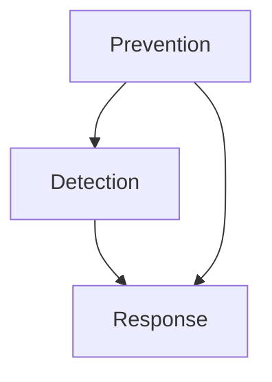

# Overview

This material organizes cybersecurity into a comprehensive framework based on the formula:

$$S = P + D + R$$

(Security = Prevention + Detection + Response)

The framework builds upon foundational principles and spans seven functional domains: five prevention domains, plus detection and response capabilities.

## Foundational Principles

Before implementing technology, security architects must establish a strategic mindset focused on the CIA Triad and core architectural principles:

- **CIA Triad:** Cybersecurity aims to ensure Confidentiality (only authorized users see data), Integrity (data remains untampered), and Availability (systems are accessible when needed).

- **Core Principles:** Defense in Depth (multiple layers of security), Principle of Least Privilege (giving only necessary access), Separation of Duties, Secure by Design, and the K.I.S.S. Principle (Keep It Simple, Stupid).

- **Architect Mindset:** Focus on how a system will fail rather than just how it works, using whiteboards to plan rather than keyboards to implement.

## Prevention: The First Line of Defense

Five domains primarily focused on preventing attacks:

### Identity and Access Management (IAM)

Often called the "new perimeter," IAM uses the Four A's (Administration, Authentication, Authorization, and Audit) to ensure users are who they claim to be and have appropriate rights.

### Endpoint Security

Protects the "IT front door," including servers, laptops, mobile devices, and IoT devices. Relies on visibility and control to manage software levels and patches.

### Network Security

Involves segmentation through firewalls (creating DMZs), VPNs for secure channels, and modern SASE (Secure Access Service Edge) models that deliver network and security via the cloud.

### Application Security

Focuses on the Software Development Lifecycle (SDLC). Advocates for DevSecOps and "shift left" thinking, which introduces security early in the coding phase.

### Data Security

Protects the "crown jewels" through encryption (at rest and in motion), discovery of both structured and unstructured data, and compliance with regulations like GDPR.

## Detection: Monitoring and Hunting

When prevention fails, detection identifies the intrusion:

### SIEM and XDR

Security Information and Event Management (SIEM) collects and correlates logs from various domains. Extended Detection and Response (XDR) provides a more automated, "top-down" approach, often utilizing Federated Search to query systems in real-time.

### Threat Hunting

Proactive effort where analysts use their instincts to develop a hypothesis about potential attacks, aiming to reduce the average 200-day delay between an attack and its identification.

## Response: Containment and Recovery

The final stage of the architecture is managing the incident:

### SOAR

Security Orchestration, Automation, and Response systems use dynamic playbooks to guide analysts through investigation and remediation steps.

### Orchestration vs. Automation

While automation handles known tasks, orchestration acts like a conductor, directing semi-automated processes for complex or "first of a kind" events.

### Breach Notification

Organizations must follow strict geographic and regulatory rules (like GDPR) to report data compromises, or face heavy financial penalties.

## High-Impact Strategies

To reduce the average cost of a data breach, focus on five key areas:

1. Artificial Intelligence (AI)
2. DevSecOps
3. Incident Response plan
4. Cryptography
5. Employee Training

> [!TIP] Mental Model: High-Security Building
> To visualize this structure, imagine a modern high-security building:
> 
> - **Prevention** — Thick outer walls, locks, and ID badges
> - **Detection** — Security cameras and motion sensors that alert the front desk
> - **Response** — Security guards following a specific plan to contain threats

