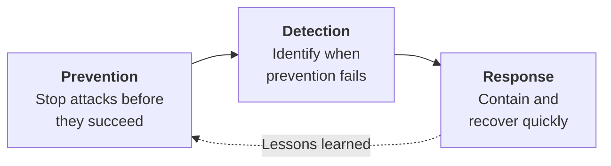
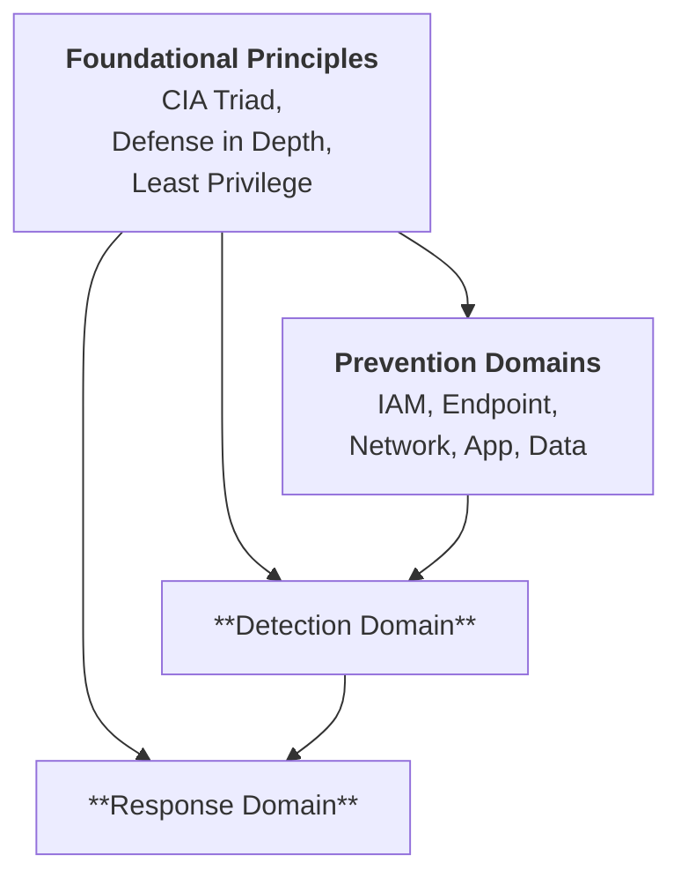
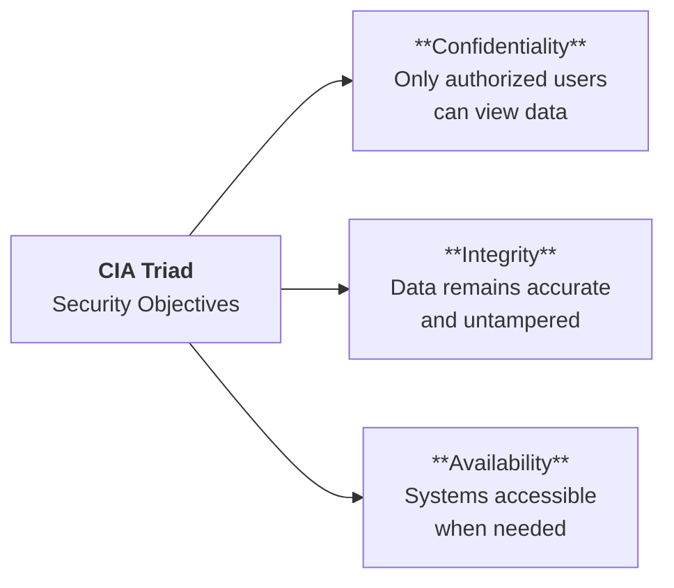
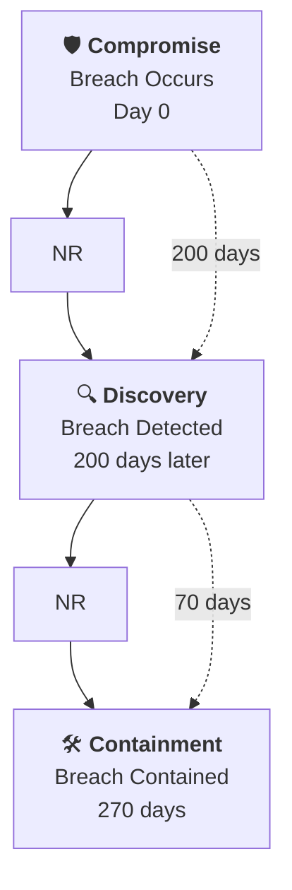
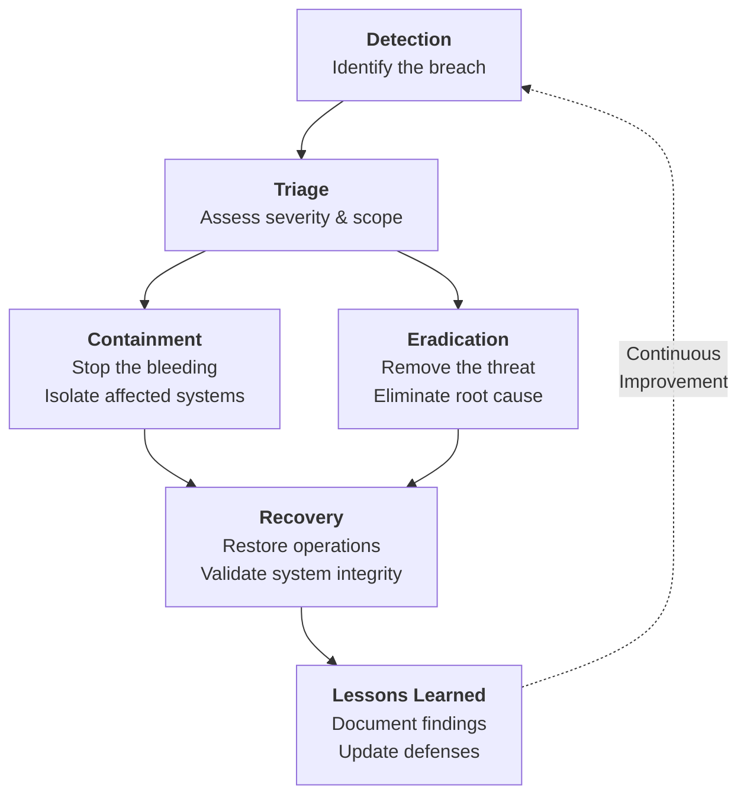
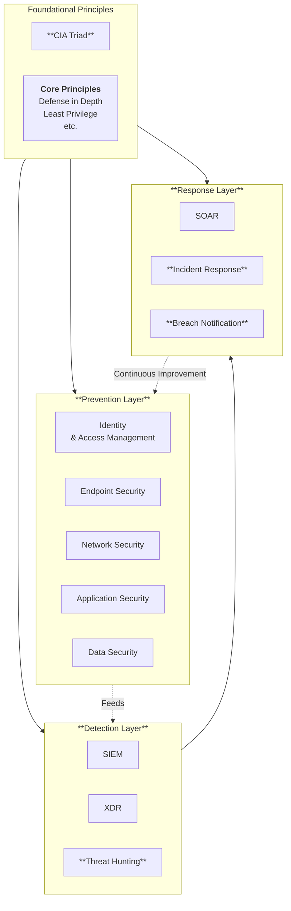

# Introduction to Cybersecurity Architecture

Cybersecurity architecture is the systematic design and implementation of security controls across an organization's technology landscape. Unlike ad-hoc security measures, an architectural approach ensures comprehensive coverage, consistent policies, and measurable effectiveness.

> [!INFO] **Credit and Source**
> This content is based on Jeff Crume's excellent IBM Cybersecurity Architecture series, which follows a 10-part deep dive into security domains.
> 
> [IBM Cybersecurity Architecture Playlist](https://www.youtube.com/playlist?list=PLOspHqNVtKADkWLFt9OcziQF7EatuANSY)

## Why Architecture Matters

**The Challenge:** Modern organizations face sophisticated threats that exploit weaknesses across multiple domains. A single strong control (like a firewall) is insufficient when attackers can pivot through identity systems, endpoints, applications, or data stores.

**The Solution:** A holistic architectural framework that addresses security at every layer, assuming that any single control can fail and planning accordingly.

## The Security Formula

This material organizes cybersecurity into a comprehensive framework based on the foundational formula:

$$S = P + D + R$$
$$Security = Prevention + Detection + Response$$

Traditional security focused almost exclusively on prevention (firewalls, antivirus, access control). However, modern threat intelligence reveals that prevention alone is insufficient:

- **No system is impenetrable :** Determined attackers with sufficient resources will eventually find a way in
- **Time is critical :** On average the breach goes undetected for 200+ days, causing exponentially more damage
- **Preparation matters :** Organizations with incident response plans reduce breach costs by an average of $2.66 million

The formula recognizes this reality: even with strong prevention, you must be able to detect intrusions quickly and respond effectively.

## The Seven Functional Domains

The framework builds upon foundational principles and spans seven functional domains:

**Prevention Domains:**
1. Identity and Access Management
2. Endpoint Security
3. Network Security
4. Application Security
5. Data Security

**Detection and Response Domains:**
6. **Detection and Monitoring:** The process of identifying security incidents and threats through monitoring, logging, and analysis
7. **Incident Response:** The coordinated approach to addressing and managing the aftermath of a security breach

## Foundational Principles

Before implementing technology, security architects must establish a strategic mindset focused on core objectives and architectural principles.

### The CIA Triad: Security Objectives

Every security control should support at least one of these three objectives:

**Why the CIA Triad Matters:**
- It provides a comprehensive checklist for evaluating any security architecture
- Different systems may prioritize different elements (e.g., financial systems prioritize Integrity, healthcare prioritizes Confidentiality)
- Attacks often target the weakest element in the triad

### Core Architectural Principles

These principles guide how security controls should be designed and implemented:

**Defense in Depth** :
- **Why:** Single points of failure are inevitable; layered defenses ensure that if one control fails, others still protect
- **How:** Combine multiple control types (preventive, detective, corrective) across different layers

**Principle of Least Privilege**
- **Why:** Excessive permissions create unnecessary risk; compromised accounts with minimal privileges limit damage
- **How:** Grant only the minimum access required for a role, for only as long as needed

**Separation of Duties**
- **Why:** Prevents any single individual from having complete control; forces collusion for fraud or sabotage
- **How:** Separate requesting, approving, and executing critical functions

**Secure by Design**
- **Why:** Retrofitting security is exponentially more expensive than building it in from the start
- **How:** Integrate security requirements into the entire Software Development Lifecycle

**K.I.S.S. Principle (Keep It Simple, Stupid)**
- **Why:** Complexity is the enemy of security; complex systems are harder to secure, audit, and maintain
- **How:** Avoid over-engineering; if users find security controls too complex, they will circumvent them

### The Security Architect's Mindset

**Think Failure, Not Success:**
- Traditional IT architects focus on how systems work
- Security architects focus on how systems will fail and how to mitigate those failures

**Use the Whiteboard, Not the Keyboard:**
- Security architecture is strategic design, not implementation
- The architect creates the blueprint; engineers execute it

**Assume Breach:**
- Design with the assumption that prevention will eventually fail
- Ensure you can detect intrusions and respond effectively

## Prevention: The First Line of Defense

Prevention aims to stop attacks before they succeed. While no prevention is perfect, strong preventive controls dramatically reduce the attack surface and force attackers to expend more resources. Why Prevention Comes First?

**Cost Efficiency:** Preventing a breach costs far less than detecting and responding to one
- Average cost of a data breach: $4.35 million globally ($9+ million in the US)
- Prevention is measured in thousands; response is measured in millions

**Reduced Attack Surface:** Each preventive control eliminates entire classes of attacks
- Strong authentication prevents credential theft attacks
- Input validation prevents injection attacks
- Network segmentation contains lateral movement

### The Five Prevention Domains

### Identity and Access Management (IAM)

**The "New Perimeter"**
- Traditional network perimeters have dissolved with cloud computing and remote work
- Identity has become the primary control point: "Is this user who they claim to be, and should they have access?"
- 81% of breaches involve compromised credentials (weak, default, or stolen passwords)

**Working :**
- **The Four A's Framework:** Administration (provisioning), Authentication (verification), Authorization (permissions), Audit (monitoring)
- **Key Technologies:** Multi-Factor Authentication (MFA), Single Sign-On (SSO), Role-Based Access Control (RBAC), Privileged Access Management (PAM)

**What It Prevents:** Unauthorized access, credential theft, privilege escalation, insider threats

### Endpoint Security

**The "IT Front Door"**
- Endpoints are the most common entry point for attackers
- Remote work has exponentially increased the number and variety of endpoints
- Compromised endpoints provide attackers with a foothold for lateral movement

**Working :**
- **Unified Endpoint Management (UEM):** Single console for visibility and control across all device types
- **Key Technologies:** Endpoint Detection and Response (EDR), patch management, encryption, remote wipe

**What It Protects:** Servers, desktops, laptops, mobile devices, IoT devices

### Network Security

**The Transport Layer**
- Networks connect all other domains; a flat network allows unrestricted lateral movement
- Segmentation contains breaches and limits damage
- Network visibility provides critical telemetry for detection

**Working :**
- **Segmentation:** Firewalls create zones (Internet, DMZ, Internal) with controlled traffic flow
- **Key Technologies:** Next-Gen Firewalls, VPNs, Network Access Control (NAC), SASE

**What It Prevents:** Unauthorized network access, lateral movement, data exfiltration

### Application Security

**Securing the Code**
- Applications are the business logic layer; vulnerabilities here directly impact business operations
- The cost to fix bugs increases exponentially through the SDLC (1x in coding, 640x in production)
- Web applications are the #1 attack vector

**Working :**
- **Shift Left Philosophy:** Integrate security in design and coding, not as an afterthought
- **Key Technologies:** Static/Dynamic Application Security Testing (SAST/DAST), Software Bill of Materials (SBOM), DevSecOps pipelines

**What It Prevents:** Injection attacks, broken authentication, sensitive data exposure, XML external entities

### Data Security

**Protecting the "Crown Jewels"**
- Data is the ultimate target; all other security exists to protect it
- 83% of organizations have experienced more than one data breach
- Regulatory penalties for data breaches can reach 4% of global revenue

**Works :**
- **Lifecycle Protection:** Discover, Classify, Protect, Monitor, Respond
- **Key Technologies:** Encryption (at rest and in transit), Data Loss Prevention (DLP), Key Management, Tokenization

**What It Protects:** Customer data, intellectual property, trade secrets, personal identifiable information (PII)

## Detection: Monitoring and Hunting

**When Prevention Fails, Detection is Critical**

Prevention will eventually fail. The question is not "if" but "when" attackers will breach the defenses. Detection determines how quickly you identify and respond.

**The Cost of Delayed Detection:**
- Average time to identify a breach: 200+ days
- Average time to contain a breach: 70 days
- Total dwell time: 270 days (9 months)
- Each day of delay increases the cost and damage

**The Detection Gap:**

### SIEM: Security Information and Event Management

**The "Bottom-Up" Approach**
- SIEM Eliminates "console fatigue" from checking dozens of separate security tools
- Correlates events across domains to identify complex attack patterns
- Provides compliance reporting and forensic investigation capabilities

**Working :**
1. **Collection:** Ingest logs from all security domains (Identity, Endpoint, Network, Application, Data)
2. **Normalization:** Convert disparate log formats into a standard schema
3. **Correlation:** Apply rules to connect related events (e.g., failed login + privilege escalation + data transfer = potential breach)
4. **Alerting:** Generate prioritized alerts for SOC analysts

### XDR: Extended Detection and Response

**The "Top-Down" Approach**
- XDR is More automated and faster than traditional SIEM
- Reduces storage costs through federated search (query data where it lives)
- Provides automated response capabilities at the edge

**Working:**
- Central console sends queries to endpoints/sensors in real-time
- Devices search locally and report only matches ("Go Fish" model)
- Automated response playbooks execute at the endpoint level

**SIEM vs. XDR:** They complement each other
- SIEM excels at correlation, compliance, and historical analysis
- XDR excels at speed, automation, and cost-effective storage

### Threat Hunting

**Proactive Investigation**
- Traditional detection waits for alerts (reactive)
- Hunting assumes compromise and searches for evidence (proactive)
- Reduces the 200-day mean time to identify

**Working:**
1. Develop a hypothesis based on threat intelligence ("I suspect they're targeting X using technique Y")
2. Search for indicators of compromise (IOCs) in logs and system data
3. Investigate anomalies even without explicit alerts
4. Update detection rules based on findings

## Response: Containment and Recovery

**Managing the Incident**

Detection identifies the problem; response solves it. The quality of your response directly impacts:
- **Financial cost:** Organizations with incident response plans save $2.66 million on average per breach
- **Reputation damage:** Fast, transparent response maintains customer trust
- **Legal liability:** Proper response reduces regulatory penalties

### The Response Timeline

**The Two Phases:**
- **Response (Containment):** Stop the attack, eject the attacker, prevent further damage
- **Recovery (Restoration):** Restore systems and data, return to normal operations

> [!IMPORTANT] Response Before Recovery
> You cannot effectively recover until you have successfully responded. Restoring data onto a system the attacker still controls simply gives them access again.

### SOAR: Security Orchestration, Automation, and Response

**SOAR: The Modern Approach**
- Traditional incident response relied on "heroic" experts and gut feelings (not scalable)
- SOAR codifies expertise into repeatable playbooks
- Automation handles routine tasks, freeing analysts for complex investigation

**Working:**
1. **Automated Case Creation:** SIEM/XDR alerts automatically create cases
2. **Enrichment:** System gathers context (threat intel, asset info, user behavior)
3. **Dynamic Playbooks:** Guide analysts through investigation steps based on incident type
4. **Automated Response:** Execute containment actions (isolate endpoint, disable account, block IP)

### Automation vs. Orchestration

**Different Tools for Different Scenarios**

**Automation:**
- **When:** Known, repetitive incidents (e.g., phishing email, malware on endpoint)
- **How:** Fully automated response with no human intervention
- **Example:** Automatically quarantine and reimage infected endpoint

**Orchestration:**
- **When:** Complex or novel incidents ("Black Swan" events, first-of-kind attacks)
- **How:** Semi-automated; system guides human decision-making
- **Example:** Novel ransomware variant requires analyst judgment on containment strategy

### Breach Notification

**Legal and Regulatory Requirements**

**Why It Matters:**
- Regulatory penalties for non-compliance can exceed the breach cost itself
- Transparent notification maintains customer trust
- Proper notification limits legal liability

**The Variables:**
- **Data Type:** Credit cards, PII, health records, financial data (different regulations apply)
- **Geography:** Where victims reside, not where your company operates
- **Timeline:** GDPR requires notification within 72 hours; state laws vary

**Examples:**
- **GDPR (Europe):** 4% of global revenue or €20 million fine
- **CCPA (California):** Up to $7,500 per violation
- **HIPAA (US Healthcare):** Up to $50,000 per violation

**Response Tools:** Map compromised data against regulatory requirements to determine notification obligations

## Strategies to Reduce Breach Impact

Based on IBM's Cost of a Data Breach report, these five factors have the highest impact on reducing breach costs:

### 1. Artificial Intelligence and Machine Learning

**Impact:** Organizations using AI save $3.05 million on average per breach

**Why It Works:**
- Analyzes millions of events per second to identify anomalies humans would miss
- Detects "unknown unknowns" through behavioral analysis
- Reduces mean time to identify from 200+ days to weeks or days

**How to Implement:**
- User Behavior Analytics (UBA) in SIEM
- AI-powered threat hunting platforms
- Machine learning for anomaly detection

### 2. DevSecOps

**Impact:** Organizations with DevSecOps save $1.68 million on average per breach

**Why It Works:**
- Fixes vulnerabilities during coding (1x cost) instead of production (640x cost)
- Integrates security into CI/CD pipelines for continuous validation
- Reduces the attack surface before code reaches production

**How to Implement:**
- SAST/DAST in development pipelines
- Security requirements in user stories
- Automated security testing in CI/CD

### 3. Incident Response Plan

**Impact:** Organizations with tested IR plans save $2.66 million on average per breach

**Why It Works:**
- Eliminates confusion and delays during high-stress incidents
- Ensures proper containment before attackers cause more damage
- Maintains compliance with notification requirements

**How to Implement:**
- Document playbooks for common incident types
- Conduct tabletop exercises quarterly
- Assign clear roles and responsibilities

### 4. Encryption

**Impact:** Organizations with encryption save $1.52 million on average per breach

**Why It Works:**
- Encrypted data is useless to attackers without the keys
- Reduces notification requirements (some regulations exempt encrypted data)
- Protects data at rest, in transit, and in use

**How to Implement:**
- Encrypt all sensitive data at rest (databases, file systems)
- Enforce TLS/SSL for data in transit
- Implement proper key management lifecycle

### 5. Security Awareness Training

**Impact:** Organizations with regular training save $1.23 million on average per breach

**Why It Works:**
- Humans are the weakest link; 85% of breaches involve human error
- Trained users recognize and report phishing, social engineering, and suspicious activity
- Creates a "human firewall" as an additional security layer

**How to Implement:**
- Quarterly security awareness training
- Simulated phishing campaigns
- Role-specific training (developers, admins, executives)

## The Complete Architecture

The cybersecurity architecture framework integrates all these domains into a cohesive system:

> [!TIP] Mental Model: High-Security Building
> To visualize this structure, imagine a modern high-security building:
> 
> - **Prevention** : Thick outer walls, locks, ID badges, and security checkpoints (multiple layers)
> - **Detection** : Security cameras, motion sensors, and alarm systems that alert the security operations center
> - **Response** : Security guards with clear procedures for each alert type, containment protocols, and communication plans
> 
> Just as a building doesn't rely solely on locks (prevention), cybersecurity requires all three layers working together.

## Next Articles

This overview provided the framework. The following sections dive deep into each domain:

1. **Foundation Principles** : The "what" and "how" of cybersecurity architecture

2. **Prevention: Identity and Access Management** : The new perimeter

3. **Prevention: Endpoint and Network Security** : Protecting the infrastructure

4. **Prevention: Application and Data Security** : Securing the code and crown jewels

5. **Detection and Response** : Monitoring, hunting, and incident management

