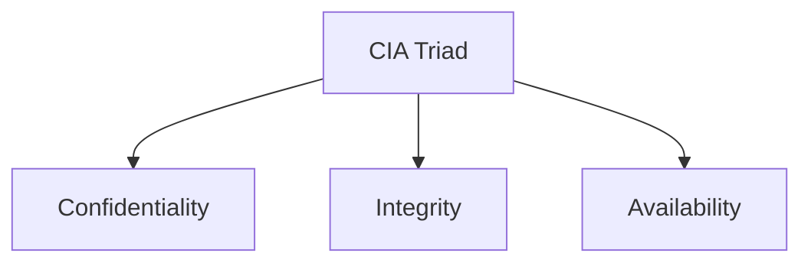

# Foundation Principles

The foundational principles of cybersecurity architecture establish a strategic mindset and provide a checklist for securing any IT system.

These principles are organized around the "What" (the goals), the "How" (the formula), and the core architectural rules that guide implementation.

## The CIA Triad

The CIA Triad serves as a comprehensive checklist to ensure an architecture is correct:

### Confidentiality

This ensures that sensitive data is only accessible to authorized users. It is achieved through **Access Control** (Authentication: "Who are you?" and Authorization: "Are you allowed to do this?") and **Encryption** (scrambling data so it is unreadable without a key).

### Integrity

This ensures that a message or transaction is **true to itself** and has not been tampered with. Technologies like **digital signatures**, message authentication codes, and **blockchain** (distributed ledgers) are used to detect unauthorized modifications and determine if data is still trustworthy.

### Availability

This ensures that resources are accessible to authorized users exactly when they are needed. Architects must guard against Denial of Service (DoS) and Distributed Denial of Service (DDoS) attacks, which use "botnets" or techniques like SYN floods to overwhelm systems.

> [!WARNING] SYN Flood Attack Mechanics
> **The Three-Way Handshake:** In a normal TCP session setup:
>   1. The user sends a SYN message.
>   2. The server reserves a resource (memory/session) and responds with an ACK.
>   3. The user responds to complete the connection (SYN-ACK).
>
> **The Attack:** In a SYN Flood, the attacker sends the initial SYN. The server "opens the door" and reserves resources, sending the ACK. However, the attacker "goes dark" and intentionally never responds with the final handshake.
> 
> **The Result:** The server is left holding the resource open, waiting for a response that never comes. When this is done thousands of times, the server runs out of resources ("doors"), preventing legitimate users from connecting.

> [!WARNING] Integrity Attack: Syslog Tampering
> **The Scenario:** A common attack vector involves hackers gaining access, stealing data, and then elevating privileges to delete or modify System Logs (Syslogs) to cover their tracks.
> 
> **The Countermeasure:** Architects use digital signatures or Write-Once-Read-Many (WORM) storage for logs to ensure that tampering "history rewrites" is detected immediately.

> [!WARNING] Availability Attack: Reflection
> A specific type of DoS where the attacker sends a request to a third party (like a DNS server) but "spoofs" the source address to be the victim's IP. The third party then sends the response (often larger than the request) to the victim, overwhelming them without the attacker directly touching the victim.

## The Security Formula

To achieve the goals of the CIA Triad, architects follow the formula:

$$S = P + D + R$$

(Security = Prevention + Detection + Response)

While many controls like firewalls and identity management focus on Prevention, the framework requires equal attention to Detection (monitoring for anomalies) and Response (containing damage).

## Core Architectural Principles

Five essential rules for building resilient systems:

### 1. Defense in Depth

This principle advocates for an "obstacle course" of security rather than relying on a single mechanism. By layering controls, such as MFA, firewalls, and encryption, the system avoids single points of failure and is designed to "fail safe".

### 2. Principle of Least Privilege

Users should only be given the access rights necessary to perform their jobs, and only for as long as needed. This involves hardening systems by removing unnecessary services/IDs and running re-certification campaigns to eliminate "privilege creep" and "just-in-case" access.

### 3. Separation of Duties

No single person should have total control over a system; instead, the architecture should force collusion for any compromise to occur. A common example is ensuring the Requester of an action is not the same person as the Approver.

### 4. Secure by Design

Security must be a pervasive part of the entire Software Development Lifecycle (SDLC) from start to finish, not an afterthought or "bolt-on" at the end. It should be built into requirements, design, and coding so the system is secure out of the box.

### 5. K.I.S.S. Principle

Keep It Simple, Stupid. Complexity is the enemy of security. If security measures create a complex maze, users will subvert the rules (e.g., writing down overly complex passwords), making the system less secure.

> [!TIP] Hardening Details (Services)
> **Unnecessary Services:** Hardening is not just about passwords; it requires removing unused functionality. 
> 
> For example, a web server usually runs HTTP. If the default configuration also turns on **FTP** (File Transfer Protocol) or **SSH** (Secure Shell) and they are not needed, they must be disabled. Every running service is a potential entry point (attack surface).

## Security by Obscurity

Architects must never rely on secret knowledge or proprietary, "black box" algorithms to keep a system safe.

> [!IMPORTANT] Kerckhoff's Principle
> A system should be secure even if everything about it is open and observable, provided the key remains secret. Security should not depend on the secrecy of the algorithm.

## The Cybersecurity Architect's Role

The **cybersecurity architect** operates primarily from a **whiteboard** rather than a keyboard, focusing on the big-picture "blueprint" that engineers then implement. Unlike a normal IT architect who focuses on how a system _works_, the security architect must prioritize thinking about **how the system will fail** and design mitigations for those specific failure cases.

### Communication Diagrams

Architects rely on specific diagrams to communicate plans:

#### Business Context Diagram

A high-level view showing the relationships between business entities. For example, in a construction scenario, this maps the interactions between the builder, marketing team, tradesmen, and the buyer.

#### System Context Diagram

Decomposes the business view into specific IT systems. It illustrates the necessary components, such as a finance system (budgeting), a permitting system, a project management system, and the GUI (interface) that connects them.

#### Architecture Overview Diagram

A further level of detail showing the interrelations of high-level components, such as schedulers, databases, and alerting mechanisms.

### The NIST Cybersecurity Framework

Just as physical architects must follow building codes, cybersecurity architects rely on frameworks to ensure a solution is comprehensive. The NIST Cybersecurity Framework serves as a checklist covering five functions:

1. **Identify** — Understanding users, data, and assets
2. **Protect** — Implementing safeguards like encryption and access control
3. **Detect** — Monitoring systems to spot intrusions
4. **Respond** — Having a plan for when issues are detected
5. **Recover** — Restoring systems and data after an incident

### Timing of Engagement

#### Typical Practice: The "Bolt-On" Approach

Frequently, security architects are brought in only after the IT architecture is finished with the instruction to "make it secure". This is fundamentally flawed; it is analogous to finishing a skyscraper and then asking the architect to "make it earthquake-proof" after it is already built.

#### Best Practice: Baked-In

The architect should be engaged at the very beginning, during the Risk Analysis phase. By being involved in policy development and requirement setting, security becomes an integral part of the design ("baked in") rather than a superficial addition ("bolt-on").

