# Foundation Principles

Before deploying firewalls, implementing identity systems, or purchasing security tools, organizations must establish foundational principles. 

These principles serve as:

**A Decision Framework:**
- When evaluating security tools: "Does this support the CIA Triad?"
- When designing systems: "Have we applied Defense in Depth?"
- When granting access: "Does this follow Least Privilege?"

**A Common Language:**
- Security architects, engineers, developers, and business stakeholders need shared vocabulary
- Principles provide that common ground for security discussions

**A Measuring Stick:**
- How do you know if your security posture is adequate?
- Foundational principles provide objective criteria for assessment

> [!TIP] Principles Before Technology
> A $10 million security budget applied without foundational principles will fail. A $100,000 budget guided by sound principles will succeed. Technology is only as effective as the strategy behind it.

## The Framework Structure

The foundational principles are organized into three layers:

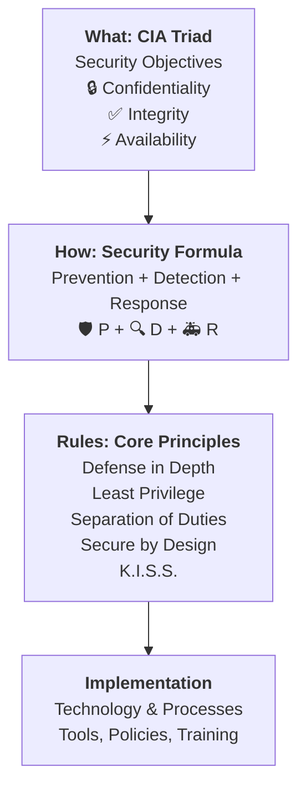

1. **The "What"** : CIA Triad defines security objectives
2. **The "How"** : Security Formula structures the approach
3. **The "Rules"** : Core Principles guide implementation

## The CIA Triad: Security Objectives

The CIA Triad provides a comprehensive checklist for evaluating security architecture. Every security control should support at least one of these three objectives.

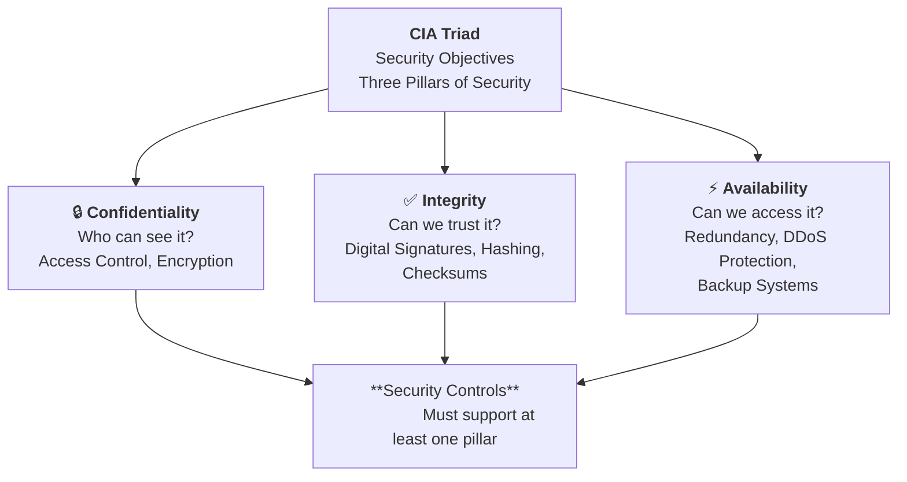

### Confidentiality: Who Can See It?

Ensuring that sensitive data is only accessible to authorized users.

**Why It Matters:**
- Data breaches average $4.35 million in costs
- Regulatory penalties for confidentiality failures (GDPR, HIPAA, PCI-DSS)
- Competitive advantage depends on protecting trade secrets

#### How It's Achieved

**Access Control:**
- **Authentication:** "Who are you?" (passwords, MFA, biometrics)
- **Authorization:** "What can you do?" (role-based access, permissions)

**Encryption:**
- **At Rest:** Scrambles data in databases and file systems
- **In Transit:** Protects data moving across networks (TLS/SSL)
- **In Use:** Protects data in memory during processing (confidential computing)

**Real-World Example:**
- Healthcare providers use encryption and access controls to protect patient records (HIPAA compliance)
- Only the patient's care team can access their medical history
- Unauthorized access triggers alerts and audit trails

### Integrity: Can We Trust It?

Ensuring that data and transactions remain accurate, complete, and unaltered.

**Why It Matters:**
- Financial systems depend on transaction integrity (if $100 becomes $1000, trust collapses)
- Software integrity prevents malware injection (supply chain attacks)
- Log integrity enables forensic investigation (attackers often try to cover their tracks)

#### How It's Achieved

**Digital Signatures:**
- Cryptographic proof that data came from a specific source and hasn't been modified
- Used for software updates, email (S/MIME), legal documents

**Hashing and Checksums:**
- Generate a unique "fingerprint" of data
- Any modification changes the hash, detecting tampering

**Blockchain and Distributed Ledgers:**
- Immutable record of transactions
- Tampering requires controlling majority of network (computationally infeasible)

**Version Control and Audit Trails:**
- Track all changes with timestamp and user ID
- Enables rollback and forensic analysis

**Real-World Example:**
- Banking systems use digital signatures on wire transfers
- If the signature doesn't match, the transaction is rejected
- Prevents man-in-the-middle attacks that try to modify transfer amounts

### Availability: Can We Access It?

Ensuring that resources are accessible to authorized users exactly when they are needed.

**Why It Matters:**
- Downtime costs money: Amazon loses $220,000 per minute of downtime
- Mission-critical systems (hospitals, utilities, emergency services) can't tolerate outages
- Availability attacks are increasing (DDoS-for-hire services cost as little as $10/hour)

#### How It's Achieved

**Redundancy:**
- Multiple servers, network paths, power supplies
- Geographic distribution (if one data center fails, others continue)
- Load balancing distributes traffic across resources

**DDoS Protection:**
- Rate limiting prevents overwhelming requests from single sources
- Cloud-based scrubbing services filter malicious traffic
- Anycast routing distributes attacks across global infrastructure

**Backup and Recovery:**
- Regular backups enable restoration after failures
- Hot/warm/cold standby systems provide failover
- Disaster recovery planning and testing

**The Availability Threat Landscape:**

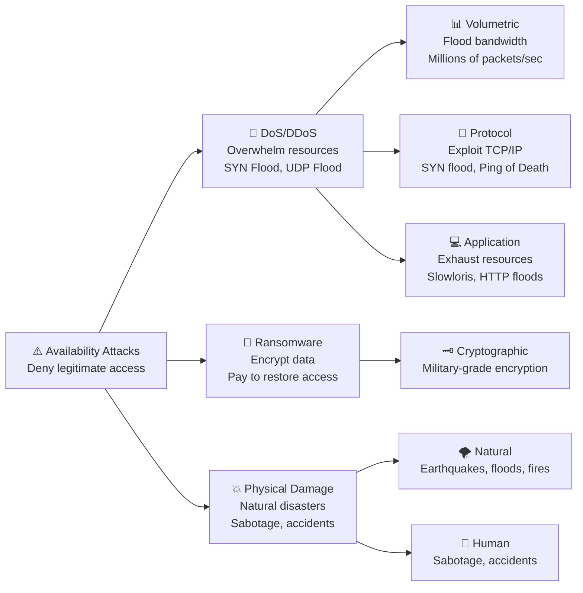

> [!WARNING] SYN Flood Attack Mechanics
> **The Three-Way Handshake:** In a normal TCP session setup:
>   1. The user sends a SYN message.
>   2. The server reserves a resource (memory/session) and responds with an ACK.
>   3. The user responds to complete the connection (SYN-ACK).
>
> **The Attack:** In a SYN Flood, the attacker sends the initial SYN. The server "opens the door" and reserves resources, sending the ACK. However, the attacker "goes dark" and intentionally never responds with the final handshake.
> 
> **The Result:** The server is left holding the resource open, waiting for a response that never comes. When this is done thousands of times, the server runs out of resources ("doors"), preventing legitimate users from connecting.

> [!WARNING] Integrity Attack: Syslog Tampering
> **The Scenario:** A common attack vector involves hackers gaining access, stealing data, and then elevating privileges to delete or modify System Logs (Syslogs) to cover their tracks.
> 
> **The Countermeasure:** Architects use digital signatures or Write-Once-Read-Many (WORM) storage for logs to ensure that tampering "history rewrites" is detected immediately.

> [!WARNING] Availability Attack: Reflection
> A specific type of DoS where the attacker sends a request to a third party (like a DNS server) but "spoofs" the source address to be the victim's IP. The third party then sends the response (often larger than the request) to the victim, overwhelming them without the attacker directly touching the victim.

### CIA Triad Trade-Offs

The three objectives sometimes conflict. Security architects must balance them based on business requirements:

**Confidentiality vs. Availability:**
- Strong encryption protects confidentiality but adds processing overhead (reduces availability)
- Example: Military systems prioritize confidentiality over availability; e-commerce prioritizes availability

**Integrity vs. Availability:**
- Strict integrity checks (multi-signature approvals, blockchain consensus) slow down transactions
- Example: Financial systems prioritize integrity; social media prioritizes availability

**System-Specific Priorities:**

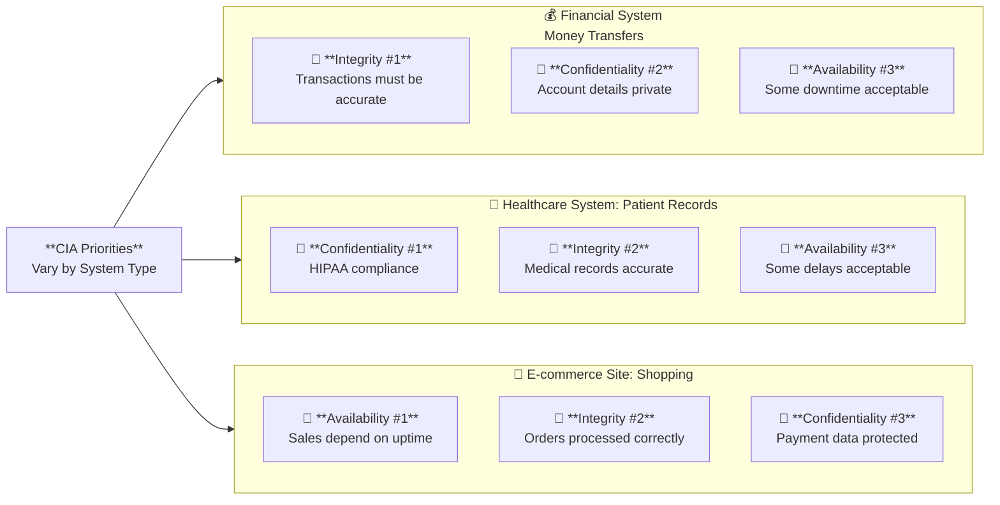

> [!TIP] Know Your Priorities
> Don't blindly implement all security controls. Understand which element of the CIA Triad is most critical for your specific system, then architect accordingly.

## The Security Formula: Prevention + Detection + Response

To achieve the goals of the CIA Triad, architects follow the formula:

$$S = P + D + R$$

$$Security = Prevention + Detection + Response$$

### Why All Three Components Are Required

**Prevention Alone Is Insufficient:**
- No system is perfectly secure; determined attackers with sufficient resources will find a way in
- Zero-day vulnerabilities exist in all complex software
- Insider threats bypass most preventive controls
- Social engineering attacks exploit human psychology, not technical vulnerabilities

**Detection Without Prevention Is Chaos:**
- Constant alerts from legitimate attack attempts would overwhelm analysts
- Prevention reduces the attack surface, making detection more manageable
- Strong prevention forces attackers to use more sophisticated techniques (easier to detect)

**Response Without Detection Is Impossible:**
- You can't respond to threats you haven't identified
- Detection provides the trigger and context for response
- The faster detection occurs, the more effective the response

### The Security Lifecycle

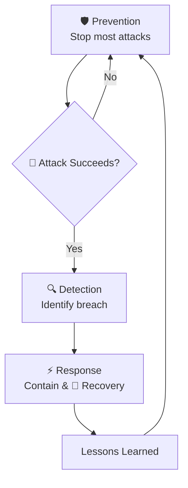

**The Continuous Improvement Cycle:**
1. **Prevention** stops most attacks
2. Sophisticated attacks bypass prevention
3. **Detection** identifies the breach (ideally within hours, not days)
4. **Response** contains the damage and ejects the attacker
5. **Lessons learned** improve prevention for next time

### Measuring Security Formula Effectiveness

**Prevention Metrics:**
- Percentage of attacks blocked at the perimeter
- Number of vulnerabilities patched before exploitation
- Failed authentication attempts blocked by MFA

**Detection Metrics:**
- Mean Time to Detect (MTTD) : target: minutes to hours, not days
- False positive rate (too high = analyst fatigue)
- Coverage: percentage of attack techniques detectable

**Response Metrics:**
- Mean Time to Contain (MTTC) : target: hours to days, not weeks
- Mean Time to Recover (MTTR)
- Breach cost (should decrease with faster MTTC)

> [!IMPORTANT] The $2.66 Million Question
> Organizations with tested incident response plans save an average of $2.66 million per breach compared to those without plans. This demonstrates that investment in Detection and Response provides measurable ROI, not just Prevention.

## Core Architectural Principles

Five essential rules for building resilient systems:

### 1. Defense in Depth

Layering multiple security controls so that if one fails, others still protect the system.

**Why It Works:**
- Single points of failure are inevitable (software has bugs, humans make mistakes, attackers find zero-days)
- Layered defenses force attackers to breach multiple controls, increasing cost and detection likelihood
- Each layer provides time for detection and response

#### How to Implement

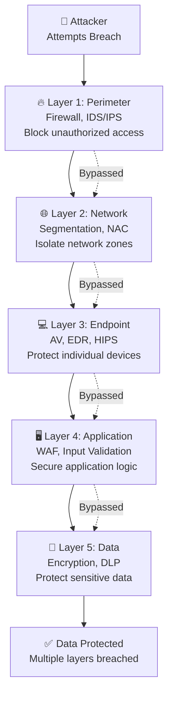

**Real-World Example: Banking Application**

| Layer | Control | What It Protects Against |
|-------|---------|-------------------------|
| Perimeter | Firewall | Blocks unauthorized IPs, ports |
| Network | DMZ | Isolates web servers from database |
| Endpoint | Hardened OS | Prevents privilege escalation |
| Application | Input validation | Stops SQL injection |
| Data | Encryption | Protects data even if stolen |

If an attacker bypasses the firewall, they still face network segmentation. If they breach the web server, they can't directly access the database. If they somehow extract data, it's encrypted.

**Anti-Pattern: Single Layer Security**
- Relying only on a firewall: Once breached, attacker has free reign
- Relying only on passwords: Credential theft gives full access
- Relying only on network security: Insiders bypass it entirely

### 2. Principle of Least Privilege

Grant users only the minimum access rights necessary to perform their job functions, and only for as long as needed.

**Why It Works:**
- Limits damage from compromised accounts (attacker inherits only the victim's limited privileges)
- Reduces insider threat risk (malicious insiders can't access what they're not authorized for)
- Minimizes accidental damage (users can't accidentally delete what they can't access)
- Simplifies compliance audits (clear access boundaries)

#### How to Implement

**Role-Based Access Control (RBAC):**
- Define roles based on job functions (e.g., "Sales Rep", "HR Manager", "Database Admin")
- Assign permissions to roles, not individuals
- Assign users to roles based on their position

**Just-In-Time (JIT) Access:**
- Temporary elevation of privileges when needed
- Automatically revoke after time limit or task completion
- Example: Developer gets production database access for 2 hours to troubleshoot, then access expires

**Regular Access Reviews:**
- Quarterly re-certification campaigns
- Managers review and approve (or revoke) team member access
- Automated alerts for stale/unused accounts

**Real-World Example: Healthcare System**

| Role | Access Level | Rationale |
|------|-------------|----------|
| Receptionist | Patient scheduling, demographics | No need for medical records |
| Nurse | Patient vitals, medication lists | No need for billing information |
| Doctor | Full patient medical records | Required for diagnosis/treatment |
| Billing Clerk | Insurance info, charges | No need for clinical data |

**The "Privilege Creep" Problem:**

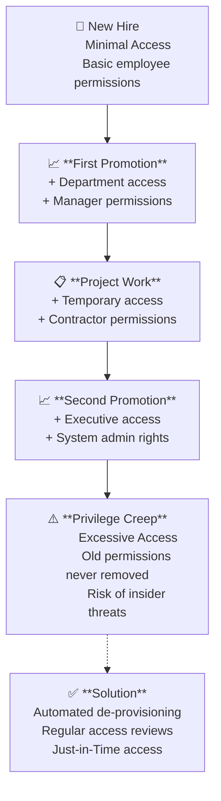

**Solution:** Automated de-provisioning when roles change, regular access recertification

> [!WARNING] The "Just-in-Case" Trap
> Granting access "just in case someone needs it later" is a security anti-pattern. It violates Least Privilege and creates unnecessary risk. Use JIT access for occasional needs.

### 3. Separation of Duties

No single person should have complete control over a critical function. Multiple people must collude for fraud or sabotage to succeed.

**Why It Works:**
- Prevents unilateral malicious actions
- Deters fraud (harder to find willing accomplices)
- Catches accidental errors (second person reviews first person's work)
- Enables accountability (clear audit trail of who did what)

#### How to Implement

**The Three-Person Rule for Critical Functions:**
1. **Requester:** Initiates the action
2. **Approver:** Reviews and authorizes
3. **Executor:** Carries out the approved action

**Real-World Example: Financial Wire Transfer**

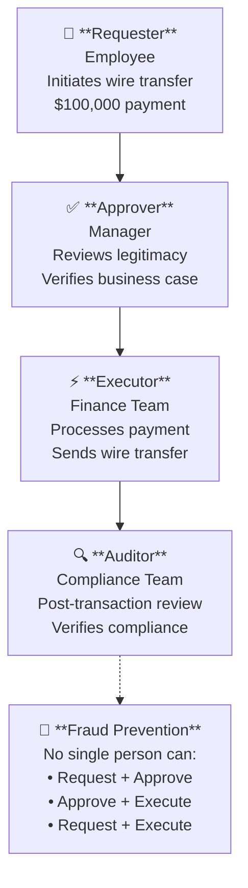

No single person can:
- Request and approve their own transfer (fraud prevention)
- Approve and execute without request (prevents manager abuse)
- Request and execute without approval (requires collusion)

**Real-World Example: Code Deployment**

| Role | Allowed Actions | Prohibited Actions |
|------|----------------|-------------------|
| Developer | Write code, submit pull request | Cannot approve own code, cannot deploy to production |
| Code Reviewer | Review and approve code | Cannot approve own code, cannot deploy |
| DevOps Engineer | Deploy approved code | Cannot approve code changes |

**Anti-Pattern: "God Mode" Accounts**
- Single administrator account with complete control
- Can create users, approve transactions, delete logs, etc.
- No accountability if something goes wrong

### 4. Secure by Design

Security must be integrated into every phase of the development lifecycle, not added as an afterthought.

**Why It Works:**
- Fixing bugs in production costs 640x more than fixing during coding
- Retrofitting security is often technically infeasible
- Built-in security is more elegant and maintainable than bolt-on patches

#### How to Implement

**The Shift-Left Approach:**

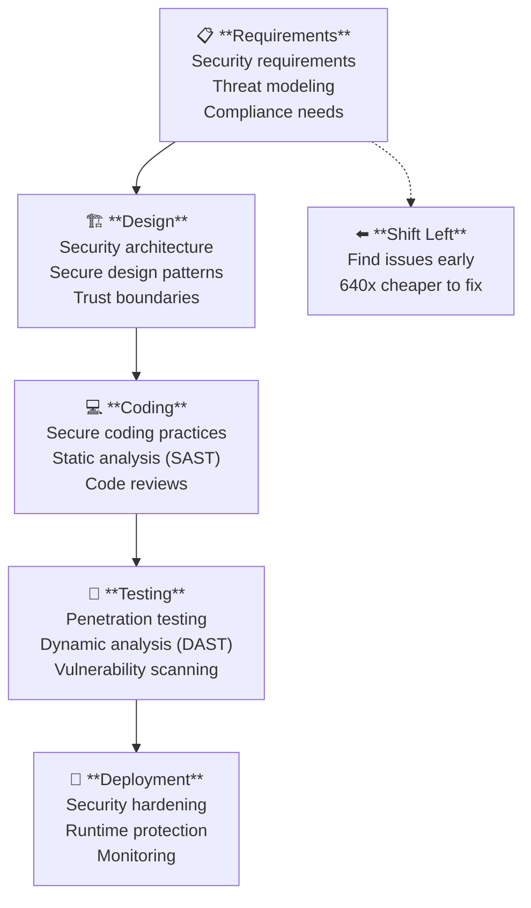

**Security Requirements Phase:**
- Threat modeling: What could go wrong?
- Security user stories: "As an attacker, I would try to..."
- Compliance requirements: GDPR, PCI-DSS, HIPAA, etc.

**Design Phase:**
- Security architecture review
- Data flow diagrams with trust boundaries
- Encryption key management planning

**Coding Phase:**
- Secure coding guidelines (OWASP)
- Static analysis tools catch vulnerabilities as code is written
- Peer code reviews with security checklist

**Testing Phase:**
- Dynamic testing (penetration testing, fuzzing)
- Vulnerability scanning
- Security regression tests

**Real-World Example:**
- **Bolt-On (Bad):** Build an e-commerce site, then realize you need to encrypt credit cards and add PCI-DSS compliance (massive refactoring)
- **Baked-In (Good):** Design with PCI-DSS requirements from day one, use tokenization, minimize cardholder data storage

### 5. K.I.S.S. Principle (Keep It Simple, Stupid)

Avoid unnecessary complexity in security controls. Simple systems are more secure than complex ones.

**Why It Works:**
- Complex systems are harder to secure (more attack surface, more bugs)
- Complex systems are harder to audit (can't verify what you don't understand)
- Users circumvent complex security (write down 20-character random passwords on sticky notes)
- Complex systems are harder to maintain (security patches, configuration drift)

#### How to Implement

**Simplicity in Access Control:**
- **Bad:** 50 different permission groups with overlapping rights
- **Good:** 10 well-defined roles based on job functions

**Simplicity in Network Design:**
- **Bad:** Complex firewall rules with hundreds of exceptions
- **Good:** Simple zones (Internet/DMZ/Internal) with default-deny

**Simplicity in Authentication:**
- **Bad:** Complex password requirements (20 chars, 5 special characters, changes every 30 days) leading to "Summer2024!" patterns
- **Good:** Passphrases or MFA with simpler passwords

**The Complexity Trade-Off:**

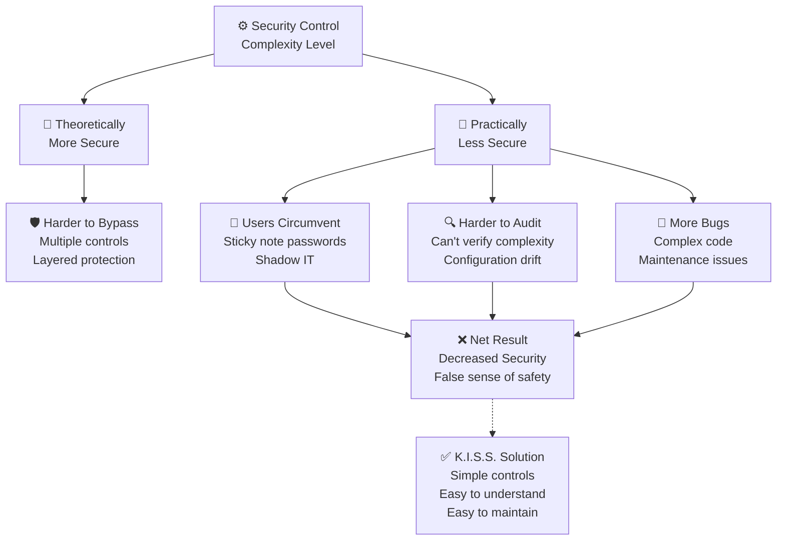

> [!TIP] The KISS Test
> If you can't explain your security control to a non-technical stakeholder in 2 minutes, it's probably too complex. Simplify it.

**Real-World Example: Password Policies**
- **Complex (Bad):** "Minimum 16 characters, at least 3 uppercase, 3 lowercase, 3 numbers, 3 special characters, no dictionary words, no repeating characters, expires every 30 days"
  - Result: Users write passwords on sticky notes or use predictable patterns (Password123!, Password456!, etc.)
- **Simple (Good):** "Minimum 12 characters OR use MFA"
  - Result: Users choose memorable passphrases ("correct-horse-battery-staple") or use password managers

> [!TIP] Hardening Details (Services)
> **Unnecessary Services:** Hardening is not just about passwords; it requires removing unused functionality. 
> 
> For example, a web server usually runs HTTP. If the default configuration also turns on **FTP** (File Transfer Protocol) or **SSH** (Secure Shell) and they are not needed, they must be disabled. Every running service is a potential entry point (attack surface).

## Security by Obscurity: The Anti-Pattern

Architects must never rely on secret knowledge or proprietary, "black box" algorithms to keep a system safe.

> [!IMPORTANT] Kerckhoff's Principle
> A system should be secure even if everything about it is open and observable, provided the key remains secret. Security should not depend on the secrecy of the algorithm.

**Why Security by Obscurity Fails:**
- Secrets eventually leak (reverse engineering, insider disclosure, breaches)
- No community peer review means vulnerabilities go undetected
- Replacing compromised "secret" algorithms is prohibitively expensive

**Real-World Examples:**
- **Bad:** Proprietary encryption algorithm "guaranteed unbreakable" (inevitably broken when analyzed)
- **Good:** AES-256 encryption (public algorithm, security depends on secret key)
- **Bad:** Hiding server IP addresses as security measure (easily discovered via reconnaissance)
- **Good:** Hardening servers assuming IP will be discovered

**The Open Source Paradox:**
- Linux/OpenSSL source code is public, yet more secure than many proprietary systems
- Thousands of security researchers review and improve open algorithms
- "Many eyes make bugs shallow" (Linus's Law)

## The Cybersecurity Architect's Role

The cybersecurity architect is distinct from both security engineers and IT architects.

### Whiteboard, Not Keyboard

**The Architect's Focus:**
- **Strategic design**, not tactical implementation
- **What** should be built and **why**, not the detailed **how**
- **Blueprint** creation, leaving construction to engineers

**The Critical Mindset Shift:**

| IT Architect Asks | Security Architect Asks |
|-------------------|------------------------|
| How will this system work? | How will this system fail? |
| What features do we need? | What attacks will we face? |
| How do we optimize performance? | What are the security trade-offs? |
| How do we scale this? | How do we secure this at scale? |

**The "Assume Breach" Mentality:**
- Don't design assuming prevention works perfectly
- Plan for: "When this control fails, what happens next?"
- Every design decision should answer: "How will we detect and respond to failure?"

### The Architect's Toolbox: Communication Diagrams

Security architects use specific diagrams as a common language:

#### Business Context Diagram

A high-level view showing the relationships between business entities. For example, in a construction scenario, this maps the interactions between the builder, marketing team, tradesmen, and the buyer.

#### System Context Diagram

Decomposes the business view into specific IT systems. It illustrates the necessary components, such as a finance system (budgeting), a permitting system, a project management system, and the GUI (interface) that connects them.

#### Architecture Overview Diagram

A further level of detail showing the interrelations of high-level components, such as schedulers, databases, and alerting mechanisms.

### The NIST Cybersecurity Framework

Just as physical architects must follow building codes, cybersecurity architects rely on frameworks to ensure comprehensive coverage.

**Why Frameworks Matter:**
- Provide systematic checklist (ensures nothing is forgotten)
- Industry standard language (enables communication with stakeholders, auditors, partners)
- Compliance alignment (NIST CSF maps to regulations like GDPR, HIPAA, PCI-DSS)
- Maturity assessment (benchmark your security posture)

**The Five NIST Functions:**

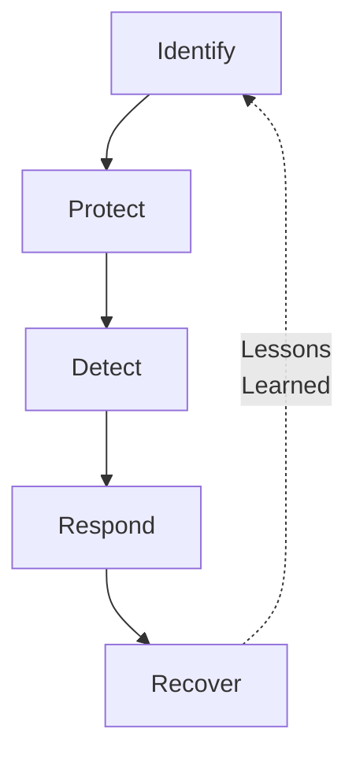

**Detailed Version:**

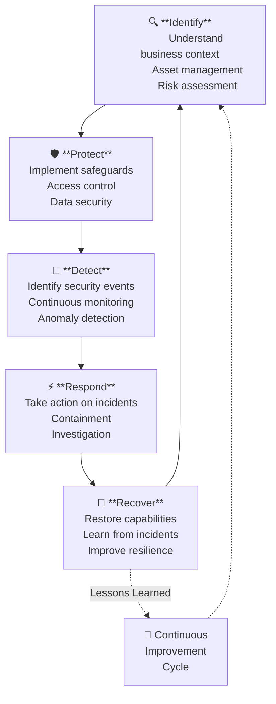

#### 1. Identify

**Purpose:** Understand the business context, resources, and risks.

**Key Activities:**
- **Asset Management:** What systems, data, and devices do we have?
- **Business Environment:** What are critical business functions?
- **Governance:** What are our security policies and procedures?
- **Risk Assessment:** What are our vulnerabilities and threats?
- **Risk Management Strategy:** How do we prioritize security efforts?

**Example Questions:**
- What data do we store? (customer records, financial data, IP)
- Which systems are mission-critical? (if down, business stops)
- Who are our threat actors? (competitors, nation-states, cybercriminals)
- What regulations apply? (GDPR, HIPAA, PCI-DSS)

#### 2. Protect

**Purpose:** Implement safeguards to ensure delivery of critical services.

**Key Activities:**
- **Access Control:** IAM, MFA, RBAC
- **Awareness and Training:** Security education program
- **Data Security:** Encryption, DLP, tokenization
- **Protective Technology:** Firewalls, antivirus, hardening

**Maps to:** The five Prevention domains (IAM, Endpoint, Network, Application, Data)

#### 3. Detect

**Purpose:** Identify security events in a timely manner.

**Key Activities:**
- **Anomalies and Events:** SIEM correlation, IDS/IPS alerts
- **Continuous Monitoring:** 24/7 SOC, automated scanning
- **Detection Processes:** Playbooks, escalation procedures

**Success Metrics:**
- Mean Time to Detect (MTTD) : target: hours, not days
- Detection coverage : can we spot all MITRE ATT&CK techniques?

#### 4. Respond

**Purpose:** Take action when security events occur.

**Key Activities:**
- **Response Planning:** Incident response plan, playbooks
- **Communications:** Internal notifications, breach disclosure
- **Analysis:** Forensics, root cause analysis
- **Mitigation:** Containment, eradication

**Success Metrics:**
- Mean Time to Contain (MTTC) : target: hours to days
- Breach cost reduction : tested plans save $2.66M on average

#### 5. Recover

**Purpose:** Restore services and normal operations.

**Key Activities:**
- **Recovery Planning:** BCP/DR plans, backup strategy
- **Improvements:** Lessons learned, updating controls
- **Communications:** Customer notification, reputation management

**Success Metrics:**
- Recovery Time Objective (RTO) : how fast can we restore?
- Recovery Point Objective (RPO) : how much data loss is acceptable?

**NIST CSF Implementation Tiers:**

| Tier | Description | Characteristics |
|------|-------------|----------------|
| **Tier 1: Partial** | Ad-hoc security, reactive | No formal processes, inconsistent |
| **Tier 2: Risk Informed** | Risk-aware, but not comprehensive | Some processes, not enterprise-wide |
| **Tier 3: Repeatable** | Formal policies, regularly updated | Consistent processes, integrated |
| **Tier 4: Adaptive** | Agile, risk-informed, continuous improvement | Predictive, automated, learning |

> [!TIP] Start with Identify
> Many organizations jump to "Protect" (buying security tools) without completing "Identify" (understanding what needs protecting). This leads to protecting the wrong things or missing critical assets entirely.

### When to Engage the Security Architect

#### The "Bolt-On" Anti-Pattern (Typical Practice)

**The Scenario:**
1. Business and IT teams design complete system
2. Budget is allocated, timelines set, features defined
3. Security architect called in: "Make this secure"

**Why This Fails:**
- Fundamental security flaws are baked into architecture
- Retrofitting security requires expensive refactoring
- Security becomes a checkbox, not a core principle
- Security and functionality trade-offs already made (without security input)

**The Cost of "Bolt-On":**
- Fixing architectural flaws: 10-100x more expensive than preventing them
- Technical debt: Security shortcuts accumulate
- Compliance gaps: May not meet regulatory requirements

**Analogy:**

> [!WARNING] The Skyscraper Problem
> Asking security to "bolt-on" protection after design is complete is like:
> 
> Building a 50-story skyscraper, then asking the architect: "Make it earthquake-proof."
> 
> The foundation, support structure, and materials are already set. Retrofitting requires:
> - Demolishing and rebuilding (prohibitively expensive)
> - Adding braces and reinforcement (ugly, limited effectiveness)
> - Accepting the risk (hoping for no earthquake)
> 
> None of these are good options. Earthquake resistance must be designed in from the foundation.

#### The "Baked-In" Best Practice

**The Scenario:**
1. Security architect engaged during **Risk Analysis** phase
2. Participates in requirements gathering
3. Contributes to architectural design
4. Reviews implementation plans
5. Validates deployment security

**Why This Works:**
- Security requirements inform design decisions
- Trade-offs made with full information
- Security becomes inherent, not added
- Cost-effective (no expensive retrofitting)

**The Security Architect's Journey:**

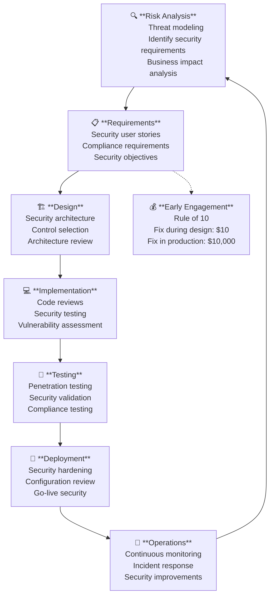

**When to Engage:**

| Phase | Security Architect Role | Output |
|-------|------------------------|--------|
| **Risk Analysis** | Threat modeling, identify security requirements | Risk register, security objectives |
| **Requirements** | Define security user stories, compliance needs | Security requirements document |
| **Design** | Create security architecture, review diagrams | Security architecture, controls mapping |
| **Implementation** | Code reviews, security testing | Vulnerability reports, remediation guidance |
| **Testing** | Penetration testing, security validation | Security test results, sign-off |
| **Deployment** | Hardening, configuration review | Security checklist, deployment approval |
| **Operations** | Monitor, respond to incidents, improve | Incident reports, security improvements |

> [!IMPORTANT] The $10 Rule of 10
> The "Rule of 10" in software engineering applies to security:
> 
> - Fix during requirements: $1
> - Fix during design: $10
> - Fix during coding: $100
> - Fix during testing: $1,000
> - Fix in production: $10,000
> 
> Early engagement isn't just better practice—it's dramatically more cost-effective.

## Summary: Foundations First

Before investing in security technology:

1. **Understand your objectives** (CIA Triad)
2. **Structure your approach** (Security Formula: P + D + R)
3. **Apply core principles** (Defense in Depth, Least Privilege, etc.)
4. **Use frameworks** (NIST CSF for comprehensive coverage)
5. **Engage early** (Bake security in, don't bolt it on)

With solid foundations, the specific security domains (IAM, Endpoint, Network, Application, Data, Detection, Response) can be implemented effectively. Without foundations, even expensive security tools will fail to protect the organization.

