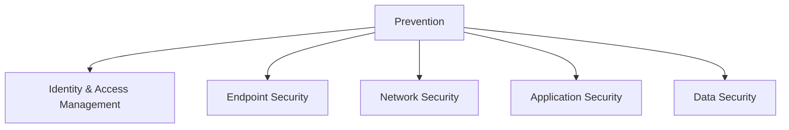
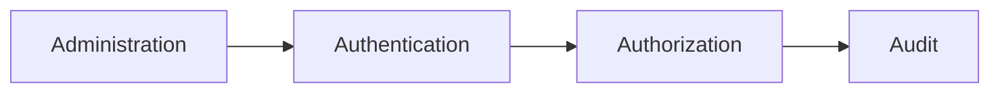

# Prevention: Identity and Access Management

This section covers the strategic framework and the five specific domains that act as the primary barriers against cyber threats.

$$S = P + D + R$$

(Security = Prevention + Detection + Response)

Prevention is the primary method for reducing the attack surface and upholding the CIA Triad:

- **Confidentiality** — Only authorized users can see data (via access control and encryption)
- **Integrity** — Data remains untampered (via digital signatures and hashing)
- **Availability** — Systems are accessible when needed (by preventing DoS attacks)

### Cost Efficiency

Fixing vulnerabilities or stopping attacks early (Shift Left) is exponentially cheaper than remediating them after a breach. For example, fixing a bug in production costs up to 640x more than fixing it during the coding phase.

## Prevention Domains Overview

### Identity and Access Management

Ensures that only authorized users access systems and data, acting as the "new perimeter" in a cloud-first world. Encompasses user provisioning, authentication methods like MFA, and access controls.

### Endpoint Security

Secures devices like laptops, servers, and IoT, preventing malware and unauthorized access. Key practices include unified management, encryption, and patch enforcement.

### Network Security

Segments traffic using firewalls, VPNs, and SASE to isolate threats. Includes DMZ setups and modern cloud-delivered security models.

### Application Security

Integrates protection into the SDLC, using tools like SAST/DAST and DevSecOps to catch vulnerabilities early. Addresses supply chain risks and AI-generated code issues.

### Data Security

Protects sensitive data through encryption, discovery, and compliance with regulations. Includes key management and loss prevention technologies.

> [!NOTE] Prevention Assumes Failure
> While these domains focus on Prevention, the architecture assumes prevention will eventually fail. Therefore, these domains feed telemetry (logs/alerts) into the Detection (SIEM/XDR) and Response (SOAR) systems to complete the security formula.

## Identity and Access Management (IAM)

The "New Perimeter" : We can no longer rely solely on network boundaries; we must verify who the user is immediately.

### Directory Infrastructure

This forms the backbone of IAM systems. Plumbing the directory correctly is critical for success.

#### User Types

Architects must first identify broad user groups (e.g., Employees, Suppliers, Customers) to determine necessary roles.

#### Directories

The storage mechanism for user identities (active directory). A directory consists of:

- **Database** — Storage layer
- **Schema** — Organization of data
- **Protocol** — LDAP (Lightweight Directory Access Protocol) is the standard language for talking to directories

#### Synchronization

While a single "Enterprise Directory" is ideal, most organizations have multiple. Strategies to manage this include:

- **Virtual Directories** — Indexing/pointers to where data lives
- **Meta Directories** — Aggregating and pre-fetching data into a central hub

> [!TIP] Why Multiple Directories Exist
> **The Ideal vs. Reality:** Ideally, an organization would have one central "Enterprise Directory." In reality, they have multiple fragmented directories (silos).
> 
> **The Technical Cause:** This fragmentation occurs because commercial applications often have hardcoded "hooks" into specific database schemas or directory structures. They refuse to communicate with a generic central directory, forcing the IT team to spin up a specific directory just for that application.
> 
> **The Mitigation:** This forces the use of Synchronization tools (Meta-directories or Virtual Directories) to keep user data consistent across these unavoidable silos.

### The Four A's Framework

#### Administration

Identity Governance manages the user lifecycle:

- **Onboarding/Offboarding** : Automating the creation ("provisioning") and deletion ("de-provisioning") of accounts based on HR data
- **Role-Based Access Control (RBAC)** : Mapping business roles (e.g., "Teller") to IT entitlements to avoid manual, one-off permissions
- **Workflow** : Complex access requests require specific approval workflows (e.g., manager approval) before provisioning

> [!TIP] Administration Workflows
> **New Hire (Provisioning):**
> - Trigger: Automated feed from the HR System ("Source of Truth")
> - Flow: HR enters employee → Identity System maps to Business Role → System converts to IT Role (entitlements) → Accounts auto-created in downstream directories/applications.
>
> **Modification (Ad-Hoc Request):**
> - Trigger: User needs access to a system outside their standard role (e.g., promotion or special project)
> - Flow: User requests via Self-Service GUI → Routes to manager for workflow approval → If approved, account provisioned
>
> **Termination (De-provisioning):**
> - Trigger: Employee status changes to "Terminated" in HR
> - Flow: System reverses provisioning, "unwrapping" access capabilities
> - Critical: Without centralized system, IT must manually audit every application which is inefficient and dangerous, leaving security gaps.

#### Authentication

Verifying user identity (who are you?):

- **Factors** : Something you Know (password), Have (mobile device), or Are (biometric)
- **Multi-Factor Authentication (MFA)** : Combining factors (e.g., phone + face) to mitigate risks like stolen passwords
- **SSO (Single Sign-On)** : Users authenticate once to access multiple systems, reducing password fatigue
- **Passwordless** : Industry trend toward removing passwords entirely to eliminate shared knowledge risks

#### Authorization

Determining what authenticated users can do:

- **Risk-Based/Adaptive Access** — Decisions consider context like location, time of day, frequency, and transaction value

> [!TIP] Risk-Based Authorization Factors
> Adaptive Access uses a complex algorithm considering:
> - **Request Type** — "View Balance" (low risk) vs. "Transfer Funds" (high risk)
> - **Transaction Value** — $100 transfer (allowed) vs. $10,000 (triggers block or step-up auth)
> - **Location** — Normal location vs. anomalous geography
> - **Time/Frequency** — Unusual patterns trigger additional verification

#### Audit

Verifying that the previous three A's were done correctly:

- **User Behavior Analytics (UBA)** — Logging activities and using machine learning to spot anomalies, such as rapid sequences like "Create Account → Dump Database → Delete Account"

### Privileged Access Management (PAM)

- **The Problem:** Admins sharing a single "root" password makes accountability impossible.

> [!WARNING] The "Dirty Secret" of IT (Privileged Access)
>**The Contradiction:** Security policies rigidly enforce that end-users must have unique, complex passwords and change them frequently. However, for the most sensitive accounts—**Privileged Users** (Admins, Root)—organizations often do the exact opposite.
> 
>**The Operational Reality:** Because multiple admins need access to the same servers, they often share a **single "root" password** rather than having unique credentials.
>
>**The Risk:** If an incident occurs on a server, it is impossible to prove _who_ did it because everyone used the same shared identity. Accountability and non-repudiation are lost, allowing admins to point fingers at one another.

- **The Solution (PAM):** Admins log into a PAM system (vault). Privileged Access Management systems force admins to log in with their own unique ID, "check out" a shared password for the target server (which the system rotates immediately after use so it cannot be reused), ensuring individual accountability.

- **Session Recording:** PAM systems often record every keystroke for audit trails and deterrence.

### Extensions: Federation and CIAM

- **Federation:** Using industry standards to extend identity beyond the organization, allowing employees to access cloud apps (SaaS) or partner systems acting as an **Identity Provider (IdP)**.
- **CIAM (Consumer IAM):** Managing customer identities. Unlike workforce IAM, CIAM focuses on **reducing friction** (barriers to entry) and preserving **privacy**.
