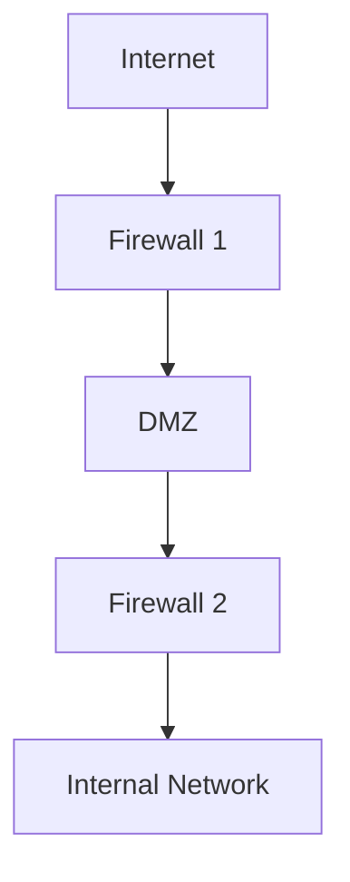

# Endpoint and Network Security

## Endpoint Security

The "IT Front Door" : Securing all devices that connect to the network.

### Trusted Platform

Security relies on the endpoint being secure. For example, Multi-Factor Authentication (MFA) is useless if the biometric data comes from a "jailbroken" or compromised device.

### Hardware Scope

Includes servers (often overlooked), desktops, laptops, mobile devices, and the Internet of Things (IoT) such as cameras and appliances.

### The Challenge

- **Attack Surface** : Every device contributes to the attack surface; the more devices, the more entry points for an attacker
- **Blurred Lines** : The distinction between "business" and "personal" use is largely a fiction; home networks now connect to corporate networks
- **Complexity** : Managing a mix of Operating Systems (Windows, MacOS, Linux, Unix, Mainframe, Mobile, IoT) creates complexity, which is the "enemy of security"

> [!WARNING] Operating System Complexity
> **The Challenge:** Endpoint security is not just about managing hardware; it also requires managing a chaotic mix of Operating Systems, not just Windows.
> 
> **The Scope:** An architect must secure MacOS, Linux, Unix, Mobile OSs, and significantly, Mainframes.
> 
> **The Risk:** Each OS requires different tools and patches. This variety creates complexity—the more fractured the environment, the harder it is to apply a consistent security policy.
>
> "Complexity is the enemy of security."

### Management Strategies

#### Typical Practice: Siloed

Different administrators manage different devices (e.g., one for servers, one for desktops, one for mobile), and often no one manages IoT. This leads to inefficiency and security gaps.

#### Best Practice: UEM

Unified Endpoint Management integrates all devices into a single, holistic console. This provides the two keys to security: Visibility (knowing what you have) and Control (ability to enforce policy).

> [!TIP] Policy Enforcement
> The "N-1" policy (allowing only the current or previous version) is enforced by **quarantine**.
>  
> If a device is found to be "N-2" (two versions old), the system should automatically disconnect it from sensitive data because it is statistically likely to have unpatched vulnerabilities.

### Key Controls : Policy Enforcement

- **Discovery** : You cannot secure what you don't know about. Systems must be able to query and identify all hardware and software on the network
- **Software Levels (Patching)** — Enforcing a policy of "Current (N) or N-1" versions. Devices falling behind (N-2) should be disconnected from sensitive data
- **Encryption** : Ensuring storage on devices is encrypted so that if a device is lost or stolen, the data remains unreadable to unauthorized users.
- **Remote Wipe** : The ability to delete data remotely if a device is compromised or lost
- **Password/Lock Policies** : Enforcing length, strength, and expiry of passwords or PINs on devices
- **Antivirus/EDR** : Installing Endpoint Detection and Response agents to prevent malware
- **Disposal** : A defined policy for securely destroying data when a device reaches end-of-life
- **Location Tracking** : Optionally tracking devices to recover them (sensitive regarding personal privacy)

### BYOD (Bring Your Own Device)

#### The Reality

Users will bring their own devices (and IT/Cloud). Organizations either have a Well-Defined Program or a Poorly Defined Program; claiming "we don't allow it" usually results in an unsanctioned program.

#### Strategy

Do not say "No," say "How." If you make doing the right thing easier than doing the wrong thing, users will comply.

#### Key BYOD Elements

- **Consent** : Users must agree to the rules, understanding what the company can monitor and wipe
- **Containerization (Selective Wipe)** : Separating corporate data from personal data. If an employee leaves, the company wipes only the corporate "container"
- **Application Control** : Blacklisting dangerous apps or requiring specific security apps before granting access
- **Hardware Standards** : Limiting support to specific hardware configurations to manage complexity
- **Authorized Services** : Preventing "Shadow IT" by mandating the use of corporate cloud services rather than personal accounts.

## Network Security

The Transport Layer : Segmenting and protecting network traffic.

### Firewalls

Like a physical firewall in a building, it limits the spread of damage (e.g., fire/attack) from one unit to another.

#### Packet Filtering

The "Envelope" method : Looks only at the header: Source, Destination, and Port. Does not inspect the contents (payload).

> [!TIP] Packet Filtering Criteria
> When configuring basic packet filtering, the firewall examines three header data points:
> 1. **Source Address** : Where it is coming from
> 2. **Destination Address** : Where it is going
> 3. **Port** : The service being requested (e.g., Port 80 for Web)

#### Stateful Inspection

The "Open Envelope" method : Looks at the payload and understands the context of the connection (e.g., "Did we request this packet?").

#### Proxy

Acts as a "Man-in-the-Middle." Breaks the connection into two separate sessions: User-to-Proxy and Proxy-to-Server. Allows for deep inspection of traffic and enforcement of privacy policies.

> [!TIP] Proxy for Privacy
> **Privacy Use Case:** While proxies are used for security inspection (Man-in-the-Middle), they are also used for **privacy**.
>  
> By forcing traffic through a proxy, the external world sees only the Proxy's IP address, masking the identity and IP of the internal user.

#### Network Address Translation (NAT)

- **Function** : Translates non-routable internal addresses (e.g., 10.x.x.x or 192.168.x.x) into a routable external IP address
- **Security Benefit** : Hides the internal network structure. External attackers cannot directly address internal workstations because their IP addresses do not exist on the public Internet

> [!TIP] NAT and Non-Routable IP Ranges
> **The Concept:** Network Address Translation (NAT) is necessary because specific IP address ranges are "non-routable" on the public Internet.
> 
> **Specific Ranges:** The most common non-routable internal addresses begin with 10.x.x.x or 192.168.x.x (common in home routers).
> 
> **The Mechanism:** If a device tries to send a packet with one of these internal source addresses directly to the Internet, the first router it hits on the public Internet will recognize it as non-routable and block/drop it immediately. This physical constraint forces the use of a NAT box to translate internal IPs to a valid public IP, inherently hiding the internal structure from external attackers.

### Segmentation Architectures

#### Bastion Host

Placing a server on the internet with a single firewall. Represents a single point of failure. Not recommended.

#### Tri-homed Firewall

A single firewall with three network interface cards (NICs) creating three zones: Internet (Red), DMZ (Yellow), and Intranet (Green). While cheap, it remains a single point of failure.

#### Basic DMZ (Demilitarized Zone)

Uses two firewalls to create a buffer zone. Defense in Depth: If the outer firewall fails, the inner firewall still protects the internal data.

#### Multi-tiered DMZ

"Defense in Depth on steroids." Uses three or more firewalls to separate tiers (e.g., Web Server → App Server → Database). Provides the highest granularity and security but comes with high cost and complexity.

### Virtual Private Networks (VPNs)

- **Goal** : Creating a secure, encrypted "pipe" or channel over an untrusted network (the Internet)
- **The Trade-off** : While VPNs ensure Confidentiality, they limit Inspection. Because the traffic is encrypted, security tools cannot easily see if malware is being sent through the pipe

#### VPN Types by OSI Layer

- **Application Layer** : Highly granular. Examples: SSH (Secure Shell) and SFTP
- **Transport Layer** : TLS/SSL. Common in web browsers (the "lock" icon). Encrypts the session between a browser and a server
- **Network Layer** : IPsec. Encrypts all traffic between two networks or endpoints. A "catch-all" but lacks granularity

> [!TIP] OSI Layer Inheritance
> **The Rule:** Security implemented at a lower layer of the OSI stack is automatically inherited by all upper layers.
> 
> **Application Layer (e.g., SSH):** Security here is highly granular and specific to that application, but it does not protect other applications or the layers below it.
> 
> **Network Layer (e.g., IPsec):** Because this sits lower in the stack (Layer 3), it encrypts everything flowing between two endpoints. Every application (email, web, file transfer) running above it automatically benefits from that encryption without needing separate configuration.

**Trend:** Moving away from broad network-based VPNs toward application-specific VPNs for better control.

### Modern Network Architecture: SASE

**Secure Access Service Edge (SASE)**

$$\text{SASE} = \text{Network Security} + \text{WAN} + \text{Identity}$$

- **Delivery Model** : Converges networking and security functions and delivers them from the Cloud to the Edge
- **Benefits** : Replaces physical appliances with scalable cloud services and supports Zero Trust strategies like Micro-segmentation

