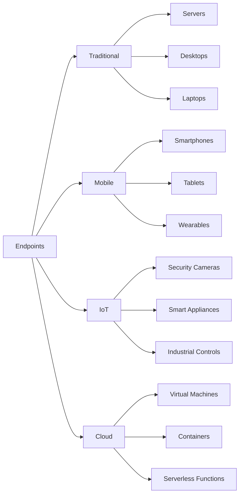
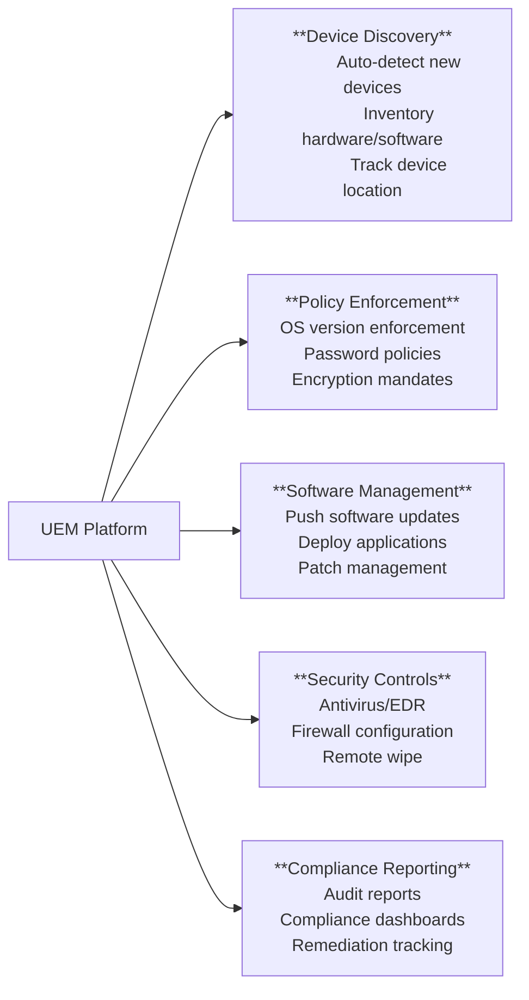
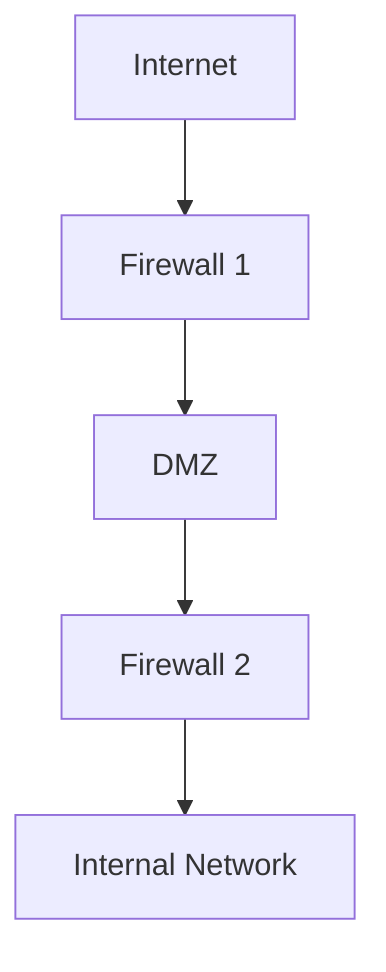
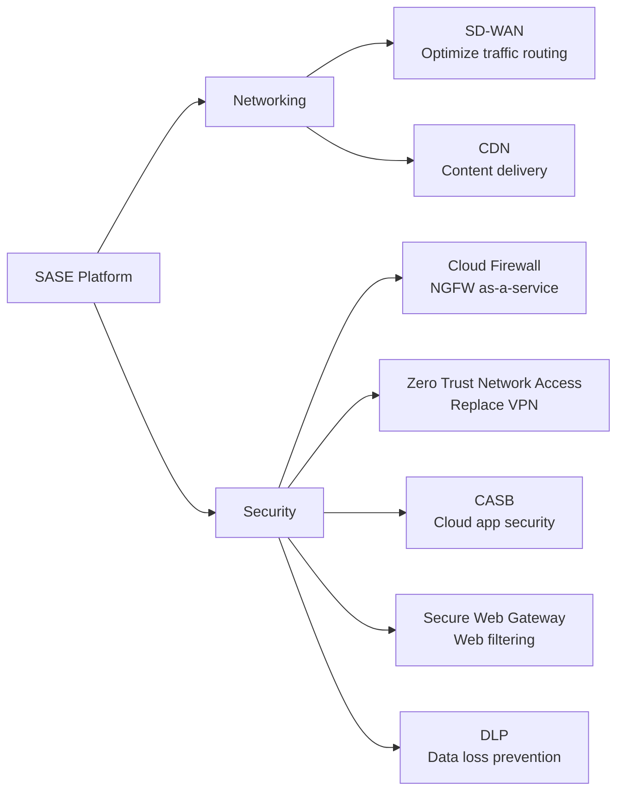

# Endpoint and Network Security

## Endpoint Security

Endpoints are the "IT Front Door", the **primary attack vector** in modern cybersecurity—they're where users interact with systems, where data lives, and where attackers gain their initial foothold.

**The Endpoint Threat Landscape:**

**Attack Statistics:**
- **70% of breaches start at the endpoint** (Ponemon Institute)
- **Ransomware attacks increased 105%** year-over-year (Sophos 2023)
- **Average cost of endpoint breach:** $4.45M (IBM Cost of Data Breach 2023)
- **Average time to detect endpoint compromise:** 207 days (Mandiant)

**Why Endpoints Are Vulnerable:**
1. **Distributed Attack Surface:** Thousands of devices, each a potential entry point
2. **User Behavior:** Phishing emails, malicious downloads, weak passwords
3. **BYOD:** Personal devices mix corporate and personal data
4. **Remote Work:** Devices outside the corporate network perimeter
5. **IoT Explosion:** Cameras, printers, smart devices—often unmanaged and unpatched
6. **Software Complexity:** Operating systems, applications, plugins—all potential vulnerabilities

**The Modern Endpoint Ecosystem:**



**Business Impact of Endpoint Compromise:**

| Attack Type | Business Impact | Example |
|-------------|----------------|--------|
| **Ransomware** | Operations halted, data encrypted | Colonial Pipeline: $4.4M ransom, $90M+ total cost |
| **Data Theft** | Customer data stolen, compliance fines | Equifax: 147M records, $700M settlement |
| **Espionage** | Intellectual property stolen | APT attacks on defense contractors |
| **Cryptomining** | Performance degradation, cloud cost spikes | Infected servers mining cryptocurrency |
| **Botnet Recruitment** | Device used for DDoS attacks | Mirai botnet (IoT devices) |

> [!IMPORTANT] Endpoints Are the Weakest Link
> **The Security Paradox:** Organizations invest millions in network security (firewalls, IDS/IPS) but often neglect endpoint security.
> 
> **The Reality:** If an attacker compromises a single laptop through phishing, they're **inside** the perimeter. Network security becomes irrelevant.
> 
> **The Shift:** Modern security focuses on **endpoint protection** as the first line of defense, not the last.

### Trusted Platform

Security relies on the endpoint being secure. For example, Multi-Factor Authentication (MFA) is useless if the biometric data comes from a "jailbroken" or compromised device.

### Hardware Scope

Includes servers (often overlooked), desktops, laptops, mobile devices, and the Internet of Things (IoT) such as cameras and appliances.

### The Challenge

- **Attack Surface** : Every device contributes to the attack surface; the more devices, the more entry points for an attacker
- **Blurred Lines** : The distinction between "business" and "personal" use is largely a fiction; home networks now connect to corporate networks
- **Complexity** : Managing a mix of Operating Systems (Windows, MacOS, Linux, Unix, Mainframe, Mobile, IoT) creates complexity, which is the "enemy of security"

> [!WARNING] Operating System Complexity
> **The Challenge:** Endpoint security is not just about managing hardware; it also requires managing a chaotic mix of Operating Systems, not just Windows.
> 
> **The Scope:** An architect must secure MacOS, Linux, Unix, Mobile OSs, and significantly, Mainframes.
> 
> **The Risk:** Each OS requires different tools and patches. This variety creates complexity—the more fractured the environment, the harder it is to apply a consistent security policy.
>
> "Complexity is the enemy of security."

### Management Strategies

#### Typical Practice: Siloed Management

**The Problem:**
- **Fragmented Tools:** Different administrators use different tools for different device types
  - Server admins: SCCM, Ansible
  - Desktop admins: SCCM, Group Policy
  - Mobile admins: Intune, AirWatch
  - IoT: Often **no management** (security blind spot)

**The Consequences:**
- **No Unified Visibility:** Can't see all devices in one place
- **Inconsistent Policies:** Different security standards per device type
- **Security Gaps:** IoT devices completely unmanaged (default passwords, unpatched)
- **Operational Inefficiency:** Multiple consoles, duplicate work
- **Slow Incident Response:** Can't quickly identify/isolate compromised devices

**Example Scenario:**
- Malware detected on a laptop
- **Question:** "Are any other devices infected?"
- **Siloed reality:** Must check 5 different consoles, no unified search
- **Result:** Delayed containment, malware spreads

#### Best Practice: Unified Endpoint Management (UEM)

**Purpose:** Manage **all endpoints**—regardless of type, OS, or location—from a **single console**.

**The UEM Value Proposition:**

**1. Unified Visibility:**
- Single dashboard showing **all devices**
- Real-time inventory (hardware, software, patch levels)
- Location tracking (on-premises, remote, cloud)

**2. Centralized Control:**
- Deploy policies to all devices simultaneously
- Enforce consistent security standards
- Automate compliance checks

**3. Operational Efficiency:**
- One tool to learn (vs. five)
- Streamlined workflows
- Reduced licensing costs (consolidate tools)

**UEM Capabilities:**




**Policy Enforcement Examples:**

**Policy 1: OS Version Enforcement ("N-1" Rule)**
```
Policy: Devices must run current (N) or previous (N-1) OS version

Example:
- Current Windows version: 11 (N)
- Allowed: Windows 11 or Windows 10 (N-1)
- Prohibited: Windows 8.1 or older (N-2)

Enforcement:
- UEM detects Windows 8.1 device
- Action: Quarantine (block access to sensitive data)
- Notification: "Your device is out of compliance. Upgrade to Windows 10 or 11."
```

**Why N-1?**
- **Security:** N-2 devices likely have unpatched vulnerabilities
- **Compatibility:** Some users delay upgrades due to application compatibility
- **Balance:** N-1 allows time for testing new OS version while maintaining security

> [!TIP] Policy Enforcement via Quarantine
> **The Mechanism:** UEM systems enforce policies through **network access control (NAC)**.
> 
> **How It Works:**
> 1. Device attempts to connect to network
> 2. UEM checks compliance (OS version, encryption, antivirus status)
> 3. **If compliant:** Full network access granted
> 4. **If non-compliant:** Quarantine VLAN (limited access—can only reach update servers)
> 
> **User Experience:**
> - User can browse to Windows Update or corporate app store
> - Cannot access email, file shares, or business applications
> - Once compliant, automatically granted full access

**Policy 2: Encryption Enforcement**
```
Policy: All laptop hard drives must be encrypted (BitLocker/FileVault)

Detection:
- UEM agent checks encryption status daily
- Reports non-encrypted devices to dashboard

Enforcement:
- If encryption disabled: Block access to corporate data
- Push policy to auto-enable encryption (if possible)
- Escalate to user's manager if not resolved in 48 hours
```

**Policy 3: Patch Management**
```
Policy: Critical security patches must be installed within 7 days

Automation:
- UEM detects missing patches
- Schedules automatic installation during maintenance window (e.g., 2 AM)
- If user postpones 3 times: Force installation (warn user first)

Reporting:
- Dashboard shows patch compliance rate (target: 95%+)
- Non-compliant devices flagged for remediation
```

**UEM Platforms:**
- Microsoft Intune
- VMware Workspace ONE
- Ivanti (formerly MobileIron)
- Jamf (Mac/iOS specialist)
- ManageEngine Endpoint Central

**UEM Implementation Challenges:**

| Challenge | Mitigation |
|-----------|------------|
| **Legacy devices don't support UEM agent** | Segment legacy devices to isolated VLAN, plan replacement |
| **IoT devices can't run agents** | Use network-based detection (passive monitoring) |
| **User resistance ("Big Brother" concern)** | Transparent communication, focus on security benefits |
| **Initial inventory overwhelming** | Prioritize high-risk devices (laptops, servers), expand gradually |
| **Cost of deployment** | Calculate ROI (reduced breaches, operational efficiency, compliance) |

> [!WARNING] The "Shadow IT" Problem
> **The Reality:** Even with UEM, users will connect **unauthorized devices** to the network.
> 
> **Examples:**
> - Personal laptop for "just checking email"
> - Smart TV in conference room
> - Fitness tracker syncing via corporate Wi-Fi
> 
> **Detection:**
> - Network Access Control (NAC) detects unknown MAC addresses
> - UEM flags devices without agent
> 
> **Response:**
> - Quarantine device (guest VLAN—internet only, no corporate access)
> - Alert IT security team
> - Require registration and compliance check before corporate access

### Key Controls: Policy Enforcement

**The Fundamental Principle:** "You cannot secure what you don't know about."

Endpoint security relies on **discovering devices**, **enforcing policies**, and **responding to threats**.

#### Discovery and Inventory

**Purpose:** Maintain a complete, real-time inventory of all endpoints to ensure visibility and control.

**What to Discover:** Hardware (make, model, location), Operating System (type, version, patches), Software (installed applications), Network info (IP, MAC address), User assignment, and Compliance status.

**Discovery Methods:**
- **Agent-based:** UEM agent installed on device (most accurate)
- **Network scanning:** Probe network for agentless devices (IoT, printers)
- **Passive monitoring:** Analyze network traffic to detect devices

#### Software Patch Management

**Purpose:** Keep systems updated to prevent exploitation of known vulnerabilities.

**Critical Statistics:**
- **60% of breaches** exploit known vulnerabilities with available patches (Ponemon)
- **WannaCry ransomware:** Exploited vulnerability patched 2 months before attack

**Patch Prioritization:**
- **Critical (CVSS 9.0-10.0):** Deploy within 24-48 hours
- **High (CVSS 7.0-8.9):** Deploy within 7 days  
- **Medium (CVSS 4.0-6.9):** Deploy within 30 days
- **Low (CVSS 0-3.9):** Next maintenance cycle

#### Encryption (Data at Rest)

**Purpose:** Protect data on devices if lost, stolen, or compromised.

**Technologies:** BitLocker (Windows), FileVault (macOS), LUKS (Linux)

**Key Management:** Enterprise UEM platforms escrow recovery keys (if user forgets password, IT can recover)

> [!IMPORTANT] Encryption Limitation
> Encryption protects data **only when device is powered off**. While running, data is decrypted and accessible to malware. Combine encryption with EDR and application controls.

#### Remote Wipe

**Purpose:** Delete data from lost, stolen, or compromised devices remotely.

**Wipe Types:**
- **Selective Wipe:** Corporate data/apps only (BYOD devices)
- **Full Wipe:** Entire device factory reset (corporate-owned)
- **Encryption Key Wipe:** Delete decryption key (faster, data becomes unreadable)

#### Endpoint Detection and Response (EDR)

**Purpose:** Detect, investigate, and respond to advanced threats that bypass traditional antivirus.

**Why Antivirus Alone Is Insufficient:**
- Signature-based AV detects only **known malware**
- Fileless attacks run in memory (no file to scan)
- Living-off-the-land attacks use legitimate tools (PowerShell) maliciously

**EDR Capabilities:**
- **Behavioral Analysis:** Detect anomalies (ransomware file encryption patterns, credential dumping)
- **Automated Response:** Isolate device, kill malicious process, remediate
- **Forensic Timeline:** Full visibility into attack chain (what happened, when, how)

**EDR Products:** CrowdStrike Falcon, Microsoft Defender for Endpoint, SentinelOne, Carbon Black

#### Additional Controls

- **Password/Lock Policies:** Enforce complexity, auto-lock timeout, failed attempt limits
- **Secure Disposal:** Data wiping (NIST 800-88), degaussing, or physical destruction when devices are retired
- **Location Tracking:** Optional GPS tracking for theft recovery (requires user consent for BYOD)

### BYOD (Bring Your Own Device)

**The Reality:** Users **will** bring their own devices (and cloud services). Organizations either have a **well-defined program** or a **poorly-defined program**—claiming "we don't allow it" usually results in unsanctioned Shadow IT.

**The BYOD Challenge:**

| Aspect | Corporate-Owned Devices | BYOD |
|--------|------------------------|------|
| **Control** | Full (company owns hardware) | Limited (user owns hardware) |
| **Privacy** | Minimal expectation | High expectation (personal data) |
| **Cost** | Company pays hardware + support | User pays hardware, company may subsidize |
| **Security** | Enforce all policies | Balance security with user rights |
| **Support** | IT supports all issues | IT supports only corporate apps/data |

**The BYOD Opportunity:**
- **Cost Savings:** Users pay for devices ($500-$1,500 per device saved)
- **User Satisfaction:** Use preferred device (iPhone vs. Android)
- **Productivity:** One device for work and personal (no carrying two phones)

**The BYOD Risk:**
- **Data Leakage:** Corporate data on personal device (lost/stolen, insecure)
- **Malware:** Personal use exposes device to threats (then connects to corporate network)
- **Compliance:** BYOD complicates audit (corporate data mixed with personal)

**Strategy: Don't Say \"No,\" Say \"How\"**

> [!TIP] Make Compliance Easy
> "If you make doing the right thing easier than doing the wrong thing, users will comply."
> 
> **Example:**
> - **Wrong:** Block all personal devices, force users to carry two phones
> - **Right:** Allow personal devices, but containerize corporate data with simple enrollment
> 
> **Result:** Users voluntarily enroll because it's more convenient than carrying two devices.

**Key BYOD Elements:**

#### 1. User Consent and Transparency

**Requirement:** Users must **explicitly agree** to BYOD terms before enrollment.

**What Users Must Understand:**
- What data company can access (corporate emails/files only, not personal photos)
- What company can monitor (corporate app usage, not personal browsing)
- What company can wipe (corporate container, not entire device—unless full wipe is policy)
- Location tracking policy (if enabled)

**Example Consent Flow:**
```
1. User requests BYOD enrollment
2. System presents BYOD agreement
3. User reviews terms ("Company can wipe corporate data, monitor corporate app usage")
4. User accepts or declines
5. If accepted: Device enrolled, corporate apps/data accessible
```

#### 2. Containerization (Selective Wipe)

**Purpose:** Separate corporate data from personal data on same device.

**How Containerization Works:**
- **Corporate Container:** Encrypted partition containing work emails, files, apps
- **Personal Space:** User's personal apps, photos, messages (company cannot access)

**Benefits:**
- **Privacy:** User's personal data protected from IT
- **Security:** Corporate data isolated, encrypted
- **Selective Wipe:** When employee leaves, wipe only corporate container (personal data preserved)

**Example Platforms:**
- **iOS/Android:** Managed App Configuration (work apps in separate container)
- **Windows:** Windows Information Protection (WIP)

**Example Scenario:**
```
Employee termination:
1. HR notifies IT (employee terminated)
2. IT admin initiates selective wipe via UEM
3. Corporate container deleted (work emails, files, apps removed)
4. Personal data unaffected (photos, personal emails, apps remain)
5. User keeps device, loses only work data
```

#### 3. Application Control

**Purpose:** Prevent risky apps from accessing corporate data.

**Controls:**
- **Blacklist:** Block dangerous apps (known malware, insecure apps)
- **Whitelist:** Allow only approved apps to access corporate data
- **Required Apps:** Mandate security apps (MDM agent, antivirus) before granting access

**Example Policy:**
```
BYOD Application Rules:
1. Corporate email accessible only via approved email client (Outlook, Gmail with MAM)
2. Blacklisted apps: Apps from unknown sources, jailbreak detection triggers lockout
3. Required apps: MDM agent, company VPN client
4. If jailbroken/rooted device detected: Block all corporate access (device compromised)
```

#### 4. Hardware Standards

**Purpose:** Limit support complexity by standardizing approved devices.

**Why Standards Matter:**
- **Support Burden:** IT can't support every device model/OS version
- **Security Patches:** Older devices don't receive security updates

**Example BYOD Hardware Policy:**
```
Approved Devices:
- iOS: iPhone 12 or newer, running iOS 16+
- Android: Samsung Galaxy S21 or newer, running Android 12+
- Tablets: iPad (5th gen or newer), Samsung Tab S7+

Prohibited:
- Devices older than 3 years (end of security support)
- Jailbroken or rooted devices
- Devices from unsupported manufacturers
```

#### 5. Preventing Shadow IT

**The Problem:** Users adopt unauthorized cloud services (personal Dropbox, Gmail for work).

**Why Shadow IT Happens:**
- Corporate tools are slow, cumbersome
- Users find workarounds (email files to personal Gmail to access from home)

**The Risk:**
- Corporate data stored on unsecured personal cloud (data leakage, compliance violations)
- No encryption, no access controls, no audit trail

**The Solution:**
- **Provide approved alternatives:** Corporate OneDrive/Google Drive (easier than blocking personal cloud)
- **CASB (Cloud Access Security Broker):** Monitor cloud usage, block risky services
- **DLP (Data Loss Prevention):** Prevent corporate data from being uploaded to unauthorized services

**Example:**
```
Shadow IT Prevention:
1. Provide OneDrive for Business (1TB storage, mobile access)
2. Block personal Dropbox at firewall (or via CASB)
3. User attempts to upload file to Dropbox → blocked
4. Notification: "Use OneDrive for Business instead (already set up for you)"
5. Result: User adopts approved service (easier than fighting it)
```

> [!WARNING] The BYOD Privacy Balance
> **The Challenge:** Users demand privacy; companies demand security.
> 
> **The Solution:** Transparency + Containerization
> - Be clear about what you monitor (corporate data only)
> - Use containerization to enforce boundaries
> - Don't overreach (tracking personal browsing alienates users)
> 
> **The Trade-off:** Perfect security would mean full device control. Perfect privacy would mean zero corporate oversight. BYOD is the compromise.

**Purpose:** Segment and protect network traffic to contain threats and control data flow.

**Why Network Security Matters:**

Traditional security assumed: **"Build a strong perimeter (firewall), trust everything inside."**

Modern reality:
- **Cloud migration:** Data and apps live outside your network (AWS, Azure, SaaS)
- **Remote work:** Employees bypass corporate network (VPN from home/coffee shops)
- **Insider threats:** 34% of breaches involve internal actors (Verizon DBIR)
- **Lateral movement:** Once attackers breach perimeter, they move freely inside (if no segmentation)

**The Shift:** From **perimeter security** to **micro-segmentation** (Zero Trust)—assume breach, verify every connection.

### Firewalls

Like a physical firewall in a building, it limits the spread of damage (e.g., fire/attack) from one unit to another.

#### Packet Filtering

The "Envelope" method : Looks only at the header: Source, Destination, and Port. Does not inspect the contents (payload).

> [!TIP] Packet Filtering Criteria
> When configuring basic packet filtering, the firewall examines three header data points:
> 1. **Source Address** : Where it is coming from
> 2. **Destination Address** : Where it is going
> 3. **Port** : The service being requested (e.g., Port 80 for Web)

#### Stateful Inspection

The "Open Envelope" method : Looks at the payload and understands the context of the connection (e.g., "Did we request this packet?").

#### Proxy

Acts as a "Man-in-the-Middle." Breaks the connection into two separate sessions: User-to-Proxy and Proxy-to-Server. Allows for deep inspection of traffic and enforcement of privacy policies.

> [!TIP] Proxy for Privacy
> **Privacy Use Case:** While proxies are used for security inspection (Man-in-the-Middle), they are also used for **privacy**.
>  
> By forcing traffic through a proxy, the external world sees only the Proxy's IP address, masking the identity and IP of the internal user.

#### Network Address Translation (NAT)

- **Function** : Translates non-routable internal addresses (e.g., 10.x.x.x or 192.168.x.x) into a routable external IP address
- **Security Benefit** : Hides the internal network structure. External attackers cannot directly address internal workstations because their IP addresses do not exist on the public Internet

> [!TIP] NAT and Non-Routable IP Ranges
> **The Concept:** Network Address Translation (NAT) is necessary because specific IP address ranges are "non-routable" on the public Internet.
> 
> **Specific Ranges:** The most common non-routable internal addresses begin with 10.x.x.x or 192.168.x.x (common in home routers).
> 
> **The Mechanism:** If a device tries to send a packet with one of these internal source addresses directly to the Internet, the first router it hits on the public Internet will recognize it as non-routable and block/drop it immediately. This physical constraint forces the use of a NAT box to translate internal IPs to a valid public IP, inherently hiding the internal structure from external attackers.

### Segmentation Architectures



#### Bastion Host

Placing a server on the internet with a single firewall. Represents a single point of failure. Not recommended.

#### Tri-homed Firewall

A single firewall with three network interface cards (NICs) creating three zones: Internet (Red), DMZ (Yellow), and Intranet (Green). While cheap, it remains a single point of failure.

#### Basic DMZ (Demilitarized Zone)

Uses two firewalls to create a buffer zone. Defense in Depth: If the outer firewall fails, the inner firewall still protects the internal data.

#### Multi-tiered DMZ

"Defense in Depth on steroids." Uses three or more firewalls to separate tiers (e.g., Web Server → App Server → Database). Provides the highest granularity and security but comes with high cost and complexity.

### Virtual Private Networks (VPNs)

- **Goal** : Creating a secure, encrypted "pipe" or channel over an untrusted network (the Internet)
- **The Trade-off** : While VPNs ensure Confidentiality, they limit Inspection. Because the traffic is encrypted, security tools cannot easily see if malware is being sent through the pipe

#### VPN Types by OSI Layer

- **Application Layer** : Highly granular. Examples: SSH (Secure Shell) and SFTP
- **Transport Layer** : TLS/SSL. Common in web browsers (the "lock" icon). Encrypts the session between a browser and a server
- **Network Layer** : IPsec. Encrypts all traffic between two networks or endpoints. A "catch-all" but lacks granularity

> [!TIP] OSI Layer Inheritance
> **The Rule:** Security implemented at a lower layer of the OSI stack is automatically inherited by all upper layers.
> 
> **Application Layer (e.g., SSH):** Security here is highly granular and specific to that application, but it does not protect other applications or the layers below it.
> 
> **Network Layer (e.g., IPsec):** Because this sits lower in the stack (Layer 3), it encrypts everything flowing between two endpoints. Every application (email, web, file transfer) running above it automatically benefits from that encryption without needing separate configuration.

**Trend:** Moving away from broad network-based VPNs toward application-specific VPNs for better control.

### Modern Network Architecture: SASE

**Secure Access Service Edge (SASE)**

$$\text{SASE} = \text{Network Security} + \text{WAN} + \text{Identity}$$

**Purpose:** Converge networking and security functions, deliver from the **cloud** (not on-premises appliances).

**Why SASE Matters:**

**Traditional Architecture (Problem):**
- **On-premises appliances:** Firewalls, VPN concentrators, proxies (expensive hardware, limited scale)
- **Backhaul traffic:** Remote users connect to corporate data center via VPN, then to cloud apps (inefficient—why route cloud-to-cloud traffic through data center?)
- **Separate tools:** Firewall team, VPN team, cloud security team (silos, inconsistent policies)

**SASE Architecture (Solution):**
- **Cloud-delivered:** Security functions run in cloud (scale elastically, no hardware to maintain)
- **Direct-to-cloud:** Users connect directly to cloud apps (Office 365, Salesforce) via nearest SASE PoP (point of presence)—no backhaul
- **Converged platform:** Firewall + VPN + CASB + DLP + Zero Trust in single service

**SASE Components:**



**SASE Benefits:**

| Benefit | Description | Example |
|---------|-------------|---------|
| **Zero Trust** | Verify every connection (no implicit trust) | Remote user accessing SharePoint: Authenticate + check device compliance + verify location → grant session |
| **Performance** | Direct-to-cloud (no backhaul) | User in London accesses Office 365 → routes directly to Microsoft EU datacenter (not via NYC corporate HQ) |
| **Scalability** | Cloud-native (auto-scale) | Black Friday traffic spike → SASE auto-scales (no need to pre-purchase hardware) |
| **Unified Policy** | One policy across all locations | "Marketing can access social media" applies to office, remote, and branch users consistently |
| **Cost Reduction** | No hardware refreshes | Replace $500K firewall every 5 years with $100K/year SASE subscription |

**SASE vs. Traditional:**

**Scenario: Remote Employee Accessing SaaS App**

**Traditional (Inefficient):**
```
User (home) → VPN to corporate data center → Firewall/proxy inspection → Internet → SaaS app
(High latency, backhauling traffic unnecessarily)
```

**SASE (Optimized):**
```
User (home) → Nearest SASE PoP (cloud) → Security inspection → Direct to SaaS app
(Low latency, traffic never touches corporate network)
```

**SASE Vendors:** Palo Alto Prisma Access, Zscaler, Netskope, Cisco Umbrella, Cloudflare for Teams

> [!TIP] SASE Migration Strategy
> **Phased Approach:**
> 1. **Pilot:** Remote users first (easiest—no on-prem dependencies)
> 2. **Branch offices:** Replace MPLS with SD-WAN + SASE
> 3. **HQ:** Last (most complex—legacy apps, on-prem dependencies)
> 
> **Don't:** Try to migrate everything overnight ("big bang" fails)
> **Do:** Prove value with pilot, learn lessons, expand gradually

## Summary: Endpoint and Network Security

**Endpoint Security Key Takeaways:**
1. **Endpoints are the primary attack vector** (70% of breaches)—prioritize endpoint protection
2. **UEM provides visibility and control** across all device types (servers, desktops, mobile, IoT)
3. **EDR is essential** for detecting advanced threats that bypass antivirus
4. **BYOD requires balance** between security and privacy (containerization is key)
5. **Policy enforcement** via quarantine ensures non-compliant devices can't access sensitive data

**Network Security Key Takeaways:**
1. **Defense in Depth** via segmentation (DMZ, micro-segmentation) contains breaches
2. **NGFWs** provide application-aware, identity-based policies (not just port-based)
3. **VPNs** ensure confidentiality but limit inspection (trend toward app-specific access)
4. **SASE** converges networking and security, delivers from cloud (Zero Trust, direct-to-cloud)
5. **Zero Trust mindset:** Assume breach, verify every connection (perimeter is obsolete)

**Implementation Priorities:**

| Priority | Action | Impact |
|----------|--------|--------|
| **1. Deploy EDR** | Install on all endpoints (especially high-value targets) | Detect and stop advanced threats |
| **2. Implement UEM** | Centralize endpoint management, enforce compliance | Visibility + control across all devices |
| **3. Segment Network** | Deploy DMZ, micro-segmentation | Contain breaches, limit lateral movement |
| **4. Upgrade to NGFW** | Replace packet-filtering firewalls | Application/identity-aware policies |
| **5. Adopt SASE** | Migrate remote users to cloud-delivered security | Zero Trust, direct-to-cloud, scalability |

**Remember:** Endpoint and network security are **complementary layers**. Strong perimeter (firewall) without endpoint protection fails when phishing bypasses the firewall. Strong endpoint protection without segmentation allows ransomware to spread laterally. **Both are required.**

