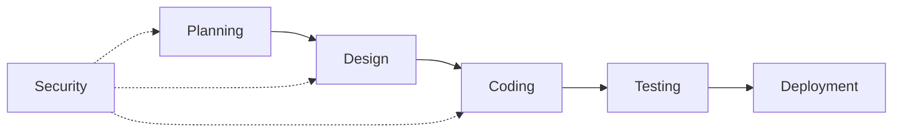

# Application and Data Security

## Application Security

Securing the Code : Integrating security throughout the Software Development Lifecycle.

### The "Shift Left" Philosophy

Most bugs and security vulnerabilities are introduced during the coding phase. However, in traditional models, they are often not found until the testing or release phases.

The "shift left" philosophy fundamentally changes this by moving security tasks to the earliest possible stages of the SDLC. Instead of waiting for the testing or release phases to look for vulnerabilities, "shift left" dictates that security must be introduced during the design and coding phases.

The goal is to design the system to be resilient to attack from the very beginning "secure by design" rather than trying to patch it later.

- **The Reality of Bugs:** Essentially all software of real complexity has bugs, and a percentage of those will always be security vulnerabilities.

> [!WARNING] The Bug Injection vs. Discovery Gap
> There is a fundamental disconnect in the SDLC regarding when bugs are created versus when they are found.
> 
> - **The Injection Phase** : The vast majority of vulnerabilities are introduced ("injected") during the Coding phase
>
> - **The Discovery Phase** : Despite being created early, these bugs are typically not found ("discovered") until the Testing or Release phases
>
> - **The Consequence** : This lag time between injection and discovery drives exponential costs. If a bug is fixed during coding (baseline 1x cost), waiting until the product is in the field can cost up to 640x more

### SDLC Evolution

- **Traditional (Waterfall)** : Linear and siloed. Developers write code and throw it "over the wall" to Operations/Security at the end. Security is a "bolt-on"
- **DevOps** : A cyclical loop of continuous improvement integrating Development and Operations for agility
- **DevSecOps** : "Bathing" the entire process in security. Breaks down silos to integrate security at every phase (Design, Code, Test, Deploy) rather than just at the end. Aiming to break the traditional "wall" between Dev, Sec and Ops

### Secure Coding Practices

Developers must proactively use prescriptive checklists to handle inputs, authentication, and error handling correctly during the coding phase itself, rather than relying on testing to catch mistakes later.

- **Prescriptive Rules** : Developers need a checklist of "do's and don'ts" for error handling routines and cryptography
- **Input Validation** : Critical practice to prevent Buffer Overflows, where an input larger than allocated memory overwrites adjacent memory
- **Standard Architectures** : Defining in advance what a secure system looks like (e.g., IBM Application Security Architecture Reference)
- **OWASP (Open Web Application Security Project)** : The industry standard for secure coding practices
- **OWASP Top 10** : A list of the most common vulnerabilities that changes very little over time

### Supply Chain Security

#### Trusted Libraries

Developers rarely write everything from scratch; they use open-source or proprietary libraries. These must be viewed with skepticism.

**Example:** Log4j was a trusted library used globally that contained a critical vulnerability, exposing millions of systems.

#### SBOM (Software Bill of Materials)

A detailed inventory ("ingredients list") of all components, libraries, and versions used in your software.

**Benefit:** When a vulnerability like Log4j is discovered, an SBOM allows you to immediately identify exactly where that code exists in your environment to remediate it quickly.

### Tools & Testing

#### SAST (Static Application Security Testing)

"White Box" testing : The tool has access to the source code. It scans the code during development to find bugs early (Shift Left).

#### DAST (Dynamic Application Security Testing)

"Black Box" testing : The tool does not see the code. It attacks the executable/running application to find external vulnerabilities.

#### Strategy

It is not "either/or"; you must use both as they find different types of defects.

### The Impact of AI on Code Security

#### The Capability

Chatbots and Large Language Models (LLMs) can generate code snippets or debug code very quickly.

#### The Risks

- **Injection of Vulnerabilities** : AI might write buggy code, or if hacked, intentionally inject backdoors or malware
- **Lack of Oversight** : Unlike open-source libraries reviewed by thousands of eyes, AI code comes directly from a "black box" source
- **IP Leakage** : Using public chatbots to debug proprietary code exposes Intellectual Property (trade secrets) to the public internet

> [!CAUTION] Chatbot IP Leakage Risk
> **The Scenario:** Developers often use AI chatbots to help debug code by pasting broken code into chat prompts.
> 
> **The Risk:** When proprietary code is pasted into a public chatbot, it is effectively sent to the public Internet and ingested into the model's training data.
> 
> **Real-World Example:** A major company experienced a significant IP breach when developers used a chatbot for debugging, accidentally releasing proprietary source code and trade secrets into the public model. The company subsequently banned or restricted the practice to protect its intellectual property.

## Data Security

The "Crown Jewels" : Protecting sensitive data through encryption, governance, and compliance.

### The Business Case

- **Average cost of a data breach** : $4.35 million worldwide (over $9 million in the US)
- **Frequency** : 83% of organizations have been hit by more than one data breach

### Governance & Discovery

#### Data Security Policy

You cannot expect users to protect data if you haven't defined the rules. This requires a clear Data Security Policy.

#### Classification

Labeling data based on sensitivity to determine necessary protections. Must distinguish between "Keys to the Kingdom" (requires max protection) and the "Lunchroom Menu" (requires no protection).

#### Discovery

You must locate where the data lives to protect it:

- **Structured Data** : Found in databases (e.g., customer records)
- **Unstructured Data** : Found in files, emails, and spreadsheets; often overlooked but contains sensitive content "flying around" the network

> [!TIP] The Resilience Plan (Governance)
> - **Planning Ahead:** Recovery doesn't start after the breach; it starts during Governance. Part of the Data Security Policy is building a **Resilience Plan** that pre-defines *how* the organization will recover data (backups, keys) before an incident occurs.

### Protection Technologies

#### Encryption

Scrambling data so only authorized users with a key can read it. Must protect data:

- **At Rest** : In databases and storage
- **In Motion** : During transit across networks and internet

#### Key Management

"If you lose the keys, you lose the data"

- **Lifecycle** : Keys must be generated randomly, rotated regularly, and retired; it is not "encrypt and forget"
- **Quantum-Safe Crypto** : Organizations must prepare now for quantum computers, which will eventually be able to break current cryptographic standards

> [!WARNING] Key Generation Predictability
> When managing encryption keys, the most critical factor is randomness. If the key generation method is predictable (e.g., based on time of day), attackers can reverse-engineer the keys, rendering the encryption useless.

#### Access Control

Strong encryption is useless if a user sets their password to "password." Data security relies on IAM (Authentication/Authorization) to ensure only the right people get the keys.

#### Resilience (Backups)

The best defense against Ransomware is having a clean copy of your data so you can restore it rather than paying the ransom.

#### Data Loss Prevention (DLP)

Technology that monitors data in real-time as it flows across the network to detect and block sensitive information from leaving the organization.

### Compliance

#### Regulations

Adhering to laws like GDPR (Europe) or HIPAA (US Healthcare).

- **Scope** : If you hold data on citizens of a region (e.g., the EU), you are subject to their laws even if you don't operate there physically
- **Fines** : Non-compliance can result in substantial financial penalties

#### Retention Policy

Storing data forever increases liability. Keep data only as long as legally required, then delete it. The longer you hold it, the longer you hold the burden of potential breach liability.

### Detection and Response

#### Monitoring

Using User Behavior Analytics (UBA) to spot anomalies. For example, if a user normally downloads 1,000 files but suddenly downloads 1 million, or accesses data outside their peer group's norms, it triggers an alert.

#### Response

- **Dynamic Playbooks** : Automated guides that tell analysts exactly what steps to follow based on the specific type of incident
- **Orchestration** : Acting like a conductor to direct the recovery process

> [!TIP] Top 5 Strategies to Reduce Breach Costs
> According to the Cost of a Data Breach survey, these five factors most effectively reduce the financial impact:
>
> 1. **Artificial Intelligence (AI)** : For faster detection
> 2. **DevSecOps** : Integrating security early in the software lifecycle
> 3. **Incident Response plan** : Having a tested plan to react quickly
> 4. **Cryptography** : Strong encryption protects data even if stolen
> 5. **Employee Training** : Because humans are almost always the "weakest link"
