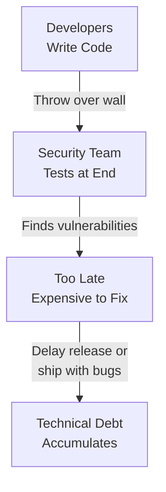
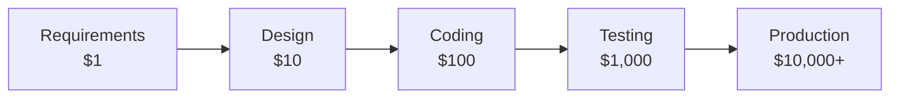
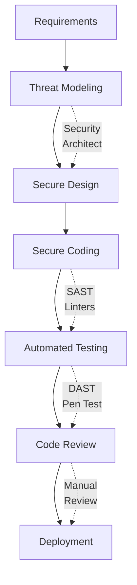

# Application and Data Security

## Application Security

**Purpose:** Integrate security throughout the Software Development Lifecycle (SDLC) to prevent vulnerabilities from reaching production.

**Why Application Security Matters:**

**The Attack Surface:**
- **Web applications are the #1 attack vector** (43% of breaches, Verizon DBIR)
- **API vulnerabilities** growing rapidly (APIs now outnumber traditional web apps)
- **Third-party code** comprises 80-90% of modern applications (supply chain risk)

**Business Impact:**
- **Average cost to fix vulnerabilities:**
  - During coding: $80
  - During testing: $800 (10x)
  - In production: $8,000-$50,000 (100-640x)
- **Breach cost:** $4.35M average (IBM 2023)
- **Reputation damage:** Customer trust lost, stock price impact

**The Traditional Problem:**

**The Shift-Left Solution:**

"Shift left" means moving security **earlier** in the SDLC (left on the timeline)—from testing/deployment to design/coding.

### The "Shift Left" Philosophy

**The Core Principle:** Find and fix security vulnerabilities **as early as possible** in the development process.

**Why Shift Left:**

**1. The Cost Escalation (Rule of 10):**

The cost to fix a vulnerability increases **exponentially** as it progresses through the SDLC:

**Example:**
- **During design:** Architect notices SQL injection risk, designs parameterized queries → **Cost: $1** (30 minutes of architect time)
- **During coding:** Developer writes vulnerable code → **Cost: $100** (rewrite code, update unit tests)
- **During testing:** QA finds SQLi vulnerability → **Cost: $1,000** (developer context switch, fix, regression testing, QA re-test)
- **In production:** Attacker exploits SQLi, steals customer database → **Cost: $10,000-$1M+** (breach response, forensics, customer notification, fines, lawsuits, reputation damage)

**2. The Bug Injection vs. Discovery Gap:**

> [!WARNING] When Bugs Are Created vs. When They're Found
> **The Disconnect:**
> - **Injection Phase:** 85% of vulnerabilities are introduced during **coding** (NIST)
> - **Discovery Phase:** 75% of vulnerabilities are found during **testing or production** (NIST)
> 
> **The Problem:** Weeks or months pass between injection and discovery—code is now deeply integrated, context is lost, fix is expensive.
> 
> **Shift Left Solution:** Automated tools (SAST, linters) catch bugs **immediately** during coding (within seconds/minutes).

**3. Faster Time to Market:**
- **Traditional:** Security review at end delays release ("We found 50 vulnerabilities, fix them before launch")
- **Shift Left:** Security built-in from start, no last-minute scramble

**4. Developer Ownership:**
- **Traditional:** Developers view security as "someone else's job" (security team's problem)
- **Shift Left:** Developers own security of their code (security is built into coding practices)

**How to Shift Left:**

**Shift Left Practices:**

| Phase | Security Activity | Tools/Techniques |
|-------|------------------|------------------|
| **Requirements** | Define security requirements (authentication, encryption, access control) | User stories: "As a user, I want MFA to protect my account" |
| **Design** | Threat modeling (STRIDE, attack trees) | Identify threats before code is written |
| **Coding** | Secure coding practices, SAST scans | OWASP guidelines, SonarQube, Checkmarx |
| **Testing** | DAST, penetration testing | Burp Suite, OWASP ZAP, manual pen tests |
| **Deployment** | Security hardening, configuration reviews | CIS Benchmarks, infrastructure-as-code security |
| **Operations** | Continuous monitoring, vulnerability scanning | SIEM, vulnerability management |

**The Reality of Bugs:**

> [!IMPORTANT] All Complex Software Has Bugs
> "Essentially all software of real complexity has bugs, and a percentage of those will always be security vulnerabilities." — Bruce Schneier
> 
> **Implication:** Perfect security is impossible. The goal is to:
> 1. **Reduce** the number of vulnerabilities (secure coding, SAST)
> 2. **Find** vulnerabilities early (shift left, automated testing)
> 3. **Fix** vulnerabilities quickly (streamlined patch process)
> 4. **Detect** exploitation attempts (WAF, SIEM)

### SDLC Evolution

- **Traditional (Waterfall)** : Linear and siloed. Developers write code and throw it "over the wall" to Operations/Security at the end. Security is a "bolt-on"
- **DevOps** : A cyclical loop of continuous improvement integrating Development and Operations for agility
- **DevSecOps** : "Bathing" the entire process in security. Breaks down silos to integrate security at every phase (Design, Code, Test, Deploy) rather than just at the end. Aiming to break the traditional "wall" between Dev, Sec and Ops

### Secure Coding Practices

Developers must proactively use prescriptive checklists to handle inputs, authentication, and error handling correctly during the coding phase itself, rather than relying on testing to catch mistakes later.

- **Prescriptive Rules** : Developers need a checklist of "do's and don'ts" for error handling routines and cryptography
- **Input Validation** : Critical practice to prevent Buffer Overflows, where an input larger than allocated memory overwrites adjacent memory
- **Standard Architectures** : Defining in advance what a secure system looks like (e.g., IBM Application Security Architecture Reference)
- **OWASP (Open Web Application Security Project)** : The industry standard for secure coding practices
- **OWASP Top 10** : A list of the most common vulnerabilities that changes very little over time

### Supply Chain Security

#### Trusted Libraries

Developers rarely write everything from scratch; they use open-source or proprietary libraries. These must be viewed with skepticism.

**Example:** Log4j was a trusted library used globally that contained a critical vulnerability, exposing millions of systems.

#### SBOM (Software Bill of Materials)

A detailed inventory ("ingredients list") of all components, libraries, and versions used in your software.

**Benefit:** When a vulnerability like Log4j is discovered, an SBOM allows you to immediately identify exactly where that code exists in your environment to remediate it quickly.

### Tools & Testing

#### SAST (Static Application Security Testing)

"White Box" testing : The tool has access to the source code. It scans the code during development to find bugs early (Shift Left).

#### DAST (Dynamic Application Security Testing)

"Black Box" testing : The tool does not see the code. It attacks the executable/running application to find external vulnerabilities.

#### Strategy

It is not "either/or"; you must use both as they find different types of defects.

### The Impact of AI on Code Security

#### The Capability

Chatbots and Large Language Models (LLMs) can generate code snippets or debug code very quickly.

#### The Risks

- **Injection of Vulnerabilities** : AI might write buggy code, or if hacked, intentionally inject backdoors or malware
- **Lack of Oversight** : Unlike open-source libraries reviewed by thousands of eyes, AI code comes directly from a "black box" source
- **IP Leakage** : Using public chatbots to debug proprietary code exposes Intellectual Property (trade secrets) to the public internet

> [!CAUTION] Chatbot IP Leakage Risk
> **The Scenario:** Developers often use AI chatbots to help debug code by pasting broken code into chat prompts.
> 
> **The Risk:** When proprietary code is pasted into a public chatbot, it is effectively sent to the public Internet and ingested into the model's training data.
> 
> **Real-World Example:** A major company experienced a significant IP breach when developers used a chatbot for debugging, accidentally releasing proprietary source code and trade secrets into the public model. The company subsequently banned or restricted the practice to protect its intellectual property.

## Data Security

The "Crown Jewels" : Protecting sensitive data through encryption, governance, and compliance.

### The Business Case

- **Average cost of a data breach** : $4.35 million worldwide (over $9 million in the US)
- **Frequency** : 83% of organizations have been hit by more than one data breach

### Governance & Discovery

#### Data Security Policy

You cannot expect users to protect data if you haven't defined the rules. This requires a clear Data Security Policy.

#### Classification

Labeling data based on sensitivity to determine necessary protections. Must distinguish between "Keys to the Kingdom" (requires max protection) and the "Lunchroom Menu" (requires no protection).

#### Discovery

You must locate where the data lives to protect it:

- **Structured Data** : Found in databases (e.g., customer records)
- **Unstructured Data** : Found in files, emails, and spreadsheets; often overlooked but contains sensitive content "flying around" the network

> [!TIP] The Resilience Plan (Governance)
> - **Planning Ahead:** Recovery doesn't start after the breach; it starts during Governance. Part of the Data Security Policy is building a **Resilience Plan** that pre-defines *how* the organization will recover data (backups, keys) before an incident occurs.

### Protection Technologies

#### Encryption

Scrambling data so only authorized users with a key can read it. Must protect data:

- **At Rest** : In databases and storage
- **In Motion** : During transit across networks and internet

#### Key Management

"If you lose the keys, you lose the data"

- **Lifecycle** : Keys must be generated randomly, rotated regularly, and retired; it is not "encrypt and forget"
- **Quantum-Safe Crypto** : Organizations must prepare now for quantum computers, which will eventually be able to break current cryptographic standards

> [!WARNING] Key Generation Predictability
> When managing encryption keys, the most critical factor is randomness. If the key generation method is predictable (e.g., based on time of day), attackers can reverse-engineer the keys, rendering the encryption useless.

#### Access Control

Strong encryption is useless if a user sets their password to "password." Data security relies on IAM (Authentication/Authorization) to ensure only the right people get the keys.

#### Resilience (Backups)

The best defense against Ransomware is having a clean copy of your data so you can restore it rather than paying the ransom.

#### Data Loss Prevention (DLP)

Technology that monitors data in real-time as it flows across the network to detect and block sensitive information from leaving the organization.

### Compliance

#### Regulations

Adhering to laws like GDPR (Europe) or HIPAA (US Healthcare).

- **Scope** : If you hold data on citizens of a region (e.g., the EU), you are subject to their laws even if you don't operate there physically
- **Fines** : Non-compliance can result in substantial financial penalties

#### Retention Policy

Storing data forever increases liability. Keep data only as long as legally required, then delete it. The longer you hold it, the longer you hold the burden of potential breach liability.

### Detection and Response

#### Monitoring

Using User Behavior Analytics (UBA) to spot anomalies. For example, if a user normally downloads 1,000 files but suddenly downloads 1 million, or accesses data outside their peer group's norms, it triggers an alert.

#### Response

- **Dynamic Playbooks** : Automated guides that tell analysts exactly what steps to follow based on the specific type of incident
- **Orchestration** : Acting like a conductor to direct the recovery process

> [!TIP] Top 5 Strategies to Reduce Breach Costs
> According to the Cost of a Data Breach survey, these five factors most effectively reduce the financial impact:
>
> 1. **Artificial Intelligence (AI)** : For faster detection
> 2. **DevSecOps** : Integrating security early in the software lifecycle
> 3. **Incident Response plan** : Having a tested plan to react quickly
> 4. **Cryptography** : Strong encryption protects data even if stolen
> 5. **Employee Training** : Because humans are almost always the "weakest link"

## Summary: Application and Data Security

**Application Security Key Takeaways:**

1. **Shift Left saves money:** Fixing vulnerabilities during coding costs $80; in production costs $8,000+ (100x difference)
2. **DevSecOps is cultural:** Security is everyone's responsibility, automated into CI/CD
3. **OWASP Top 10:** Focus on most common vulnerabilities (SQL injection, XSS, broken auth)
4. **SAST + DAST:** Use both (white-box code scanning + black-box runtime testing)
5. **Supply chain risk:** 80-90% of code is third-party libraries—track with SBOM, monitor for vulnerabilities (Log4j lesson)
6. **AI code generation:** Convenient but risky—can inject vulnerabilities, leak IP if using public chatbots

**Data Security Key Takeaways:**

1. **Classification is foundational:** Can't protect data if you don't know what's sensitive
2. **Encryption everywhere:** Data at rest (storage) + data in transit (network) + data in use (processing)
3. **Key management is critical:** Encryption is only as strong as key protection—use HSM/KMS, rotate keys
4. **DLP prevents leakage:** Monitor and block sensitive data from leaving organization (email, USB, cloud)
5. **Compliance drives requirements:** GDPR, HIPAA, PCI-DSS mandate encryption, retention limits, breach notification
6. **Retention = liability:** Store data only as long as needed—longer retention = longer breach exposure

**Implementation Roadmap:**

| Phase | Application Security | Data Security |
|-------|---------------------|---------------|
| **Phase 1: Foundation** | - Integrate SAST into IDE - OWASP Top 10 training - Threat modeling for new projects | - Classify data (PII, PHI, PCI, IP) - Enable encryption at rest (databases) - Implement key management |
| **Phase 2: Automation** | - SAST/DAST in CI/CD pipeline - Security gates (fail build if critical vulns) - Automated dependency scanning | - Deploy DLP (email + endpoint) - Encrypt data in transit (TLS 1.3) - Automate access reviews |
| **Phase 3: Maturity** | - Full DevSecOps culture - Bug bounty program - Continuous pen testing | - UBA for anomaly detection - Tokenization for sensitive data - Automated breach response playbooks |

**Remember:** Application and data security are **interdependent**:
- **Secure application with weak data protection:** SQL injection steals unencrypted database
- **Strong encryption with vulnerable application:** XSS steals decryption keys from memory
- **Both required:** Defense in depth—secure the code AND protect the data
