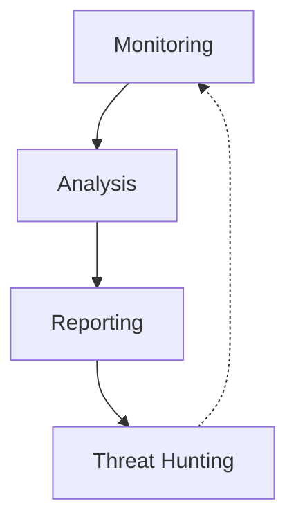
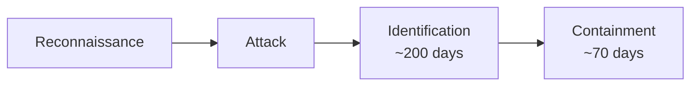

# Detection and Response

## Detection: Monitoring and Hunting

The "Eyes and Ears" of the SOC : Identifying when prevention fails.

$$S = P + D + R$$

Detection is the bridge between Prevention and Response. While prevention (Identity, Endpoint, Network, etc.) puts controls in place, detection monitors those domains to identify when controls fail.

#### The SOC

Detection and Response are the primary functions of the Security Operations Center (SOC), a centralized team responsible for monitoring, analyzing, and reporting on security events.

### Security Information and Event Management (SIEM)

A "Bottom-Up" approach designed to solve the problem of siloed security consoles. Instead of checking ten different screens, SIEM provides a single "pane of glass" for visibility.

#### Core Functions

- **Collection** : Ingests logs, events, and flow data from all domains (Identity, Endpoint, Network, etc.) into a central database
- **Correlation** : Connects disparate data points. If an attacker hits the network, then the server, then the database, the SIEM correlates these separate alarms into a single incident instead of ten isolated alerts.
- **Rules-Based Analysis** : Uses logic (e.g., "If traffic comes from Geo X AND fails login 5 times") to generate high-priority alarms
- **Anomaly Detection (UBA)** : Uses User Behavior Analytics and Machine Learning to find "unknown unknowns." Establishes a baseline of normal behavior and alerts on deviations
(e.g., "This user usually downloads 10 files", "User downloaded 1 million files" or "User is acting differently than their peer group" and alerts on deviations.) 

> [!TIP] SIEM Trend Analysis
> - **Management Reporting:** Beyond immediate alerts, SIEMs are responsible for **Trend Analysis**. The SOC needs to report to leadership whether the organization is getting better or worse over time (e.g., "Are we detecting attacks faster this month than last month?").

> [!NOTE] SIEM Vendor Origins (Historical Context)
> - **The Convergence:** The concept of **SIEM** (Security Information and Event Management) didn't appear out of thin air; it evolved by combining two distinct historical "camps" of vendors.
> - **Camp 1: Log Management:** These vendors focused on the **system** side. Their tools were designed to ingest logs from operating systems, databases, and applications, centralizing them for storage and analysis.
> - **Camp 2: Network Management:** These vendors focused on the **transport** side. Their tools specialized in monitoring network behavior, flow data, and anomaly detection.
> - **The Result:** Modern SIEMs were designed to bridge this gap, reaching across both domains to correlate system logs with network traffic, providing a unified view that neither camp could provide alone.

### Extended Detection and Response (XDR)

A "Top-Down" approach that evolved from Endpoint Detection and Response (EDR). It focuses on pushing actions down to the platform to automate response closer to the source of the attack.

#### Federated Search

Unlike SIEM, which requires copying all data into a central database (which is expensive), XDR often leaves the data in place on the endpoints.

**"Go Fish" Analogy:** XDR operates like the card game. The central system asks all devices, "Do you have this specific file or indicator of compromise?" The devices search locally and only report back if they have a match.

**Benefit:** This "just-in-time" query model is more efficient and reduces storage costs.

### SIEM vs. XDR

It is not "SIEM versus XDR," but rather "SIEM plus XDR." They complement each other:

- **SIEM** : Excellent for high-quality, correlated alarms and compliance reporting
- **XDR** : Superior for cost-effective data management and rapid, automated response at the edge

### Threat Hunting

**The Timeline:** An attack consists of Reconnaissance → Attack → Identification → Containment.

**The Lag:** The average Mean Time to Identify (MTTI) is approximately 200 days. The Mean Time to Contain (MTTC) is another 70 days. This means an attacker can be inside the network for nearly a year (270 days) before the issue is resolved.

#### Definition

Threat Hunting is a proactive activity designed to move the identification bar earlier in the timeline (Shift Left).

#### Investigation vs. Hunting

- **Investigation** : Reactive. You wait for an alarm (from SIEM/XDR), then perform forensics to see what happened
- **Hunting** : Proactive. The analyst assumes a breach has occurred without an alarm. They form a hypothesis based on instinct and experience and use tools to search for evidence

## Response: Containment and Recovery

Managing the Incident : Stopping the bleeding and restoring operations.

### Strategic Context

#### The Timeline of an Attack

- **Reconnaissance** : The attacker "cases the joint" to find weak points
- **Mean Time to Identify (MTTI)** : Average time between attack starting and organization realizing it: ~200 days
- **Mean Time to Contain (MTTC)** : Once identified, average time to resolve: ~70 days
- **Total Exposure** : The attacker is inside the system for roughly 270 days (the better part of a year)

> [!IMPORTANT] Response vs. Recovery
> While often grouped together, Response and Recovery are distinct phases per NIST:
> 
> **Response (Containment):**
> - Goal: Stopping the bleeding
> - Focus: Mean Time to Contain (MTTC) : the ~70-day window to identify scope, eject the attacker, and stop data leakage
> - Action: Triage, blocking access, shutting down compromised systems
> 
> **Recovery (Restoration):**
> - Goal: Getting back to business (begins after threat is contained)
> - Action: Restoring data from backups, rebuilding systems, bringing operations back online
> 
> You cannot effectively Recover until you have successfully Responded; otherwise, you are simply restoring data onto a system the attacker still controls.

**The Goal:** The Response phase aims to drastically shrink the 70-day MTTC window to minimize damage and cost.

### Traditional Incident Response

#### Manual Process

Traditionally relied on "heroes" and experts using gut feelings, which is not scalable or repeatable.

#### Core Functions

- **Triage** : Like a hospital ER, prioritizing alerts to determine which incidents are real and most critical
- **Remediation** : Blocking access, shutting down systems, applying patches, and stopping data leakage

> [!TIP] Incident Triage Priorities
> Triage is necessary because a SOC never has enough time to handle every alert. The primary function of Triage is establishing the "Pecking Order": determining which "patient" (incident) will die if not treated immediately versus which one can wait.

### Modern Approach: SOAR

**Security Orchestration, Automation, and Response**

#### Case Management

- **Automatic Creation** : Detection systems (SIEM/XDR) automatically open a case in the SOAR system when an alarm triggers
- **Enrichment** : The system automatically adds artifacts and Indicators of Compromise (IOCs) to the case so the analyst has all context in one place.

#### Dynamic Playbooks

Unlike static Standard Operating Procedures (SOPs), dynamic playbooks guide analysts through the investigation. They change based on findings (e.g., "If result A happens, do step B; if result X happens, do step Y").

### Automation vs. Orchestration

- **Automation** : The ideal state where the machine handles the entire response without human intervention. Used for known, repeated issues
- **Orchestration** : Acts like a conductor in an orchestra, directing different tools and people to act at the right time. Necessary for "Black Swan" events (rare, unexpected) or "First of a Kind" attacks where no automated script exists. A "semi-automated" approach where a human pushes the button to execute a chain of automated tasks

### Breach Notification

If sensitive data is compromised, the organization is legally required to notify the victims and regulators.

#### Key Variables

- **Data Type** : Credit Card numbers, SSNs, Health data
- **Geography** : Where the victim lives, not just where the company is located

#### Regulatory Examples

- **GDPR (Europe)** : Applies to the data of any EU citizen, regardless of where the company operates. Penalties can reach 4% of worldwide revenue or €20 million
- **US Laws** : A complex patchwork of individual state laws

#### Response Tooling

Organizations use tools to map the compromised data against regulations to determine exactly who to notify. This avoids over-notification (expensive/reputational damage) and under-notification (legal penalties).

