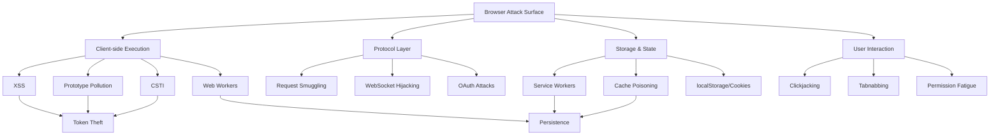

# The Hostile DOM: Master Index & Coverage Map

::: info Document Purpose
This index serves as a **structural blueprint** for browser security research. It catalogs all attack vectors covered in the presentation series, plus additional offensive techniques identified through expansion analysis.
:::

## How to Use This Index

- **Original Vectors**: Topics directly from the conference presentation
- **Expanded Vectors**: Additional browser exploitation techniques for comprehensive coverage
- **Deep Dive Links**: References to detailed technical analysis sections

---

## Core Presentation Topics

### 1. Browser Architecture & Attack Surface

**Topic**: The Browser as an Operating System  
**Abstract**: Analysis of how modern browsers have evolved beyond document viewers into full-featured OS environments with hardware API access, creating a trust paradox where sandboxed environments execute arbitrary third-party code.  
**Coverage**: [Deep Dive: Browser Architecture](/projects/security_blog/dom_exploits/deep_dive/02-hostile-dom-architecture#11-the-browser-as-an-untrusted-operating-system)

**Topic**: The Complexity Stack  
**Abstract**: Examination of the three-layer attack surface: Rendering Engine (Blink/Gecko), JavaScript Engine (V8/SpiderMonkey), and Web API Layer (Sensors, Storage, Hardware).  
**Coverage**: [Deep Dive: Complexity Analysis](/projects/security_blog/dom_exploits/deep_dive/02-hostile-dom-architecture#the-complexity-attack-surface)

### 2. Browser Instrumentation & Privilege Escalation

**Topic**: Command-Line Flags as "Backdoors"  
**Abstract**: Exploitation of debugging flags (`--no-sandbox`, `--remote-debugging-port`, `--headless`) that disable security isolation for forensic/development purposes but create attack vectors.  
**Coverage**: [Deep Dive: Launch Flag Exploitation](/projects/security_blog/dom_exploits/deep_dive/02-hostile-dom-architecture#12-launch-flags-the-forensic-backdoor)

**Topic**: Chrome DevTools Protocol (CDP) Takeover  
**Abstract**: Remote browser control via CDP connections on debugging ports, enabling session hijacking, MFA bypass, and complete browser automation without authentication.  
**Coverage**: [Deep Dive: CDP Attack Chains](/projects/security_blog/dom_exploits/deep_dive/02-hostile-dom-architecture#13-chrome-devtools-protocol-cdp-the-control-plane)

**Topic**: Context-Level Privileges (Playwright/Puppeteer)  
**Abstract**: Abuse of browser automation frameworks that bypass CSP (`bypassCSP: true`), ignore HTTPS errors, record network traffic (HAR files), and inject context scripts.  
**Coverage**: [Deep Dive: Automation Framework Weaponization](/projects/security_blog/dom_exploits/deep_dive/02-hostile-dom-architecture#14-browser-automation-framework-weaponization)

### 3. Visual Deception & UI Redressing

**Topic**: Clickjacking (UI Redressing)  
**Abstract**: CSS-based attacks using invisible iframes (`opacity: 0`) and z-index manipulation to overlay malicious elements over legitimate UI controls, weaponizing user clicks.  
**Coverage**: [Deep Dive: Clickjacking Mechanics](/projects/security_blog/dom_exploits/deep_dive/03-hostile-dom-visual-attacks#21-clickjacking-ui-redressing)

**Topic**: Homograph Attacks (IDN Spoofing)  
**Abstract**: Domain registration using Unicode characters (Cyrillic, Greek) that visually mimic legitimate domains, bypassing user verification while maintaining valid SSL certificates.  
**Coverage**: [Deep Dive: Internationalized Domain Name Spoofing](/projects/security_blog/dom_exploits/deep_dive/03-hostile-dom-visual-attacks#22-homograph-attacks-internationalized-domain-name-idn-spoofing)

**Topic**: Cursorjacking  
**Abstract**: CSS cursor manipulation to offset the visual pointer from actual mouse coordinates, causing users to click malicious elements while believing they're clicking safe targets.  
**Coverage**: [Deep Dive: Cursor Offset Attacks](/projects/security_blog/dom_exploits/deep_dive/03-hostile-dom-visual-attacks#23-cursorjacking-pointer-offset-attacks)

### 4. Persistence & Background Execution

**Topic**: Service Workers as "Ghost" Networks  
**Abstract**: Client-side proxy scripts that intercept all network requests, persist across browser sessions, and enable cache poisoning attacks that serve malicious content offline.  
**Coverage**: [Deep Dive: Service Worker Attack Lifecycle](/projects/security_blog/dom_exploits/deep_dive/04-hostile-dom-persistence#31-service-workers-the-ghost-network)

**Topic**: Web Workers for Stealth Execution  
**Abstract**: Background thread execution that keeps UI responsive while running cryptominers, network scanners, or data exfiltration scripts invisible to users.  
**Coverage**: [Deep Dive: Multi-threaded Malware](/projects/security_blog/dom_exploits/deep_dive/04-hostile-dom-persistence#32-web-workers-invisible-background-execution)

**Topic**: IndexedDB Persistent Storage Exploitation  
**Abstract**: Unlimited client-side database storage for credential harvesting, offline phishing pages, and binary payload caching that survives browser restarts.  
**Coverage**: [Deep Dive: IndexedDB Persistence](/projects/security_blog/dom_exploits/deep_dive/04-hostile-dom-persistence#34-indexeddb-client-side-database-persistence)

**Topic**: Beacon API Exit-Handler Exfiltration  
**Abstract**: Guaranteed data exfiltration using navigator.sendBeacon() that delivers stolen data even during page unload, ensuring no data loss.  
**Coverage**: [Deep Dive: Beacon API Attacks](/projects/security_blog/dom_exploits/deep_dive/04-hostile-dom-persistence#35-beacon-api-exit-handler-persistence)

**Topic**: Background Sync Deferred Payloads  
**Abstract**: Service Worker Background Sync API exploitation to execute malicious code when network connectivity resumes, bypassing user awareness.  
**Coverage**: [Deep Dive: Background Sync Exploitation](/projects/security_blog/dom_exploits/deep_dive/04-hostile-dom-persistence#36-background-sync-api-deferred-payload-execution)

**Topic**: Malvertising & Ad Ecosystem Exploitation  
**Abstract**: Abuse of third-party ad networks through redirect chains, drive-by downloads, and tracking pixel data exfiltration.  
**Coverage**: [Deep Dive: Ad Network Attack Chains](/projects/security_blog/dom_exploits/deep_dive/04-hostile-dom-persistence#33-malvertising-ad-network-exploitation)

### 5. Code Injection & Script Execution

**Topic**: Cross-Site Scripting (XSS) Dangerous Sinks  
**Abstract**: Exploitation of `eval()`, `Function()`, and `innerHTML` to execute arbitrary code in the context of the victim's session.  
**Coverage**: [Deep Dive: XSS Exploitation Techniques](/projects/security_blog/dom_exploits/deep_dive/05-hostile-dom-injection#41-cross-site-scripting-xss-attack-surface)

**Topic**: Polyglot Payloads  
**Abstract**: Crafting files that are valid in multiple contexts (e.g., GIF + JavaScript) to bypass Content Security Policy and file upload filters.  
**Coverage**: [Deep Dive: Multi-context Payload Engineering](/projects/security_blog/dom_exploits/deep_dive/05-hostile-dom-injection#42-polyglot-payloads)

### 6. Credential & Token Theft

**Topic**: localStorage vs. HttpOnly Cookie Vulnerabilities  
**Abstract**: Comparison of client-side storage mechanisms, focusing on how localStorage lacks HttpOnly protection, making JWT tokens accessible via XSS.  
**Coverage**: [Deep Dive: Token Storage Attack Surface](/projects/security_blog/dom_exploits/deep_dive/06-hostile-dom-theft#51-localstorage-vs-httponly-cookies-storage-vulnerabilities)

**Topic**: Password Manager Auto-fill Exploitation  
**Abstract**: Harvesting credentials from password managers (1Password, LastPass, Bitwarden) via invisible forms, extension content script manipulation, and fake UI phishing.  
**Coverage**: [Deep Dive: Password Manager Attacks](/projects/security_blog/dom_exploits/deep_dive/06-hostile-dom-theft#56-password-manager-exploitation)

**Topic**: WebAuthn/FIDO2 Relay Attacks  
**Abstract**: Proxy phishing and relay attacks against WebAuthn hardware tokens, bypassing phishing-resistant authentication through real-time credential forwarding.  
**Coverage**: [Deep Dive: WebAuthn Exploitation](/projects/security_blog/dom_exploits/deep_dive/06-hostile-dom-theft#57-webauthn--fido2-token-theft)

**Topic**: Pastejacking (Clipboard Manipulation)  
**Abstract**: JavaScript interception of copy events to replace clipboard content with malicious payloads, escalating browser attacks to terminal/system compromise.  
**Coverage**: [Deep Dive: Clipboard Weaponization](/projects/security_blog/dom_exploits/deep_dive/06-hostile-dom-theft#53-pastejacking-clipboard-manipulation)

**Topic**: Cross-Site Request Forgery (CSRF)  
**Abstract**: Forcing authenticated browsers to submit requests to target sites, leveraging automatic cookie attachment to bypass authentication.  
**Coverage**: [Deep Dive: CSRF Attack Mechanics](/projects/security_blog/dom_exploits/deep_dive/06-hostile-dom-theft#54-cross-site-request-forgery-csrf)

### 7. Permission Fatigue & Extension Exploitation

**Topic**: Browser Extension Manifest Permissions  
**Abstract**: Analysis of dangerous permission combinations (`tabs`, `webRequest`, `<all_urls>`) that grant extensions god-like privileges across all browsing.  
**Coverage**: [Deep Dive: Extension Permission Model](/projects/security_blog/dom_exploits/deep_dive/07-hostile-dom-extensions#61-permission-fatigue-attacks)

**Topic**: Manifest V3 Service Worker Exploitation  
**Abstract**: Exploiting Chrome's Manifest V3 Service Workers, declarativeNetRequest API abuse, and migration period vulnerabilities in modern extensions.  
**Coverage**: [Deep Dive: Manifest V3 Attacks](/projects/security_blog/dom_exploits/deep_dive/07-hostile-dom-extensions#66-manifest-v3-exploitation--migration-attacks)

**Topic**: Extension Supply Chain Attacks  
**Abstract**: Developer account takeover, post-acquisition weaponization with delayed activation, and suspicious update detection in browser extensions.  
**Coverage**: [Deep Dive: Extension Supply Chain](/projects/security_blog/dom_exploits/deep_dive/07-hostile-dom-extensions#67-extension-supply-chain-attacks)

**Topic**: Notification Permission Abuse  
**Abstract**: Exploitation of notification APIs to deliver system-level popups and phishing messages even when the browser is closed.  
**Coverage**: [Deep Dive: Notification Spam Vectors](/projects/security_blog/dom_exploits/deep_dive/07-hostile-dom-extensions#62-dangerous-permissions-exploitation)

### 8. Browser Fingerprinting & Tracking

**Topic**: Canvas Fingerprinting  
**Abstract**: GPU-based hardware identification using pixel-level rendering differences in HTML5 canvas elements to generate unique device hashes.  
**Coverage**: [Deep Dive: Canvas Hash Generation](/projects/security_blog/dom_exploits/deep_dive/08-hostile-dom-fingerprinting#71-canvas-fingerprinting)

**Topic**: AudioContext Fingerprinting  
**Abstract**: Audio hardware signature extraction through signal processing to create persistent device identifiers.  
**Coverage**: [Deep Dive: Audio Hardware Profiling](/projects/security_blog/dom_exploits/deep_dive/08-hostile-dom-fingerprinting#72-audiocontext-fingerprinting)

**Topic**: WebRTC IP Leakage  
**Abstract**: Bypass of VPN/proxy protection through WebRTC STUN server requests that leak real local and public IP addresses.  
**Coverage**: [Deep Dive: WebRTC Deanonymization](/projects/security_blog/dom_exploits/deep_dive/08-hostile-dom-fingerprinting#73-webrtc-ip-leakage)

**Topic**: Font Enumeration  
**Abstract**: Detection of installed system fonts to create high-entropy device fingerprints based on font collection uniqueness.  
**Coverage**: [Deep Dive: Typography-based Fingerprinting](/projects/security_blog/dom_exploits/deep_dive/08-hostile-dom-fingerprinting#74-font-enumeration)

**Topic**: Hardware Sensor APIs (Gyroscope, Accelerometer)  
**Abstract**: Exploitation of device motion sensors to infer PINs, detect physical location, or correlate device movement with user behavior.  
**Coverage**: [Deep Dive: Sensor-based Side Channels](/projects/security_blog/dom_exploits/deep_dive/08-hostile-dom-fingerprinting#75-hardware-sensor-fingerprinting)

---

## Expanded Attack Vectors (Additional Coverage)

::: tip Research Expansion
These topics extend beyond the original presentation to provide comprehensive offensive browser security coverage.
:::

### 9. Cross-Site Leaks (XS-Leaks)

**Topic**: Timing-based Information Disclosure (XS-Leaks)  
**Abstract**: Exploitation of browser timing APIs and resource loading behaviors to infer sensitive information across origins without direct access.  
**Coverage**: [Deep Dive: XS-Leak Attack Primitives](/projects/security_blog/dom_exploits/deep_dive/09-hostile-dom-advanced#81-xs-leaks-cross-site-leakage-attacks)

**Topic**: Spectre Variant 1 (Bounds Check Bypass)  
**Abstract**: Branch predictor training to speculatively execute out-of-bounds reads, leaking data via cache side channels in browser JavaScript/WASM.  
**Coverage**: [Deep Dive: Spectre-v1 Exploitation](/projects/security_blog/dom_exploits/deep_dive/10_spectre_meltdown#84-spectre-and-meltdown-variants)

**Topic**: Spectre Variant 2 (Branch Target Injection)  
**Abstract**: Indirect Branch Predictor (IBP) poisoning to make victim code speculatively execute attacker-chosen gadgets.  
**Coverage**: [Deep Dive: Spectre-v2 IBP Poisoning](/projects/security_blog/dom_exploits/deep_dive/10_spectre_meltdown#spectre-variant-2-branch-target-injection-cve-2017-5715)

**Topic**: Meltdown (Kernel Memory Leakage)  
**Abstract**: Speculative kernel memory reads from user space, exploiting CPU race conditions before exception handlers trigger.  
**Coverage**: [Deep Dive: Meltdown Attack](/projects/security_blog/dom_exploits/deep_dive/10_spectre_meltdown#meltdown-cve-2017-5754-kernel-memory-leakage)

**Topic**: Foreshadow/L1TF (SGX Cache Leakage)  
**Abstract**: L1 Terminal Fault exploitation to read SGX enclave memory and other protected regions via L1 cache side effects.  
**Coverage**: [Deep Dive: Foreshadow Attack](/projects/security_blog/dom_exploits/deep_dive/10_spectre_meltdown#foreshadowl1tf-cve-2018-3615-l1-cache-data-leakage)

**Topic**: PortSmash (SMT Port Contention)  
**Abstract**: Simultaneous Multithreading execution port contention exploitation to leak cryptographic keys across sibling hyperthreads.  
**Coverage**: [Deep Dive: PortSmash Attack](/projects/security_blog/dom_exploits/deep_dive/10_spectre_meltdown#portsmash-cve-2018-5407-smthyperthreading-exploitation)

**Topic**: TLBleed (Page Table Timing)  
**Abstract**: Translation Lookaside Buffer (TLB) timing attacks to leak secrets across hyperthreads via page table access patterns.  
**Coverage**: [Deep Dive: TLBleed Attack](/projects/security_blog/dom_exploits/deep_dive/10_spectre_meltdown#tlbleed-page-table-entry-timing)

**Topic**: Cache Probing  
**Abstract**: Detection of whether specific resources are cached to infer user browsing history or authentication status on third-party sites.  
**Coverage**: [Deep Dive: Cache Timing Attacks](/projects/security_blog/dom_exploits/deep_dive/09-hostile-dom-advanced#cache-based-xs-leaks)

**Topic**: Frame Counting  
**Abstract**: Measurement of iframe count differences to leak information about page state (e.g., number of search results, login status).  
**Coverage**: [Deep Dive: Frame-based Oracle Attacks](/projects/security_blog/dom_exploits/deep_dive/09-hostile-dom-advanced#81-xs-leaks-cross-site-leakage-attacks)

**Topic**: Event Timing & Error Messages  
**Abstract**: Analysis of cross-origin event timing and error message differences to extract sensitive data.  
**Coverage**: [Deep Dive: Event-based Side Channels](/projects/security_blog/dom_exploits/deep_dive/09-hostile-dom-advanced#81-xs-leaks-cross-site-leakage-attacks)

### 10. Prototype Pollution

**Topic**: JavaScript Prototype Chain Manipulation  
**Abstract**: Modification of `Object.prototype` or built-in prototypes to inject malicious properties that affect all objects globally.  
**Coverage**: [Deep Dive: Prototype Injection Techniques](/projects/security_blog/dom_exploits/deep_dive/09-hostile-dom-advanced#82-prototype-pollution)

**Topic**: Client-side Prototype Pollution to XSS  
**Abstract**: Escalation of prototype pollution vulnerabilities to achieve code execution through gadget chains and DOM manipulation.  
**Coverage**: [Deep Dive: PP-to-XSS Exploitation](/projects/security_blog/dom_exploits/deep_dive/09-hostile-dom-advanced#82-prototype-pollution)

**Topic**: JSON Merge/Deep Clone Vulnerabilities  
**Abstract**: Exploitation of unsafe object merging operations that allow `__proto__` pollution through user-controlled input.  
**Coverage**: [Deep Dive: Merge Function Attack Surface](/projects/security_blog/dom_exploits/deep_dive/09-hostile-dom-advanced#82-prototype-pollution)

### 11. Dangling Markup Injection

**Topic**: Incomplete Tag Injection  
**Abstract**: Injection of unclosed HTML tags to capture subsequent page content and exfiltrate it via attacker-controlled attributes.  
**Coverage**: [Deep Dive: Markup-based Data Exfiltration](#)

**Topic**: Meta Tag Injection  
**Abstract**: Injection of meta refresh tags or base tags to redirect users or alter relative URL resolution.  
**Coverage**: [Deep Dive: Meta Tag Exploitation](#)

**Topic**: Attribute Breakout  
**Abstract**: Breaking out of HTML attribute context to inject new attributes or tags without proper tag closure.  
**Coverage**: [Deep Dive: Attribute Context Escapes](#)

### 12. Tabnabbing & Window Object Exploitation

**Topic**: Reverse Tabnabbing  
**Abstract**: Exploitation of `window.opener` references to navigate the originating tab to a phishing page after the user clicks a link.  
**Coverage**: [Deep Dive: Opener Hijacking](#)

**Topic**: Window.name Data Persistence  
**Abstract**: Abuse of the `window.name` property that persists across navigation to leak or inject data cross-origin.  
**Coverage**: [Deep Dive: Window.name Side Channel](#)

**Topic**: Popup & Window.open Exploitation  
**Abstract**: Creation of deceptive popups that mimic system dialogs or legitimate sites to harvest credentials.  
**Coverage**: [Deep Dive: Window Spoofing Techniques](#)

### 13. PostMessage Vulnerabilities

**Topic**: Origin Validation Bypass  
**Abstract**: Exploitation of weak or missing origin checks in `postMessage` handlers to inject malicious commands across frames.  
**Coverage**: [Deep Dive: PostMessage Security Model](#)

**Topic**: Message Forwarding Attacks  
**Abstract**: Chain exploitation where messages are blindly forwarded to third frames, creating unintended trust relationships.  
**Coverage**: [Deep Dive: Multi-frame Message Chains](#)

**Topic**: DOM Clobbering via PostMessage  
**Abstract**: Combination of DOM clobbering techniques with postMessage to override expected properties and alter execution flow.  
**Coverage**: [Deep Dive: Clobbering-based Message Injection](#)

### 14. DOM Clobbering

**Topic**: Named Element Property Collision  
**Abstract**: Exploitation of HTML's automatic property creation from `id`/`name` attributes to override JavaScript variables and functions.  
**Coverage**: [Deep Dive: DOM Property Shadowing](#)

**Topic**: Form Element Collection Clobbering  
**Abstract**: Abuse of form element collections to create unexpected object structures that break security checks.  
**Coverage**: [Deep Dive: Form-based Clobbering](#)

**Topic**: HTMLCollection Exploitation  
**Abstract**: Manipulation of live HTMLCollection objects to create dynamic property references that affect script execution.  
**Coverage**: [Deep Dive: Collection-based Attacks](#)

### 15. Client-side Template Injection (CSTI)

**Topic**: Angular/React Template Injection  
**Abstract**: Injection of template syntax into client-side frameworks to achieve code execution through template engines.  
**Coverage**: [Deep Dive: Framework Template Exploitation](#)

**Topic**: Template Expression Sandbox Escape  
**Abstract**: Bypass of sandboxed template expression evaluation to access global scope and execute arbitrary code.  
**Coverage**: [Deep Dive: Sandbox Breakout Techniques](#)

**Topic**: Server-Side vs. Client-Side Template Context  
**Abstract**: Distinction between SSR and CSR template injection vectors and their exploitation methodologies.  
**Coverage**: [Deep Dive: Template Context Analysis](#)

### 16. Request Smuggling & Desync Attacks

**Topic**: HTTP/2 Request Smuggling  
**Abstract**: Exploitation of protocol translation differences between HTTP/2 and HTTP/1.1 to smuggle requests past security controls.  
**Coverage**: [Deep Dive: Protocol Desync Techniques](#)

**Topic**: Browser Cache Poisoning  
**Abstract**: Injection of malicious responses into browser caches through request smuggling to persistently serve compromised content.  
**Coverage**: [Deep Dive: Client-side Cache Poisoning](#)

**Topic**: CRLF Injection in Modern Browsers  
**Abstract**: Header injection through newline characters to split HTTP responses or inject headers.  
**Coverage**: [Deep Dive: Response Splitting Attacks](#)

### 17. OAuth & Authentication Flow Exploitation

**Topic**: OAuth Token Theft via Redirect Manipulation  
**Abstract**: Exploitation of open redirects in OAuth flows to intercept authorization codes or access tokens.  
**Coverage**: [Deep Dive: OAuth Redirect Attacks](#)

**Topic**: PKCE Bypass Techniques  
**Abstract**: Circumvention of Proof Key for Code Exchange (PKCE) protection through implementation flaws.  
**Coverage**: [Deep Dive: PKCE Security Analysis](#)

**Topic**: Implicit Flow Fragment Theft  
**Abstract**: Extraction of access tokens from URL fragments in implicit OAuth flows through history or referrer leakage.  
**Coverage**: [Deep Dive: Fragment-based Token Theft](#)

### 18. WebSocket & Real-time Communication Exploitation

**Topic**: WebSocket Hijacking  
**Abstract**: Cross-Site WebSocket Hijacking (CSWSH) attacks that establish unauthorized WebSocket connections using victim credentials.  
**Coverage**: [Deep Dive: WebSocket Security Model](#)

**Topic**: Message Injection in WebSocket Streams  
**Abstract**: Injection of malicious messages into WebSocket communication to manipulate application state.  
**Coverage**: [Deep Dive: WS Message Tampering](#)

**Topic**: WebRTC Data Channel Exploitation  
**Abstract**: Abuse of peer-to-peer data channels to bypass server-side security controls and exfiltrate data.  
**Coverage**: [Deep Dive: P2P Channel Attacks](#)

### 19. Progressive Web App (PWA) Exploitation

**Topic**: Manifest Injection  
**Abstract**: Modification of web app manifests to change app identity, icons, or permissions for phishing attacks.  
**Coverage**: [Deep Dive: PWA Manifest Manipulation](#)

**Topic**: Offline Page Poisoning  
**Abstract**: Injection of malicious content into PWA offline caches to maintain persistence even without network access.  
**Coverage**: [Deep Dive: Offline-first Attack Vectors](#)

**Topic**: Background Sync API Abuse  
**Abstract**: Exploitation of Background Sync to execute code when connectivity resumes, bypassing user awareness.  
**Coverage**: [Deep Dive: Background Sync Exploitation](#)

### 20. Content Security Policy (CSP) Bypass

**Topic**: Script-src Bypass via JSONP Endpoints  
**Abstract**: Abuse of whitelisted JSONP endpoints to inject and execute JavaScript despite strict CSP policies.  
**Coverage**: [Deep Dive: JSONP-based CSP Evasion](#)

**Topic**: Base-URI Manipulation  
**Abstract**: Injection of `<base>` tags to alter relative URL resolution and bypass CSP script-src restrictions.  
**Coverage**: [Deep Dive: Base Tag Injection](#)

**Topic**: Nonce/Hash Reuse Attacks  
**Abstract**: Exploitation of predictable CSP nonces or hash collisions to execute unauthorized scripts.  
**Coverage**: [Deep Dive: CSP Nonce Security](#)

**Topic**: Unsafe-eval Gadget Chains  
**Abstract**: Discovery and exploitation of existing code that uses `eval()` to achieve execution despite CSP restrictions.  
**Coverage**: [Deep Dive: Gadget-based CSP Bypass](#)

---

## Coverage Summary

### Topic Count by Category

| Category | Original Topics | Expanded Topics | Total |
|----------|----------------|-----------------|-------|
| Architecture & Instrumentation | 5 | 0 | 5 |
| Visual Deception | 3 | 0 | 3 |
| Persistence | 3 | 3 | 6 |
| Code Injection | 2 | 2 | 4 |
| Credential Theft | 3 | 5 | 8 |
| Permissions | 3 | 0 | 3 |
| Fingerprinting | 5 | 0 | 5 |
| Advanced Vectors | 0 | 40+ | 40+ |
| **Total** | **24** | **50+** | **74+** |

### Attack Vector Relationship Map

<!-- 
## Next Steps

::: tip Navigation
- **[Return to Summary](/projects/security_blog/dom_exploits/00-hostile-dom-summary)** - High-level overview with vulnerability statistics
- **[Part 1: Browser Architecture](/projects/security_blog/dom_exploits/deep_dive/02-hostile-dom-architecture)** - CDP, automation frameworks, HAR exploitation
- **[Part 2: Visual Attacks](/projects/security_blog/dom_exploits/deep_dive/03-hostile-dom-visual-attacks)** - Clickjacking, homograph attacks, cursor manipulation
- **[Part 3: Persistence](/projects/security_blog/dom_exploits/deep_dive/04-hostile-dom-persistence)** - Service Workers, IndexedDB, Beacon API
- **[Part 4: Code Injection](/projects/security_blog/dom_exploits/deep_dive/05-hostile-dom-injection)** - XSS, polyglots, CSP bypasses
- **[Part 5: Credential Theft](/projects/security_blog/dom_exploits/deep_dive/06-hostile-dom-theft)** - Password managers, WebAuthn, OAuth attacks
- **[Part 6: Extensions](/projects/security_blog/dom_exploits/deep_dive/07-hostile-dom-extensions)** - Manifest V3, supply chain attacks
- **[Part 7: Fingerprinting](/projects/security_blog/dom_exploits/deep_dive/08-hostile-dom-fingerprinting)** - Canvas, audio, hardware sensors
- **[Part 8: Advanced Attacks](/projects/security_blog/dom_exploits/deep_dive/09-hostile-dom-advanced)** - XS-Leaks, prototype pollution, WebAssembly
- **[Part 9: Spectre/Meltdown Variants](/projects/security_blog/dom_exploits/deep_dive/10_spectre_meltdown)** - Speculative execution attacks
:::

 -->
