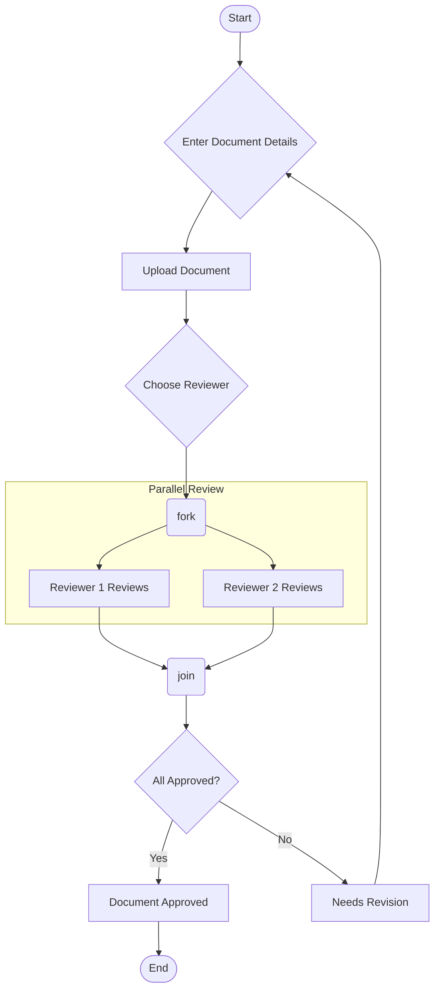
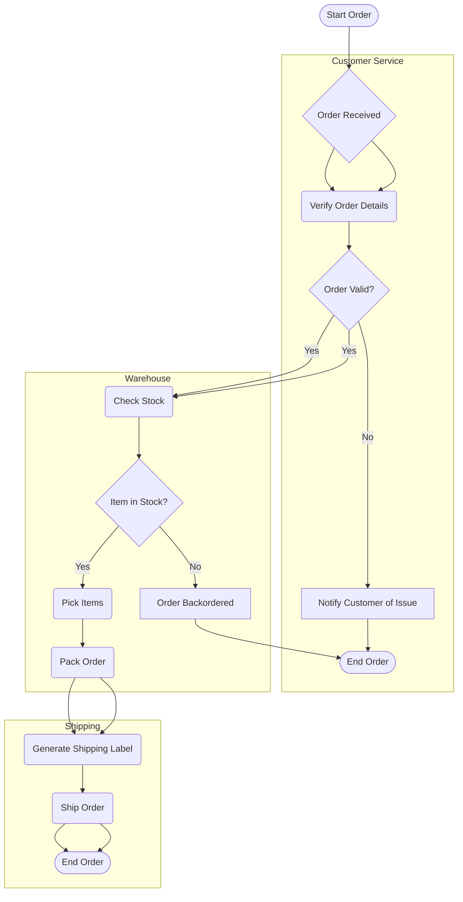
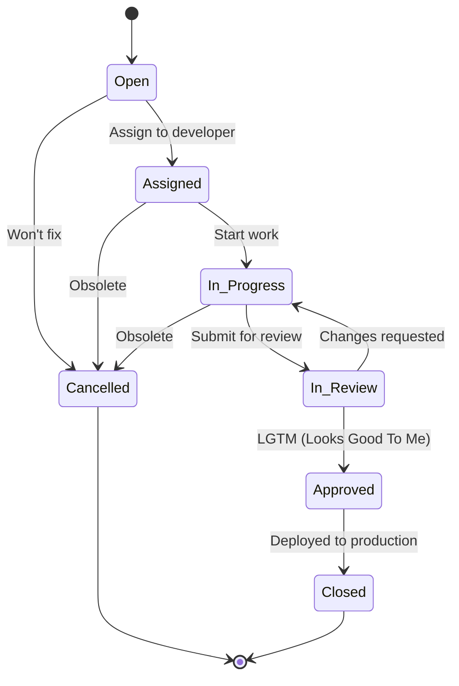
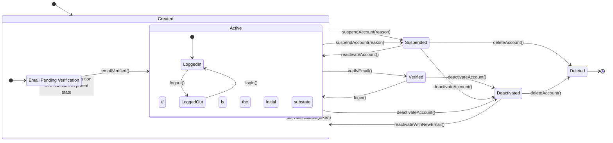

# Behavioral Modeling

Behavioral models describe the dynamic behavior of a system, focusing on what the system does in response to events or stimuli. Unlike structural models that show the static architecture, behavioral models illustrate the process and flow of control over time. They are crucial for understanding how the system functions and for modeling complex workflows and state changes.

## Activity Diagrams

Activity diagrams are used to display the sequence of activities. They are useful for modeling business processes, workflows, and the logic of complex operations. They are essentially advanced flowcharts.

### Key Components

-   **Action**: A rounded rectangle representing a single step or task.
-   **Start/End Nodes**: A filled circle for the start and a filled circle with a border for the end.
-   **Flow/Edge**: Arrows showing the transition from one activity to another.
-   **Decision Node**: A diamond shape indicating a point where the flow can branch based on a condition.
-   **Fork/Join Nodes**: Black bars used to split the flow into parallel activities (fork) and bring them back together (join).

### Example: Document Approval Workflow

This diagram shows a workflow for getting a document reviewed and approved.

### Advanced Example: Order Fulfillment Process with Swimlanes

This activity diagram illustrates a detailed order fulfillment process using swimlanes to show responsibilities across different departments.

## State Machine Diagrams

State machine diagrams (or statecharts) are used to model the behavior of a single object across its lifetime. They show the different states an object can be in and how it transitions from one state to another in response to events. They are excellent for modeling reactive systems and the lifecycle of objects with complex behavior.

### Key Components

-   **State**: A condition or situation in the life of an object. Represented by a rounded rectangle.
-   **Initial State**: The starting point, represented by a solid black circle.
-   **Final State**: The ending point, represented by a circle with a dot inside.
-   **Transition**: An arrow from one state to another, labeled with the event that triggers the change.
-   **Choice**: A diamond that allows for conditional transitions based on a guard condition.

### Example: Bug Tracking Lifecycle

This diagram models the lifecycle of a bug in an issue tracking system.

### Advanced Example: User Account Lifecycle

This state machine diagram models the lifecycle of a user account in a system, showing various states, events, and conditional transitions.

