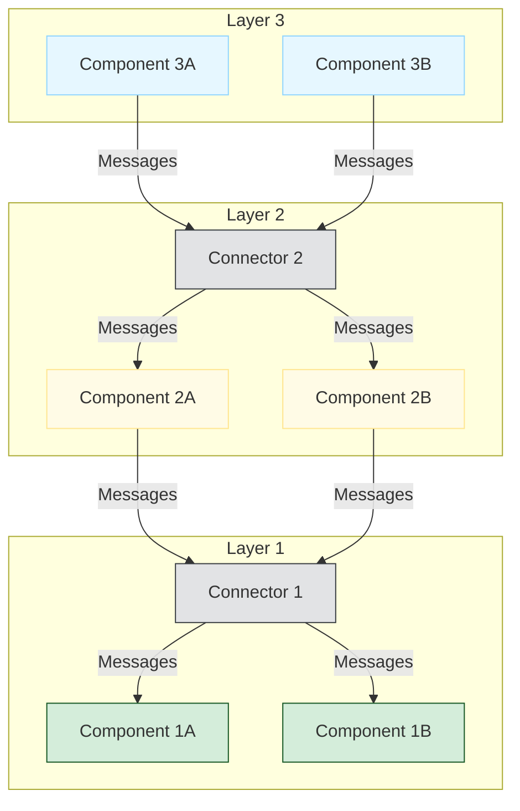
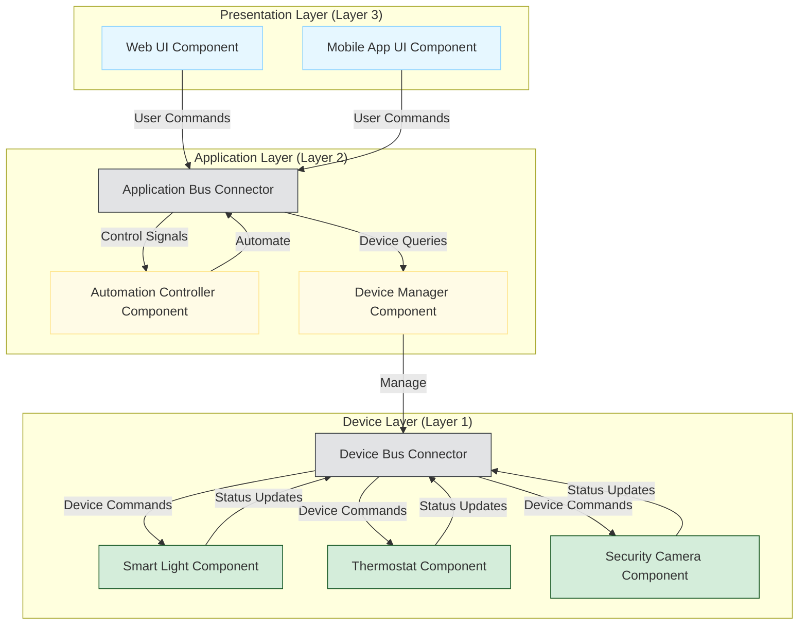

# C2-style Architecture

C2-style architecture is an architectural style that promotes a decentralized, message-based communication paradigm among independent components. It emphasizes loose coupling and extensibility, making it suitable for complex, evolving software systems.

## Core Principles

The fundamental principles of C2 architecture are:

-   **Independent Components**: Components are independent and only interact with each other via message passing.
-   **Asynchronous Communication**: Communication between components is typically asynchronous, meaning components send messages and continue their processing without waiting for an immediate response.
-   **Connectors**: Components communicate exclusively through connectors. Connectors are explicit architectural elements that facilitate communication by routing messages.
-   **Layered Structure**: Components and connectors are organized into a layered structure. A component at a given layer can only be connected to components and connectors in the layer directly above or below it.

## Benefits

-   **Flexibility and Extensibility**: New components can be added or existing ones modified with minimal impact on the rest of the system due to loose coupling.
-   **Reusability**: Independent components can be easily reused in different contexts.
-   **Maintainability**: Changes are localized, making the system easier to maintain.
-   **Concurrency**: Asynchronous message passing naturally supports concurrency.

## Drawbacks

-   **Increased Complexity**: The explicit connectors and message-based communication can add overhead and complexity, especially for simpler systems.
-   **Debugging Challenges**: Tracing message flows through multiple connectors and components can be difficult.

## Example: C2-style System

This conceptual diagram illustrates the layered nature and message flow in a C2-style architecture.

### Advanced Example: Smart Home Automation System

This diagram illustrates a C2-style architecture applied to a smart home automation system, showing components and connectors in a layered structure.

