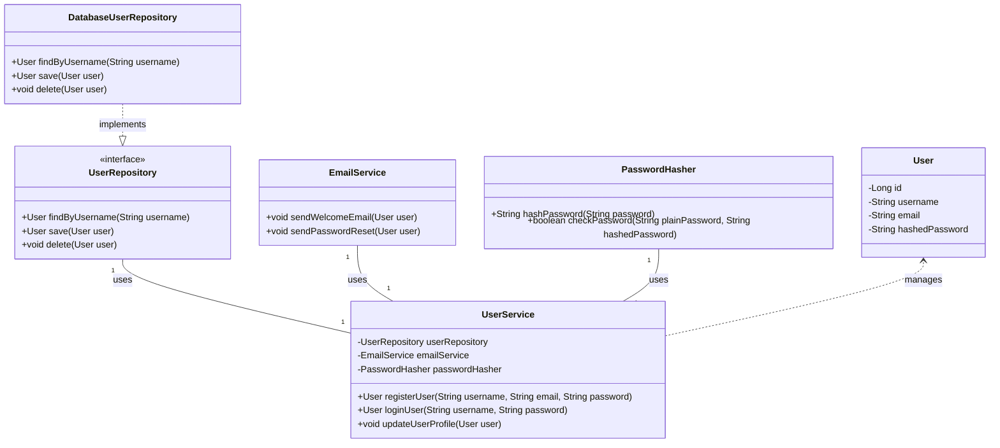

# C4 Model for Software Architecture

The C4 model is a "lean" approach to visualizing software architecture. It was created by Simon Brown to help software development teams describe and communicate software architecture at different levels of detail, telling a story that different audiences can understand.

"C4" stands for the four levels of diagrams:

1.  **Context**: The highest level, showing your system as a black box in its environment.
2.  **Containers**: Zooms into the system to show its high-level building blocks (e.g., web applications, APIs, databases).
3.  **Components**: Zooms into a container to show its internal components or services.
4.  **Code**: An optional, detailed view zooming into a component to show how it's implemented.

The C4 model is designed to be a pragmatic and effective way to communicate software architecture, avoiding the ambiguity of informal diagrams and the complexity of overly detailed formal notations.

## Level 1: System Context

The System Context diagram is the highest level of abstraction in the C4 model. It shows the system as a "black box" and illustrates how it fits into the surrounding environment, including the key users and other systems it interacts with. This diagram is ideal for non-technical audiences.

It is identical in purpose and structure to a standard [System Context Diagram](./system-context-diagrams.md).

### Basic Example: Internet Banking System

This diagram shows a user interacting with the banking system, which in turn uses an external email service and connects to a mainframe banking system.

### Advanced Example: Microservices E-commerce Platform (Context)

This diagram shows a high-level view of an e-commerce platform and its interactions with various users and external systems.

## Level 2: Containers

The Container diagram zooms into the system boundary from the Context diagram. It shows the high-level technical building blocks that make up the system. A "container" is a deployable and runnable unit, such as a server-side web application, a client-side web application, a microservice, or a database.

This diagram is useful for developers and operations staff to understand the high-level structure and technology choices of the system.

### Example: Containers of an Internet Banking System

This diagram decomposes the "Internet Banking System" into its constituent containers.

### Advanced Example: E-commerce Platform Containers

This diagram breaks down the E-commerce Platform into its main deployable containers.

## Level 3: Components

The Component diagram zooms into an individual container to show its internal components. A "component" is a group of related code, like a set of classes or functions behind an interface. This level shows how a container's responsibilities are partitioned into smaller, manageable parts.

This diagram is primarily for developers who are working on or with that specific container.

### Example: Components of the API Application

This diagram decomposes the "API Application" container into its key components.

### Advanced Example: User Profile Service Components

This diagram details the internal components of a `User Profile Service` container, showing how different functionalities are encapsulated and interact.

## Level 4: Code

The Code diagram is the lowest level of detail in the C4 model. It zooms into an individual component to show how it is implemented in code. This level can be represented by a UML class diagram, an Entity-Relationship Diagram (ERD), or even a snippet of actual code.

This level is optional and should only be created when necessary to explain a particularly complex or important part of the codebase.

### Example: Code for the "Security Component"

A class diagram can be used to show the key classes within the `Security Component`.

### Advanced Example: User Service (Code Level Detail)

This Class Diagram illustrates the internal structure of a `UserService` component, including dependencies on other services and utility classes.

