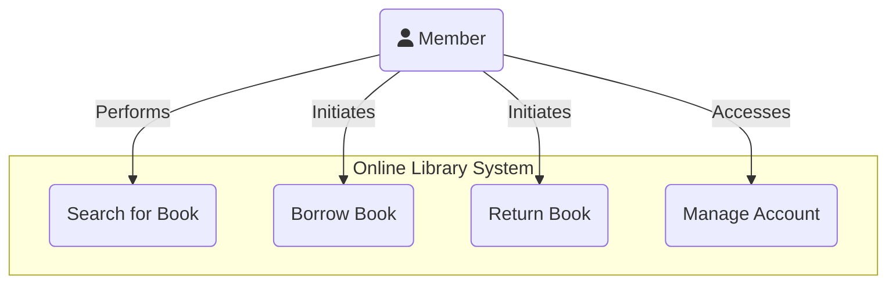
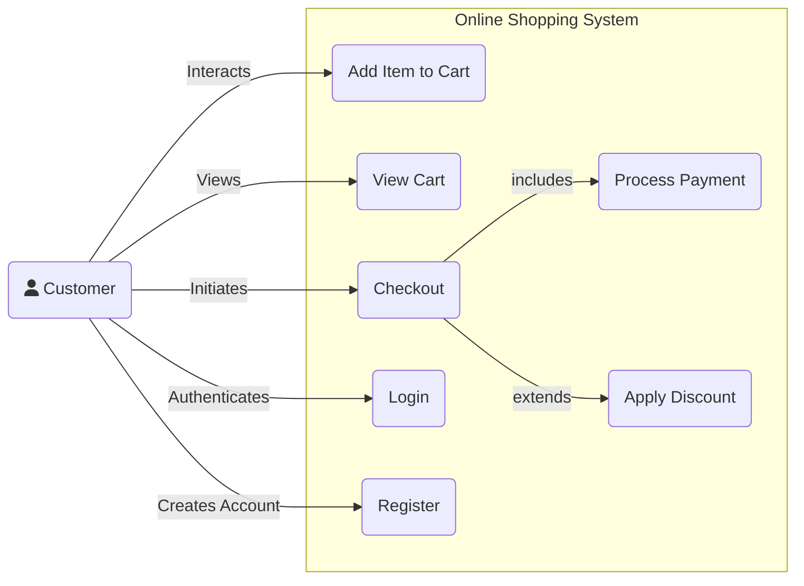
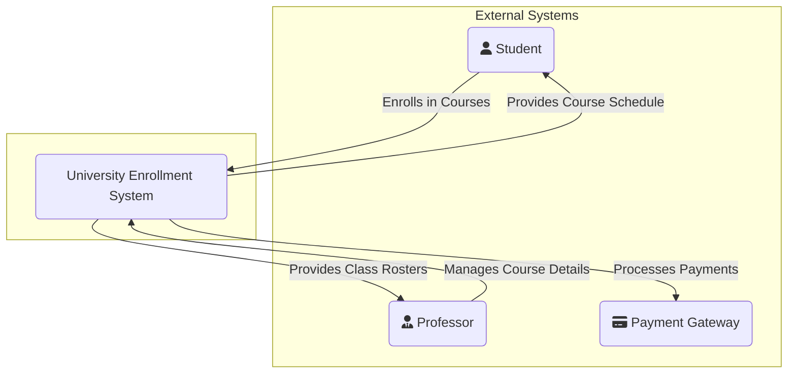
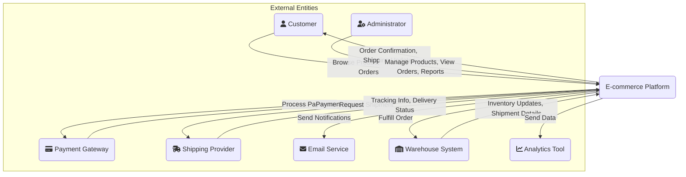

# Context Modeling

Context models are used to illustrate the operational context of a system. They define the system's boundaries and show how it interacts with external entities like other systems, users, and sensors. They are crucial for understanding the system's scope and its relationship with the environment.

## Use Case Diagrams

Use Case diagrams capture the functional requirements of a system by showing how "actors" interact with the system to achieve specific goals. They are a valuable tool for communicating with stakeholders and defining the scope of a project.

### Key Components

-   **Actor**: Represents a user or any other entity that interacts with the system. Actors are typically drawn as stick figures.
-   **Use Case**: A specific goal that an actor can achieve with the system. It's represented by an ellipse.
-   **System Boundary**: A box that encloses all the use cases to delineate the scope of the system.
-   **Relationships**: Lines connecting actors to use cases.

### Example: Online Library System

This diagram uses a `graph` with a styled actor to represent the Use Case. This approach offers more flexibility for layout and styling and is reliably supported.

### Advanced Example: Online Shopping Cart

This example demonstrates `include` and `extend` relationships commonly found in more detailed Use Case diagrams.

## System Context Diagrams

A System Context Diagram is a high-level diagram that shows a system as a single process and highlights its interactions with external entities. It's part of the C4 model (as the Level 1 diagram) but is also used as a standalone technique to establish the system's boundary and scope.

It does not show any internal detail of the system itself, focusing only on the system as a "black box."

### Key Components

-   **The System**: A central node representing the entire system.
-   **External Entities**: Nodes representing users, other software systems, or hardware devices that interact with the system.
-   **Interactions**: Labeled arrows showing the flow of data or commands between the system and the external entities.

### Example: University Enrollment System

This diagram shows a university enrollment system and its interactions with students, professors, and a payment gateway.

### Advanced Example: E-commerce Platform Context

This advanced example shows an e-commerce platform interacting with various external systems and users, detailing key data flows.

